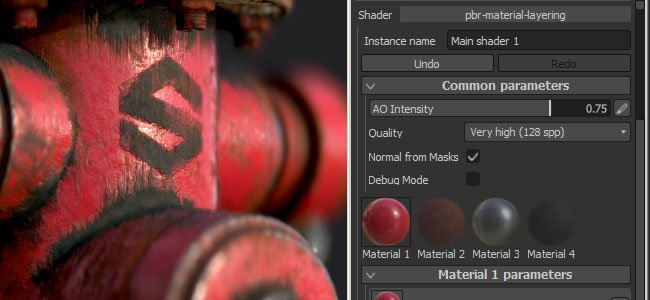

# 버전 2.5

**Substance Painter 2.5**&#x200B;에는 많은 새로운 기능이 추가되었습니다. 브러시 설정의 불투명도 지원부터(흐름 외에도) 8K에서 추가 맵을 굽는 기능 등에 이르기까지.

출시일: *21 2017년 2월*

## 주요 기능

### 새로운 브러시 불투명도

{width="650px"}

이제 Substance Painter에서 페인팅할 때 **브러시 매개 변수**&#x200B;에 **불투명도**&#x200B;인 새 설정이 있습니다.\
**불투명도**&#x200B;는 브러시 획 안의 **각 개별 스탬프**&#x200B;의 강도를 제어하는 **플로우** 설정과 반대로 **브러시 획의 전체 강도**&#x200B;를 제어합니다. 즉, 이제 겹치는 값을 만들지 않고도 **동일한 영역을 페인트 및 다시 페인트할 수 있습니다**. 이렇게 하려면 플로우를 100으로 설정하고 불투명도 값을 원하는 강도로 설정합니다. 불투명도가 작동하는 방식 때문에 펜 압력에 연결할 수 없습니다. 그런 종류의 제어에는 여전히 흐름이 최선의 선택입니다.

또한 기본적으로 **&quot;A&quot;** 키에 있는 이 새 매개 변수와 함께 **새 한정자**&#x200B;을(를) 추가했습니다. 이 키를 누르면 **이전 브러시 획이 새 브러시 획을 만드는 대신**&#x200B;을(를) 계속할 수 있습니다. 즉, 원하는 불투명도로 균일 색상을 페인트 할 수 있지만 카메라를 이동할 수도 있습니다. 또 다른 예는 복제 도구로 수행하던 복제를 계속하는 것입니다.

### 8K 및 정사각형이 아닌 해상도에서의 새로운 베이킹

최대 **8192x8192**(8K + 앤티 앨리어싱)의 해상도를 지원하도록 베이커가 개선되었습니다. 즉, 이제 추가 맵을 사용하여 1:1 비율의 8K로 내보낼 수 있습니다.\
**정사각형이 아닌** 해상도에 대한 지원도 추가했습니다. 이제 예를 들어 **4096x2048**&#x200B;의 텍스처를 구울 수 있습니다. 이렇게 하려면 드롭다운 옆에 있는 &quot;**잠금**&quot; 아이콘을 클릭하여 해상도를 선택하면 됩니다.

### 뷰포트에서 색상 프로파일에 대한 새로운 지원

Substance Painter에서 **뷰포트**&#x200B;의 렌더링을 제어하기 위해 **LUT**(텍스처) 지원을 추가했습니다. 프로필을 적용하려면 &quot;**표시 설정**&quot; 창에서 &quot;**색상 프로필**&quot; 설정을 활성화하고 전용 슬롯에 LUT를 로드하십시오. 이 렌더러는 **OpenGL** 뷰포트(페인팅)와 **IRay** 렌더러에서 모두 작동합니다. 일반적인 **카메라 사전 설정**&#x200B;부터 더 많은 **예술적 효과**&#x200B;까지 기본적으로 몇 가지 예제를 사용할 수 있습니다. 자세한 내용은 설명서의 전용 페이지([색상 프로필](../../features/post-processing/color-profile.md))를 참조하십시오.

### Substance Designer 6과 호환되는 새 Substance 엔진

**Substance Designer 6**&#x200B;에 대한 지원을 추가했습니다. 이는 **SD6**&#x200B;으로 만든 리소스를 **Substance Painter 2.5**!에서 열고 사용할 수 있음을 의미합니다.\
SD6의 **새 텍스트 노드**&#x200B;을(를) 사용하여 Substance에 통합하는 기능이 좋은 예입니다. 이렇게 하면 응용 프로그램에서 나갈 필요 없이 **동적 텍스트**&#x200B;를 만들고 직접 페인트할 수 있습니다. 가장 일반적인 용도로 사용할 수 있도록 각각 다른 스타일로 **10개의 글꼴**&#x200B;이 기본적으로 포함되었습니다. **선반**&#x200B;의 &quot;**절차**&quot; 섹션에서 찾을 수 있습니다.

{width="400px"}

### 셸프의 새 콘텐츠

새 선반에 대한 몇 가지 수정 및 개선 사항과 함께 페인팅 및 텍스처링을 개선하기 위해 **새로운 필터**&#x200B;를 많이 추가했습니다. 또한 &quot;**HSL**&quot;과(와) 같은 기존 필터의 동작을 **개선**&#x200B;합니다. **새 프로젝트**(예: **Unity 5** 및 **Unreal Engine 4**)을 만들 때 새 **템플릿**&#x200B;을 추가했습니다.

### 사용자 정의 셰이더 UI 지원을 통한 새로운 스크립팅 개선

이 릴리스에서는 **셰이더 매개 변수**&#x200B;를 **스크립트 및 컨트롤**&#x200B;하는 방법을 추가했습니다. 또한 기본 UI 대신 **사용자 지정 UI**&#x200B;를 사용할 수 있는 지원을 추가하여 **애니메이션 셰이더**&#x200B;와 같은 새로운 가능성을 많이 열어보았습니다.\
자세한 내용은 애플리케이션의 도움말 메뉴에서 사용할 수 있는 스크립팅 설명서를 참조하십시오.

## 튜토리얼

새로운 주요 기능은 최신 Twitch 스트림에서 다룹니다.

## 릴리스 정보

### 2.5.3

(2017년 3월 15일 릴리스)

**고정:**

* [베이커] 특정 메쉬로 베이킹할 때 충돌이 발생합니다

**알려진 문제 :**

* [Mac] 파티클로 인해 텍스처 손상이 발생하는 경우가 있습니다

### 2.5.2

(2017년 3월 14일 릴리스)

**고정:**

* [도구] Wacom 태블릿이 Linux에서 작동하지 않음
* [도구] 손가락 도구를 사용할 때 검은색 가공물
* [베이커] 케이지에 [이름별 일치]를 사용하면 베이킹 실패
* [베이커] 일반 지도로만 베이킹할 때 주변 오클루전이 끊김
* [선반] 일반 필터에서 알파를 제대로 처리하지 않습니다(대비/광도, 하이패스 등).
* [뷰포트] 그림자가 활성화된 프로젝트를 로드할 때 성능 문제
* [뷰포트] MacOS의 3D 보기에서 디더링 문제
* [뷰포트] 색상 프로필을 활성화하면 입자 미리 보기가 잘못 표시됨
* [Iray] Iray를 초기화하지 못한 경우 프로젝트를 다시 OpenGL로 전환할 때 충돌이 발생합니다
* [IRay] SpecGloss 셰이더/mdl 렌더링 시 광택이 무시됩니다.
* [셰이더] 사양/광택 셰이더가 Iray 및 SD와 일치하지 않습니다.
* [Shader] sRGB 변환이 선형에서 sRGB LUT로 변환과 다름
* [Shader] 오래된 셰이더가 있는 프로젝트를 로드할 때 렌더링이 잘못되었습니다.
* [Shader] &quot;pbr-coated&quot; 셰이더가 더 이상 작동하지 않습니다.
* [내보내기] 일부 채널은 텍스처 세트에 없는 경우에도 계속 내보내집니다
* [레이어] 혼합 모드 &quot;표준 맵 역디테일&quot;이 회색 음영 채널에서 작동하지 않습니다
* [UI] HDPI 모니터 및 디스플레이 확대/축소 시 &quot;색상 선택 창&quot; 문제 150%

**알려진 문제 :**

* [Mac] 파티클로 인해 텍스처 손상이 발생하는 경우가 있습니다

### 2.5.1

(2017년 2월 27일 릴리스)

**고정:**

* [Mac] 3D 및 2D 보기에서 Wacom 태블릿 입력이 손상됨
* [베이커] 이름별 비교가 더 이상 작동하지 않음
* [베이커] &quot;평균 표준&quot; 설정이 더 이상 작동하지 않음
* [Iray] 베이킹된 표준 맵이 누락된 경우 렌더링이 올바르지 않습니다.
* [Iray] 색상 프로필이 OpenGL 렌더러와는 다르게 작동합니다.
* [Iray] 렌더링을 비트맵으로 내보내면 색상 프로필 교정이 포함되지 않습니다
* [Substance] 재질 필터가 더 이상 작동하지 않습니다.
* [도구] 획 불투명도가 브러시 사전 설정에 저장되지 않음
* [도구] 복제 브러시 UV 정렬이 더 이상 작동하지 않음
* [내보내기] 정수로 내보낼 때 변위 채널은 0.5의 가운데에 와야 합니다.
* [템플릿] 절대 경로는 템플릿에 저장됩니다.
* [TextureSet] 채널을 제거한 후에도 채널 텍스처가 유지됩니다.

**알려진 문제 :**

* [Linux] Wacom 태블릿 입력이 3D 및 2D 보기에서 작동하지 않음
* [Mac] 파티클로 인해 텍스처 손상이 발생하는 경우가 있습니다
* [내보내기] 매우 드문 경우지만 AMD GPU에 검은색 사각형이 나타날 수 있습니다

### 2.5.0

(2017년 2월 21일 릴리스)

**추가됨 :**

* AMD Radeon Pro 및 AMD FirePro GPU에 대한 지원 추가
* [도구] 선 불투명도 지원 추가
* [도구] 마지막 브러시 획을 계속할 수 있도록 하는 수정자를 추가합니다
* [Iray] Pascal GPU 지원 업데이트
* [뷰포트] 색상 프로필(LUT) 지원 추가
* [Substance] 새 프레임워크(SD6 엔진) 통합
* [UI] 파일 메뉴에서 &quot;최근 파일&quot; 크기 목록 늘리기
* [가져오기] 가져오기 대화 상자에서 substance의 범주를 사용하여 접두어를 채웁니다.
* [베이커] 8K 텍스처가 베이킹되도록 허용합니다.
* [베이커] 정사각형이 아닌 해상도를 베이킹할 수 있습니다.
* [베이커] 두꺼운 하이 폴리 메시를 굽는 경우 메모리 소비량을 개선합니다.
* [Shelf] 선반(및 프로젝트)을 잠가 동시 편집을 금지하고 손상을 방지합니다.
* [Shelf] 필터링에 사용할 물질에서 범주 및 키워드를 읽습니다.
* [Shelf] 검색 쿼리 결과에서 리소스를 제외할 수 있습니다.
* [Shelf] 축소판 시간 계산 개선
* [Shelf] 프로젝트에 사전 설정 포함 허용
* [Shelf] SHIFT를 사용하여 트리 보기를 빠르게 축소/확장할 수 있습니다.
* [Shelf] 에셋을 읽기 전용으로 설정한 경우 축소판 저장 허용(로컬 캐시)
* [Shelf] 새로운 필터 (, 미러, 3 평면 등)
* [Shelf] 새로운 콘텐츠 : 새로운 LUT 프로필(필름 느와르, 빈티지 등과 같은 클래식 및 예술적)
* [Shelf] 새로운 내용 : 사용자 정의 텍스트를 빠르게 생성하기 위한 10개의 새로운 글꼴 Substance
* [Shelf] 새로운 템플릿 : 유니티 5 및 언리얼 엔진 4
* [Shelf] 아티스트 친화적인 개선된 HSL 필터
* [Shader] PBR 셰이더에서 Specular level 채널에 대한 지원을 추가합니다
* [Shader] Alpha 테스트 셰이더에서 디더링 지원 추가
* [Shader] PBR 셰이더에서 시차 오클루전 매핑 지원 추가
* [Shader] 셰이더 매개 변수에 대한 사용자 지정 UI를 정의할 수 있습니다.
* [MatLayering] 재질 레이어 작업 과정을 위한 새 마스크 채널 만들기
* [스크립팅] SP 프로젝트에 메타데이터를 쓸 수 있습니다.
* [스크립팅] 특정 내보내기 사전 설정을 사용하여 내보내기 허용
* [스크립팅] 셰이더 매개 변수를 JSON으로 검색할 수 있습니다.
* [스크립팅] WebSocket 연결 지원 추가
* [스크립팅] 셰이더 인스턴스를 로드할 수 있는 가능성을 추가합니다
* [스크립팅] 새 프로젝트를 만들 가능성을 추가합니다.
* [스크립팅] 프로젝트에 가져온 메쉬의 URL을 검색할 수 있습니다.
* [스크립팅] 정사각형이 아닌 베이킹 허용
* [스크립팅] 스크립팅 API를 통해 데이터를 설정할 때 오류 보고
* [Substance] 표준 맵 포맷 지정을 위한 user-data 태그 추가

**고정:**

* 물질을 사용하여 색상을 선택할 때 충돌
* 비 RGBA32f 이미지를 환경 맵으로 로드할 때 충돌
* AMD GPU 페인팅과 관련된 충돌
* [Mesh] OBJ 가져오기에서 mtl 파일이 없는 재질을 인식하지 못합니다
* [망] 일부 망에서 UDIM 텍스처 집합 이름 생성이 잘못될 수 있습니다.
* [UI] 뷰어 설정의 실행 취소/다시 실행 버튼 스틸 포커스 및 마우스 스크롤 중지
* [UI] 일부 레이블이 높은 DPI에서 잘못 잘립니다.
* [레이어] 페인트 효과의 [바꾸기] 모드가 마스크에서 잘못된 동작을 수행합니다
* [레이어] 빼기 혼합 모드가 알파에 잘못된 동작을 가지고 있음
* [2D 보기] UV 테두리에 페인팅할 때 브러시 크기가 매우 커짐
* [도구] 높은 DPI에서 물린 직선이 불규칙하게 작동합니다
* [도구] 스텐실 해상도가 올바르지 않은 경우가 있습니다.
* [Bakers] &quot;테두리 상자를 기준으로&quot;가 &quot;Off&quot;인 경우 &quot;최대 폐색기 거리&quot; 값이 고정되어 있습니다.
* [Shader] 스택 및 자동 매개 변수 채널 정의가 일치하지 않습니다.
* [3D 보기] 프로젝트 설정에 따라 일반 채널의 표시가 일치하지 않습니다.
* [뷰포트] 일부 노멀 맵은 가공물로 나타나는 고정된 값을 가집니다
* [뷰포트] 포스트 효과는 기본적으로 항상 비활성화되어 있습니다.
* [내보내기] 일반 채널이 없는 경우 일반 믹싱 설정이 올바르지 않습니다.
* [내보내기] AMD GPU의 경우 텍스처 생성이 잘못되는 경우가 있습니다
* [Export] 셰이더 매개 변수가 그룹 내에 있는 경우 제대로 내보내지지 않습니다.
* [내보내기] 사용자 정의 셸프에서 내보내기 사전 설정을 편집하면 로그 오류가 출력됨
* [Shelf] 트리 보기 필터링이 폴더 이름과 정확하게 일치하지 않습니다.
* [Shelf] 셸프 사전 설정의 이름을 바꾸는 것은 읽기 어렵습니다
* [Shelf] Shelf에 가져온 셰이더 리소스는 다시 실행 후 보존되지 않습니다.
* [Shelf] 내용 : 용접 도구 사전 설정이 누락되었습니다.
* [Shelf] 내용 : Tile Generator이 제대로 작동하지 않음
* [선반] 내용 : 고무 타이어 더티 스마트 재질에서 잘못된 마스크를 수정했습니다.
* [선반] 내용 : 가죽 가방 재질에서 잘못된 그룹 이름을 수정했습니다.
* [Iray] 메시의 절반이 Iray에서 누락되었습니다
* [Linux] 리소스를 3D 보기 위로 드래그할 때 충돌 발생
* [Mac] Sierra에서 실행할 때마다 환경 설정이 재설정됨

**알려진 문제 :**

* [내보내기] 매우 드문 경우지만 AMD GPU에 검은색 사각형이 나타날 수 있습니다
* [Iray] 색상 프로필이 이상하게 작동할 수도 있습니다
