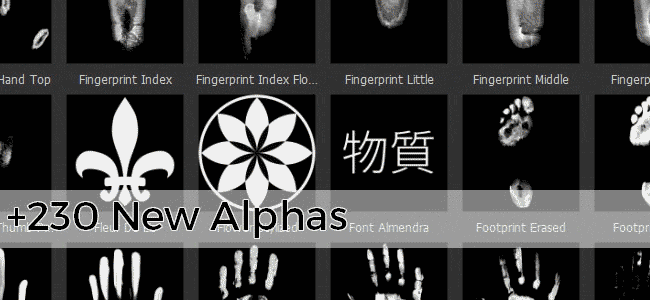

# 버전 2017.1

Substance Painter은 새로운 Substance 오퍼에 따라 버전 번호를 변경합니다. 자세한 내용은 다음을 확인하십시오. <https://www.allegorithmic.com/welcome-to-substance>\
이 새로운 버전에서는 Substance Source을 검색하고 재질을 셸프로 직접 가져올 수 있는 새로운 플러그인을 제공하여 콘텐츠에 집중하고자 했습니다. 또한 창의적인 가능성을 확장하기 위해 새로운 에셋을 많이 추가했습니다.

출시일: *20 June 2017*

## 주요 기능

### 새 플러그인 : Substance Source

이 새로운 플러그인을 사용하면 이제 **Substance Source**&#x200B;라는 소재 데이터베이스를 **직접 검색**&#x200B;하고 **선반에 직접 다운로드**&#x200B;할 수 있습니다.\
Substance Source을 열려면 응용 프로그램의 기본 도구 모음&#x200B;**에서 Substance Source 로고**&#x200B;을(를) 클릭하면 됩니다. 그러면 라이브러리를 검색할 수 있는 새 창이 열립니다.

{width="650px"}

### 새로운 콘텐츠 : Alpha, 절차, 필터 등

이 새 버전에서는 **300개 이상의 새 에셋**&#x200B;을 추가하고 있습니다. 알파에 **sf**, **기하학**, **중세** 또는 심지어 **켈틱** 테마 콘텐츠를 추가했습니다. 또한 많은 **새 브러시** 및 **스캔한 손그림/지문**&#x200B;이 포함됩니다. **MatFX 세부 정보 Edge Wear**&#x200B;와 같은 몇 가지 편리한 새 필터도 제공되는데, 이를 통해 메쉬에 칠해진 일반 정보에서 **스크래치**&#x200B;를 직접 **생성할 수 있습니다**.

다음은 새로운 콘텐츠 목록입니다.

* **4개의 새로운 글꼴**(일본어, 중국어 간체, 타자기, 세그먼트)
* **230개의 새 Alpha**(패턴 및 스캔한 이미지 혼합)
* **50개의 새로운 절차**(주로 중세 및 현대 의류를 위한 직물 패턴)
* **2개의 새 환경 지도**(몬다레인 및 Villa Nova Street)
* **새로운 필터&lbrace;1 (MatFX 세부 정보 Edge Wear, HBAO 등)**

또한 **기본 환경 맵**&#x200B;과 같이 더 잘 작동하도록 기존 에셋 중 일부를 업데이트했습니다. 이제 **덜 노랗게 보이는**

## 튜토리얼

새로운 콘텐츠는 최신 비디오 튜토리얼에서 다룹니다.

## 릴리스 정보

### 2017.1

(2017년 6월 20일 릴리스)

**추가됨 :**

* [플러그인] 새 Substance Source 플러그인(쉘프에 있는 에셋 다운로드 허용)
* [Shelf] 4개의 새로운 글꼴(일본어 + 중국어 간체, 타자기, 세그먼트)
* [Shelf] 230개의 새로운 Alpha(패턴, 브러시 및 지문 스캔 혼합)
* [선반] 50 새로운 절차 (중세 및 현대 의류의 직물 패턴)
* [Shelf] 2개의 새로운 환경 지도(Mondarrain과 Villa Nova Street)
* [Shelf] 9 새로운 필터 (MatFx 세부 Edge Wear, HBAO 등)
* [Shelf] 향상된 기본 파노라마 환경 맵
* [Shelf] 새로운 아놀드 5 내보내기 사전 설정
* [스크립팅] 셸프로 리소스를 가져올 수 있습니다.

**알려진 문제 :**

* [내보내기] 내보내기 사전 설정 편집이 매우 느립니다
