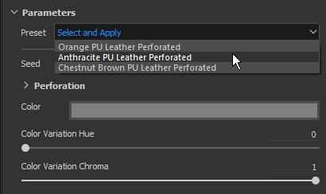

# 버전 2018.2

**Substance Painter 2018.2**&#x200B;에는 이전보다 더욱 쉽게 텍스처링을 할 수 있도록 표면 아래 분산 페인팅과 같은 오랫동안 기다려온 기능이 추가되었습니다.

출시일: *2 2018년 8월*

## 주요 기능

### 표면 하부 산란

**서브서피스 분산**&#x200B;이 이제 **실시간** 뷰포트 및 **Ray 렌더러**&#x200B;에서 지원됩니다.\
서브서피스 스캐터링은 물체나 표면을 투과할 때 빛을 내는 메커니즘입니다. 금속 표면과 같이 반사되는 대신 빛의 일부는 재료에 흡수된 다음 **내부에 흩어집니다**. 실생활에서 많은 물질들은 피부나 왁스와 같은 표면 밑의 산란을 가진다.

당사의 서브서피스 효과 구현은 다른 게임 엔진뿐만 아니라 다른 오프라인 렌더러로부터의 실시간 구현과 매우 밀접하게 일치합니다. 분산 텍스처를 다른 응용 프로그램에서 사용할 수 있도록 매우 쉽게 만들 수 있습니다.

{width="650px"}

다음은 잘 알려진 Digital Emily 2 에셋의 예입니다. USC Institute for Creative Technologies와 위키휴먼 프로젝트 멤버들이 Digital Emily 2 에셋을 사용하여 렌더링을 시연해 볼 수 있도록 해 주셔서 감사합니다.\
(이 비교는 시각적 차이를 설명할 수 있는 유사하지만 정확한 조명 조건이 아닌 상태에서 수행되었다는 점에 유의하십시오.)

프로젝트에 서브서피스 스캐터링을 추가하려면 다음 단계를 따르십시오.

1. **디스플레이 설정** 창으로 이동하여 **하위 표면 분산** 설정을 **활성화**&#x200B;합니다.
1. 현재 텍스처 집합에 &quot;**분산**&quot; 채널 추가
1. 새 채널에서 채우기 레이어 또는 **흰색 페인트**&#x200B;를 사용하여 뷰포트에서 하위 표면 효과를 **표시**&#x200B;합니다.

자세한 절차는 [표면 아래 분산 설명서](../../features/subsurface-scattering/subsurface-scattering.md)에서 확인할 수 있습니다.

>[!NOTE]
>
> 실시간 뷰포트에서 하위 표면 산란을 지원하려면 프로젝트의 **셰이더들**&#x200B;을 **업데이트**&#x200B;해야 합니다.\
> 사용자 지정 셰이더의 경우 **도움말 메뉴**&#x200B;에 있는 설명서를 참조하여 **셰이더 API**&#x200B;에서 변경된 내용을 확인하세요.

### 칠 레이어용 조작기

조작기를 제공하기 위해 칠 레이어 컨트롤이 개선되었습니다. 이제 채우기 투영을 정확하게 배치하고 제어하는 것이 더 쉬워졌습니다.

**UV 투영**&#x200B;을 사용하면 **2D 보기**&#x200B;에 조작기가 나타납니다.

* **바깥쪽**&#x200B;을 클릭하면 조작기가 **회전**&#x200B;합니다.
* **테두리**&#x200B;에서 **정사각형**&#x200B;을 클릭하면 **크기 조절/크기 조정**&#x200B;이 됩니다.
* **안쪽**&#x200B;을 클릭하면 조작기가 **변환**&#x200B;됩니다.
* **CTRL**&#x200B;을 사용하여 **대칭**&#x200B;의 여러 모퉁이에 영향을 줍니다.
* **SHIFT**&#x200B;에서 **제약 조건**&#x200B;으로 변환(변환, 회전 또는 크기 조절)을 사용합니다.\
  

**삼중 평면 투영**&#x200B;을 사용하면 조작기가 **3D 보기**&#x200B;에 나타납니다.

* 점선 육면체는 전체 투영을 나타냅니다
* **W**, **E** 또는 **R** 키보드 단축키를 사용하여 **Translate**, **Rotate** 및 **Scale** 모드 간에 전환합니다.
* **T** 키보드 단축키를 사용하여 조작기의 로컬 방향과 세계 방향 사이를 전환합니다.
* **SHIFT**&#x200B;를 사용하여 **제약 조건** 변환을 수행합니다.
* 고급 칠 레이어 속성에서 삼면 육면체 투영을 수정할 수도 있습니다.\
  \
  

뷰포트 상단에 있는 컨텍스트 도구 모음도 현재 투영 모드에 따라 조정되며 추가 도구 및 컨트롤을 제공합니다.

자세한 내용은 [레이어 채우기 설명서](../../painting/fill-projections/fill-projections.md)를 참조하십시오.

### 스텐실 및 투영 도구에 대한 비사각형 및 비틸링 지원

스텐실 매개 변수 및 투영 도구가 정사각형이 아닌 해상도와 경사가 없는 비헤이비어를 지원하도록 개선되었습니다.\
이제 기본 매개변수가 기본적으로 경작되지 않도록 설정됩니다. 이 매개 변수는 도구 속성에서 변경할 수 있습니다.

틸링 모드는 다음과 같이 설정할 수 있습니다.

* **타일링 없음**(기본값)
* **수평 타일링**
* **세로 타일링**
* **H 및 V 타일링**(이전 동작)

이 새로운 매개 변수는 도구 또는 브러시 사전 설정에 저장할 수 있으므로 사용자 정의 콘텐츠와 쉽게 공유할 수 있습니다.

>[!NOTE]
>
> * 투영 비율은 정사각형이 아닌 해상도를 출력하는 Substance 파일에도 적용됩니다. 이 비율은 출력 노드에서 직접 계산됩니다.
> * 여러 채널의 비율이 서로 다른 경우 투영 도구를 사용하면 발견된 첫 번째 비율이 다른 모든 채널에 적용됩니다.

### 카메라 가져오기 및 관리

이제 메시 가져오기와 함께 Substance Painter 내에서 **사용자 지정 카메라 가져오기**&#x200B;를 할 수 있습니다.\
**3D 뷰포트**&#x200B;에서 카메라를 **살펴보기**&#x200B;하도록 선택한 다음 Iray **에서 렌더링하기 위해**&#x200B;사용할 수 있습니다.

자세한 내용은 [카메라 관리 설명서](../../interface/viewport/camera-management.md)를 참조하십시오.

프로젝트로 **카메라 가져오기**:

1. 동일한 파일(FBX, Alembic 또는 glTF 등 지원되는 형식)의 카메라가 있는 프로젝트의 메쉬를 내보냅니다.
1. [새 프로젝트 창](../../getting-started/project-creation.md)(또는 [프로젝트 구성](../../interface/project-configuration.md))에서 &quot;카메라 가져오기&quot; 설정을 선택합니다.\
   
1. 뷰포트에 드롭다운을 사용하거나 [디스플레이 설정](../../interface/display-settings/camera-settings.md)의 설정을 사용하여 원하는 카메라로 전환하세요.\
   

디스플레이 설정 창의 카메라 설정 은 카메라 속성을 제어하도록 확장되었습니다.\
카메라 간에 **전환**&#x200B;하고, **비율**&#x200B;을 확인하고, 속성을 **잠금**&#x200B;하여 수정할 수 있습니다. 복원 버튼을 사용하여 카메라를 초기 값으로 되돌릴 수 있습니다.

카메라 프레임(및 그것의 게이트)도 고려되어, 매우 특정 시점을 통해 보고 페인팅할 수 있습니다. 프레임과 게이트는 3D 뷰포트에 표시되고 불투명도는 [디스플레이 설정](../../interface/display-settings/camera-settings.md) 창의 **뷰포트 설정**&#x200B;에서 제어할 수 있습니다.

### 레이어 스택 동작 개선

* **재질 및 스마트 재질을 ID 맵으로 드래그 앤 드롭 :**\
  선반에서 뷰포트로 콘텐츠를 끌어다 놓는 기능이 개선되었습니다. 재질을 드래그하여 놓으면서 **CTRL**&#x200B;을 누르면 마스크로 사용할 ID 색상을 선택할 수 있습니다.\
  색상 선택 효과가 적용된 검정 마스크가 레이어 스택에서 만든 새 레이어에 추가됩니다. 동일한 재질을 다른 ID 색상으로 드래그하여 놓으면 기존 레이어가 업데이트되고 ID 색상이 결합됩니다.\
  
* **레이어 스택 드래그 앤 드롭 스크롤 :**\
  이제 레이어 스택 주위로 레이어를 드래그하면 작은 창이 표시됩니다.\
  리소스 또는 레이어를 레이어 스택 창의 테두리 근처로 드래그하면 리소스 또는 레이어의 내용이 자동으로 스크롤됩니다.\
  

### glTF 및 알렘빅 메시 가져오기

이제 새 파일 형식 은 메시 가져오기 및 새 프로젝트 만들기에 대해 지원됩니다.

* **glTF** : 이 형식은 텍스처를 내보낼 때 이미 사용할 수 있으며, 이제 가져오는 동안 사용할 수 있습니다. glTF 파일에 텍스처가 포함되어 있으면 해당 텍스처를 가져와 레이어 스택 안에 배치합니다(금속/거칠기 워크플로우의 경우).
* **알렘빅** : 이 형식은 VFX/애니메이션 업계에서 망을 전송하는 데 널리 사용됩니다.

>[!NOTE]
>
> Substance Painter은 현재 가져올 애니메이션 프레임을 제어하는 방법을 제공하지 않습니다.\
> 즉, Alembic 파일을 내보낼 때 에셋에 페인팅하는 데 사용할 참조 프레임이 이미 설정되어 있어야 합니다.

### Substance 통합 개선 사항

오래 기다린 요청으로 Substance Painter 내 Substance 통합이 개선되었습니다.

* <b>다음 경우에 표시:</b>\
  &quot;보이는 경우&quot;는 조건에 따라 매개 변수를 숨길 수 있는 Substance 파일 형식의 훌륭한 기능입니다.\
  이 기능은 매개 변수 및 컨텍스트 설정의 목록을 더 명확하게 제공하므로 전체적으로 더 쉽게 재료 및 필터를 사용할 수 있습니다.\
  자세한 내용은 [Substance Designer 설명서](https://experienceleague.adobe.com/en/docs/substance-3d-designer/home)를 참조하십시오.\
  
* **Substance 사전 설정** Substance 사전 설정은 고급 변형 재질을 제공하는 쉬운 방법입니다. [Substance Source](https://source.allegorithmic.com)의 많은 재질에 사전 설정이 있으므로 사용해 보십시오!\
  Substance 파일에 하나 이상의 사전 설정이 포함되어 있으면 매개 변수 목록의 새 드롭다운을 사용할 수 있습니다. 매개 변수를 업데이트하기 위해 적용할 사전 설정을 선택합니다.\
  
* **Substance 특성**\
  이제 인터페이스에 Substance 속성이 표시되므로 특정 파일에 대한 정보를 보다 쉽게 검색할 수 있습니다.\
  속성은 속성 창의 매개 변수 위에서 보거나 셸프에서 에셋을 마우스 오른쪽 버튼으로 클릭하여 두 위치에서 볼 수 있습니다.\
   

### 새 샘플 프로젝트 &quot;Jade Toad&quot;

이제 새 샘플 프로젝트 &quot;**JadeToad**&quot;이(가) Substance Painter에 포함됩니다. 이 샘플 프로젝트에는 기본적으로 **하위 표면 분산** 효과가 활성화되어 있습니다.\
프로젝트를 찾으려면 **파일** > **샘플 열기...** 메뉴 항목을 사용하십시오.

## 릴리스 정보

### 2018.2.3

(2018년 9월 25일 릴리스)

**&#x200B;**&#x200B;고정:**&#x200B;**

* [2D 보기] 새 프로젝트를 만들 때 일부 메시로 2D 보기가 깨집니다
* [충돌] UV 투영에서 삼면 투영으로 전환하면 충돌이 발생합니다
* [RayCollider] &quot;RayCollider&quot;로 인한 다중 충돌
* [도구] 레이어를 전환하면 수정된 브러시 속성이 손실됩니다
* 지우개로 전환할 때 브러시 설정이 재설정됨

**알려진 문제:**

* AMD VEGA GPU에서 계산 중단
* Windows OS의 단축키와 관련된 Huion 태블릿 문제

### 2018.2.2

(2018년 9월 11일 릴리스)

**추가됨:**

* 요약: 콘텐츠 업데이트, 새로운 스크립팅 기능 및 자동 업데이트를 비활성화할 수 있는 핫픽스
* [콘텐츠]&#x200B;[셸프] 스킨 셸프 사전 설정 추가
* [Content]&#x200B;[shelf] 19개의 피부 표준을 표면 아래 산란을 위한 재료로 변환
* [스크립팅] 열려 있는 프로젝트에서 프로젝트 템플릿 만들기
* [스크립팅] 열려 있는 프로젝트의 내보내기 설정을 가져오거나 설정합니다
* [업데이트] 설정 및 환경 변수에서 자동 업데이트 팝업을 비활성화할 수 있습니다.
* [업데이트] 유지 관리 오래된 팝업에서 다음 버전까지 표시되지 않습니다.

**고정:**

* [카메라] 직교 방식에서 원근감 방식으로 전환하여 잘못된 확대/축소
* [표시] 일부 맵이 sRGB가 아닌 선형으로 표시됨
* [Viewports] 메시 포커스가 제대로 작동하지 않습니다.
* [2D 보기] 끊어진 카메라가 있는 프로젝트의 UV 쉘이 사라짐
* [SSS]&#x200B;[도구 설명] 서브서피스 분산 도구 설명이 로그에 나타납니다
* 일부 프로젝트는 2018.2에서 열 수 없으며 오류 메시지는 null substance 패키지를 저장할 수 없습니다.
* [마스크] 마스크 작업 시 경우에 따라 페인트 도구 색상이 중단될 수 있습니다
* [재질] 특정 상황에서 맵이 표시되지 않음
* [Proj]&#x200B;[도구] 생성기를 사용하여 활성화된 매니퓰레이터
* [Substance] 매개 변수의 Substance 그룹이 없습니다.
* [스크립팅] 설명서의 소프트웨어 이름이 잘못되었습니다.
* [UDIMs] 여러 UV 타일의 UV 쉘에 대한 로그에 정보가 없습니다.

**알려진 문제:**

* AMD VEGA GPU에서 계산 중단
* Windows OS의 단축키와 관련된 Huion 태블릿 문제

### 2018.2.1

(2018년 8월 3일 릴리스)

**고정:**

* 업그레이드 프로젝트에서 하위 표면 분산 셰이더 매개 변수가 누락되었습니다.

**알려진 문제:**

* AMD VEGA GPU에서 계산 중단
* Windows OS의 단축키와 관련된 Huion 태블릿 문제

### 2018.2

(2018년 8월 2일 릴리스)

**추가됨:**

* 요약: 여름 릴리스, 서브서피스 산란 지원, 투영 및 채우기 개선, 카메라 가져오기 및 선택, Alembic/glTF 지원, ID 맵에서의 드래그 앤 드롭, 개선된 Substance 형식 지원 및 새로운 콘텐츠
* [SSS]&#x200B;[뷰포트]&#x200B;[Iray] 일반 서브서피스 스캐터링
* [SSS] MDL 및 서브서피스 스캐터링 매개변수 동기화
* [SSS] &quot;분산&quot;이라는 이름의 새 회색 음영 채널을 추가했습니다.
* [SSS]&#x200B;[셰이더 설정] 서브서피스 스캐터링(스킨 또는 반투명)을 위한 스캐터링 유형 매개 변수입니다.
* [SSS]&#x200B;[셰이더 설정] 서브서피스 스캐터링을 위한 스캐터링 비율 매개 변수
* [SSS]&#x200B;[Shader Settings] 서브서피스 스캐터링을 위한 스캐터링 색상 매개 변수
* [SSS]&#x200B;[디스플레이 설정] 서브서피스 스캐터링을 위한 스캐터링 샘플 개수
* [Shader]&#x200B;[Iray] Iray에 대한 서브서피스 스캐터링 MDL 통합
* [Shader] 리소스 업데이터를 통한 셰이더 업데이트
* [Shader] 변경 로그 API 및 설명서 업데이트
* [도구 속성]&#x200B;[Proj] 트리평면 투영에 대한 새 매개변수
* [뷰포트]&#x200B;[Proj] 조작기를 사용하여 직접 3D 뷰에서 채우기 레이어 속성 제어(삼평면 투영)
* [Shortcuts]&#x200B;[Proj] 삼면형 투영 조작기를 위한 새로운 단축키 Q, W, E, R, T
* [뷰포트]&#x200B;[Proj] 매니퓰레이터(UV 투영)를 사용하여 2D 뷰에서 채우기 레이어 속성을 직접 제어합니다
* [단축키]&#x200B;[Proj] UV 투영 조작기를 위한 새로운 단축키 Q
* [컨텍스트 도구 모음]&#x200B;[Proj] 컨트롤 삼각 투영 조작기
* [상황별 도구 모음]&#x200B;[프로젝트] 컨트롤 UV 투영 조작기
* [도구 속성] 투영 및 스텐실 도구로 텍스처 타일링 비활성화
* [스텐실] 투영 도구/스텐실과 함께 사각형이 아닌 이미지 사용
* [스텐실] 속성 창에서 타일링 모드 제어 허용
* [스텐실] 확대/축소가 타일링하지 않은 스텐실의 중심에 있지 않음
* [카메라] Maya, Max, Blender, Modo, DAE에서 카메라 가져오기
* [Cameras]&#x200B;[Viewport] 뷰포트에서 가져온 카메라 선택 및 제어
* [Cameras]&#x200B;[Iray] Iray에서 가져온 카메라 선택 및 제어
* [Cameras]&#x200B;[UI]&#x200B;[새 프로젝트]&#x200B;[프로젝트 구성] &quot;카메라 가져오기&quot;는 기본적으로 선택되어 있습니다.
* [Cameras]&#x200B;[Shortcuts] 단축키 &quot;&lt;&quot; 및 &quot;>&quot;를 추가하여 카메라 간 전환
* [Cameras]&#x200B;[Viewport] 뷰포트에 프레임 추가
* [카메라]&#x200B;[뷰포트 설정] 프레임 불투명도 제어
* [카메라]&#x200B;[카메라 설정] 최대 초점 거리: 500mm
* [Cameras]&#x200B;[Camera Settings] 노출 비율
* [카메라]&#x200B;[카메라 설정] 잠금 옵션 추가
* [Cameras]&#x200B;[Camera Settings] 복원 옵션 추가
* [카메라]&#x200B;[카메라 설정] 초점 거리 특성 추가
* [glTF] glTF 파일 가져오기
* [glTF] 앰비언트 오클루전 맵 가져오기
* [Alembic] 정적 기하학이 있는 Alembic 1 프레임 가져오기
* [Shelf] 수정자(CTRL/Command)와 함께 ID 맵을 사용하여 재료를 메시로 직접 드래그하여 놓습니다.
* [레이어 스택] ID 맵이 있는 메쉬에 재료를 드래그하여 놓아 자동으로 ID 마스크 만들기
* [레이어 스택] 레이어 스택에서 드래그 앤 드롭으로 레이어 자동 스크롤
* [UI]&#x200B;[도구 속성] Substance 사전 설정 노출
* [UI]&#x200B;[도움말 메뉴] 도움말 메뉴 개선
* [UI]&#x200B;[새 프로젝트]&#x200B;[프로젝트 구성] 창 재구성
* [UI]&#x200B;[새 프로젝트]&#x200B;[프로젝트 구성] &quot;메시&quot; 용어를 &quot;파일&quot;로 바꿉니다.
* [UI]&#x200B;[Substance] UI에서 Substance 특성 표시
* [단축키] &quot;F4&quot;는 2D 보기와 3D 보기 간을 전환합니다.
* [단축키] 스텐실 &quot;N&quot; 전환 및 빠른 마스크 &quot;U&quot;에 대한 새 단축키
* [Substance 통합] Substance 매개 변수에서 &#39;보이는 if&#39; 문을 고려합니다.
* [뷰포트] 카메라 이동 후 그림자가 강제 계산되지 않음
* [Content] 가져온 카메라로 MeetMat 업데이트
* [Content] 서브서피스 스캐터링이 활성화된 샘플 추가 - JadeToad
* [내용] 서브서피스 스캐터링이 활성화된 새 PBR 프로젝트 템플릿을 추가합니다
* [콘텐츠] 내보내기 사전 설정을 업데이트하여 새 분산 채널을 추가했습니다
* [Content]&#x200B;[Shelf] pbr-metal-rough, pbr-metal-rough-alpha-test, pbr-coated, pbr-spec-gloss에 대한 서브서피스 스캐터링 지원 추가
* [Content]&#x200B;[Shelf] 5개의 스마트 재질(대리석 및 스킨)에 산란 채널 추가
* [Content]&#x200B;[Shelf] 1개의 새로운 옥 재질
* [Content]&#x200B;[Shelf] 새로운 왁스 재질 1개

**고정:**

* [CMD] 다른 버전에서 동일한 명령줄을 사용하는 다른 결과
* [TDR] TdrLevel을 설정한 경우 로그에 오류가 없습니다
* [Baker] 주변 오클루전 맵이 뒤집힘
* [ID 맵] 0-1 범위 밖에서 선택할 때 충돌이 발생합니다
* [Iray] 텍스처 설정을 전환하고 페인트 모드로 돌아갈 때 충돌 발생
* [뷰포트] 드래그 앤 드롭을 위해 뷰포트 간 드롭 영역 동기화
* [엔진] 칠 레이어를 타일링하거나 작은 브러시를 칠할 때 아티팩트를 수정합니다.
* [라이선스] 라이선스 서비스 잘못된 소프트웨어 버전 확인
* [라이선스] 인증을 처리하는 방식 재작업
* [API] 템플릿을 사용하여 만드는 경우에도 `onNewProjectCreated` 스크립팅 API 이벤트를 호출합니다.
* [Shader] 셰이더 파일이 컴파일되지 않으면 컴파일된 셰이더가 캐시에서 로드되지 않습니다.
* [Shelf] 셸프에서 HDR 파일을 내보내면 클램프된 값이 있는 파일이 출력됨
* [내보내기] EXR 내보내기는 0-1 사이의 RGB 색상 값을 클램프합니다
* [콘텐츠] 절차 노이즈 &quot;3D Perlin Noise Fractal&quot;이 픽셀화됨

**알려진 문제:**

* AMD VEGA GPU에서 계산 중단
* Windows OS의 단축키와 관련된 Huion 태블릿 문제
