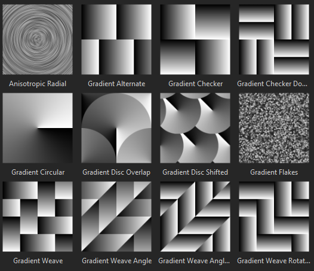

# 버전 2018.3

**Substance Painter 2018.3**&#x200B;이(가) 여기에 있으며 많은 새로운 워크플로와 렌더링 기능을 제공합니다!

출시일: *20 2018년 11월*

## 주요 기능

### 2D 보기 내보내기

이제 **2D 보기로** 렌더링 **텍스처를 내보내기**&#x200B;할 수 있습니다. 이 기능은 많은 사람들이 요청했으며 마침내 사용할 수 있게 되었습니다! 내보내기 프로세스는 **2D 보기**&#x200B;의 현재 상태를 사용하여 일반 내보내기 설정(패딩, 파일 형식, 비트 심도)으로 텍스처를 렌더링합니다. 즉, 보기 모드가 **재질** 모드 대신 **솔로**&#x200B;로 설정되어 있으면 2D 보기를 그대로 내보냅니다.

**내보내기 창**(으)로 이동하여 이름이 &quot;**2D 보기**&quot;인 새 구성을 선택합니다.\

**내보내기 사전 설정**&#x200B;을(를) 만들려는 경우 내보내기 창의 **구성** 탭에서도 &quot;**2D 보기**&quot;이라는 이름의 새 **변환된 맵**&#x200B;을 사용할 수 있습니다.

### 향상된 조명 필터

**베이크된 조명 환경** 필터가 크게 개선되었으며 이제 **HDR 환경 맵**&#x200B;을 제대로 지원합니다.\
이제 뷰포트의 조명을 재현하고(2D 보기에 표시됨) 기본 색상 채널로 베이킹할 수 있습니다. 새 필터는 **환경** 지도 **수직**&#x200B;에서 **회전** 및 **노출** 변경과 같은 추가 컨트롤을 제공합니다.

### 실시간 비등방성 Specular 반사

이 새 버전에서는 &quot;**pbr-metal-rough-비등방성-angle**&quot;이라는 이름의 새 셰이더를 소개합니다. 이 셰이더는 이방성 Specular 반사를 만드는 데 사용할 수 있는 &quot;**비등방성 각도**&quot; 및 &quot;**비등방성 레벨**&quot;이라는 두 개의 채널을 지원합니다. 이 셰이더는 변환 필요 없이 Iray로 그대로 변환됩니다.

셰이더 단추를 클릭하고 미니 쉘프 를 열어 [셰이더 창](../../interface/shader-settings/shader-settings.md)을 통해 이 새 셰이더에 액세스할 수 있습니다.

기본 샘플 프로젝트 &quot;**미리 보기 구**&quot;이(가) 새 셰이더를 활용하고 다른 채널을 설정하는 방법을 보여주기 위해 업데이트되었습니다.

>[!NOTE]
>
> **비등방성 각도** 채널 내에서 그레이디언트를 사용할 때 이상하게 보이는 **선 아티팩트**&#x200B;가 나타나면 채우기 레이어의 경우 필터링 모드를 &quot;**가장 가까운**&quot;(으)로 변경해 보면 셰이더의 샘플링을 개선하고 문제를 제거할 수 있습니다.

### 업데이트된 Clear Coat 셰이더

더 많은 컨트롤과 렌더링 가능성을 제공하기 위해 **Clear Coat** 셰이더(**pbr-coated**)가 개선되었습니다. 전용 **MDL**&#x200B;을(를) 사용하여 **Ray**&#x200B;와 호환되도록 만들 수 있는 기회도 얻었습니다.

다음은 변경 사항 목록입니다.

* **보조**&#x200B;거칠음&#x200B;**레이어(**&#x200B;사용자0 **채널을 통해)를 제어**.
* **사용자1** 채널을 통해 보조 레이어를 **마스크**&#x200B;합니다.
* 표면 레이어에 적용할 동작 선택: **표준 세부 사항 유지**(원본) 또는 **부드러운 표면**(새로 만들기, 메시 표준 맵 무시)

또한 편의상 이 새 셰이더를 텍스처링할 준비가 된 새 프로젝트 템플릿을 추가했습니다. **PBR - 금속 거칠기 코팅**.

### 새 뷰포트 앤티 앨리어싱

Substance Painter의 앤티앨리어싱 사후 프로세스가 다시 작동되어 &quot;**임시 안티앨리어싱**&quot;(**TAA**)이라는 새 메서드로 변경되었습니다.\
이 새로운 기법은 매우 적은 비용으로 모든 경우에 훨씬 더 좋은 결과를 제공한다. **TAA**&#x200B;은(는) 여러 프레임에 정보를 축적하여 작동하므로 세부 사항을 잃지 않고 매우 매끄러운 가장자리를 만들 수 있습니다.

더 이상 포스트 효과가 아니므로 설정이 **디스플레이 설정** 창 내에서 약간 이동했으며 현재 **포스트 효과** 섹션의 **아래**&#x200B;에 있습니다.

이 새로운 앤티앨리어싱은 또한 투명도와 결합할 때 새로운 가능성을 제공합니다. 프로젝트에서 **Alpha-테스트** 셰이더를 사용하는 경우 &quot;**알파 디더링**&quot; 설정을 활성화해 보십시오.

새로운 **TAA**&#x200B;은(는) **Specular 반사**&#x200B;뿐만 아니라 **표면 아래 산란** 샘플에서도 보이는 파랑 노이즈 패턴을 멋지게 필터링합니다.

### SVT(Sparse Virtual Texturing)

이 새 버전의 큰 변경 사항은 **스파스 가상 텍스처** 또는 **SVT**&#x200B;의 도입입니다.

이 새로운 시스템은 Substance Painter의 일부 기본 사항 및 응용 프로그램의 작동 방식을 변경합니다. Substance Painter은 이제 SVT를 사용하여 **시작 및 종료 텍스처 스트리밍**&#x200B;을 할 수 있도록 뷰포트에 대한 특정 메모리 풋프린트를 유지합니다. 주요 이점은 더 큰 프로젝트를 더 쉽게 로드하고 GPU의 압력을 줄여 **성능을 향상**&#x200B;할 수 있다는 것입니다. 즉, 크기가 너무 커지기 시작하면 디스크의 일부 텍스처를 언로드하고 필요한 경우 나중에 다시 검색합니다. 응용 프로그램을 닫을 때 삭제되는 **휘발성 캐시**&#x200B;입니다.

이 시스템의 또 다른 이점은 **뷰포트**&#x200B;에 **밉맵**&#x200B;을 도입하면 텍스처 품질이 향상되고 섬유 패턴으로 특히 보이는 모아레 효과가 줄어든다는 것입니다.

기본 환경 설정(**편집 > 설정**)에서 편집할 수 있는 이 새 시스템과 관련된 몇 가지 컨트롤이 표시되었습니다.

* **캐시 디렉터리** : 이 설정은 Substance Painter이 SVT 캐시를 포함하여 임시 파일을 쓰는 위치를 제어합니다.
* **하드웨어 지원 가속** : 활성화된 경우 Substance Painter은 GPU에 의한 스파스 텍스처의 기본 지원을 사용합니다(비활성화된 경우 소프트웨어 구현 시 대체됨).

SVT에 대한 자세한 내용은 문서 페이지([스파스 가상 텍스처](../../features/sparse-virtual-textures.md))를 참조하십시오.

>[!NOTE]
>
> Substance Painter 작업 시 최상의 성능을 보장하기 위해 **SSD(Solid State Drive)**&#x200B;에서 **캐시 디렉터리**&#x200B;를 설정하는 것이 좋습니다.
> 
> 환경 변수 [환경 변수](../../pipeline-and-integration/configuration/environment-variables.md)를 통해 이러한 설정을 재정의할 수 있습니다.

### 새롭고 향상된 대칭 도구

대칭 도구가 재작업되어 원점을 오프셋할 수 있습니다. 프로젝트가 부분적으로 대칭이거나 중심을 벗어난 경우 이제 계획을 조정할 수 있습니다. 오프셋은 축당 프로젝트 내부에 저장됩니다.

또한 이 기능에 사랑을 주고 새로운 시각적 피드백을 제공할 기회를 가졌습니다.

* 이제 메시에 **교차선**&#x200B;이 **기본값**&#x200B;으로 그려져 대칭 평면이 있는 위치를 표시합니다.
* 이제 **커서**&#x200B;를 이동하여 미러 브러시 획이 적용될 위치를 표시할 때 **미러된 점**&#x200B;이 나타납니다.

상황별 도구 모음 의 새 대칭 메뉴를 통해 모든 새로운 비주얼을 변경할 수 있습니다.

* **미러 X, 미러 Y, 미러 Z** : 대칭에 사용할 방향을 정의합니다.
* **오프셋** : 축당 오프셋 값을 제어합니다. 교차 화살표 아이콘을 사용하여 모든 오프셋을 다시 0으로 재설정할 수 있습니다.
* **대칭 평면** : 표시 평면을 사용하면 메시를 자르는 평면을 그릴 수 있습니다. [교차 표시]는 평면이 메시를 자르는 위치에 메시에 선을 그립니다.
* **대칭 커서** :Show 커서는 대칭이 적용된 위치에 보조 브러시 커서를 그립니다. 페인팅 중에 숨기기: 페인팅하지 않을 때만 해당 커서가 표시됩니다.
* **조작기** : 조작기 표시 는 대칭 평면을 오프셋하기 위해 뷰포트에 조작기를 표시합니다. **조작기 크기**&#x200B;는 뷰포트에서 컨트롤러의 크기를 제어합니다.

3색 평면 및 UV 조작기와 동일한 **단축키**&#x200B;를 사용하여 대칭 조작기를 숨기거나 표시할 수 있습니다.

* **Q** : 조작기 표시/숨기기
* **Shift** : 스냅 변환(이산 오프셋)
* **+/-** : 조작기 크기 변경

### 개선된 3회 평면 조작기

회전을 제어하기 위한 3개의 원래 축 외에도 삼면 조작기를 제어할 때 새로운 회전 구를 추가했습니다. 구를 사용하면 노이즈 패턴을 투영할 때 다양한 각도를 빠르게 시도해 볼 수 있습니다.

### 8비트 디더링 텍스처 내보내기

8비트 모드에서 표준 및 높이 맵 텍스처를 파일 형식으로 내보낼 때 Substance Painter은 이제 **디더링**&#x200B;을 자동으로 적용하여 **밴딩** **문제**&#x200B;를 줄입니다.

>[!NOTE]
>
> 내보내기 사전 설정이 노멀 맵을 사용하지만 알파의 다른 것(예: RGB = 표준, A = 거칠기)이 사용되는 경우 표준만 디더링됩니다.

### 레이어 스택 동작 개선

레이어 스택 및 레이어 관리에 일부 워크플로우가 개선되었습니다.

* **마우스 오른쪽 버튼 클릭** 메뉴를 통해 레이어 스택 내 **레이어** 및 **폴더**&#x200B;에 **색상**&#x200B;을 할당하여 레이어를 구성합니다.\
  그러나 Substance Painter 레이어 색상은 다른 소프트웨어 패키지에서 약간 다르게 작동합니다 .
  * 폴더 안에 있는 레이어는 폴더의 색상을 상속하지만 흐리게 표시됩니다.
  * 색상이 있는 폴더 내에서 색상이 할당되지 않은 레이어를 이동하면 폴더 색상이 상속됩니다.
  * 레이어에 전용 색상이 있는 경우 폴더에서 재정의되지 않습니다.이렇게 원래 동작을 사용하면 수동으로 색상을 너무 많이 지정할 필요 없이 레이어 스택에 색상을 지정하고 구성하는 것이 더 쉬워집니다.

* 마우스를 **클릭하고 밀기**&#x200B;하여 **여러**&#x200B;레이어&#x200B;**를 빠르게 숨기고 숨김 해제**&#x200B;하세요.\
  또한 이번에는 숨겨진 폴더 내에서 레이어를 숨기지 않는 비헤이비어를 조금 더 다듬어 숨겨진 폴더도 숨기지 않도록 할 계획입니다.

* **화살표** 키보드 **바로 가기**&#x200B;를 사용하여 빠르게 **혼합 모드 간 전환**&#x200B;하세요.\
  **닫기** 후 혼합 팝업 메뉴에서 **초점**&#x200B;은 레이어에 **남아**&#x200B;되며, 이전 단축키와 동일하게 계속 변경될 수 있습니다.

### 필터 및 생성기용 새 Substance 입력

사용자 지정 필터 및 생성기에 대한 새로운 Substance 입력이 노출되었습니다. 이러한 새로운 텍스처 입력은 새로운 메시 관련 정보 덕분에 더 진보된 효과를 생성할 수 있게 한다.

사용 가능한 새 입력:

* 메쉬 위치
* 메시 월드 공간 표준
* 메시 월드 공간 탄젠트
* 메시 월드 스페이스 비탕언트
* 메쉬 텍셀 크기
* 메쉬 UV 마스크

자세한 내용은 새 문서 [메시 기반 입력](../../content/creating-custom-effects/mesh-based-input.md)을 참조하십시오.

예를 들어 현재 텍스처 세트의 UV 섬 테두리에서 흑백 마스크를 만드는 &quot;**UV 테두리 거리**&quot;이라는 새 **마스크 생성기**&#x200B;을 제공합니다.

>[!NOTE]
>
> 이러한 입력은 프로젝트 메시를 기반으로 Substance Painter 엔진에서 직접 제공되며 [베이커](../../baking/baking.md)를 사용하지 않습니다.

### 신규 및 업데이트된 콘텐츠

이 새로운 버전에는 다음과 같은 새로운 콘텐츠가 포함되었습니다.

* 새로운 **비등방성** 셰이더 와 함께 사용할 새로운 프로시저 **그레이디언트** 패턴 :

  * 비등방성 방사형
  * 원형 그레이디언트
  * 그레이디언트 디스크 오버랩
  * 그레이디언트 디스크가 이동됨
  * 그라디언트 플레이크
  * 그레이디언트 대체
  * 그레이디언트 검사기
  * 그레이디언트 검사기 이중
  * 그레이디언트 위브
  * 회전된 그레이디언트 직조
  * 그레이디언트 직조 각도
  * 회전된 그레이디언트 직조 각도\
    
* 새 **환경** 맵 :

  * 스튜디오 오토모티브 중립\
    
* 새 **프로젝트** **템플릿** :

  * PBR - 금속 거칠기 비등방성 각도
  * PBR - 금속 거칠기 코팅
* 새 **재질** :

  * Human Female 30s Face 06 (선반의 Skin 사전 설정을 통해 빠르게 찾을 수 있음)\
    이 새로운 스킨 소재는 **Texturing.XYZ**&#x200B;에서 제공되었으며, 실제 피부를 페인트할 수 있도록 멋진 표면 세부 사항을 제공합니다.\
    

또한 기존 콘텐츠 중 일부를 업데이트하여 다듬었습니다.

* 업데이트 프로그램 필터 &quot;**베이크된 조명 환경**&quot; : 위를 참조하십시오.
* 업데이트된 필터 &quot;**MatFx Shutline**&quot; : 이제 재질 효과를 숨기고 Height/표준 결과만 유지할 수 있습니다.
* **샘플 프로젝트**&#x200B;가 업데이트되었습니다. 이제 미리 보기 구를 대칭으로 사용할 수 있으며 사용자 정의 렌더링을 위한 새로운 카메라 각도가 제공됩니다. 기본 셰이더는 이제 &quot;비등방성 각도&quot;입니다.

## 릴리스 정보

### 2018.3.3

(2019년 3월 7일 릴리스)

**추가됨:**

* [Content] 새 프로젝트 템플릿 통합: &quot;PBR - Metallic Roughness Alpha-blend&quot;
* Linux 동적 라이브러리 검색 순서가 시스템에 설치된 라이브러리보다 설치 디렉토리의 라이브러리에 우선 순위를 지정하도록 변경되었습니다.

**고정:**

* 3D 뷰포트에서 가끔씩 메시가 사라집니다(카메라를 재설정하려면 F 키 누름).
* [glTF] 새 Sketchfab 라이선스 유형으로 Substance Painter Sketchfab 업로더를 업데이트합니다.
* [Import][glTF] glTF 파일에 정의된 입력 텍스처 변조를 잘못 처리함
* [Import][glTF] 경우에 따라 그라운드 평면이 glTF 가져오기에서 잘못 표시됩니다
* [내보내기][USD] Arkit에서 불투명도가 작동하지 않습니다.
* [내보내기][USD] USDz 내보내기가 충돌하는 경우가 있습니다.
* [내보내기][USD] 저장하지 않고 USD로 내보내면 충돌이 발생합니다
* [내보내기][USD] 텍스처, 메쉬 하위 분할 모드 및 셰이더의 출력 유형에 대한 타일링 모드가 잘못되었습니다.
* [내보내기][USD] 모든 형상이 있는 일부 텍스처 세트만 스파스 내보냅니다
* [인스턴스] 끊어진 인스턴스 레이어를 삭제하려고 하면 충돌이 발생함
* [회귀][내보내기] 선택한 비트 심도에서 일부 맵이 내보내지지 않음
* [Linux] 라이브러리 libtbb.so.2 문제

**알려진 문제:**

* 경우에 따라 AMD VEGA GPU에서 계산 중단
* Windows OS의 단축키와 관련된 Huion 태블릿 문제

### 2018.3.2

(2019년 1월 24일 릴리스)

**추가됨:**

* 요약: 새로운 기능이 포함된 핫픽스
* [내보내기] USDZ로 내보내기 허용
* [뷰포트] 디스플레이 설정에서 텍스처 품질 제어 가능
* [뷰포트] 디스플레이 설정에 mip 바이어스 설정 추가됨
* [뷰포트] 디스플레이 설정에서 비등방성 필터링 추가
* [플러그인] Substance Painter 2018 스타일을 사용하도록 공식 플러그인 업데이트
* [License] 기본적으로 사용자 폴더에 라이선스를 설치합니다

**고정:**

* 압축 해제에 연결된 충돌
* 솔로 재질에 TAA 추가
* 그림자가 있는 노이즈, 디더링이 있는 TAA 및 알파 테스트 셰이더
* 모든 클래식 PBR 셰이더에 대한 Specular 디더링 제거
* 경우에 따라 셰이더 설정에서 충돌이 발생합니다
* OpenGL과 Iray 렌더링 간에 분산 활성화가 동기화되지 않음
* 손가락 및 복제 도구가 특정 메시에서 더 이상 작동하지 않습니다
* 일부 텍스처 세트가 Ray 렌더링에 나타나지 않습니다.
* 프로젝트를 닫은 후 이름이 바뀐 텍스처 세트가 저장되지 않음
* ID 맵에서 재질을 드래그 앤 드롭할 때 가공물 와이어프레임
* [스크립팅] 프로젝트를 저장할 때 파일 경로 생성이 강제되지 않음
* [스크립팅] 콜백 &quot;onProjectAboutToSave()&quot;가 더 이상 작동하지 않습니다.
* 버그 보고 창에서 포럼 링크가 끊어짐

**알려진 문제:**

* 경우에 따라 AMD VEGA GPU에서 계산 중단
* Windows OS의 단축키와 관련된 Huion 태블릿 문제

### 2018.3.1

(2018년 12월 6일 릴리스)

**추가됨:**

* 요약: 핫픽스
* [대칭][뷰포트] 2D 보기에서 대칭 페인팅이 다시 시작되어 이제 복제 브러시 미리 보기가 수정되었습니다.

**고정:**

* [내보내기] 2D 보기 내보내기에서 경우에 따라 검은색 텍스처가 출력됩니다
* [Iray] 재질 레이어를 인스턴스화한 후 Iray에서 일반 정보가 올바르지 않게 됩니다.
* 정사각형이 아닌 텍스처 세트를 사용하면 경우에 따라 충돌이 발생할 수 있습니다
* [실행 취소] 몇 가지 Ctrl+Z를 사용하면 경우에 따라 무작위로 충돌이 발생할 수 있습니다.
* [QML] AlgScrollView는 경우에 따라 로그에 경고를 생성할 수 있습니다(바인딩 루프)

**알려진 문제:**

* 경우에 따라 AMD VEGA GPU에서 계산 중단
* Windows OS의 단축키와 관련된 Huion 태블릿 문제
* 앤티 앨리어싱과 그림자를 함께 활성화하면 예기치 않은 결과가 발생할 수 있습니다

### 2018.3.0

(2018년 11월 20일 릴리스)

<b><b>추가됨:</b></b>

* 요약: 뷰포트 업그레이드, 적절한 2D 보기 내보내기, 새로운 UI 도우미, 향상된 대칭 도구, 새로운 콘텐츠 및 큰 성능 향상
* [앤티 앨리어싱][뷰포트] 3D 뷰포트에 대한 새 임시 안티앨리어싱 필터링(디스플레이 설정을 통해)
* [내보내기] 2D 뷰포트의 내용을 단일 텍스처로 내보냅니다
* [내보내기][디더링] 내보낼 때 디더링 노출
* [레이어 스택] 레이어 및 폴더의 색상
* [레이어 스택] 여러 레이어 및 효과의 빠른 활성화 및 비활성화
* [레이어 스택] 위쪽/아래쪽 키와 마우스 스크롤을 사용하여 혼합 모드를 쉽게 탐색할 수 있습니다.
* [Proj][UI] 세 축 모두에 세 개의 평면 회전 조작기 추가
* [Proj][단축키] - 및 +를 사용하여 UV 투영 조작기 크기 변경
* [Shader] PBR 코팅 셰이더의 채널을 사용하여 코팅된 레이어 매개 변수를 제어합니다.
* [Substance] 필터 및 생성기에 대한 새로운 메시 기반 텍스처 입력 노출
* [Symmetry][Viewport][UI] 조작기를 사용하여 대칭 오프셋 제어
* [Symmetry][Contextual toolbar][UI] 옵션이 있는 새로운 대칭 패널
* [대칭] 새로운 대칭 선 교차 모드
* [대칭] 새로운 대칭 복제 커서
* [대칭][단축키] Q: 숨기기 및 -, +: 크기 변경, 이동: 스냅
* [Log] 텍스처를 내보낼 수 없는 경우 오류 메시지를 개선합니다.
* [스크립팅] 표시 설정에서 리소스를 변경하거나 업데이트할 수 있습니다.
* [스크립팅] 텍스처 세트에서 채널을 만들거나 제거할 수 있습니다.
* [Content][Shaders] 전용 셰이더(pbr-metal-rough-비등방성-angle)를 사용한 비등방성 지원 추가
* [내용] 비등방성 및 수정된 각도로 미리 보기 구 업데이트
* [Content] 업데이트된 matFx shutline
* [Content] 새로운 Texturing.XYZ 원활한 얼굴 스캔
* [내용] 새로운 비등방성 절차
* [Content] 새 필터: 베이크된 조명 환경
* [콘텐츠] 새로운 환경 맵: 스튜디오 오토모티브 중립
* [Content] 새 프로젝트 템플릿: PBR - 금속 거칠음 비등방성 각도(비등방성 채널 포함)
* [Content] 새 프로젝트 템플릿: PBR - 금속 거칠음 코팅
* [SVT][엔진] SVT(스파스 가상 텍스처)
* [SVT][환경 설정][UI] SVT 하드웨어 지원 가속 옵션
* [SVT][로그] 스파스 가상 텍스처링 기능에 대한 추가 정보(예: 디스크 크기)
* [SVT][UI] 디스크의 크기가 캐시에 비해 너무 낮은 경우 시작 시 메시지 창
* [SVT][Preferences][UI] Substance Painter 전역 캐시 위치
* [SVT] Substance Painter 캐시의 경로를 지정하는 새 환경 변수
* [SVT] SVT 하드웨어 지원 가속을 활성화하는 새로운 환경 변수
* [SVT] 하드웨어별 스파스 지원 검색
* [SVT][하드웨어 스파스] Nvidia GPU용 최소 드라이버 버전 올리기
* [SVT][Shader][Viewport][UI] 프로젝트를 열 때 스파스 가상 텍스처링과 함께 객체가 있는 경우 사용자에게 경고합니다.

<b><b>고정:</b>\
</b>

* [색상 피커] 색상을 선택하려고 할 때 페인팅 커서가 표시됨
* 특정 순서로 레이어를 선택하거나 선택 취소하여 충돌이 발생할 수 있습니다
* 마스크가 있는 레이어를 인스턴스로 붙여넣을 때 충돌 발생
* [사용자 채널][회귀] 사용자 채널 이름을 바꿀 때 충돌이 발생합니다.
* [사용자 채널] 브러시 미리보기가 회색으로 표시됨
* [Alembic] 가져온 후 여러 재질에서 설정한 텍스처 하나
* [엔진] 내보낸 텍스처가 브러시 스탬프의 뷰포트에 비해 다릅니다.
* [엔진] 레벨 효과를 사용한 반전은 텍스처에 영향을 완전히 미치지 않습니다.
* 재료 선택기가 선택하는 동안 브러시 획을 적용하고 있음
* 해상도를 128x128px로 전환하면 충돌이 발생합니다
* 레이어를 다시 굽거나 인스턴스화할 때 메시 맵 링크가 제대로 업데이트되지 않음
* [Substance] UserData ColorSpace가 입력으로 요청된 Baked Mesh Normal에서 작동하지 않습니다.
* 여러 셰이더스 인스턴스를 사용할 때 MDL 연결 불일치
* [대칭][칠 레이어] 대칭 평면과 칠 레이어에서 활성화된 조작기
* [뷰포트] 클릭 후 변환에 대한 피벗 지점이 업데이트되지 않음
* [UI] HDPI 모니터의 고정 아이콘 및 자리 표시자 제거

<b><b>알려진 문제:</b>\
</b>

* AMD VEGA GPU에서 계산 중단
* Windows OS의 단축키와 관련된 Huion 태블릿 문제
* 앤티 앨리어싱과 그림자를 함께 활성화하면 예기치 않은 결과가 발생할 수 있습니다

<b>  
</b>
