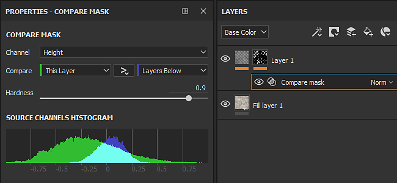
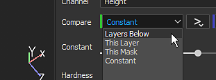
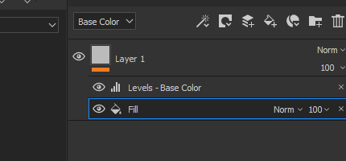
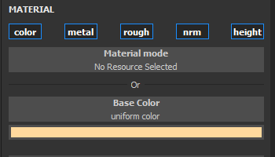
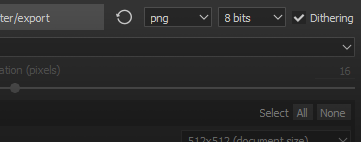

# 버전 2019.1

**Substance Painter 2019.1**&#x200B;은 기존 기능을 확장하고 새로운 예술 도구를 도입합니다. 이번 릴리스는 많은 새로운 콘텐츠를 제공하는 데에도 중점을 둡니다.

출시일: *23 2019년 4월*

## 주요 기능

### 역동적인 획

이번 릴리스에서는 브러시 엔진이 역동적인 획 기능을 지원합니다. 이러한 유형의 획은 즉석에서 새 Substance 버전을 생성해 다양한 효과와 새로운 효과를 만듭니다. 이제 자산에 페인팅한 각각의 새 브러시 획에 대해 새 Substance 재질 또는 알파를 가질 수 있습니다.

동적 획 호환 리소스가 [페인트] 도구([페인트], [지우개], [손가락] 또는 [복제])에 로드되면 새 매개 변수 그룹이 나타납니다.

역동적인 획은 다음 속성을 지원합니다(Substance 그래프에 표시되는 경우).

* **스탬프 인덱스** : 선 내부의 스탬프 ID/번호입니다.
* **임의 시드** : 스탬프나 획마다 변경할 수 있습니다.
* **시간** : 브러시 획의 페인팅 시간이 경과하여 빠르게 또는 느리게 페인팅하면 다른 결과가 발생합니다.

스탬프 인덱스는 두 가지 다른 매개 변수와 함께 제공됩니다.

* **스탬프 시작** : *처음부터*(항상 0에서 인덱스 시작) 또는 *무작위 인덱스에서*(0에서 **스탬프 주기 수**&#x200B;로 정의된 최대값 사이의 임의의 위치를 선택).
* **스탬프 주기 수** : 이 매개 변수는 생성될 Substance 변화의 총 양을 정의합니다. 성능을 최적화하기 위해 이 파라미터는 한계로서 작용한다. Substance Painter은 새로운 것을 만드는 대신 이미 생성된 것을 재활용하는 데 사용합니다.

이 새로운 기능과 호환되는 리소스는 간단히 셸프를 찾아 현재 셸프 옆에 있는 새 아이콘을 보면 찾을 수 있습니다.

기능과 호환되는 리소스는 셸프의 키워드로 쉽게 필터링할 수 있도록 이름이 &quot;**dynamicstroke**&quot;인 새 태그도 자동으로 가져옵니다.

다음으로 재생할 새로운 **도구 사전 설정**&#x200B;도 많이 추가되었습니다.

{width="450px"}

>[!NOTE]
>
> 이 기능 및 성능에 미치는 영향에 대해 자세히 알아보려면 [전용 설명서](../../painting/dynamic-strokes/dynamic-strokes.md)를 살펴보십시오.

### 변위 및 테셀레이션

이제 Substance Painter은 실시간 뷰포트 및 Iray 모두에서 **변위** 및 **메시 테셀레이션**&#x200B;을 지원합니다. 둘 다 셰이더 매개 변수 아래의 **셰이더 설정** 창에서 제어할 수 있습니다.

* **소스 채널**: 메시 변형의 기반이 되는 채널입니다. 기본값은 Height 이지만 변위 로 설정할 수도 있습니다.
* **크기 조절**: 프로젝트의 메쉬에 적용되는 변형 정도를 제어합니다.

* **하위 분할 모드**: 균일 또는 가장자리 길이. 하위 분할의 계산 방법을 결정합니다.
* **하위 분할 수** : (모드 균일) 1부터 32까지. 값이 높으면 더 많은 다각형이 생성되어 세부 사항은 더 많지만 성능 문제가 발생할 수 있습니다.
* **최대 길이** : (모드 가장자리 길이) 1/값. 모든 다각형 가장자리는 각 세그먼트가 이 숫자와 같거나 이보다 작을 때까지 분할되며, 1/1은 장면의 크기입니다.

**파일 > 샘플 로드**&#x200B;를 통해 &quot;**타일링 재질**&quot; 샘플 프로젝트를 로드하여 이 새로운 기능 을 빠르게 사용해 보세요.

{width="450px"}{width="450px"}

>[!NOTE]
>
> &quot;**정규로 Height**&quot;이라는 새 필터가 셸프에 추가되어 최종 표준 맵을 가져오는 데 사용할 수 있습니다(Substance Painter에 의한 기본 변환이 충분하지 않은 경우).

### 마스크 비교 효과

때때로 재질을 만들고 혼합하는 것이 조금 어려울 수 있는데, 이 때문에 &quot;**마스크 비교**&quot;이라는 이름의 새 효과를 만들었습니다. 이 효과를 사용하면 두 채널을 빠르고 쉽게 비교하고 그 결과로 마스크를 만들 수 있습니다.

[마스크 비교] 효과에는 다음과 같은 속성이 있습니다.

* **채널** : 마스크를 만들 원본과 대상을 비교할 채널입니다.
* **비교** : 여기서 세 개의 매개 변수를 사용하여 마스크를 계산하는 방법을 선택할 수 있습니다. 중간에 있는 드롭다운은 비교 작업(보다 작음, 공차 내, 보다 큼)을 정의합니다.
* **상수** : 비교 설정이 &quot;상수&quot;로 설정된 경우 비교할 값입니다.
* **경도**: 결과 마스크 비교의 Smoothness/경도를 제어합니다.
* **막대 그래프** : 소스와 대상의 막대 그래프 보기를 제공합니다. 마스크가 약간 겹치는지 전혀 겹치지 않는지 확인하는 데 유용합니다(마스크와 겹치지 않으면 비어 있음).

레이어를 마우스 오른쪽 버튼으로 클릭하고 바로 가기 &quot;**Height 조합이 포함된 마스크 추가**&quot;를 선택하여 레이어에 이 새 마스크를 빠르게 추가할 수 있습니다. 또한 이 단축키는 Height 채널 혼합 모드를 기본 &quot;선형 닷지(추가)&quot; 대신 &quot;표준&quot;으로 전환합니다.\

### 방사형 대칭

대칭 도구의 기능을 확장하여 방사형 대칭을 처리합니다. 이제 대칭 설정 메뉴에 이를 활성화하는 새로운 모드가 있습니다(컨텍스트 도구 모음에서 사용 가능).

다음과 같은 설정을 사용할 수 있습니다.

* **X / Y / Z** : 방사형 대칭에 사용되는 대칭 축의 방향을 제어합니다.
* **개수** : 복제된 점의 수입니다.
* **각도 범위** : 원래 위치에서 복제된 점의 위치입니다. 이 설정을 사용하여 전체 원 또는 전체 원의 1/4 등을 만들 수 있습니다.

또한 색칠을 시작하기 전에 설정을 보다 쉽게 수정할 수 있도록 약간의 미리 보기를 추가했습니다.

### 새 칠 레이어 투영 모드

칠 레이어 및 칠 효과로 두 가지 새로운 투영 모드가 추가되었습니다. **평면** 및 **구형**. 또한 3D 투영의 비헤이비어를 추가로 제어하기 위해 새로운 매개변수를 많이 추가했습니다.

* **새로운 평면 투영 모드**\
  이제 이 새로운 모드를 사용하여 평면을 투영할 수 있습니다. 차량에 줄무늬를 만들거나 데칼을 특정 위치에 배치하는 데 유용할 수 있다.

  
* **평면 투영용 표면 도구**\
  평면 투영을 쉽게 조작할 수 있도록 단축키 &quot;**Shift+W**&quot;을(를) 사용하여 액세스할 수 있는 **표면 도구**&#x200B;라고 하는 3D 조작기에 대한 새 컨트롤도 추가했습니다. 또한 컨텍스트 도구 모음에서 액세스할 수도 있습니다. 이 새 모드는 평면 투영에서만 사용할 수 있습니다.

  

  
* **평면 투영 컬링/페이딩**\
  여러 설정을 사용하여 평면 투영을 연속적이거나 한정적으로 만들 수 있습니다. 컬링 설정을 활성화하면 조작기 주변의 doted 상자가 투영에 대한 경계 상자를 나타내고 가운데 줄이 투영이 시작되는 지점입니다. 투영의 크기를 조절하면 투영의 이동 거리 및 페이드 시작 시간을 제어할 수 있습니다.

  {width="500px"}

  
* **새 구형 투영 모드**\
  이제 구형 투영은 이 새로운 모드로 실행할 수 있습니다. 이를 사용하여 고급 패턴을 얻거나 더 쉽게 곡선 표면을 따를 수 있습니다.

  {width="350px"}
* **새 모양 자르기 설정**\
  3D 투영에 투영의 반복을 제어하는 설정이 추가되었습니다. 데칼이 수동으로 마스킹하지 않고도 특정 영역에서만 반복하는 경우에 매우 유용합니다.

  {width="500px"}
* **기존 설정 이동 및 이름 변경됨**\
  이 새로운 투영 때문에 몇 가지 설정이 작동하는 방식을 약간 재작업했습니다. 예를 들어 &quot;**타일링**&quot;의 이름이 &quot;**UV 랩**&quot;으로 바뀌었습니다. 이제 타일링을 세로 또는 가로로만 설정할 수 있습니다. 크기 조절, 회전 및 오프셋은 이제 투영 모드 간에 더 일관성을 유지하기 위해 &quot;**UV 변형**&quot;이라는 새 매개 변수 그룹에 포함됩니다.

  

  
* **회전 조작기 전축 모드 개선** 명시적 구를 그리는 대신 아래의 텍스처링을 숨기지 않도록 구를 숨깁니다. 축 사이를 클릭하면 모든 축을 한 번에 회전할 수 있는 구가 선택됩니다.\
  

### 다양한 개선 사항

* **텍스처 집합에 대한 다중 선택**\
  이제 [텍스처 세트] 설정을 통해 여러 [텍스처 세트]를 선택하여 해상도를 한 번에 변경할 수 있습니다.\
  다중 선택 모드에서는 여전히 &quot;기본&quot; 텍스처 세트라는 개념이 있으며, 이 때문에 추가 요소가 회색으로 선택됩니다. 현재 선택 영역을 유지하면서 다른 텍스처 세트로 전환해야 하는 경우에는 마우스 가운데 버튼을 사용하여 전환할 수 있습니다.
* **텍스처 집합 목록에서 빠른 표시/숨기기**\
  이제 레이어 스택에서처럼 클릭하고 드래그하여 텍스처 세트를 숨기거나 표시할 수 있습니다.
* **레이어 스택용 UI 개선**\
  레이어의 숨겨진/표시 상태에 대한 아이콘을 보다 일관되고 이해하기 쉽게 변경했습니다. 또한 선택한 레이어가 표시되는 방식을 변경하여 효과 및 다른 레이어의 선택 항목과 더 쉽게 비교할 수 있습니다.\
  
* **현재 선택 영역을 기반으로 하는 새 효과 위치** 레이어에 추가된 새 효과는 이제 현재 선택한 효과 바로 위에 배치됩니다.\
  
* **재질 채널 단추의 빠른 토글**\
  이제 Alt 키를 누르고 채널 버튼을 클릭하여 분리할 수 있습니다. 다시 클릭하면 모든 채널이 다시 활성화됩니다.\
  
* 이제 파일 형식 및 비트 심도 옆의 내보내기 창에서 전용 설정을 통해 **내보내기에서 디더링**&#x200B;을 사용하지 않도록 설정할 수 있습니다. 디더링을 적용하는 방법과 시기에 대한 자세한 내용은 [내보내기 설명서를 참조하십시오](../../export/export-window/export-window.md).\
  
* **더 나은 히스토그램**\
  히스토그램 생성기를 재작업했습니다. 이제 레이어 스택을 변경한 후에 막대 그래프에 더 정확한 정보가 표시되고 적절하게 업데이트되어야 합니다.\
  
* **레이어 인스턴스 개선**\
  이제 인스턴스 레이어의 혼합 모드가 기본 혼합 모드 대신 &quot;통과&quot;로 설정됩니다. 이 혼합 모드는 [텍스처 세트]에서 레이어를 인스턴스화할 때 일부 효과의 호환성을 향상시킵니다.

### 새 콘텐츠

이 릴리스에서는 사전 설정에서 알파 및 새로운 강력한 필터에 이르기까지 많은 새로운 콘텐츠를 추가했습니다.

* **새 브러시 및 도구 사전 설정**\
  이 릴리스에서는 새로운 역동적인 획 기능을 도입하고 일부 브러시 및 도구 사전 설정을 추가했습니다.

  * 10개의 새로운 브러시 사전 설정 :
    * 잉크 더티
    * 잉크 무작위
    * 나뭇잎 곡선 굵게
    * 나뭇잎 곡선
    * 잎이 지저분함
    * 단순 리프
    * 나뭇잎 소용돌이
    * 지그재그 길게
    * 지그재그 짧게
    * 지그재그 계단
  * 11개의 새로운 도구 사전 설정 :
    * 단풍
    * 균열
    * 발자국
    * 그레이디언트 색조
    * 손발톱
    * 조약돌
    * 스크래치
    * 스프레이 색상
    * 피부 빛 분무
    * 스프레이 스킨 레드
    * 지퍼
* **93명의 새 Alpha**\
  그것들을 모두 열거하기에는 너무 많으므로, 선반의 &quot;Alpha&quot; 섹션을 보면 많은 새로운 화살표, 삼각형, 기호 및 다른 종류의 모양을 볼 수 있습니다.
* **13개의 새 필터**\
  이 새로운 버전에는 상황의 분실에 매우 편리할 수있는 많은 새로운 필터가 있습니다 :

  * **흐림 효과 경사** : 새 흐림 효과 필터가 패밀리에 추가되었습니다. 이 필터는 뒤틀기 필터와 유사한 방식으로 작동합니다. 즉, 기존 입력 또는 사용자 정의 입력을 사용하여 대상 채널을 흐리게 만들 수 있습니다.
  * **경사** : 모양 주위에 그래디언트 테두리를 만듭니다. 예를 들어, 마스크를 확장하려는 경우에 유용합니다.
  * **색상 일치** : 이 필터는 소스 색상을 대상 색상과 일치시키려고 합니다. 재질의 색상을 조정하는 데 편리합니다.
  * **그레이디언트 곡선** : 이 필터는 모든 회색 음영 입력에 적용하여 모양을 변경할 수 있는 곡선 사전 설정 목록을 제공합니다.
  * **그레이디언트 동적** : 새 입력 이미지(회색 음영 또는 색상)로 회색 음영 입력을 다시 매핑합니다.
  * **Height 조정** : 이 필터는 Height 채널을 쉽게 조작할 수 있는 두 가지 설정(오프셋 및 곱하기)을 제공합니다.
  * **일반 채널에 Height** : 이 필터는 Height 채널을 일반 채널로 변환하고 일반 채널로 보냅니다. 그것은 필요에 따라 다른 강도 컨트롤을 가지고 있습니다.
  * **마스크 윤곽선** : 이 필터는 회색 음영 입력 주위의 검은색 테두리에 흰색을 만듭니다. 이 기능은 모양 주위에 테두리를 만들 때 [마스크]에서 가장 유용합니다.
  * **PBR 유효성 검사** : PBR 재질 색상이 올바른 범위에 있는지 확인하기 위해 이 필터를 추가했습니다. 자세한 내용은 [PBR 안내서](https://www.allegorithmic.com/pbr-guide)!을(를) 확인하십시오.
  * **MatFX 박리 페인트** : 박리되기 시작하는 이전 페인트를 시뮬레이션합니다. 이 필터는 아래의 재질과 혼합하기 쉬운 알파를 출력합니다.
  * **MatFx 물방울** : 개체 표면의 물방울을 시뮬레이션합니다. 비 온 뒤에 차 위에 물이 있는 것처럼.
* **7개의 새 생성기**\
  이번 릴리스에서는 몇 가지 새로운 생성기 를 추가했습니다.

  * **주변 오클루전** : 주변 오클루전 메시 맵을 제어하는 마스크 생성기입니다. 기반으로 합니다.
  * **월드 스페이스 표준** : 월드 스페이스 표준 메시 맵에 대한 컨트롤을 제공하는 마스크 생성기입니다. 기반으로 합니다.
  * **위치** : 위치 메시 맵을 제어하는 마스크 생성기입니다. 기반으로 합니다.
  * **곡률** : 곡률 메시 맵을 제어하는 마스크 생성기입니다. 기반으로 합니다.
  * **자동 스티처** : UV 테두리, 메시 곡률 또는 사용자 지정 마스크 입력 주위에 스티치를 만드는 마스크 생성기입니다.
  * **UV 텍셀 밀도** : 메쉬 다각형의 텍셀 밀도를 기반으로 색상 그레이디언트를 출력하는 도우미.
  * **UV 무작위 색상** : UV 섬 당(또는 사용자 정의 그라디언트 입력을 기반으로) 무작위 색상을 생성합니다.
* **2개의 새 환경 맵**

  * 가을 숲
  * 카노푸스 그라운드

    
* **5개의 새 프로시저**

  * 그레이디언트 색조
  * 그레이디언트 빌더
  * 색인별 색상 지터
  * 시드별 색상 지터
  * 페더 스타일화

    

## 튜토리얼

최신 기능이 포함된 튜토리얼을 확인하십시오.

또한 Substance 아카데미에서 동적 선을 만드는 방법을 다룬 튜토리얼도 있습니다. [Substance Painter을 위한 사용자 정의 동적 선 만들기](https://academy.allegorithmic.com/courses/Creating-a-custom-Dynamic-Stroke-for-Substance-Painter)

## 릴리스 정보

### 2019.1.3

*(2019년 7월 1일 릴리스)*\
요약 : **두 가지 새로운 기능이 포함된 버그 수정**

**고정:**

* &quot;패스 따르기&quot;가 항상 작동하지 않음
* 단일 채널 슬롯에 사용된 SBSAR에서 채널 매핑이 작동하지 않음
* [레이어 스택] 숨겨진 레이어로 스크롤할 때 성능이 저하됨
* [TextureSet] 마스크 사이를 클릭할 때 충돌 발생
* [SVT] 변위가 제대로 표시되지 않고 일부 경우 깜박임
* [알렘빅] 메시가 꼭지점 수직 대신 점 수직을 사용할 때 충돌합니다.
* [Alembic][Log] 가져오는 동안 Alembic 파일이 지원되지 않는 경우 로그에 오류를 보고합니다.

### 2019.1.2

*(2019년 5월 21일 릴리스)*\
요약 : **핫픽스**

**고정:**

* 이미지 입력이 있는 두 개의 리소스를 선택할 때 충돌 발생

### 2019.1.1

*(2019년 5월 20일 릴리스)*\
요약 : **핫픽스**

**추가됨:**

* Substance Designer 2019.1의 마지막 릴리스를 사용하여 최신 버전의 Substance 엔진으로 업데이트

**고정:**

* [Substance] 입력 이미지를 고려하지 않은 경우 표시됩니다.
* [SVT][엔진] 텍스처 세트 해상도를 변경하면 경우에 따라 충돌이 발생합니다
* [엔진] 경우에 따라 검정 텍스처 무작위 표시
* [레이어 스택][UI] SHIFT를 사용하여 마스크를 전환하면 여러 레이어를 동시에 선택할 수 있습니다
* [레이어 스택] 통과 혼합 모드를 사용하는 페인트 효과에는 불투명도가 영향을 주지 않습니다.
* [레이어 스택] 일반 필터 입력에 대한 Height이 지우개 브러시 획으로 제대로 업데이트되지 않음
* [LayersStack] 스마트 마스크 삭제를 실행 취소하면 충돌이 발생합니다
* 어두운 영역과 시간 앤티 앨리어싱이 활성화된 와이어프레임 깜박임
* [변위] 일부 무거운 메시가 있는 AMD에서 지연됨
* [Windows] 파일 탐색기를 통해 일부 프로젝트를 열 때 충돌이 발생합니다
* [막대 그래프] 고정점이 있는 마스크를 제거할 때 경우에 따라 충돌이 발생합니다
* 드문 경우지만 미리 보기 생성 시 충돌이 발생합니다
* [충돌] 너무 많은 복제 및 손가락 도구를 사용하여 프로젝트를 다시 열 수 없습니다.
* 경우에 따라 저장한 후 재질 모드에서 메쉬가 표시되지 않습니다
* [Scripting] alg.mapexport.documentStructure()가 폴더에 대해 잘못된 값을 반환합니다.

**알려진 문제:**

* 텍스처 세트 이름을 두 번 클릭하면 이름 바꾸기 모드로 들어가기 전에 해당 이름이 선택됩니다.

### 2019.1

*(2019년 4월 23일 릴리스)*\
요약 : **전용 새 콘텐츠가 있는 동적 획, 실시간 및 Iray의 변위 및 테셀레이션, 마스크 효과 비교, 방사형 대칭, 평면 및 구형 투영**

**추가됨:**

* [도구] 동적 선: 브러시 선과 함께 변형 Substance
* [동적 선] 옵션을 사용하여 새 스탬프 인덱스 매개 변수를 표시합니다.
* [동적 선] $time 매개 변수를 고려합니다.
* [동적 선] 선 및 스탬프당 새로운 $randomseed 매개 변수를 생성합니다.
* [동적 선] 임의의 숫자에서 동적 선 인덱스를 시작합니다.
* [Dynamic stroke][Shelf] 전용 새 아이콘이 있는 동적 획 리소스를 찾는 데 도움이 됩니다.
* 실시간 뷰포트에서 변위 및 쪽맞춤
* Iray의 변위 및 테셀레이션
* [Shader settings][UI] 변위 및 테셀레이션 제어를 위한 새 탭
* [레이어 스택] 새로운 CompareMask 효과: 두 채널을 비교하여 마스크 만들기
* [레이어 스택][UI] 마우스 오른쪽 버튼 클릭 메뉴 &quot;Height 조합으로 마스크 추가&quot;에 CompareMask 효과를 삽입하는 새 항목
* [대칭] 새로운 대칭 모드: 방사형 페인팅
* [대칭 설정] &quot;설정&quot; 및 &quot;표시&quot; 섹션을 모두 확장합니다.
* [대칭 설정][UI] 방사형 페인팅을 위한 미리보기
* 두 가지 새로운 투영 모드, 즉 평면 및 구형 노출
* [Proj] 모든 투영에 대한 새로운 모양 자르기 모드
* [Proj] 새로운 매니퓰레이터가 있는 평면 모드: 서피스 도구
* [Proj][단축키] [서피스 도구]의 단축키 Shift+W
* [Proj] 깊이 컬링 및 백페이스 컬링을 사용한 평면 투영 마스킹
* [매니퓰레이터] 삼평면의 세 축 모두에서 회전 매니퓰레이터 개선
* [Tool][UX] 채널을 Alt-클릭하여 채널을 강조합니다(다른 채널을 사용하거나 사용하지 않도록 설정).
* [엔진] 최신 버전의 Substance 엔진으로 업데이트
* [텍스처 세트] 다중 선택 및 해상도 변경
* [텍스처 세트] 텍스처 세트의 빠른 활성화 및 비활성화
* [텍스처 세트] 솔로 및 모든 옵션을 새 메뉴로 결합
* [텍스처 세트][레이어 스택] 활성화 및 비활성화에 대한 새 아이콘
* [레이어 스택][UX] 이미 선택한 효과 위에 효과를 삽입합니다.
* [레이어 스택][UI] 레이어 스택 보기 선택 스타일 다시 작업
* [레이어 스택] 이제 인스턴스 레이어의 혼합 모드가 기본적으로 통과 모드에 있습니다.
* [내보내기] 디더링 활성화 및 비활성화 옵션
* [플러그인] 슬라이더에 대한 정밀도 수정자 지원(SHIFT)
* [플러그인][UI] 자동 저장에 대한 새 아이콘
* [스크립팅] 폴더의 내용을 나열합니다.
* [스크립팅] 파일 삭제 허용
* [스크립팅] 사용된 리소스를 포함한 모든 스택 정보 읽기
* [콘텐츠][동적 선] 새로운 도구 및 브러시 사전 설정
* [콘텐츠][동적 선] 두 개의 새로운 절차적 그레이디언트: 그레이디언트 색조 및 그레이디언트 빌더
* [콘텐츠] 11가지 새로운 필터: MatFx 필링 페인트, MatFx 물방울 등
* [Content] 7개의 새로운 생성기: 자동 스티처, UV 랜덤 색상, UV 텍셀 밀도 등
* [내용] 93개의 새로운 알파: 새로운 텍스트, 화살표 및 다양한 모양
* [콘텐츠] 그라디언트 색조, 그라디언트 빌더 등의 2가지 새로운 절차
* [내용] 역동적인 획에 대한 21개의 새로운 도구 및 브러시 사전 설정 : 자갈, 발자국, 스프레이 등
* [콘텐츠] 2 새로운 HDRis: Canopus Ground 및 Autumn Forest
* [콘텐츠] 셸프의 무작위 시드 큐레이션으로 콘텐츠 업데이트
* [Content] 셸프에 노출된 임의 시드 매개 변수가 있는 새 아이콘

**고정:**

* [레이어 스택] 레이어 스택은 계속 드래그합니다.
* [Mac] &quot;파인더에 표시&quot;하면 작동이 멈출 수 있습니다
* [스크립팅] 셰이더 파일을 이동하면 사용자 지정 UI를 통해 저장된 설정이 손실됩니다.
* [스크립팅] API 버전 번호가 잘못되었으며 최신 버전이 아닙니다.
* [효과] 막대 그래프 콘텐츠가 올바르게 표시되지 않음
* [효과] 막대 그래프 효과가 업데이트되지 않는 경우가 있습니다
* [선반] 스티치가 &quot;플라스틱 직물 피라미드&quot; 재료에 제대로 정렬되지 않습니다.

**알려진 문제:**

* 텍스처 세트 이름을 두 번 클릭하면 이름 바꾸기 모드로 들어가기 전에 해당 이름이 선택됩니다.
* [레이어 스택][UI] SHIFT를 사용하여 마스크를 전환하면 여러 레이어를 동시에 선택할 수 있습니다
