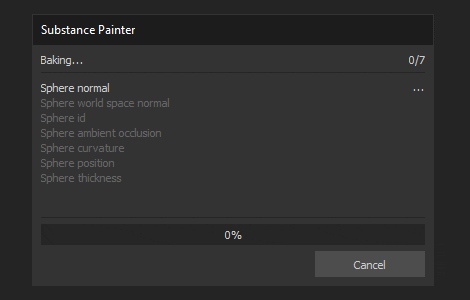

# 버전 2019.2

**Substance Painter 2019.2**&#x200B;은 제빵사에 새로운 강력한 기능을 제공하고 새로운 스마트 재질 및 스마트 마스크 세트를 선반에 제공합니다.

출시일: *2019년 7월*

## 주요 기능

### 베이커를 위한 작업 과정 개선

이 릴리스에서는 몇 가지 새로운 기능을 통해 베이킹 워크플로우가 개선되었습니다. 이러한 개선 사항을 통해 Substance Painter 작업 속도가 빨라지고 작업이 쉬워집니다.

* **굽기 프로세스 시각화**\
  기본적으로 이 새로운 버전에서는 모든 베이킹 과정이 뷰포트에 표시됩니다. 이를 통해 실시간으로 베이커의 결과를 미리 볼 수 있으며, 프로세스가 끝날 때까지 기다리지 않고도 필요에 따라 취소할 수 있어 더 빠른 반복을 제공할 수 있습니다. 이 동작은 기본 설정으로 이동하여 &quot;**굽기 옵션**&quot; 섹션에서 &quot;**실시간 미리 보기 굽기 프로세스 사용**&quot; 설정의 선택을 취소하여 비활성화할 수 있습니다.

  

  {width="500px"}
* **굽기 대화 상자 개선**\
  베이킹 대화 상자가 재작업되어 현재 베이킹 프로세스의 상태가 더 개선되었습니다. 이제 계산되는 텍스처의 수와 베이커 및 텍스처 세트당 명시적으로 몇 개의 목록이 있는지 나타내는 카운터가 있습니다. 오류가 발생하면 제빵사 이름 옆에 빨간색 십자가 표시됩니다. 프로세스가 끝나면 새 버튼을 사용하여 로그 창을 빠르게 열고 문제에 대해 자세히 알아볼 수 있습니다.\
  
* **진행 중인 굽기 취소** 굽기 프로세스가 더 이상 응용 프로그램을 잠그지 않습니다. 이제 Substance Painter이 더 신속해졌습니다. 즉, 현재 진행 중인 굽기가 끝날 때까지 기다리지 않고 취소할 수 있습니다. 취소는 즉시 이루어지지 않으며 적용되는 데 몇 초 정도 걸릴 수 있습니다. 이는 내부적으로 베이킹 프로세스가 청크의 텍스처에 대해 작동하고 청크가 계산되는 동안 중지할 수 없기 때문입니다. 베이킹 프로세스를 취소하면 베이킹 창이 자동으로 다시 열립니다.\
  

### 제빵사를 위한 성능 개선 사항

워크플로우 개선을 통해 베이커를 업데이트하고 성능을 개선할 수 있는 기회도 얻었습니다. 또한 DXR과 Optix의 지원을 추가해 이전보다 훨씬 더 빠르게 베이킹할 수 있는 GPU 광선 추적을 구현했다. 단, GPU 광선 추적은 앰비언트 오클루전 및 Thickness 베이커에만 영향을 줍니다.

* **CPU 광선 추적이 개선되었습니다**\
  이제 CPU에서 광선 추적 계산이 이전보다 2~3배 빨라졌습니다. 따라서 GPU가 GPU 광선 추적과 호환되지 않더라도 일반적으로 성능이 개선됩니다.
* **DXR 및 Optix에서 GPU 광선 추적 지원**\
  호환되는 하드웨어를 사용하면 베이커가 GPU에서 직접 계산할 수 있어, 특히 앤티 앨리어싱이 활성화되어 있고 많은 광선이 정의된 경우 계산 시간이 크게 줄어듭니다. DXR이 사용 가능한 경우 기본 옵션이며, 그렇지 않으면 Optix가 사용됩니다. [기본 설정](../../interface/settings/settings.md)으로 이동하여 &quot;**굽기 옵션**&quot; 을 찾아 GPU 광선 추적을 비활성화할 수 있습니다.

  

>[!NOTE]
>
> GPU 광선 추적 기능을 활성화하려면 다음 드라이버로 업데이트해야 합니다. **Nvidia 드라이버 430.86**.\
> DXR은 RTX GPU 및 [GeForce GTX 10xx GPU](https://www.nvidia.com/en-us/geforce/news/geforce-gtx-dxr-ray-tracing-available-now/)에서 사용할 수 있습니다. DXR에서 액세스하려면 Windows 10이 최신 상태여야 합니다(버전 1809). 자세한 내용은 이 페이지를 참조하십시오.

>[!WARNING]
>
> GPU 광선 추적을 사용할 때, 고-폴리 메쉬가 VRam에 맞지 않으면 베이커가 실패할 수 있다. 이 경우 [기본 설정](../../interface/settings/settings.md)으로 이동하여 &quot;**굽기 옵션**&quot; 섹션에서 &quot;**GPU 광선 추적**&quot; 설정을 비활성화하는 것이 좋습니다. 그 후 베이킹 프로세스를 다시 시작할 수 있습니다.

### 기타 새로운 기능 및 개선 사항

이 릴리스에서는 Substance Painter 내 삶의 질을 높이기 위해 몇 가지 사항을 추가하고 재작업했습니다.

* **회전 조작기 개선**\
  회전 조작기는 이전에는 회전을 수행하는 데 다소 지루한 작업을 수행했습니다. 이제 회전 속도가 카메라 및 장면 크기에 연결됩니다.
* **뷰포트 다운스케일링을 사용하여 높은 DPI 화면에서 향상된 성능**\
  이제 [기본 설정](../../interface/settings/settings.md)에 값이 &quot;**없음**&quot; 및 &quot;**자동**&quot;(기본값)인 &quot;Viewport Scaling&quot;이라는 새 매개 변수가 있습니다. Substance Painter이 화면에서 HDPI 비율 조정(예: MacOS의 Retina 화면)을 사용하는 것을 감지하면 자동으로 뷰포트 해상도를 2로 나눕니다. 이 비헤이비어를 사용하면 뷰포트를 너무 크게 그리는 것을 방지할 수 있으며 전반적인 성능은 눈에 띄게 저하되지 않고 향상됩니다.

  
* **스크립팅을 위한 새 콘솔 플러그인**\
  스크립팅 API에서 명령을 쉽게 실행하기 위해 새 플러그인을 만들었습니다. Github : <https://github.com/AllegorithmicSAS/painter-plugin-console>에서 사용할 수 있습니다. 콘솔은 자동 완료도 지원합니다.

  

### 새 콘텐츠

새로운 스마트 재질 및 스마트 마스크 세트가 기본 셸프에 추가되어 다양한 사용을 다룹니다. 추가된 에셋의 전체 목록은 다음과 같습니다.

* **40개의 새로운 스마트 재질**

  * 섬유
    * 캔버스 천 주름
    * 사용된 직물 복합재료
    * 데님 직물이 씻겨짐
    * 플란넬 타탄 섬유
    * 주름진 패브릭 리넨
    * 베갯잇용 섬유
    * 직물 합성 점
    * 합성한 운동용 섬유
  * 가죽
    * 가죽 송아지 그레인
    * 가죽으로 주름짐
    * 가죽 천연 색상
    * 가죽 러프 다크
  * 대리석 - 화강암
    * Marble Verde Alpi
  * 금속
    * 손상된 금
    * 철 단조 옛
    * 페인트가 칠이 벗겨진 더러운 강철
    * 강철로 칠한 러프 손상
    * 페인트가 칠해진 더러운 강철
    * 강철로 그린 스크랩드 그린
    * 페인팅된 스틸 효과
    * 강철폐석
  * 천연
    * Creative Skin Alien Blue
    * 피부 녹색 매끄럽게 동물
    * 생물 치아
    * 동물 혀
  * 플라스틱 - 고무
    * 플라스틱 먼지
    * 광택이 있는 플라스틱 자루
    * 광택 있는 플라스틱 스테인드
    * 플라스틱 그레인 소프트
    * 플라스틱 러프 스크래치
    * 열성형 플라스틱
    * 두꺼운 플라스틱 깨짐
    * 플라스틱 공구가 마모됨
    * 플라스틱 중고 부드러운
  * 돌
    * 사파이어 커런덤
  * 반투명
    * 유리 필름 더티 미러
  * 나무
    * 목탄
    * 우드 아까주
    * 우드선박 선체 노르딕
    * 우드 쉽 헐 올드
* **20개의 새 스마트 마스크**

  * 구김
  * Dirt 캐비티
  * Dirt 그라운드
  * Dirt 누수 건조
  * 부드러운 가장자리 Dirt
  * Dirt 스플래시
  * Dirt 스팟
  * Dust 플라스틱
  * 부드러운 가장자리 Dust
  * Dust 표면
  * 넓은 가장자리 Dust
  * Edge 더티 균열
  * Edge Stone 균열
  * 가장자리 강하게 스크래치
  * 섬유 스레드
  * 페인트 손상됨
  * 미세한 스크래치 페인트
  * 모래 공동
  * 모래 Dust
  * 물이 뚝뚝 떨어짐

## 릴리스 정보

### 2019.2.3

*(2019년 10월 23일 릴리스)*\
요약 : **버그 수정**

**추가됨:**

* [텍스처 세트 목록] 포커스 모드를 빠르게 활성화/비활성화하는 [추가] 버튼
* [Log] 로그 파일에 Windows 10 버전 번호 추가
* 최신 버전의 Substance 엔진으로 업데이트
* [MacOS] 새 MacOS Catalina 배포 요구 사항을 따르도록 소프트웨어를 공증했습니다.

**고정:**

* [플러그인] 플러그인 소스가 작동하지 않음
* [MacOS][셰이더] Mac OS 10.14.5 및 AMD: 재질 레이어링 이 의도한 대로 작동하지 않습니다.

**알려진 문제:**

* 하위 구분이 있는 알렘빅 파일은 가져올 수 없습니다.
* 일부 Alembic 파일을 가져올 때 드문 충돌이 발생합니다
* Pascal GPU의 DXR을 사용하여 굽는 동안 UI가 일시적으로 응답하지 않습니다.

### 2019.2.2

*(2019년 9월 20일 릴리스)*\
요약 : **버그 수정**

**고정:**

* 스크립팅으로 리소스를 가져오면 충돌이 발생할 수 있습니다
* [플러그인] 소스에서 재질을 다운로드하면 충돌이 발생할 수 있습니다

### 2019.2.1

*(2019년 9월 17일 릴리스)*\
요약 : **버그 수정**

**고정:**

* [Mac][USD] MacOS에서 내보낸 USDZ 파일을 열 수 없습니다.
* [텍스처 세트] ALT 수정자를 사용하여 텍스처 세트를 분리할 수 없음
* [Shelf] 응용 프로그램을 종료할 때 사전 설정, 스마트 재질 및 스마트 마스크가 항상 수정됨
* [레이어 스택] 다른 효과를 삭제한 후 효과를 선택할 수 없습니다.
* 도구 속성 패널 내에서 슬라이더를 사용할 때 깜박임
* 사전 설정을 선반으로 내보낼 때 충돌 발생
* 공간이 부족한 사전 설정을 내보낼 때 충돌 발생
* 공간이 부족한 사전 설정을 만들 때 충돌이 발생합니다

**알려진 문제:**

* 하위 구분이 있는 알렘빅 파일은 가져올 수 없습니다.
* 일부 Alembic 파일을 가져올 때 드문 충돌이 발생합니다
* Pascal GPU의 DXR을 사용하여 굽는 동안 UI가 일시적으로 응답하지 않습니다.

### 2019.2

*(2019년 7월 25일 릴리스)*\
요약 : **성능 및 새로운 사전 시각화 모드의 베이커 업데이트가 포함된 주요 릴리스 + 새 콘텐츠**

**추가됨:**

* [베이커] DXR 및 OptiX에 GPU 광선 추적 지원 추가(앰비언트 오클루전, Thickness)
* [베이커] CPU 광선 추적을 위한 최적화 및 가속
* [Bakers][Vis mode][UI] 뷰포트의 새로운 베이킹 시각화 모드
* [Bakers][Preferences][UI] GPU 광선 추적을 비활성화하는 새로운 베이킹 옵션
* [베이커][UI] 진행률 표시줄 대화 상자의 재작업
* [베이커] 경고 및 오류 메시지 개선
* [베이커] 베이킹 프로세스의 반응형 취소 허용
* [베이커] 취소 클릭 후 베이크 창 다시 열기
* [Proj][UX] 회전 조작기의 사용성 개선
* [설정] HDPI 화면의 뷰 포트 해상도를 줄여 성능을 개선하는 옵션
* [스크립팅] 텍스처 세트 해상도 변경
* [스크립팅] 선택한 텍스처 세트 가져오기
* [스크립팅] 사용자가 텍스처 세트를 선택할 수 있습니다.
* [스크립팅] 텍스처 세트 선택이 언제 변경되었는지 아는 기능
* [Shelf] 40개의 새로운 스마트 재질 추가
* [Shelf] 20개의 새로운 스마트 마스크가 추가되었습니다.

**고정:**

* [레이어 스택] 여러 레이어를 선택할 때 UI 고정
* [레이어 스택] 많은 레이어를 그룹화하면 UI가 평소보다 오래 고정됩니다
* [레이어 스택] 경우에 따라 레이어와 효과를 동시에 선택할 수 있습니다
* 페인팅 도구 내에 사용된 Substance 그래프가 적절한 해상도로 생성되지 않습니다
* [베이커] 베이커를 선택하지 않으면 [모든 텍스처 세트 베이크] 버튼이 비활성화되지 않습니다.
* [MacOS] 쪽맞춤에 대한 경고 메시지 비활성화
* 마스크와 함께 사용할 때 투영 도구에 미리보기가 없음
* 디스크 공간 부족으로 저장하려고 할 때 프로젝트가 충돌하고 손상됨
* [Shelf] 공간이 부족한 셸프를 통해 디스크의 리소스를 가져올 때 충돌이 발생합니다
* [Shelf] 세션 사전 설정을 복원할 때 충돌이 발생합니다
* [Shelf] 공백으로 끝나는 이름을 가진 사전 설정을 가져오면 충돌이 발생합니다
* [Shelf] 접두어가 공백으로 끝나는 리소스를 가져오면 충돌이 발생합니다

**알려진 문제:**

* 하위 구분이 있는 알렘빅 파일은 가져올 수 없습니다.
* 일부 Alembic 파일을 가져올 때 드문 충돌이 발생합니다
* Pascal GPU의 DXR을 사용하여 굽는 동안 UI가 일시적으로 응답하지 않습니다.
