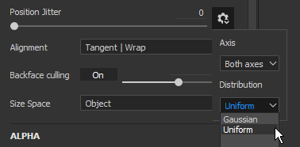

# 버전 2019.3

**Substance Painter 2019.3**&#x200B;에서는 Photoshop 브러시 사전 설정 지원 및 메시에 대한 자동 UV 감싸기를 도입하고 그래픽 태블릿을 더 잘 처리하는 등 다양한 삶의 질을 개선합니다.

출시일: *2019년 12월 17일*

## 주요 기능

### Photoshop 브러시 사전 설정 지원(ABR)

이제 Substance Painter에서 Photoshop 브러시를 사용할 수 있습니다. 이제 사전 설정을 ABR 파일로 내보내기만 하면 일반 브러시 사전 설정으로 가져올 수 있습니다. ABR 파일에 포함된 사전 설정은 개별 브러시 사전 설정으로 선반에 표시됩니다.

가져올 ABR 파일이 없는 경우 온라인에서 많은 파일을 찾을 수 있습니다.

* [Adobe 시 Kyle의 브러시 사전 설정](https://www.adobe.com/products/photoshop/brushes.html)
* [ArtStation의 브러시 사전 설정](https://www.artstation.com/marketplace?q=photoshop%20brush&sort_by=trending)
* [DeviantArt의 브러시 사전 설정](https://www.deviantart.com/search?q=photoshop%20brush)
* [큐브브러시의 브러시 사전 설정](https://cubebrush.co/marketplace?categories=354,57)

Photoshop 브러시를 지원하기 위해 페인팅 도구 속성에 다음과 같은 다양한 새로운 기능이 추가되었습니다.

* **새 크기 및 흐름 최소 매개 변수**\
  이제 펜 압력을 활성화하면 도구의 최소 크기 및 최소 흐름을 지정할 수 있습니다. 이 매개변수는 정의된 현재 최대 크기/흐름을 기준으로 백분율로 작동합니다. 이러한 설정은 Photoshop 브러시 사전 설정을 사용할 때 자동으로 보정됩니다.\
  
* **새 위치 지터 매개 변수**\
  Photoshop 브러시 비헤이비어와 일치하도록 몇 가지 새로운 설정을 추가했습니다. 이제 지터가 적용되는 축과 무작위 위치가 분포되는 방식을 정의할 수 있습니다(Photoshop에 맞게 **균일**&#x200B;을 선택).\
  \
  
* **새로운 알파 혼합 모드**\
  Photoshop에서는 Substance Painter과 같은 방식으로 브러시 획을 합성하지 않으므로 페인팅 결과에 더 잘 맞도록 새 혼합 모드(밝게)를 추가했습니다. 이 혼합 모드는 스탬프가 겹칠 때 과도하게 축적되지 않으므로 [흐름/불투명도] 값을 낮게 설정하여 페인팅할 때 압력 느낌을 개선할 수 있습니다.\
  \
  
* **원형율 및 뒤집기 지원**\
  원형율(Alpha Height 크기 조절) 및 뒤집기(두 축 모두에서 이미지 반전)와 같은 매개 변수를 지원하기 위해 이름이 **브러시 메이커 Photoshop**&#x200B;인 새 Substance Alpha이 추가되었습니다. ABR 파일에서 가져온 브러시 사전 설정을 클릭하면 이 Substance Alpha이 자동으로 로드됩니다.\
  \
  
* **레이어의 알파 채널에 대한 새로운 감마 교정**\
  Photoshop은 선형 감마 공간에서 브러시 획을 혼합하지 않습니다. 따라서 Photoshop 브러시 사전 설정으로 페인트할 때 혼합 및 불투명도가 잘못 표시될 수 있습니다. 레이어에 새로운 설정을 활성화하여 해당 비헤이비어와 일치시키고 감마 교정을 적용할 수 있습니다. 이렇게 하면 브러쉬 선을 페인트하는 데 사용되는 알파와 레이어의 마스크를 사용하여 다른 레이어와 혼합하는 방법에 영향을 주지만 레이어의 혼합 모드는 여전히 선형 감마 공간에서 작동합니다.\
  **이 설정을 활성화**&#x200B;하려면 레이어를 마우스 오른쪽 단추로 클릭하고 **감마 수정된 알파/마스크**&#x200B;를 선택합니다. 이 설정이 활성화된 시기를 나타내는 새 아이콘이 레이어 옆에 나타납니다.\
   \
  
* **간격 및 위치 지터에 대한 최대 값 증가**\
  Photoshop 브러시 사전 설정 매개 변수를 올바르게 일치시키기 위해 다음 매개 변수의 최대값이 증가했습니다.

  * **간격**: 이제 최대값을 1000으로 설정할 수 있습니다.
  * **위치 지터**: 이제 최대값을 1000으로 설정할 수 있습니다.

ABR 파일을 내보내고 가져오는 방법 등 자세한 내용은 [Photoshop 브러시 사전 설정](../../painting/presets/photoshop-brush-presets/photoshop-brush-presets-abr.md) 설명서를 참조하십시오.

>[!NOTE]
>
> 현재 일부 Photoshop 브러시 매개 변수는 지원되지 않습니다. 자세한 내용은 [호환성 목록](../../painting/presets/photoshop-brush-presets/photoshop-brush-parameters-compatibility.md)을 참조하세요.

### 페인팅 및 그래픽 태블릿 지원 개선

Photoshop 브러시 사전 설정 지원 외에도 그래픽 태블릿 사용과 관련하여 수많은 개선 및 수정 사항이 이루어졌습니다.

* **직선 첫 번째 스탬프가 더 이상 두 배가 되지 않습니다.**\
  직선을 페인트할 때 첫 번째 스탬프는 더 이상 복제되지 않습니다(직선을 배치하기 위해 스탬프를 실행 취소할 필요가 없음).\
  
* **직선 압력 보간**\
  이제 [직선]은 압력을 지원합니다. 압력 값은 첫 번째 스탬프와 마지막 스탬프 사이에 보간됩니다.\
  
* **새로운 브러시 미리 보기 모드**\
  이제 뷰포트에서 브러시 미리 보기를 다른 시각화 모드로 변경할 수 있습니다. 모드를 변경하려면 컨텍스트 도구 모음에서 새 드롭다운 버튼을 클릭하면 됩니다.

  
* **펜 압력 곡선**\
  이제 상황별 도구 모음에서 펜 압력을 해석하는 방법을 정의할 수 있습니다. 이러한 새로운 설정은 다양한 페인팅 스타일을 허용하는 압력 빌드업의 속도를 제어합니다.

  * **선형**: 변환 없음, 그래픽 타블렛의 펜에서 제공한 대로 검색된 압력. [태블릿 드라이버] 설정에 [펜] 압력 곡선이 이미 정의되어 있는 경우 이 설정을 사용합니다.
  * **가속**(기본값): 압력 시작 속도를 낮춰 얇거나 희미한 획을 쉽게 칠할 수 있도록 합니다.
  * **이즈 인 아웃**: 압력의 시작 속도를 늦추고 끝 속도를 높여 부드러운 또는 강한 획을 쉽게 페인트할 수 있도록 합니다.

  
* **압력 단추가 더 이상 드롭다운이 아닙니다**\
  펜 압력 컨트롤을 간단한 켜기/끄기 버튼으로 변경했습니다. 이렇게 하면 압력을 훨씬 더 쉽고 빠르게 활성화 및 비활성화할 수 있습니다.

  
* **그래픽 태블릿에 대한 지원 개선 및 Windows Ink로 전환**\
  우리는 그래픽 태블릿을 다루는 방법을 재작업했다. 이렇게 하면 최신 그래픽 태블릿 모델과의 호환성이 전반적으로 개선되고 과거에 발생했던 문제의 수가 줄어듭니다. Windows에서도 호환성을 개선하기 위해 Wintab 대신 Windows Ink로 전환했습니다.

  >[!NOTE]
  >
  > Wacom 드라이버가 최신 버전이고 태블릿 설정에서 &quot;Windows Ink&quot;가 활성화되어 있는지 확인합니다.

### 자동 UV 감싸기 해제(Beta)

이제 Substance Painter이 누락된 UV 좌표가 있는 메시의 감싸기를 자동으로 해제합니다. 이렇게 하면 모든 종류의 형상을 가져와 바로 페인팅할 수 있습니다. 우리의 UV 언래핑 시스템은 텍스처 세트를 만들기 위해 재료 지정을 계속 따라가면서 하위 메쉬당 하나의 UV 섬을 생성합니다. 이 기능은 현재 Beta 버전이며 향후 버전에서 발전할 예정입니다. 자동 래핑 해제는 **UDIM 워크플로를 사용하지 않는** 프로젝트에만 적용됩니다.

* **자동 UV 감싸기 해제**\
  이제 기본 Substance Painter에서 누락된 메시에 대한 UV 좌표를 자동으로 생성합니다. 이는 프로젝트 생성 및 메시 다시 가져오기 모두에 적용됩니다. 그러나 [기본 설정](https://helpx.adobe.com/substance-3d/unlisted/documentation/spdoc/general-71008262.html)으로 이동하여 **가져오기 옵션**&#x200B;에서 **자동 UV 감싸기 사용**&#x200B;을 사용하지 않도록 설정하여 이 동작을 사용하지 않도록 설정할 수 있습니다.

  
* **UV 감싸기 해제 진행률 표시줄**\
  메시를 가져올 때는 프로세스의 현재 상태를 나타내는 진행률 표시줄이 나타납니다. 여기에는 UV 언래핑 프로세스도 포함됩니다.

  
* **현재 알려진 문제**\
  이 새로운 기능은 현재 베타 버전이므로 몇 가지 문제가 예상됩니다. 현재 알려진 문제 목록을 확인하려면 아래 릴리스 정보를 참조하십시오. 응용 프로그램이 충돌하여 잘못된 결과가 나올 경우 문제를 조사하고 프로세스를 개선하는 데 도움이 되도록 응용 프로그램을 통해 충돌 또는 버그 보고서를 보내는 것이 좋습니다.

>[!NOTE]
>
> 자동 래핑 해제를 시각화하기 위해 셸프에 새 **생성기**&#x200B;가 추가되었습니다. 이 기능을 사용하려면 간단히 새 레이어를 만들고 제네레이터 효과를 추가한 다음 새 **UV 검사기** 리소스를 로드하십시오.

### Substance 통합 개선 사항

오랫동안 기다린 일부 기능을 지원하지만 동적 선 기능과 같은 기존 시스템을 개선하여 Substance 형식의 통합을 계속 개선합니다.

* **소프트 범위 슬라이더로 고정되지 않음**\
  지금까지 Substance 그래프에서 노출된 슬라이더는 항상 고정된 것처럼 동작했습니다. 입력할 수 있는 값이 매개 변수에 정의된 기본 최소값 및 최대값을 초과할 수 없음을 의미합니다.

  
* **매개 변수에 정의된 단계 지원**\
  이제 정의된 단계가 있는 매개 변수가 있는 Substance 그래프가 슬라이더를 조정할 때 고려됩니다.
* **부동 슬라이더의 자릿수 정밀도 증가**\
  이제 Float 슬라이더에 6소수로 내려가는 입력 값이 있을 수 있습니다. 그러나 이는 부동 소수점 정밀도에 의해 제한되며, 이는 값 입력이 일부 경우에 라운딩될 수 있음을 의미한다.
* **역동적인 획을 사용한 새 임의화 컨트롤**\
  이제 정의된 범위 내에서 여러 개의 임의 시드 값을 요청할 수 있습니다. 이를 통해 캐시 재활용의 이점을 활용하여 좋은 성능을 유지하면서 고유한 임의 Substance 변형을 만들 수 있습니다.\
  동적 선 그룹에서 **임의 시드 유형** 매개 변수를 **선당 임의** 또는 **스탬프당 임의**(으)로 전환하여 새 매개 변수에 액세스합니다. **무작위 샘플 양**&#x200B;은 총 생성되는 Substance 변화 수를 정의합니다. 선택한 양이 생성되면 집합 내에서 임의 변형이 이미 선택됩니다.

  
* **새 사용자 데이터 정적 역동적인 획**\
  Substance을 동적 획으로 간주할 수 있는 시기를 지정할 수 있는 새로운 최적화가 추가되었습니다. 표시되는 If와 마찬가지로 이제 uservodata 필드에 조건을 추가하여 Substance Painter이 동적 획 기능을 사용하여 새 Substance 변형을 생성해야 하는 조건을 지정할 수 있습니다. 자세한 내용은 [userdata 설명서](../../content/creating-custom-effects/user-data.md)를 참조하십시오.
* **출력 노드를 모든 채널에 대한 마스크로 지정하는 새 사용자 데이터**\
  이제 새 사용자 데이터를 출력 노드에 추가하여 다른 모든 채널에 대한 알파 마스크로 사용할 수 있습니다. 이는 기존 **channels\_channel** 시스템과 유사하지만 Substance 그래프에서 새 전용 출력을 만들 필요가 없습니다. 자세한 내용은 [userdata 설명서](../../content/creating-custom-effects/user-data.md)를 참조하십시오.

### 기타 개선 사항

나머지 응용 프로그램에서는 Substance Painter 내에서 일상적인 작업에 도움이 되는 다양한 개선이 이루어졌습니다.

* **독립 뷰포트 포커스**\
  2D 및 3D 초점(바로 가기 키)이 다음 비헤이비어로 수정되었습니다.

  * **2D 보기 위에 마우스 놓기**: F를 누르면 2D 보기만 포커스가 설정됩니다.
  * **3D 보기 위에 마우스**: F를 누르면 3D 보기만 포커스가 설정됩니다.
  * **뷰포트 외부에 있는 마우스**: F 키를 누르면 2D 보기와 3D 보기 모두에 초점이 맞춰집니다.

  {width="400px"}
* **베이킹 창 키보드 및 메뉴 바로 가기**\
  베이킹 창은 두 가지 새로운 방법으로 열 수 있습니다.

  * **Ctrl+Shift+B**&#x200B;를 누릅니다.
  * 편집 메뉴에서 **메시 맵 굽기**&#x200B;를 클릭하여

  
* **바로 가기를 Ctrl+Alt+왼쪽 단추로 클릭하여 도킹 및 창 스크롤**\
  새 단축키가 추가되어 마우스 휠이 없어도 창과 도크를 스크롤할 수 있습니다. 이제 그래픽 타블렛의 펜으로 스크롤할 수 있는 단축키입니다.

  
* **성능 개선**\
  배경에는 Substance Painter의 일반적인 성능을 향상시킬 수 있는 많은 최적화가 배치되었습니다(시작 프로젝트에서 페인팅까지).

### 새 콘텐츠

이번 릴리스에서는 새로운 콘텐츠가 많이 추가되었습니다.

* **업데이트된 &quot;Meet Mat&quot; 샘플 프로젝트**\
  Mat가 새로운 토폴로지로 업데이트되어 보다 변위 친화적으로 사용할 수 있습니다. 더 많은 마스킹 가능성을 제공하기 위해 ID 맵이 재작업되었으며 새로운 시야각을 제공하기 위해 프로젝트에서 새로운 카메라 세트를 사용할 수 있습니다.

  {width="500px"}
* **새 필터**\
  3개의 새로운 필터가 추가되어 스타일화된 콘텐츠를 더 쉽게 만들 수 있습니다.

  * **MatFx 만화책**\
    이 필터는 기본 색상/확산에서 곡률로 제공되는 입력을 기반으로 해칭 및 모서리 선을 시뮬레이션합니다.

    
  * **MatFx 수채화 효과**\
    이 필터는 입력 색상을 읽어 색상 번짐과 용지 흡수가 있는 수채화 효과를 시뮬레이션합니다.

    
  * **MatFx 유화 효과**\
    [Emrecan Cubukcu](https://www.artstation.com/emrecancubukcu) 작업에서 영감을 받은 이 필터는 입력에서 색상 정보를 읽고 다양한 매개 변수를 기반으로 브러시 획으로 변환합니다. 여러 사전 설정을 사용하여 다양한 버전을 손쉽게 사용해 볼 수 있습니다. **베이크된 조명 환경** 필터와 결합하거나 텍스처의 그림자를 수동으로 베이킹/페인팅하여 효과를 극대화하는 것이 좋습니다.

    

    

    >[!NOTE]
    >
    > 이것은 계산하는데 시간이 걸릴 수 있는 매우 비싼 필터이다. 반복할 때는 아래에 있는 레이어를 수정하기 전에 효과가 포함된 레이어를 비활성화하는 것이 좋습니다.
* **새 브러시 사전 설정**

  * **102 Photoshop 브러시 사전 설정**\
    Photoshop 브러시가 도입되면서 이를 표시하기 위한 새로운 사전 설정 세트가 포함되었습니다. 해당 사전 설정은 [Adobe 웹 사이트](https://www.adobe.com/products/photoshop/brushes.html)에서 사용할 수 있는 Kyle T. Webster 팩에서 선택되었습니다.

    {width="500px"}
  * **18개의 새 브러시 사전 설정**\
    Photoshop 브러시 사전 설정 외에도 다음과 같은 일반 사전 설정이 새로 추가되었습니다.

    * 기본 경압
    * 목탄 미세
    * 목탄 전체 프레임
    * 목탄 라이트
    * 목탄 배지
    * 목탄 천연
    * 목탄 램프
    * 조밀하게 선 흔들기
    * 흔들기 점
    * 해체된 흔들기 획
    * 흔들기 선
    * 페인트 롤러 화살표
    * 페인트 롤러 스테이플 와이드
    * 페인트 롤러 스테이플
    * 페인트 롤러 스티치
    * 페인트 롤러 Stripe
    * 페인트 롤러 정맥 Long Narrow
    * 페인트 롤러 경고 텍스트

    {width="500px"}
* **새 도구 사전 설정**\
  구아슈 페인트를 시뮬레이션하는 두 개의 새로운 도구 사전 설정이 추가되었습니다.

  * 구아슈 밀도
  * 구아슈.

  
* **새 알파**\
  새로운 브러시 사전 설정을 만드는 데 사용된 색상 외에도(위 참조) 두 개의 중요한 Alpha이 통합되었습니다.

  * **브러시 메이커 Photoshop**\
    이 새로운 Substance 그래프는 동적 선 기능을 통해 Photoshop에서 사용할 수 있는 특정 브러시 매개 변수를 복제합니다. 이를 통해 원형율 및 뒤집기 또는 입력 이미지를 제어할 수 있습니다. 일부 지터 매개 변수를 사용하여 더 많은 변형을 만들 수도 있습니다. 이 Substance 그래프는 ABR 파일에서 나오는 Photoshop 브러시 사전 설정을 클릭하면 Alpha 섹션에 자동으로 삽입됩니다.

    
  * **브러시 메이커 페인트 롤러**\
    이 새로운 Substance 그래프는 페인트 롤러(또는 간단한 리본 도구)를 시뮬레이션하여 끊김 없이 돌림으로 연속 패턴을 페인팅합니다. 설정을 보다 쉽게 하려면 기존 사전 설정을 확인하거나 그래프 설명을 참조하십시오. [게으른 마우스](../../painting/lazy-mouse.md)를 활성화하여 중단점을 만들지 않고도 롤 브러시를 제대로 그릴 수 있도록 하는 것이 좋습니다.

    

    {width="290px"}
* **새로운 &quot;UV 검사기&quot; 생성기**\
  메쉬 UV 좌표 분석을 돕기 위해 &#39;UV 체커&#39;라는 이름의 새 생성기가 통합됐다. 이를 통해 자동 UV 언래핑으로 생성된 UV를 더 쉽게 이해할 수 있습니다.

  
* **새 템플릿 및 내보내기 사전 설정**

  * **Keyshot 9+**\
    이 내보내기 사전 설정을 사용하면 내보낸 텍스처가 텍스처 및 재료의 로드와 할당을 간소화한 새로운 키샷 9 기능과 호환됩니다. 자세한 내용은 [Keyshot 설명서](https://luxion.atlassian.net/wiki/spaces/K9M/pages/1124335675/Material+Importer)를 참조하십시오.
  * **Spark AR Studio**\
    이 새 프로젝트 템플릿과 내보내기 사전 설정을 사용하면 [Spark AR Studio](https://sparkar.facebook.com/ar-studio/)에서 보다 쉽게 작업할 수 있습니다.

>[!WARNING]
>
> * 이 릴리스는 더 이상 MacOS 10.11(El Capitan)을 지원하지 않습니다.
> * 이 릴리스에서는 더 이상 CentOS 6.x를 지원하지 않습니다.
> * CentOS 7.5 이하 버전에서는 일부 종속성 문제로 인해 응용 프로그램이 시작되지 않을 수 있습니다. 이 문제를 해결하려면 시스템을 업데이트하거나 설치 폴더에 있는 [다음 라이브러리](https://centos.pkgs.org/7/centos-x86_64/freetype-2.8-12.el7.x86_64.rpm.html)를 복사하십시오.

## 릴리스 정보

### 2019.3.3

*(2020년 2월 6일 릴리스)*\
요약 : **Iray 2019.3으로 업그레이드한 버그 수정**

**추가됨:**

* Iray 2019.3으로 업그레이드
* [Log] 굽는 동안 Ryzen CPU에 오래된 BIOS가 충돌함을 나타냅니다.
* [ABR] ABR 알파를 셸프로 추출

**고정:**

* [베이커] 고-폴리 메쉬에 UV가 없는 경우 베이킹 실패
* [Linux] 사용자 정의 마우스 단축키가 저장되지 않음
* [브러시] 윤곽선이 일부 알파 모양과 함께 사라짐
* [태블릿] 슬라이더를 이동할 때 잘못된 감지
* [단축키] &quot;Ctrl+Alt+마우스 클릭&quot;을 사용하는 단축키를 설정할 수 없음
* [Shelf] 펜 타블렛을 사용할 때 리소스 도구 설명이 표시되지 않음
* [2D 보기][내보내기] 2D 보기 사전 설정은 일반 정보를 고려하지 않습니다
* 특정 브러시를 사용하여 UV 정렬로 페인팅할 때 고정
* 필터 아래에 페인팅하면 진행 중인 획에 가공물이 만들어집니다
* [뷰포트] 메시를 다시 가져온 후 뷰포트에 텍스처 캐시가 잘못됨
* [충돌] Photoshop으로 내보낸 후 저장하는 동안 오류가 발생했습니다.
* [충돌] 리소스를 가져올 때 접두어에 특수 기호를 씁니다.
* [충돌] [기준점 속성]에서 참조를 클릭합니다.
* [기준점] 기준점과 참조 사이에 필터가 있는 경우 채널이 업데이트되지 않습니다.
* 도움말 메뉴의 URL 링크가 작동하지 않습니다.

**알려진 문제:**

* [UV 언래핑] 높은 폴리 메쉬 처리는 시간이 오래 걸릴 수 있습니다
* [UV 풀기] 정확히 동일한 좌표의 정점이 병합됩니다
* [UV 풀기] 드물게 일부 메시 부분에서 UV 생성이 실패할 수 있습니다
* [UV 풀기] 경우에 따라 단일 UV 섬에서 균일하지 않거나 왜곡이 심한 텍스처 비율이 표시됩니다
* [UV 풀기] 텍스처 세트 간의 텍스처 비율이 균일하지 않음
* 생성된 [UV 언래핑] UV 섬은 매우 길어질 수 있으며 경우에 따라 UV 공간에 맞지 않을 수 있습니다
* [UV 언래핑] 변화된 면 또는 가장자리가 작거나 겹치는 비삼각형 메쉬 면은 UV 언래핑이 되지 않을 수 있습니다

### 2019.3.2

*(2020년 1월 21일 릴리스)*\
요약 : **버그 수정**

**고정:**

* 단독 채널 모드로 저장된 프로젝트를 열면 메쉬가 표시되지 않습니다
* 복제 도구를 사용하여 레이어 아래에 페인팅할 때 뷰포트가 업데이트되지 않는 경우가 있음

**알려진 문제:**

* [베이커] Ryzen CPU에서 멀티 스레딩 관련 충돌
* [UV 언래핑] 높은 폴리 메쉬 처리는 시간이 오래 걸릴 수 있습니다
* [UV 풀기] 정확히 동일한 좌표의 정점이 병합됩니다
* [UV 풀기] 드물게 일부 메시 부분에서 UV 생성이 실패할 수 있습니다
* [UV 풀기] 경우에 따라 단일 UV 섬에서 균일하지 않거나 왜곡이 심한 텍스처 비율이 표시됩니다
* [UV 풀기] 텍스처 세트 간의 텍스처 비율이 균일하지 않음
* 생성된 [UV 언래핑] UV 섬은 매우 길어질 수 있으며 경우에 따라 UV 공간에 맞지 않을 수 있습니다
* [UV 언래핑] 변화된 면 또는 가장자리가 작거나 겹치는 비삼각형 메쉬 면은 UV 언래핑이 되지 않을 수 있습니다

### 2019.3.1

*(2019년 12월 20일 릴리스)*\
요약 : **핫픽스**

**고정:**

* 특정 UV 투영이 있는 메시에서 작업할 때 충돌이 발생함
* [ABR] Photoshop 사전 설정 간 전환 시 충돌 발생
* [Linux] libGLX 종속성 문제로 인해 CentOS 7.4에서 Substance Painter을 시작할 수 없습니다.
* [베이커] 파일 > 지우기를 사용한 후 베이킹 시 충돌 발생
* [베이커] 취소 후 베이킹 진행 대화 상자가 멈춤
* [베이커] 텍스처를 내보낸 후 베이킹 메시가 작동하지 않습니다
* [베이커] 검은색 메시 맵에서 &quot;이름으로 일치&quot;를 사용하여 결과 확인
* [베이커스] 케이지는 고려하지 않습니다
* [Shelf] PSD 파일을 가져오면 이미지가 손상됨
* [샘플] &quot;Mat&quot; 샘플 프로젝트에 카메라가 손상되고 내보내기 사전 설정이 잘못됨

**알려진 문제:**

* [베이커] Ryzen CPU에서 멀티 스레딩 관련 충돌
* [UV 언래핑] 높은 폴리 메쉬 처리는 시간이 오래 걸릴 수 있습니다
* [UV 풀기] 정확히 동일한 좌표의 정점이 병합됩니다
* [UV 풀기] 드물게 일부 메시 부분에서 UV 생성이 실패할 수 있습니다
* [UV 풀기] 경우에 따라 단일 UV 섬에서 균일하지 않거나 왜곡이 심한 텍스처 비율이 표시됩니다
* [UV 풀기] 텍스처 세트 간의 텍스처 비율이 균일하지 않음
* 생성된 [UV 언래핑] UV 섬은 매우 길어질 수 있으며 경우에 따라 UV 공간에 맞지 않을 수 있습니다
* [UV 언래핑] 변화된 면 또는 가장자리가 작거나 겹치는 비삼각형 메쉬 면은 UV 언래핑이 되지 않을 수 있습니다

### 2019.3.0

*(2019년 12월 17일 릴리스)*\
요약 : **핸드페인팅 사용자 경험 개선, 태블릿 작업, 베타(0.3.0)의 자동 UV 언래핑 및 핸드페인팅을 위한 다양한 새로운 콘텐츠**&#x200B;가 포함된 주요 릴리스

**추가됨:**

* Substance Painter에 자동 UV 언래핑 0.3.0 버전 통합
* [UV 언래핑] UV가 없거나 부분 UV가 있는 경우 Substance Painter에서 자동 UV 언래핑
* [UV 언래핑] 활성화하고 비활성화하는 하나의 전역 설정
* [UV 언래핑] 로그 파일에 버전이 보고되었습니다.
* [UV 언래핑][UI] UV 언래핑 진행률을 나타냅니다.
* [UI] 상황에 맞는 도구 모음의 새로운 설정으로 브러시 미리 보기를 선택할 수 있습니다(전체 미리 보기, 브러시 윤곽선 및 십자).
* [도구] 알파 섹션의 새로운 고급 혼합 모드: [표준]에 더해 [밝게](최대값)
* [레이어 스택] 알파 또는 마스크에 대한 레이어당 감마 교정 옵션(마우스 오른쪽 단추 클릭 메뉴)
* [레이어 스택][UI] 레이어 알파가 감마 수정된 경우 &#39;i&#39; 아이콘 추가
* [태블릿][도구] 크기 및 플로우에 대한 최소 압력 노출
* [태블릿][UI] 곡선 압력을 선택할 수 있는 컨텍스트 도구 모음의 새로운 설정: 선형, 가속, 감속
* [태블릿][UX] 스크롤하려면 Ctrl+Alt+클릭 추가
* Photoshop 브러시 사전 설정 가져오기(ABR 형식)
* [ABR] Support Shape parameters
* [ABR] 모양 다이내믹 매개 변수 지원
* [ABR] 전송 매개 변수 지원
* [ABR] 분산 매개 변수 지원
* [ABR][역동적인 획] 지원 원형율 및 뒤집기
* [ABR][Shelf] 필터 편집기에서 브러시 폴더 구조를 표시합니다.
* [ABR][Shelf] 축소판에 Photoshop 아이콘 추가
* [ABR][Shelf] ABR 세부 썸네일에 지원되지 않는 매개 변수 목록을 추가합니다.
* [역동적인 획][도구] 생성할 임의 시드 수를 제어하는 새로운 동적 선 설정
* [도구][UI] 산란 지터에 대한 새로운 분포 및 축 설정을 추가합니다.
* [단축키] Ctrl+Shift+B를 추가하여 베이킹 창 열기
* [UI][메뉴] &#39;편집&#39; 메뉴에 항목을 추가하여 베이킹 창 열기
* [UI][설정] 단축키 목록의 정렬 개선
* [UI] 압력 컨트롤(크기 및 플로우) 아이콘을 켜기/끄기 버튼으로 바꾸기
* [뷰포트] 2D 및 3D 뷰포트를 별도로 포커싱할 수 있습니다
* QT 5.12.5로 업데이트
* [UI] 메시 로드 진행률을 나타냅니다.
* [Substance] 슬라이더로 비 고정 및 소프트 범위에 대한 지원 추가
* [Substance] Substance 매개 변수 정밀도를 최대 6소수로 높입니다.
* [Substance] 매개 변수에 의해 정의된 단계를 고려합니다.
* [Substance] 사용자 데이터의 조건을 지원하여 동적 획 생성을 최적화합니다.
* [Substance] 사용자 데이터를 통해 그래프 출력을 모든 채널에 대한 마스크로 지정할 수 있습니다.
* [Content] 변위 친화적인 토폴로지, 새 ID 맵 및 새 카메라로 &#39;Mat&#39; 샘플 프로젝트 업데이트
* [Content] 3가지 새로운 필터 통합(MatFx): 만화책, 수채화 효과, 유화 효과(Emrecan Cubukcu 작업에서 영감)
* [콘텐츠] Kyle T. Webster 팩의 102개 Photoshop 브러시 사전 설정 통합
* [Content] 18개의 새로운 브러시 사전 설정 통합: 페인트 롤러 화살표, 페인트 롤러 경고 텍스트, 목탄 미세 등
* [Content] 9개의 새로운 알파 통합: 브러시 메이커 페인트 롤러, 브러시 메이커 Photoshop, 브러시 패턴 등
* [Content] 두 가지 새로운 도구 사전 설정 통합: Gouache Dense 및 Gouache Faded
* [Content] 새로운 생성기 1개 통합 : UV 검사기(밝은 영역 UV 섬 및 이음새)
* [Content] 2개의 새로운 내보내기 사전 설정 통합: Keyshot 9+ 및 Spark AR Studio
* [Content] 1개의 새 프로젝트 템플릿 통합 : Spark AR Studio(Facebook)

**고정:**

* [태블릿] 스타일러스 획을 실행 취소하면(Ctrl+Z) 마우스 획을 실행 취소하는 것보다 더 지연됨
* [태블릿] 직선을 그릴 때 시작 및 끝 압력이 고려되지 않음
* [태블릿] 직선을 사용할 때 첫 번째 스탬프가 두 번 그려짐
* [태블릿] Huion 태블릿 바로 가기 지원 개선
* [태블릿] Huion 펜 버튼에 대한 지원 개선
* [태블릿] 브러시 미리 보기와 그린 스탬프 간의 오프셋
* [태블릿] 드물게 펜으로 연결된 브러시를 수정하는 단축키로 인해 성능이 저하되는 경우가 있습니다.
* [태블릿] 특정 레이어에 페인트할 때 지연됨
* 뷰포트를 전환할 때 드물게 텍스처 흐림 현상이 발생할 수 있습니다
* [UI][Substance] 이미지 입력이 항상 표시되는 것은 아닙니다
* 정리하면 프로젝트에서 가져온 셸프에서 사전 설정이 제거되지 않음
* [도구][동적 선] 스탬프 사이클 수를 조정할 때 성능 문제가 발생합니다.
* 드문 경우지만 3D/2D 뷰포트 모드에서 페인팅하는 동안 새로 고침 문제
* 매우 긴 획 하나를 페인트하면 얼음이 발생할 수 있습니다
* [역동적인 획] 특정 도구를 사용하여 페인팅할 때 성능 문제
* [UI] 폴더 선택 시 상황별 도구 모음에 브러시 속성이 계속 표시됨
* 대칭 축 값이 재설정되지 않음
* 부동 소수점 값이 있는 EXR 텍스처의 가져오기는 완전히 검정색입니다
* Alt 키를 누른 채 격리할 채널을 클릭하는 기능은 필터 및 생성기에서 작동하지 않습니다
* [내보내기] 내보내기 시 특정 프로젝트가 충돌합니다
* [Substance] 매개 변수가 Visible If에 의해 숨겨진 경우 드롭다운의 기본값이 잘못되었습니다.
* [셰이더] 재질 레이어를 통해 정의된 채널이 UI에서 동일한 방식으로 정렬되지 않습니다.
* [Shelf] 사전 설정 메타데이터가 디스크에 저장되지 않음

**알려진 문제:**

* [UV 언래핑] 높은 폴리 메쉬 처리는 시간이 오래 걸릴 수 있습니다
* [UV 풀기] 정확히 동일한 좌표의 정점이 병합됩니다
* [UV 풀기] 드물게 일부 메시 부분에서 UV 생성이 실패할 수 있습니다
* [UV 풀기] 경우에 따라 단일 UV 섬에서 균일하지 않거나 왜곡이 심한 텍스처 비율이 표시됩니다
* [UV 풀기] 텍스처 세트 간의 텍스처 비율이 균일하지 않음
* 생성된 [UV 언래핑] UV 섬은 매우 길어질 수 있으며 경우에 따라 UV 공간에 맞지 않을 수 있습니다
* [UV 언래핑] 변화된 면 또는 가장자리가 작거나 겹치는 비삼각형 메쉬 면은 UV 언래핑이 되지 않을 수 있습니다
* Meetmat 샘플에서 가져온 카메라에 몇 가지 문제가 있습니다
