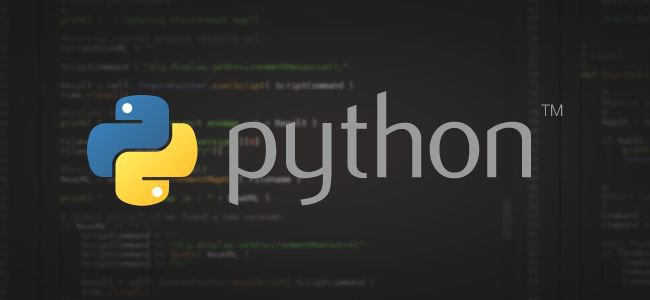
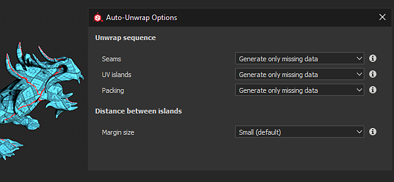

# 버전 2020.1 (6.1.0)

**Substance Painter 2020.1(6.1.0)**&#x200B;은(는) 새로운 내보내기 도구, python 스크립팅, 새로운 곡률 베이커, 새로운 콘텐츠 및 기타 다양한 워크플로 개선 사항을 제공합니다.

출시일: *2020년 4월 22일*

>[!NOTE]
>
> 이 릴리스부터 애플리케이션 버전 번호의 형식이 변경됩니다. **2020.1**&#x200B;이(가) 이제 **6.1.0**&#x200B;이(가) 됩니다.

## 주요 기능

### 새 텍스처 내보내기 창

내보내기 창이 완전히 재구성되어 더 쉽고 간편하게 프로젝트에서 텍스처를 구성하고 내보낼 수 있습니다. 또한 내보내기를 훨씬 더 편리하게 해 주는 몇 가지 새로운 기능을 제공합니다. 새 내보내기 창은 이제 세 개의 탭으로 나뉩니다.

**설정**

이 탭은 각 텍스처 세트의 일반 및 특정 설정을 제어합니다.

* **새 전역 설정**\
  전역 설정 은 모든 텍스처 세트에서 공유하는 매개 변수 집합입니다. 각 텍스처 세트를 개별적으로 수동으로 편집하지 않고도 매개변수를 빠르게 할당하거나 업데이트하는 데 사용할 수 있습니다. 전역 설정에는 다음과 같은 매개 변수가 있습니다.

  * **출력 디렉터리**: 텍스처가 생성될 대상 위치를 정의합니다.
  * **출력 템플릿**: 내보낸 텍스처의 명명 및 패킹 구성에 사용할 사전 설정을 정의합니다.
  * **파일 형식**: 내보낸 텍스처의 파일 형식과 비트 심도를 정의합니다.
  * **크기**: 텍스처 집합을 내보낼 최대 텍스처 해상도를 정의합니다.
  * **패딩**: UV 섬 외부의 정보를 생성하는 방법을 정의합니다.
  * **셰이더 매개 변수 내보내기**: 활성화되면 셰이더 설정 및 해당 텍스처 집합 할당을 저장하는 json 파일을 내보냅니다.

  
* **텍스처 집합별 설정 및 매개 변수 재정의**\
  [전역 설정] 아래에는 현재 열려 있는 프로젝트의 텍스처 세트 목록이 있습니다. [일반 내보내기 매개 변수] 섹션에는 [전역 매개 변수]에서 상속된 설정이 표시됩니다. **텍스처 집합당 내보내기 사전 설정**&#x200B;을 선택할 수도 있습니다.

  

  펜 아이콘을 클릭하면 특정 매개 변수를 재정의하여 값을 변경할 수 있습니다. 다시 클릭하면 재정의가 비활성화되고 값이 다시 기본값으로 재설정됩니다(전역 설정에서 상속됨).

  
* **내보낼 텍스처 선택**\
  텍스처 세트 내보내기 매개변수 아래에는 생성될 텍스처 목록이 있습니다. 이 목록을 사용하면 파일을 선택하거나 선택 취소하여 생성할 파일을 정확하게 선택할 수 있습니다. 또한 목록에는 내보내기 구성 또는 출력 템플릿에서 상속된 각 텍스처의 파일 형식과 비트 심도가 표시됩니다. 펜 아이콘을 사용하여 특정 텍스처의 파일 형식과 비트 심도를 재정의합니다.
* **내보내지 않고 설정 저장**\
  이제 새 **설정 저장** 단추를 사용하여 텍스처를 내보낼 필요 없이 프로젝트의 내보내기 구성을 저장할 수 있습니다. 이 기능은 텍스처를 다시 생성하지 않고 프로젝트를 조정하려고 할 때 유용합니다. 재생성에는 시간이 걸릴 수 있습니다.

  
* **클릭하고 드래그하여 빠르게 내보내기 사용/사용 안 함**\
  마우스 클릭과 드래그를 사용하여 텍스처 세트 및 텍스처를 빠르게 활성화하거나 비활성화할 수 있습니다.

  

  

**출력 템플릿**

이 탭을 사용하면 내보낸 텍스처의 이름을 지정하는 구성 사전 설정을 만들 수 있습니다.

* <b>내보내기 사전 설정 만들기</b>\
  <b>출력 템플릿</b> 탭은 이전 내보내기의 <b>구성</b> 탭과 동일합니다. 내보내기 사전 설정을 만들어 텍스처의 이름을 빠르게 지정하고 압축을 푸는 데 사용할 수 있습니다. 사용자 정의 내보내기 사전 설정을 만드는 방법을 알아보려면 설명서 페이지를 참조하십시오.
* **내보내기 사전 설정에서 파일 형식 및 비트 심도 설정**\
  내보내기 사전 설정 외에도 파일 포맷과 텍스처당 비트 심도를 설정하여 프로젝트 전체에서 구성을 훨씬 더 쉽게 공유할 수 있습니다.

  
* **출력 템플릿에서 내보낸 텍스처 제어**\
  내보내기 프로세스를 설정할 때 새 옵션 **출력 템플릿 기반**&#x200B;을 사용하여 내보내기 사전 설정에서 텍스처 속성을 정의합니다.

  

**내보내기 목록**

이 탭에는 진행 중인 내보내기 프로세스와 내보낸 모든 텍스처의 전체 요약이 표시됩니다.

* **내보낸 텍스처 목록**\
  이 탭에는 오버라이드된 매개 변수와 무시/제외된 텍스처를 고려하여 텍스처 세트별로 내보낼 각 개별 텍스처가 나열됩니다. 이는 내보내기 프로세스를 시작하기 전에 모든 것이 정상인지 확인하는 좋은 방법입니다. 내보내기 프로세스가 시작되면 인터페이스가 자동으로 이 탭으로 전환됩니다.

  
* **내보내기 프로세스 및 로깅**\
  탭의 오른쪽에는 진행 중인 내보내기 프로세스에 대한 세부 정보를 출력하는 콘솔이 있습니다. 성공적으로 내보낸 텍스처와 경고 및 오류가 표시됩니다. 인터페이스의 하단에는 프로세스의 현재 상태를 나타내는 진행률 표시줄도 표시됩니다.

  

  

### 새 데칼 레이어 모드

[에셋](../../interface/assets/assets.md)에서 재질을 끌어서 놓을 때 사용할 수 있는 새로운 **데칼** 모드가 있습니다. 패턴 및 이미지를 보다 쉽게 배치할 수 있도록 **평면 투영** 모드에서 새 칠 레이어를 만듭니다. 사용하려면 **ALT 키보드 단축키**&#x200B;를 누른 상태에서 선반에서 재료를 **드래그하여 놓기만 하면 됩니다**. 조작기를 미리 보고 데칼이 원하는 위치에 있으면 마우스를 놓습니다. 마우스 버튼을 놓으면 새 칠 레이어가 만들어집니다.

이 경우 Substance Source에서 선택한 기본 Shelf에 5개의 데칼도 포함했습니다. 이 새로운 데칼 워크플로에 대해 자세히 알아보려면 [이 문서](https://magazine.substance3d.com/effortless-grunge-look-with-new-substance-source-parametric-decals/)를 확인하세요.

>[!NOTE]
>
> 데칼을 더 쉽게 사용할 수 있도록 레이어를 만들 때 각 채널에 대해 기본 혼합 모드를 지정할 수 있는 새로운 [user-data 키워드](../../content/creating-custom-effects/user-data.md)을 구현했습니다.

### 새로운 Python 스크립팅

이제 Substance Painter으로 **Python** 스크립트와 모듈을 작성하고 실행할 수 있습니다. Python 3.7 및 PySide2를 Substance Painter과 통합했으며, 전용 **substance\_painter** 모듈을 통해 사용자 정의 Python API도 제공합니다. 또한 API를 JavaScript 버전에서 다시 생각해 보고 더 명확하고 사용하기 쉽게 만들었습니다. 이 플러그인은 유사점을 공유하므로 기존 사용자가 Python 플러그인을 손쉽게 만들 수 있습니다.

Python API에 대해 자세히 알아보려면 애플리케이션 내의 도움말 메뉴를 통해 액세스할 수 있는 설명서를 참조하십시오.

* **Python 모듈 설치**\
  Python 모듈은 사용자 계정의 전용 Documents 폴더에 설치할 수 있지만 전용 환경 변수를 통해 보조 경로 위치를 추가하여 스튜디오 전체에서 보다 쉽게 설정할 수 있는 방법도 제공합니다.
* **Substance Painter Python 하위 모듈**\
  다음 하위 모듈이 표시되었습니다(나중에 더 많은 하위 모듈을 사용할 수 있음).

  * substance\_painter.display
  * substance\_painter.event
  * substance\_painter.exception
  * substance\_painter.export
  * substance\_painter.logging
  * substance\_painter.project
  * substance\_painter.resource
  * substance\_painter.textureset
  * substance\_painter.ui
* **파이썬 인터프리터**\
  새 Python 콘솔 창을 사용하여 모듈을 테스트하거나 python 스크립트를 실행할 수 있습니다.

  {width="500px"}

### 개량된 제빵사

이 릴리스에서는 곡률 베이커가 개선되었으며 주변 오클루전 베이커에는 몇 가지 새로운 매개 변수가 추가되었습니다.

* <b>메쉬 베이커의 새 곡률</b>\
  이전 곡률 제빵기는 이제 더 이상 사용되지 않으며, 최근에 Substance Designer에 추가된 새로운 &quot;메쉬로부터&quot; 버전으로 대체되었습니다. 새로운 베이커 설정에 대해 자세히 알아보려면 설명서 페이지를 살펴보십시오.\
  새로운 제빵사는 다음과 같은 특징을 가지고 있다:

  * <b>정확도 향상</b>: 계산된 곡률이 훨씬 더 정확하고 사실적인 값을 생성합니다.
  * <b>메시 접촉</b>: 이제 메시 사이의 상호 침투가 곡률 정보를 생성합니다(이전 베이커에서는 그렇지 않음).
  * <b>높은 폴리 메시</b>: 이제 표준 맵에서 변환하는 대신 높은 폴리 메시에서 직접 세부 사항을 가져옵니다.
  * <b>성능</b>: 새 베이커는 광선 추적을 사용하여 세부 정보를 계산합니다. 이는 GPU 광선 추적 가속(RTX/Optix)의 이점을 의미합니다.

  {width="500px"}

  곡률 제빵기 설정을 통해 호환성을 위해 이전 곡률 제빵기에 액세스 할 수 있습니다. **표준 맵에서 생성** 설정을 선택하여 오래된 제빵기를 사용합니다.

  
* <b>개선된 주변 오클루전</b>\
  앰비언트 오클루전 베이커가 새로운 설정을 지원하도록 개선되었습니다.

  * <b>지표 평면</b>: 메시 아래의 평면을 시뮬레이션하여 지면에서 오는 그림자를 만듭니다. 자세한 내용은 앰비언트 오클루전 설명서를 참조하십시오.
  * <b>뒷면 무시</b>: 앰비언트 오클루전을 구울 때 특정 개체를 무시하는 새로운 메시 이름 접미사가 있습니다. 예를 들어 부동 형상 세부 정보를 무시할 수 있습니다. 자세한 내용은 이름별 일치 설명서를 참조하십시오

  {width="500px"}

### 개선된 메시 내보내기(쪽맞춤 사용)

내보내기 메쉬가 새로운 기능 및 설정으로 개선되었습니다.

* **원래 메시 토폴로지 내보내기 또는 쪽맞춤을 사용하여 메시 내보내기**\
  메쉬를 내보낼 때 변위 효과에 대해 생성된 쪽맞춤을 적용하도록 선택할 수 있습니다. 가능한 설정은 다음과 같습니다.

  * **변위/테셀레이션 없이**: 메시 세분화 없이 기본 메시를 내보냅니다. **삼각 측량 적용**&#x200B;을 사용하지 않도록 설정하면 원래 메시 삼각형, 쿼드 또는 n-곤을 내보냅니다.
  * **변위/테셀레이션**: 하위 분할을 사용하여 메시를 내보냅니다. **정점 수직 다시 계산**&#x200B;이 활성화되면 메시 수직이 변위 오프셋과 일치하도록 조정됩니다.

  
* **장면 계층 구조 및 메시 이름**\
  이제 원래 장면 계층과 가져온 메쉬의 개체 이름이 유지되고 내보낸 메쉬에 다시 적용됩니다.
* **FBX 파일 형식으로 내보내기**\
  이제 프로젝트 메시를 다른 파일 형식과 함께 FBX로 내보낼 수 있습니다.\
  **참고**: Substance Painter과 호환되지 않는 데이터는 가져오는 동안 계속 삭제됩니다(예: 스키닝, 조인트).

### 향상된 자동 UV 언래핑

이제 새 설정을 사용하여 자동 UV 감싸기 해제를 더 쉽게 제어할 수 있습니다.

* **프로젝트를 만드는 동안 자동 UV 감싸기 해제 사용**\
  이제 프로젝트를 만들 때 새로운 자동 UV 감싸기 해제 프로세스를 활성화하거나 비활성화할 수 있는 새로운 설정이 제공됩니다. 이 설정은 3D 메시를 기존 프로젝트로 다시 가져올 때도 사용할 수 있습니다.

  
* <b>고급 감싸기 해제 설정</b>\
  자동 UV 감싸기 해제를 활성화하는 확인란 옆에는 새로운 <b>옵션</b> 단추가 있습니다. 래핑 해제 프로세스를 제어하기 위한 고급 설정이 있는 새 창이 열리며, 기존과 같이 모든 것을 다시 계산하는 대신 프로세스의 다른 부분에서 기존 메시 정보를 유지할 수 있습니다. 자세한 내용은 전용 설명서를 참조하십시오. 현재 설정:

  * <b>솔기</b>: 기존 솔기가 보존되는지 또는 다시 생성되는지를 정의합니다.
  * <b>UV 섬</b>: 기존 UV 감싸기 풀기가 보존되는지 또는 다시 생성되는지를 정의합니다.
  * <b>패킹</b>: UV 섬 패킹을 보존할지 또는 다시 생성할지 정의합니다.
  * <b>여백 크기</b>: 각 UV 섬 사이의 간격(백분율)을 정의합니다.

  

### 새 콘텐츠

이 릴리스에서는 몇 가지 새로운 재질을 추가하고 새로운 소프트웨어 버전에 맞게 내보내기 사전 설정을 업데이트했습니다.

* **5개의 새로운 데칼 재질**\
  이 데칼 기능을 사용해 보기 위해 Substance Source에서 직접 제공하는 5가지 새로운 재질을 추가했습니다.

  * 대규모 녹 누출
  * 중아가로스포라리헨
  * 희소한 혈액 누출
  * 작은 총알이 콘크리트 벽에 미치는 영향
  * 스프레이 페인트 태그

  
* <b>새 Vray 셰이더, 프로젝트 템플릿 및 내보내기 사전 설정</b>\
  [Chaos Group](https://www.chaosgroup.com/)과(와) 공동으로 VrayMtl 동작을 복제하는 두 개의 새로운 셰이더를 통합했습니다. Vray로 만든 렌더링을 일치시키려고 할 때 더 정확한 모양을 제공해야 합니다. 프로젝트 템플릿을 사용하여 Vray용 새 프로젝트를 쉽게 설정할 수 있습니다. 자세한 내용은 설명서를 참조하십시오.

  
* <b>새 Maxwell 프로젝트 템플릿 및 내보내기 사전 설정</b>\
  [다음 제한](http://www.nextlimit.com/)과(와) 공동으로 Maxwell 렌더러에 대한 새 프로젝트 템플릿과 내보내기 사전 설정을 통합했습니다.
* **업데이트된 내보내기 사전 설정**\
  많은 내보내기 사전 설정이 업데이트되었는데, 주로 새로운 파일 포맷과 비트 심도 설정을 사용하지만 새로운 소프트웨어 버전과도 일치시키기 위해서입니다.

## 튜토리얼

새로운 기능을 다루는 새로운 비디오 튜토리얼을 살펴보세요.

## 릴리스 정보

### 2020.1.3

*(2020년 6월 16일 릴리스)*\
요약 : **버그 수정**

**추가됨:**

* [내보내기] 셰이더 매개 변수 json 파일에 변위 설정을 추가합니다.

**고정:**

* [충돌]&#x200B;[엔진] 기존 채널을 지우고 바꾸려고 할 때 충돌이 발생합니다
* [충돌] 재질 레이어에서 마스크를 페인트한 후 셰이더를 변경합니다.
* [충돌]&#x200B;[엔진] 일부 대용량 프로젝트에서 충돌
* [Bakers] zBrush에서 내보낸 OBJ에서 이름으로 일치 기능이 작동하지 않음
* [변위]&#x200B;[SVT] 변위가 켜져 있을 때 프로젝트 열기 시 텍스처가 표시되지 않습니다.
* [내보내기] 일부 텍스처를 균일한 회색으로 내보냅니다
* [내보내기] 비활성화된 텍스처 세트는 Dimension 및 Sketchfab 내보내기 사전 설정에 대해 내보내서는 안 됩니다
* [스크립팅]&#x200B;[JavaScript] JavaScript API를 사용하여 onProjectOpened 이벤트의 내보내기 구성에 액세스하는 동안 충돌이 발생합니다
* [스크립팅]&#x200B;[Javascript] onExportFinished()는 내보내기 후 호출되지 않습니다.

### 2020.1.2

*(2020년 5월 28일 릴리스)*\
요약 : **Substance 엔진 및 베이커 업데이트 관련 버그 수정**

**추가됨:**

* [베이커] 최신 버전으로 업데이트
* [베이커] 주변 오클루전, 곡률, Thickness 베이커의 새로운 샘플링 방법
* 최신 버전의 Substance 엔진으로 업데이트
* [스크립팅]&#x200B;[Python] 프로젝트 리소스에 대한 ResourceID 만들기를 허용합니다.
* [스크립팅]&#x200B;[Python] 채널 정보 쿼리 허용
* [스크립팅]&#x200B;[Python] 텍스처 내보내기를 시뮬레이션하기 위해 dryrun 및 callback 함수를 추가합니다

**고정:**

* [Bakers] 특정 경우에 탄젠트 법선 맵을 사용하여 월드 공간 법선 베이커에서 잘못된 법선이 생성됩니다.
* [베이커] 높은 폴리가 없을 때 Optix로 앰비언트 오클루전을 베이킹하는 동안 오류가 발생했습니다.
* [역동적인 획] 특정 텍스처 세트를 로드할 때 지연됨
* [내보내기] USD, glTF에 대해 비활성화된 텍스처 세트를 내보내서는 안 됩니다.
* [스크립팅]&#x200B;[JavaScript] 새 곡률 베이커 설정을 편집할 수 없음
* [Scripting]&#x200B;[JavaScript] alg.texturesets.addChannel()은 경우에 따라 오류를 반환하지 않습니다.
* [스크립팅]&#x200B;[JavaScript] setProjectExportOptions()에 대한 Javascript API 설명서의 오타
* [스크립팅]&#x200B;[JavaScript] 항상 모든 텍스처 세트를 내보냅니다
* [Scripting]&#x200B;[Python] sys.executable이 Substance Painter 대신 python.exe에 대한 경로를 반환합니다.
* Mac OS 및 Windows/Linux에서 텍스처 캐시가 호환되지 않음
* [Livelink UE4] 마지막 재질만 결합된 메쉬의 모든 텍스처 세트에 사용됩니다.

**알려진 문제:**

* [Export]&#x200B;[Dimension]&#x200B;[Skecthfab]은 비활성화된 텍스처 세트를 내보내서는 안 됩니다
* [Crash] 재질 레이어에서 마스크를 페인트한 후 셰이더를 변경합니다.

### 2020.1.1

*(2020년 5월 5일 릴리스)*

**추가됨:**

* [내보내기] TextureSet에서 재정의된 상태 시각적 피드백

**고정:**

* [내보내기] 내보내기 창 크기가 특수 해상도 모니터에서 너무 커서 크기를 조정할 수 없습니다
* [내보내기] 내보내기 후 옵션이 저장되지 않음
* [내보내기] 내보내기 사전 설정이 충돌하거나 &quot;캐시에서&quot; 내보내기와 함께 내보낼 수 없음
* [내보내기] 내보내기를 취소하면 예기치 않은 추가 빈 맵이 생성됩니다
* [내보내기] 가상 내보내기 사전 설정 수정
* [Python] PYTHONPATH env var은 고려하지 않습니다
* [Python]&#x200B;[Export] Python을 통해 내보내기를 취소하면 예외 오류가 반환됩니다.
* [Python]&#x200B;[Export] export\_project\_textures에서 psd 파일 형식의 잘못된 결과가 표시됩니다.

**알려진 문제:**

* [JavaScript] 새 곡률 베이커 설정을 편집할 수 없음
* [JavaScript]&#x200B;[내보내기] 항상 모든 텍스처 세트를 내보냅니다
* [베이커] GPU 광선 추적이 있는 Linux에서 충돌
* [내보내기]&#x200B;[USD] 비활성화된 텍스처 세트를 내보내서는 안 됩니다.

### 2020.1.0

*(2020년 4월 22일 릴리스)*

**추가됨:**

* 새 텍스처 및 메시 내보내기 도구
* [내보내기] 새 내보내기 인터페이스
* [내보내기]&#x200B;[내보내기 탭] 텍스처 세트당 내보낼 맵 채널을 선택할 수 있습니다
* [내보내기]&#x200B;[내보내기 탭] 한 번의 작업으로 모든 텍스처 세트의 텍스처 세트 크기를 수정할 수 있습니다.
* [내보내기]&#x200B;[내보내기 탭] 텍스처 세트별로 다른 템플릿 허용(USD, glTF, Sketchfab 및 Dimension 제외)
* [내보내기]&#x200B;[내보내기 탭] 맵 및 텍스처 세트의 빠른 활성화 및 비활성화
* [내보내기]&#x200B;[내보내기 탭] 내보내기 해상도 8192x8192 더 이상 실험적이지 않음
* [내보내기]&#x200B;[내보내기 탭] 맵당 파일 형식 및 비트 심도 수정 허용
* [내보내기]&#x200B;[내보내기 탭] 기본 매개 변수 값으로 재설정 허용
* [내보내기]&#x200B;[내보내기 탭] 내보내기를 수행하지 않고 설정을 저장할 수 있습니다.
* [내보내기]&#x200B;[출력 템플릿 탭] &quot;구성&quot; 탭의 이름을 &quot;출력 템플릿&quot; 탭으로 바꿉니다
* [내보내기]&#x200B;[출력 템플릿 탭] 사전 설정 맵당 파일 형식 및 비트 심도 정의 허용
* [내보내기]&#x200B;[내보내기 목록 탭] 내보내기 프로세스를 요약하고 볼 수 있는 새 미리 보기 탭
* [메시 가져오기/내보내기] 가져오기/내보내기 시간 성능 최적화
* [메시 내보내기] FBX에서 메시 내보내기
* [메시 내보내기] 변위 및 쪽맞춤을 사용하여 메시 내보내기
* [메시 내보내기]&#x200B;[UI] 표준 정점을 다시 계산하기 위한 새로운 설정, 삼각 측량 적용
* [메시 내보내기] 자동 래핑 해제로 생성된 새 UV로 원래 메시 토폴로지를 내보냅니다
* 더 많은 컨트롤로 업데이트된 자동 UV 감싸기
* [UV 언래핑]&#x200B;[UI] 새 프로젝트 창에서 자동 UV 언래핑을 활성화하는 설정 추가
* [UV 언래핑]&#x200B;[UI] 언래핑 단계(이음새, 언래핑, 패킹)를 제어하는 새로운 옵션
* [UV 언래핑]&#x200B;[UI] 기존 언래핑 이음새/언래핑/패킹을 보존할 수 있습니다.
* [UV 언래핑]&#x200B;[UI] 언래핑 단계를 완전히 다시 계산하는 새로운 옵션
* [UV 언래핑]&#x200B;[UI] 여백 크기를 제어하는 새로운 옵션(없음, 소형, 중간 및 대형)
* 뉴베이커
* [베이커] 이전 곡률을 메쉬의 새 곡률로 바꾸기
* [베이커] &quot;앰비언트 오클루전&quot; 베이커의 백페이스를 무시하려면 이름별로 일치 옵션을 추가합니다.
* [베이커] &quot;앰비언트 오클루전&quot; 베이커에서 그라운드 평면 옵션을 추가합니다.
* 새로운 스크립팅 Python API(3.7.6)
* [Python]&#x200B;[UI] Python에 대한 새로운 스크립팅 메뉴
* [Python]&#x200B;[UI] 도움말 메뉴의 새로운 Python 설명서
* [Python] Substance Painter python 모듈 노출: substance\_painter, alg, display, project.setting, project, texturesets, ui
* [Python] 새로운 &quot;substance\_painter&quot; Python 모듈 노출
* [Python] 새 Python 하위 모듈 노출: alg, display, log, project, resource, texturesets, ui
* [Python] 프로젝트 변경 사항에 대한 수신기
* [Python] Python 설명서의 새로운 예
* [JavaScript]&#x200B;[UI] 플러그인 메뉴가 JavaScript로 대체됨
* [뷰포트] 선반에서 리소스를 &quot;드래그/드롭 + ALT&quot;하여 데칼 투영을 생성할 수 있습니다.
* 새 콘텐츠
* [Content] Substance Source의 5가지 새로운 데칼 재질
* [콘텐츠] 새 프로젝트 템플릿을 추가하고 Maxwell 렌더러용 사전 설정을 내보냅니다
* [Content] Keyshot 9 내보내기용 프로젝트 템플릿 추가
* [Content] 변위 및 발광을 지원하도록 Keyshot 9 내보내기 사전 설정을 업데이트합니다
* [Content]&#x200B;[Exporter] 게임 엔진 및 렌더러의 최신 버전과 일치하도록 모든 내보내기 사전 설정을 업데이트합니다
* [Content]&#x200B;[Exporter] 내보내기 사전 설정 파일을 업데이트하여 새 형식 및 디더링 설정을 사용합니다
* [콘텐츠] VRay 재질(VRayMtl)을 지원하는 새로운 템플릿 및 셰이더입니다
* [레이어 스택] 휴지통 아이콘 또는 키보드 단축키를 사용하여 레이어 효과 삭제 허용
* 플러그인 제거 Substance Source(&quot;보내기&quot; 기능과 함께 시작 프로그램 사용)
* [Windows] 고급 GPU에서 TDR 경고가 표시되지 않음

**고정:**

* 새 프로젝트 파일 대화 상자의 번역 문제
* [베이커] &quot;사전 처리된 장면 파일 저장&quot; 설정이 더 이상 작동하지 않음
* [베이커] 높은 폴리가 없을 때 optix로 베이킹할 때 충돌 발생
* [평면 투영] 반복 UV가 있는 메쉬에서 투영이 작동하지 않습니다
* [데칼] 다른 칠 레이어 투영 모드를 사용할 때 일반 채널에서 동작 차이
* [손가락]&#x200B;[복제] 마스크에서 페인팅할 때 가공물이 나타날 수 있습니다.
* [엔진] 특정 레이어 콘텐츠에서 충돌이 발생합니다
* [엔진] 페인팅 시 경우에 따라 임의 충돌
* [기준점] 빈 마스크를 참조하면 항상 흰색이 반환됩니다.
* [내보내기] 일부 특정 스택 구성에서 레이어가 고려되지 않음
* [내보내기 메시] 특수 문자가 포함된 경로로 내보낼 수 없습니다
* [내보내기 메시] Linux 또는 MacOS에서 내보낼 때 glTF 파일을 읽을 수 없습니다
* [메시 가져오기] DAE, PLY 또는 glTF를 다시 가져오는 것이 의도한 대로 작동하지 않습니다.
* [Crash] 재질 레이어에서 마스크를 페인트한 후 셰이더를 변경합니다.

**알려진 문제:**

* [스크립팅]&#x200B;[JavaScript] 새 곡률 베이커 설정을 편집할 수 없음
* [베이커] GPU 광선 추적이 있는 Linux에서 충돌
* [내보내기]&#x200B;[USD] 비활성화된 텍스처 세트를 내보내서는 안 됩니다.
