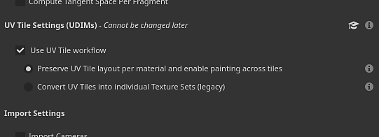
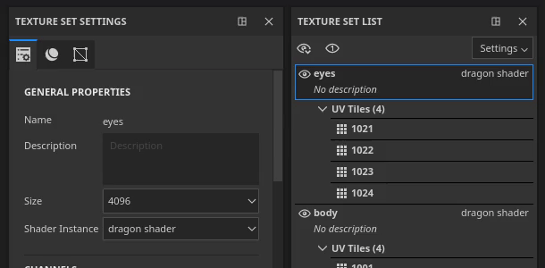
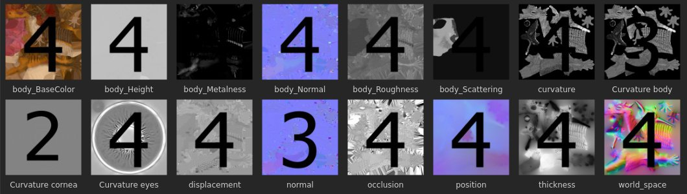
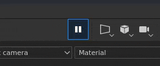

# 버전 2020.2 (6.2.0)

**Substance Painter 2020.2.0(6.2.0)**&#x200B;에서는 UDIM 간에 페인트할 수 있는 새로운 UV 타일 워크플로를 도입했습니다. 또한 모든 유형의 프로젝트에 대해 몇 가지 성능 및 프로젝트 크기 개선 사항이 포함되어 있습니다.

출시일: *2020년 7월 23일*

>> 

아티스트 크레딧: [Damien Guimoneau]의 Dragon(https://www.artstation.com/damz) 및 [Jason Huang]의 Robot(https://www.artstation.com/jasonhuang).

## 주요 기능

### UDIM 간 페인팅이 포함된 새로운 UV 타일 작업 과정

이 릴리스에서는 UDIM 타일 간에 페인트할 수 있는 Substance Painter에 새로운 UV 타일 워크플로우를 도입합니다.

새 워크플로를 사용하면 **UV가 더 이상 개별 텍스처 집합으로 분할되지 않습니다**. 대신 UV 타일은 메쉬의 재료 할당에 따라 단일 텍스처 세트 내에 포함됩니다. 동일한 텍스처 세트 내에 있는 UV 타일은 2D 및 3D 뷰포트 모두에서 **이음새 없이 칠하기**&#x200B;할 수 있습니다.

UV 타일은 UDIM이 주로 명명 규칙이므로 이 새로운 워크플로우를 일반적인 방식으로 설명하는 데 사용되는 용어입니다. 현재 UDIM이 유일하게 사용 가능한 협약이지만, 향후 이를 확장할 계획입니다(예: Mudbox 또는 ZBrush 명명 지원). 우리는 또한 음좌표 타일을 지원하는 것에 대해서도 생각하고 있는데, 이는 UDIM 체계에서는 가능하지 않다. 이 워크플로우에 대해 더 넓은 용어를 선택한 이유입니다.

다음은 이 새로운 워크플로우에서 도입된 변경 사항에 대한 개요입니다.

* **UV 타일 프로젝트 만들기**\
  새 프로젝트를 만들 때 새 작업 과정을 사용할지 여부를 지정하는 설정이 새로 추가되었습니다.

  워크플로우가 결정되고 프로젝트가 생성되면 나중에 다른 설정과 반대로 변경할 수 없습니다.

  
* 2D 뷰포트의 UV 타일

  새로운 UV 타일 작업 과정을 사용할 때 2D 보기에는 이제 각 UV 타일에 전용 UDIM 번호가 있는 새 격자가 표시됩니다. 각 타일은 개별적으로 칠할 수 있습니다.

  
* UV 타일 간 페인팅

  UV 타일

  동일한 텍스처 세트 내에 있는 모든 텍스처는 완벽하게 페인트할 수 있습니다. 이를 통해 간단하게 UV 타일 수를 곱하여 에셋의 일반 해상도 및 품질을 높일 수 있습니다.
* 텍스처 세트 목록 창의 UV 타일

  대상

  텍스처 집합 목록에

  가져온 메쉬에서 발견되는 재질과 관련된 UV 타일을 나열하도록 업데이트되었습니다. 각 UV 타일은 UDIM 규칙에 따라 해당 이름과 함께 표시됩니다.

  
* UV 타일당 해상도 변경

  각 UV 타일의 기본 해상도는 해당 상위 [텍스처 세트]를 기반으로 하지만, 타일당 재정의할 수 있습니다. [텍스처 세트 목록]에서 타일을 선택한 다음 [텍스처 세트 설정] 창으로 이동하여 해상도를 변경하기만 하면 됩니다. 타일의 해상도가 재정의되면 새 해상도가 2D 보기에서 해당 번호 옆에 표시됩니다.

  
* 새 레이어 스택 아이콘

  레이어 스택에 페인트 및 칠 레이어의 새로운 아이콘이 표시됩니다. UV 타일은 훨씬 더 많은 텍스처를 특징으로 하기 때문에 이 작은 영역에 모든 텍스처를 표시할 수 없었습니다. 더 이상 특정 축소판을 계산할 필요가 없으므로 이 도움말 성능이 제공됩니다. 이 새로운 아이콘 세트는 기본 설정(아래 참조)에서 설정을 활성화하여 일반 프로젝트에서도 사용할 수 있습니다.

  
* 레이어에 새로운 UV 타일 마스크 적용

  UV 타일 마스크는 일반 마스크보다 더 효율적인 시작/종료 레이어를 마스킹하는 새로운 방법입니다. 특정 UV 타일의 계산을 완전히 삭제할 수 있으므로 더 나은 성능을 제공합니다. UV 타일이 많은 프로젝트에서 작업하는 경우 편안한 경험을 제공하기 위해 사용하는 것이 좋습니다. 자세한 내용은 설명서에서 [전용 페이지](../../interface/layer-stack/geometry-mask.md)를 참조하세요.

  {width="550px"}
* **마스크된 UV 타일을 통해 페인팅**\
  여러 UV 타일이 동일한 텍스처 세트에 있는 경우 형상의 다른 부분으로 인해 메쉬의 특정 영역을 페인트하기가 어려울 수 있습니다. 이러한 상황을 피하기 위해 상황별 도구 모음에 새 페인팅 설정이 추가되었습니다. **페인트 선은 마스크된 UV 타일을 무시합니다**. 이 설정을 사용하면 UV 타일 마스크를 통해 제외된 UV 타일이 뷰포트에서 숨겨져 페인트 선이 해당 타일을 통과/무시할 수 있습니다. UV 타일 마스크를 수정하면 수정된 UV 타일이나 제외해야 하는 새 형상이 있을 수 있는 메시를 다시 가져올 수 있으므로 브러시 획이 다시 계산됩니다. 이렇게 하면 페인트 선이 다시 실행되지 않습니다.

  

  
* UV 타일 굽기

  베이커는 또한 UV 타일을 지원하며 이제 베이킹 창에 선택 목록이 있습니다

  불러올 타일 및 텍스처 세트를 지정합니다. 확인란을 클릭하고 드래그하거나 새 드롭다운 메뉴를 사용하여 선택 항목을 빠르게 변경할 수 있습니다.

  

  
* 새로운 $udim 태그로 UV 타일 텍스처 내보내기

  출력 템플릿에 새 태그가 추가되어 파일 이름에 UV 타일 번호가 있는 파일을 내보낼 수 있습니다. 현재는 UDIM 규칙만 사용할 수 있습니다. 태그를 사용할 수 없는 경우 파일 이름에 괄호를 사용하여 선택적 요소를 정의할 수도 있습니다. 이를 통해 예를 들어 UV Tile 프로젝트에서 사용할 수 있을 때 UDIM 번호만 추가하는 파일 이름을 만들 수 있으므로 내보내기 사전 설정이 모든 유형의 프로젝트와 호환됩니다.

  
* **이미지 시퀀스 불러오기**&#x200B;이미지 시퀀스는 일련의 텍스처로서 각각 특정 UV 타일과 일치합니다. 이미지 시퀀스를 가져오려면 시퀀스의 첫 번째 파일을 셸프로 끌어다 놓거나 리소스 가져오기 창을 사용하면 됩니다. 시퀀스의 나머지 파일도 자동으로 가져옵니다. 시퀀스는 포함된 파일 수를 나타내는 숫자와 함께 하나의 리소스로 셸프에 표시됩니다. 시퀀스를 사용하려면 채우기 레이어로 드래그 앤 드롭하면 됩니다. 투영 모드가 **채우기(UV 타일당 일치)**&#x200B;로 자동 설정됩니다.

  {width="600px"}

  
* 알레빅 메시가 있는 얼굴 세트 지원

  이제 알렘빅 얼굴 세트를 재질을 가져와서 텍스처 세트로 분할합니다. 이렇게 변경하면 알레빅 메시가 새로운 UV 타일 워크플로우와 호환됩니다. 알렘빅 메시에 얼굴 세트에 없는 면이 포함된 경우, 해당 면은 DefaultMaterial이라는 이름의 텍스처 세트에 자동으로 배치됩니다.

새로운 UV 타일 작업 과정에 대한 자세한 내용은 [전용 설명서](../../features/uv-tiles/uv-tiles.md)를 참조하십시오.

>[!NOTE]
>
> UV 타일 워크플로는 매우 까다로울 수 있습니다. 로드 시간을 줄이고 원활한 경험을 얻으려면 캐시와 프로젝트 파일을 모두 저장하는 SSD를 사용하는 것이 좋습니다.

### 새 일시 중지 엔진

이제 작업하는 동안 Substance Painter 엔진을 일시 중지할 수 있습니다. 엔진이 일시 중지되면 모든 텍스처 계산, 뷰포트 업데이트 또는 페인트 선이 등록되지만 계산되지는 않습니다.

이 새로운 동작을 통해 복잡한 레이어 스택을 설정 및 조정하고 계산을 마지막 순간으로 지연할 수 있습니다. 엔진을 일시 정지시키는 주요 이점은 중간 계산을 피하고 대신 최종 결과만 계산하는 것이다. 이렇게 하면 애플리케이션의 응답 속도가 빨라지고 업데이트가 전반적으로 빨라집니다. 트레이드 오프는 엔진이 일시 정지될 때까지 시각적 피드백이 없다는 것이다.

엔진을 일시 중지하려면 뷰포트 위의 컨텍스트 도구 모음에서 **버튼**&#x200B;을 클릭하거나 **단축키 Shift + Esc**&#x200B;를 사용하면 됩니다(설정에서 수정할 수 있음). 엔진을 일시 정지하지 않으려면 버튼을 끄거나 단축키를 다시 사용합니다.

### 성능 개선 사항

* **텍스처 내보내기 속도 향상**\
  특히 많은 텍스처를 생성하는 대용량 프로젝트의 경우 텍스처 내보내기가 훨씬 빨라야 합니다. 텍스처가 생성되고 기록되는 방식에 있어 몇 가지 개선이 이루어졌다. 많은 텍스처 세트 또는 복잡한 레이어 스택이 있는 프로젝트에 대한 내부 테스트에서 내보내기 프로세스가 일반적으로 최대 **4 또는 5배 더 빠름**&#x200B;함을 확인했습니다.
* **프로젝트를 열 때 지연된 캐시 계산** Substance Painter은 캐시 시스템을 사용하여 레이어를 빠르게 수정하고 혼합할 수 있습니다. 이전 버전에서는 프로젝트를 열 때마다 이 캐시가 계산되었습니다(뷰포트 하단의 녹색 로딩 막대에 표시됨). 이제 캐시 계산은 레이어 편집을 시도할 때만 트리거됩니다(예를 들어, 칠 레이어 매개 변수를 페인트하거나 수정함). 이 변경으로 작업을 시작하기 전에 대기하고 원하는 텍스처 세트로 전환하지 않고 프로젝트를 열 수 있습니다. 계산은 또한 더 세분화되어 있으므로 필요한 것만 계산할 수 있습니다. 예를 들어 UV 타일이 포함된 프로젝트의 경우 수정해야 하는 타일만 계산됩니다.
* **메시 맵의 비동기 로드**&#x200B;메시 맵이 비동기적으로 로드됩니다. 즉, 메시 맵이 로드되기를 기다리는 동안 애플리케이션이 더 이상 차단되지 않습니다. 이 아이콘은 아래 이미지와 같이 메시 맵을 뷰포트에 표시할 때 특히 나타납니다. 또한 메시 맵을 기다릴 필요가 없으므로 프로젝트를 더 빠르게 열 수 있습니다.

  
* **향상된 마스크 보기 모드 편집**\
  Alt 키를 누른 채 마스크(또는 전용 보기 모드)를 클릭하여 뷰포트에 표시할 때 이제 마스크에 대해서만 텍스처 업데이트가 수행됩니다. 즉, 뷰포트가 재질 모드로 다시 설정될 때까지 다른 계산이 지연되므로 이 보기 모드를 사용하면 페인팅 및 편집 효과가 훨씬 더 매끄러워집니다.

  
* **새 레이어 스택 축소판**\
  앞에서 언급한 바와 같이 이제 레이어 스택에서 새로운 아이콘 세트를 사용할 수 있습니다. 이러한 아이콘을 사용하면 썸네일을 계산할 필요가 없으므로 일반적인 성능을 향상시킬 수 있습니다. UV 타일 프로젝트에서는 자동으로 표시되지만 일반 프로젝트에서는 **편집 > 설정**&#x200B;으로 이동하여 **레이어 스택 축소판을 아이콘으로 바꾸기**&#x200B;를 활성화하여 이러한 아이콘도 사용하도록 선택할 수 있습니다.

  
* **더 빠른 증분 저장**&#x200B;프로젝트가 더 작아질 수 있고 변경된 데이터에 대해 저장 프로세스가 더 세분화되었기 때문에 증분 저장(Ctrl+S를 누름)이 훨씬 빨라졌습니다. 특히 과중한 프로젝트에서 이런 현상이 두드러진다.
* **개선된 Iray 시작 성능**\
  애플리케이션 내에서 공유된 메모리를 관리하는 방식을 개선했으므로 Iray를 사용한 렌더링 모드로 전환하는 것이 더 빨라졌습니다.

### 프로젝트 크기 개선

프로젝트 파일은 [많은 파일 설치 공간](../../technical-support/workflow-issues/project-issues/projects-are-really-big.md)을 갖는 것으로 유명합니다. 시간을 들여 이 문제의 근본 원인을 조사하고 몇 가지 해결 방법을 설계했습니다. 이 버전에서는 첫 번째 변경 사항 세트를 소개합니다.

* **베이커 출력을 회색 음영 이미지로 전환**\
  이전 버전에서는 베이커가 어떤 경우에도 RGB 이미지를 출력합니다. 이제 회색 음영 베이커(곡률, 주변 오클루전)는 회색 음영 이미지만 출력합니다. 이렇게 간단히 변경하면 프로젝트 크기를 20%에서 60%로 줄일 수 있습니다. 이러한 변경 사항을 활용하려면 기존 프로젝트의 메시 맵을 다시 생성해야 합니다.
* **베이커에 대한 기본 확산 및 확장 설정 변경**\
  이전에, 베이커들은 1 픽셀 확장, 그 다음 확산 패턴(UV 섬 외측의 흐릿한 픽셀들)을 생성할 것이다. 그레이디언트는 압축하기 어려우므로 이 설정에서는 텍스처가 매우 무거워집니다. 따라서 이 문제를 줄이기 위해 기본 설정이 변경되었습니다. 이제 기본적으로 [확산]은 해제되어 있으며 [확장]은 32픽셀(4K 해상도와 일치해야 함)로 설정되었습니다. 이러한 개선 사항을 활용하려면 기존 프로젝트를 이러한 새로운 설정으로 전환하고 다시 굽는 것이 좋습니다.

### 기타 개선 사항

이 새 버전에는 다음과 같은 몇 가지 추가 변경 사항이 포함되어 있습니다.

* **베이킹 선택**\
  새로운 UV 타일 워크플로우로 더 쉽게 작업할 수 있도록 텍스처 세트당 UV 타일 목록을 포함하는 새 선택 목록을 포함하도록 베이킹 창이 약간 수정되었습니다. 따라서 &quot;현재 텍스처 세트 굽기&quot; 버튼이 제거되었습니다. 무엇을 굽을지 편리하게 선택하기 위해 드롭다운 메뉴에 여러 옵션이 추가되었습니다.

  

  
* **텍스처 집합 설정의 셰이더 인스턴스**\
  UV 타일을 포함하도록 텍스처 세트 목록을 다시 작업하면 UI가 덜 복잡해지도록 일부 약간 변경되었습니다. 이전에 다른 셰이더 인스턴스를 만들고 전환할 수 있었던 기능이 이제 텍스처 세트 설정으로 이동되었습니다.

  

## 튜토리얼

다음은 새로운 기능에 대한 새로운 비디오 튜토리얼입니다. [Substance 아카데미](https://www.youtube.com/playlist?list=PLB0wXHrWAmCx1fWbUyBFcjtfL8xhxZFnv)에서 새로운 UV 타일 워크플로에 대한 더 많은 비디오를 사용할 수 있습니다.

## 릴리스 정보

### 2020.2.0

*(2020년 7월 23일 릴리스)*

**추가됨:**

* UV 타일(UDIM)
* [UV 타일] UV 타일에서 페인팅
* [UV 타일] UV 타일에 대한 새 작업 과정과 기존 작업 과정 중에서 선택할 수 있습니다.
* [UV 타일] UDIM/UV 타일 이미지 시퀀스를 리소스로 가져오기
* [UV 타일] 텍스처 세트 목록 창에서 텍스처 세트당 UV 타일 목록 추가
* [UV 타일] 텍스처 세트 설정에서 여러 UV 타일의 해상도를 한 번에 편집할 수 있습니다
* [UV 타일][2D 보기] UV 타일을 격자로 표시
* [UV 타일][2D 보기] UV 타일 정보를 표시하거나 숨기는 새 뷰포트 단추
* [UV 타일] UV 타일 프로젝트의 경우 기본적으로 페인팅 도구를 단일 채널로 전환합니다.
* [UV 타일] 페인팅 중에 마스킹된 UV 타일을 무시하는 컨텍스트 도구 모음의 [새] 버튼
* [UV 타일][레이어 스택] 성능 향상을 위한 새로운 레이어 스택 아이콘
* [UV 타일][레이어 스택] 도구 모음의 페인트 및 칠 아이콘 개선
* [UV 타일 마스크][2D 보기] 한 번에 여러 UV 타일을 포함하거나 제외할 수 있습니다(왼쪽 클릭, CTRL+왼쪽 클릭)
* [UV 타일 마스크] 새 아이콘이 있는 레이어당 타일을 포함하거나 제외하는 새로운 UV 타일 마스크
* [UV 타일 마스크][레이어 스택] 모두가 포함되지 않은 경우 UV 타일 마스크 아이콘의 UV 타일 수를 표시합니다
* [UV 타일 마스크][2D/3D 보기] 커서 아래에 UV 타일을 시각화하는 호버 효과를 추가합니다
* [UV 타일][베이커] 특정 UV 타일을 선택하고 베이킹할 수 있습니다.
* [UV 타일][베이커] 텍스처 세트/UV 타일에 대한 선택 옵션 추가
* [UV 타일][베이커] 텍스처 세트 내에서 UV 타일을 선택하려면 마우스 오른쪽 버튼을 클릭합니다.
* [UV 타일][베이커] 드래그하여 텍스처 세트/UV 타일에서 빠른 선택을 허용합니다.
* [UV 타일][베이커] 메시 맵에서 &quot;모두&quot; 및 &quot;없음&quot; 버튼을 더 명시적인 선택 옵션으로 대체합니다
* [UV 타일][베이커] 구울 텍스처의 수를 표시합니다.
* [UV 타일][내보내기] 특정 UV 타일을 선택하고 내보낼 수 있습니다
* [UV 타일][내보내기] 드래그하여 UV 타일을 빠르게 선택할 수 있습니다
* [UV 타일][내보내기] UV 타일에 대한 드롭다운 메뉴 옵션 추가
* [UV 타일][내보내기] UV 타일(Adobe Dimension, Sketchfab, glTF, USD)로 작동하지 않는 경우 일부 내보내기 사전 설정을 사용할 수 없도록 설정합니다
* [UV 타일][콘텐츠] 새 $udim 태그를 사용하도록 내보내기 사전 설정을 업데이트합니다
* [UV 타일] UV 섬이 겹치는 메시를 가져올 때 오류 보고를 개선합니다.
* [UV 타일] Iray에서 호환되는 UV 타일
* [UV 타일][스크립팅] Python 문서에 UV 타일 내보내기 설명서 추가
* 성능
* [성능] 작업 시 엔진 계산을 일시 중지하는 컨텍스트 도구 모음의 새 단추(SHIFT+ESC)
* [성능] 텍스처 세트 캐시 계산을 지연시켜 프로젝트를 더 빨리 열 수 있습니다.
* [성능] 프로젝트를 열 때 메시 맵이 로드될 때까지 기다리지 않음
* [성능][2D/3D 보기] 마스크 채널을 사용하지 않을 때 뷰포트에서 계산하지 않음
* [성능] 뷰포트에 표시된 메시 맵을 로드할 때 애플리케이션을 차단하지 않습니다.
* [성능] 프로젝트 저장 시 증가분 저장 속도 향상
* [성능][베이커] 기본 확장 설정을 변경하여 시간과 프로젝트 크기를 절약합니다.
* [성능][베이커] 특정 베이커에서 회색 음영으로 전환하여 시간 절약 및 프로젝트 크기 개선
* [성능][내보내기] 텍스처를 더 빠르게 내보내기 위해 엔진 성능을 개선합니다.
* [성능][내보내기] 많은 텍스처 세트를 사용하여 내보내기 대화 상자를 열 때 응답성을 개선합니다.
* [Performance][Export] &quot;List of Exports&quot; 탭으로 전환할 때 성능 향상
* [Performance][Iray] Iray 시작 시간 단축
* 기타
* [베이커] 텍스처 세트의 선택 옵션 추가
* 셰이더 인스턴스 관리를 텍스처 집합 설정으로 이동
* [2D/3D 보기] 뷰포트 하단에 편집할 마스크 유형을 나타내는 메시지를 추가합니다.
* [레이어 스택] 기존 축소판과 새 축소판 사이를 전환하는 설정의 새로운 옵션
* [레이어 스택] 축소판의 로딩 상태를 나타내는 시각적 피드백을 추가합니다
* [Proj] 이미지 시퀀스를 로드하는 새로운 투영 모드 &quot;칠(UV 타일에 따라 일치)&quot;
* [Proj] 특정 경우에 칠 레이어 투영 모드를 &quot;칠(UV-타일에 따라 일치)&quot;로 변경
* [내용] 목탄 브러시 사전 설정을 최적화하여 성능 향상
* Iray를 버전 2020.0.0으로 업데이트
* [내보내기] 아무 것도 선택하지 않은 경우 내보내기 목록 탭을 비활성화합니다.
* 자동 줄 바꿈 해제
* [자동 풀기] 이음새 배치 품질 향상
* [자동 풀기] 속도와 안정성을 높이기 위해 개선된 매개 변수화

**고정:**

* [Alembic] 파일을 가져올 때 얼굴 세트가 무시됩니다.
* [Alembic] 특정 파일의 무한 로드 시간
* [가져오기] 파일 확장자만 다를 때 잘못된 UDIM 이미지 시퀀스를 가져옵니다
* [충돌] 다른 프로세스에 의해 잠긴 프로젝트를 열려고 하면 충돌이 발생합니다
* [내보내기] USD 형식으로 방출 채널을 내보내지 않음
* [Content] 스마트 재질 &quot;Charcoal&quot;에 페인트 선이 포함되어 있음

**알려진 문제:**

* [텍스처 집합 목록] 설명을 숨길 수 없습니다.
* [텍스처 집합 목록] UI 문제
