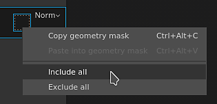

# 버전 2021.1 (7.1.0)

**Substance Painter 2021.1(7.1.0)**&#x200B;에서는 모양 마스크, 레이어 스택의 효과 복사 및 붙여넣기와 같은 몇 가지 새로운 기능과 개선 사항을 도입합니다.

릴리스 데이터: *2021년 1월*

>[!NOTE]
>
> 이 릴리스에서는 Ubuntu에서 지원되는 최소 버전을 18.04로, MacOS에서 지원되는 최소 버전을 10.14로 늘립니다. 자세한 내용은 [기술 요구 사항](../../getting-started/system-requirements.md)을 참조하세요.

## 주요 기능

### 새로운 지오메트리 마스크

지오메트리 마스크는 메시 이름 또는 UV 타일을 기반으로 지오메트리를 숨길 수 있는 레이어 스택의 새로운 마스크 도구입니다. UDIM 숫자를 기반으로 형상을 마스크한 이전의 UV 타일 마스크의 발전입니다.

이 새로운 도구는 여러 엔진 최적화의 이점을 활용하기 때문에 일반 페인팅(또는 [다각형 채우기](../../painting/tool-list/polygon-fill.md)를 사용할 때)보다 도형을 마스킹하는 더 좋은 방법입니다. 면이나 정점과 같은 모양 정보를 저장하지 않고 메시 이름이나 UV 타일 번호만 저장하여 메시를 다시 가져오면 마스크가 깨지지 않으므로 비파괴적입니다. 또 다른 이점은 형상을 숨기면 텍스처 세트 내에서 이전에 액세스할 수 없었던 표면에 페인트할 수 있기 때문에 예를 들어 개체를 여러 텍스처 세트로 분할하지 않아도 된다는 것입니다.

* **레이어의 새 지오메트리 마스크**\
  지오메트리 마스크는 [레이어 스택](../../interface/layer-stack/layer-stack.md)의 모든 레이어에서 자동으로 사용할 수 있습니다. 기본적으로 레이어는 영향을 받지 않습니다. 즉, 레이어가 완전히 보입니다.\
  모양 마스크에는 모든 항목을 빠르게 선택하거나 선택 해제할 수 있을 뿐만 아니라 해당 값을 다른 레이어에 복사할 수 있는 자체 컨텍스트 메뉴가 있습니다.

  

  

* **모양 마스크 속성 편집**&#x200B;모양 마스크는 다른 레이어의 컨텍스트와 동일한 논리를 따릅니다(예: 마스크 또는 인스턴스화된 속성 편집). 지오메트리 마스크 편집 모드를 시작하려면 레이어 오른쪽에 있는 닷지 사각형을 클릭하면 됩니다. 지오메트리 마스크를 종료하려면 동일한 레이어의 콘텐츠 또는 페인트 마스크를 클릭합니다.

  

* **메시 이름 또는 UV 타일로 마스킹**\
  지오메트리 마스크 속성 상단에는 마스크 모드를 제어하는 드롭다운이 있습니다. UV 타일 번호별 마스킹 또는 메쉬 이름별 마스킹 중에서 선택할 수 있습니다. 프로젝트에서 UV 타일 워크플로를 사용하지 않는 경우에만 이 드롭다운이 비활성화되고 메시 이름으로 설정됩니다.

  

* **속성을 통해 도형 마스크**\
  형상 마스크를 편집하면 속성 창에 현재 텍스처 세트와 관련된 형상을 기반으로 메시 이름(또는 UV 타일) 목록이 표시됩니다.

  * 목록 위의 숫자는 사용 가능한 총 마스크 수 동안 마스크되지 않은 메시/UV 타일의 수를 나타냅니다.
  * 숫자 옆에 있는 메뉴를 사용하면 항목을 모두 선택하거나 하나도 선택하지 않고 현재 선택 영역을 반전할 수 있는 빠른 컨트롤이 가능합니다.
  * 아래 목록은 마스킹될 항목 또는 마스킹되지 않은 항목을 정의합니다. 응용 프로그램의 다른 목록과 마찬가지로 한 번에 여러 항목을 활성화/비활성화하기 위해 클릭하고 드래그하거나 **ALT+클릭**&#x200B;을 사용하여 항목을 격리할 수 있습니다.

   

* **뷰포트를 통해 모양 마스크**\
  2D 및 3D 보기에서도 형상 마스크 선택을 변경할 수 있습니다. 표시/숨겨야 하는 부품 위로 마우스를 이동하고 클릭하여 상태를 전환하기만 하면 됩니다. 지오메트리 마스크를 편집하면 마스크된 지오메트리가 회색 및 대각선 효과와 함께 표시됩니다. 한 번에 여러 항목을 선택하고 클릭 및 드래그하여 사각형 선택 작업을 수행할 수도 있습니다.\
   

* **숨겨진/연결할 수 없는 도형 그리기.**\
  지오메트리 마스크에서 마스킹할 지오메트리를 선택한 후, 뷰포트 상단에 있는 **제외된 지오메트리 숨기기/무시** 버튼을 활성화하거나 **ALT+H** 단축키를 누를 수 있습니다. 이 옵션을 활성화하면 제외된 형상이 숨겨져(다른 텍스처 세트와 함께) 현재 레이어에 포함되거나 페인트할 수 있는 형상만 표시됩니다. 이 옵션을 사용하면 이전에 차단되었거나 손이 닿지 않는 영역을 페인트할 수 있습니다. 이 옵션은 모든 종류의 레이어에도 적용됩니다.

  >[!NOTE]
  >
  > 마스크된 지오메트리를 사용한 페인팅은 계속 동적으로 유지됩니다. 처음에 브러시 획이 만들어질 때 페인팅을 차단하는 일부 지오메트리를 숨긴 다음 마스크를 해제하면 이전에 만든 브러시 획이 다시 차단됩니다.

  

### 레이어 스택 효과의 새 복사 및 붙여넣기

이제 일반 레이어와 같은 방식으로 레이어 및 레이어 스택에 효과를 복사할 수 있습니다.

이제 여러 효과를 한 번에 복사하고 붙여넣을 수 있는 가능성을 제공하는 다중 선택도 가능합니다.

마스크가 없는 레이어의 마스크에서 효과를 복사하거나 이동하면 마스크가 자동으로 추가됩니다. 레이어 내용과 마스크의 효과가 서로 호환되지 않기 때문입니다. 즉, 마스크에서 레이어의 내용으로 효과를 복사하면 자동으로 마스크로 전환되거나 마스크가 만들어집니다.

* **상황에 맞는 메뉴를 통해 복사 및 붙여넣기**\
  텍스처 세트의 레이어 스택에서 효과를 마우스 오른쪽 버튼으로 클릭하고 잘라내기 또는 복사 작업을 선택합니다. 그런 다음 레이어를 마우스 오른쪽 버튼으로 다시 클릭하고 붙여넣기 를 선택하여 원하는 효과의 사본을 이동하거나 만듭니다. 또한 상황별 메뉴를 다시 작업하고 더 많은 기능에 액세스할 수 있는 기회도 얻었습니다.

  

* **키보드 바로 가기로 복사 및 붙여넣기**\
  모든 레이어와 마찬가지로 키보드 단축키 **CTRL+C**(복사)/**CTRL+X**(잘라내기) 및 **CTRL+V**(붙여넣기)를 사용하여 현재 선택 영역을 기반으로 효과를 복사할 수 있습니다. 레이어와 마찬가지로 효과도 현재 선택 영역 위에 삽입됩니다.

  

* **키보드 단축키로 빠르게 효과 복제**\
  **CTRL+D**&#x200B;을(를) 사용하여 현재 선택 영역을 복제하거나, **ALT를 누른 상태에서 드래그**&#x200B;하여 원하는 위치에 복제합니다.

  

* **레이어 간 효과 이동**\
  복사 및 복제 외에도 이제 효과를 한 레이어에서 다른 레이어로 드래그하여 놓기만 하면 효과를 이동할 수 있습니다.

  

### 새로운 일반 기능 및 개선 사항

이번 릴리스에서는 몇 가지 기능이 개선되었습니다.

* **UV 타일에 설명 추가**\
  이제 [텍스처 세트 목록]을 통해 각 UV 타일에 대한 설명을 추가할 수 있습니다. 이렇게 하면 프로젝트를 보다 쉽게 탐색할 수 있습니다. 특히 내보내기 및 굽기를 수행할 때 이러한 컨텍스트에서도 설명을 확인할 수 있으므로 더욱 그렇습니다.\
  설명을 추가하거나 편집하려면 [텍스처 세트 목록] 창에서 UV 타일을 클릭한 다음 [텍스처 세트 설정] 창으로 이동하여 설명을 편집하면 됩니다.

  

   

* **새 레이어 스택 축소판**\
  최적화된 레이어 스택 축소판이 개선되었습니다. 이제 채우기 레이어에 대해 재질 구가 표시되므로 [UV 타일](../../features/uv-tiles/uv-tiles.md) 워크플로로 작업할 때도 각 레이어의 주요 속성을 더 쉽게 탐색하고 볼 수 있습니다. 축소판은 레이어 정보에서 생성되지만 너무 자주 다시 계산되지 않도록 효과는 고려하지 않습니다.

  

* **레이어 스택에서 개선된 지오메트리 마스크 종료**\
  마스크가 없는 경우 레이어 스택에 있는 폴더에서 지오메트리 마스크(이전 이름: UV 타일 마스크)를 종료하는 것이 어려울 수 있습니다. 다른 레이어를 선택하는 것 외에 전환할 다른 컨텍스트가 없었기 때문입니다. 이제 폴더 축소판을 클릭하여 모양 마스크를 종료할 수 있습니다. 지오메트리 마스크를 편집하는 동안 셸프에서 재질 또는 스마트 재질을 뷰포트로 끌어다 놓을 수도 있습니다.

  

  

* **베이킹 창에서 새 Alt 키를 누른 상태에서 선택 영역 클릭**\
  이제 굽기 창의 메시 맵 목록을 **Alt+마우스 클릭**&#x200B;으로 격리하여 수동으로 제외하지 않고도 굽을 특정 맵을 분리할 수 있습니다. 동일한 단축키를 사용하여 모든 메시 맵을 다시 활성화할 수 있습니다.

  

* **현재 텍스처 집합 새로 만들기 단추**\
  [텍스처 세트]를 빠르고 쉽게 다시 굽도록 [굽기] 창 아래쪽에 새 단추가 추가되었습니다. 이 버튼을 사용하면 이전에 정의된 사용자 정의 선택 항목에 영향을 주지 않고, 전체 텍스처 세트(사용 가능한 경우 모든 UV 타일 포함)를 구울 수 있습니다.

  

### 새 Substance 엔진 업데이트

Substance 엔진이 최신 Substance 파일 형식 및 기능을 지원하도록 버전 8로 업데이트되었습니다.

새로운 Substance 엔진 기능에 대한 자세한 내용은 [이 문서 페이지](https://helpx.adobe.com/kr/substance-3d/unlisted/documentation/sddoc/version-2020-2-10-2-0-200574252.html)를 참조하세요.

### Iray의 새로운 Nvidia RTX 3000 지원

[Iray 렌더러](../../features/iray-renderer/iray-renderer.md)가 최신 버전으로 업데이트되어 이제 새로운 Nvidia Ampere GPU(RTX 3000 시리즈 및 Quadro A 시리즈)를 지원합니다.

>[!NOTE]
>
> 이 업데이트 Kepler GPU(GeForce 600 및 700 시리즈)는 더 이상 지원되지 않으며, Iray에서의 렌더링이 대신 CPU에서 수행됩니다.

### 새 콘텐츠

이 릴리스에는 세 가지 새로운 스티치 도구가 추가되었으며 복잡한 패턴과 사실적인 스티치를 만드는 데 사용할 수 있습니다. 이러한 에셋을 찾으려면 Shelf의 Tool 섹션으로 이동하여 다음 항목을 찾아보십시오.

* 스티치 콤플렉스
* 스티치 크로스 심
* 똑바르게 하기

페인팅된 스티치의 품질을 높이려면 컨텍스트 도구 모음에서 [게으른 마우스](../../painting/lazy-mouse.md) 기능을 활성화하는 것이 좋습니다.

아래는 이러한 새로운 도구 내에 포함된 모든 사전 설정에 대한 개요입니다.

{width="800px"}

### 새로운 Python 기능

Python API는 몇 가지 새로운 기능을 받았습니다. 이 설명서는 API를 이해하고 학습하기 쉽게 다시 작성되었으며 특히 그 예시가 그렇습니다.

* **리소스 및 선반 관리**\
  리소스 모듈이 개선되었으며 이제 다음을 수행할 수 있습니다.
  * 셸프를 만들고 관리합니다.
  * 선반 및 프로젝트에서 리소스를 검색하거나 가져옵니다.
  * 셸프가 크롤링 중인지 확인합니다(리소스를 사용할 준비가 된 시기를 알 수 있음).
  * 사용자 정의 축소판을 셸프의 리소스에 할당합니다.

* **UV 타일 정보**\
  이제 텍스처 세트의 UV 타일 목록을 쿼리할 수 있습니다. 이렇게 하면 특정 범위의 UDIM 타일에서 사용자 정의 내보내기를 만들 수 있습니다.

* **프로젝트 버전 상태**\
  프로젝트를 편집할 수 있는지 여부를 알 수 있는 새로운 기능과 이벤트가 추가되었습니다. 계산이 진행 중이며 프로젝트의 속성을 수정할 수 없는지 확인하는 데 유용합니다.

>[!NOTE]
>
> Python API 설명서는 애플리케이션의 도움말 메뉴에서 액세스할 수 있습니다.

## 튜토리얼

다음은 새로운 기능에 대한 비디오 튜토리얼입니다.

## 릴리스 정보

### 2021.1

*(2021년 1월 28일 릴리스)*\
요약 : **주요 릴리스, 지오메트리 일부를 선택하고 페인팅할 수 있는 새로운 지오메트리 마스크, 레이어 스택에서 효과 복사/붙여넣기, UV 타일 작업 과정 개선, Iray, 베이커, Substance 엔진 및 새 콘텐츠 업데이트**

**추가됨:**

* 새로운 지오메트리 마스크 및 지오메트리 선택 부분 페인트
* [지오메트리 마스크] 지오메트리의 선택한 부분을 메시 이름으로 페인트할 수 있습니다.
* [지오메트리 마스크] 두 뷰포트에서 사각형 선택
* [지오메트리 마스크] 레이어에서 제외된 지오메트리를 숨기거나 무시할 수 있습니다.
* [지오메트리 마스크]&#x200B;[속성] 클릭하고 드래그하여 빠르게 확인란 선택
* [지오메트리 마스크]&#x200B;[속성]&#x200B;[UI] [속성] 창에 드롭다운이 있는 모두 포함/제외
* [지오메트리 마스크]&#x200B;[속성] ALT+왼쪽 클릭으로 목록에서 한 항목을 빠르게 선택할 수 있습니다.
* [지오메트리 마스크]&#x200B;[속성] 속성 창에서 메쉬 이름/UV 타일을 마우스로 가리킬 때 뷰포트에 오버레이됨
* [지오메트리 마스크]&#x200B;[레이어 스택] 지오메트리 마스크에 복사/붙여넣기 옵션 추가
* [지오메트리 마스크] 제외된 지오메트리 숨기기/무시 버튼에 대한 새 아이콘
* [지오메트리 마스크] 제외된 지오메트리 숨기기/무시를 위한 새로운 도구 설명
* [지오메트리 마스크] 키보드 단축키 ALT+H를 누르면 &quot;제외된 지오메트리 숨기기&quot; 버튼이 켜짐/꺼짐
* [UV 타일]&#x200B;[레이어 스택] UV 타일 및 단순화 모드에 대한 새 칠 레이어 구 미리 보기 축소판
* [UV 타일]&#x200B;[레이어 스택] UV 타일 마스크를 쉽게 종료할 수 있습니다.
* [UV 타일]&#x200B;[텍스처 세트 목록] UV 타일에 대한 설명을 제공할 수 있습니다.
* [UV 타일]&#x200B;[텍스처 설정]&#x200B;[UI] 드롭다운 메뉴에서 UV 타일 해상도를 변경하는 두 개의 새로운 섹션 제목
* [UV 타일]&#x200B;[뷰포트] 재질을 뷰포트로 드래그할 때 UV 타일 마스크를 종료합니다
* [레이어 스택] 효과에 대한 복사/붙여넣기 옵션 추가
* [레이어 스택] 한 텍스처 세트에서 다른 텍스처 세트로 효과를 복사/붙여넣기를 허용합니다.
* [레이어 스택] 효과의 다중 선택 허용
* [레이어 스택] 복사/붙여넣기 옵션을 레이어 효과에 대한 단축키로 추가합니다
* [레이어 스택] 효과를 다른 레이어로 드래그할 때 마스크와 내용 사이를 자동으로 전환
* [레이어 스택] 다른 레이어의 마스크를 붙여넣을 때 자동으로 마스크 만들기
* [레이어 스택] 효과의 상황에 맞는 오른쪽 클릭 메뉴 안에 이동 효과 동작을 추가합니다
* [레이어 스택] 한 레이어에서 다른 레이어로 효과를 드래그하여 놓을 수 있습니다.
* [레이어 스택] 항목을 폴더로 드래그하면 폴더 맨 위에 항목이 놓입니다
* Iray를 버전 2020.1.0으로 업데이트
* [베이커] 베이커를 버전 2.5.4로 업데이트
* [베이커] 베이킹 진행률 창에 개별 UV 타일 표시
* [베이커]&#x200B;[UI] 새 버튼으로 현재 텍스처 세트를 빠르게 베이킹할 수 있습니다.
* [베이커] 사용자가 ALT+왼쪽 클릭으로 베이커 중 하나를 빠르게 선택할 수 있습니다.
* 버전 8.0.8로 Substance 엔진 업데이트
* [Substance 엔진] 새 .sbsar 파일에서 기본 색상 지원
* [자동 풀기] 성능 개선
* [내보내기] 시각적 피드백을 추가하여 프로젝트의 기본값과 다른 UV 타일의 해상도를 나타냅니다
* [내보내기] 내보낸 셰이더 json 파일에 장면 크기 요소를 추가합니다
* [언어] 일본어 번역 추가
* [UI] 내부 종속성 버전 관리를 사용하는 정보 창 업데이트
* [스크립팅]&#x200B;[Python] Shelf 리소스 관리 허용
* [스크립팅]&#x200B;[Python] 프로젝트를 굽고 내보낼 준비가 되면 알려줍니다.
* [스크립팅]&#x200B;[Python] 셸프가 디스크의 리소스 크롤링을 완료한 시기를 알 수 있습니다.
* [스크립팅]&#x200B;[Python] 텍스처 세트당 UV 타일 목록을 쿼리할 수 있습니다
* [스크립팅]&#x200B;[Python] 사용자 정의 미리 보기를 셸프 리소스에 할당할 수 있습니다.
* [스크립팅]&#x200B;[Python] 맞춤형 셸프 관리 허용
* [스크립팅]&#x200B;[Python] 설명서의 각 하위 모듈에 메서드 인덱스를 추가합니다
* [스크립팅]&#x200B;[Python] 설명서의 새로운 스타일
* [스크립팅]&#x200B;[Python] 리소스 및 Shelf 문서 개선
* [콘텐츠] 스티치를 만드는 세 가지 새로운 도구 사전 설정
* [Shelf] 새 Substance share 플랫폼으로 전환하는 동안 일시적으로 &quot;Substance share으로 내보내기&quot;를 제거

**고정:**

* 해상도가 다른 모니터를 사용할 때 충돌 발생
* 일부 드문 프로젝트와 Substance 엔진 시 충돌 발생
* 레이어를 전환할 때 제외된 형상 숨기기/무시로 뷰포트 새로 고침이 실패함
* [2D 보기] 일부 프로젝트에서 2D 뷰포트가 누락될 수 있습니다.
* [베이킹] &quot;메쉬 이름으로 일치&quot;는 오브젝트의 일부를 무시합니다
* [레이어 스택] 레이어 효과를 클릭하면 폴더가 열립니다.
* [지오메트리 마스크] UV 타일은 메쉬를 다시 가져올 때에도 마스크에 계속 계산됩니다
* [모양 마스크] 뷰포트의 마우스 오른쪽 버튼을 클릭하면 올바른 도구가 제공되지 않습니다.
* [엔진] 특정 프로젝트에 많은 지연 문제가 발생합니다.
* [스크립팅] Windows에서 원격 JSON POST 요청에 지연 시간이 많습니다.
* [Linux] 특정 통합 GPU에서 Vram 양이 제대로 감지되지 않음
* [자동 래핑 해제] 일부 프로젝트에서 충돌하거나 긴 래핑 해제
