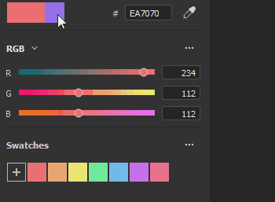

# 버전 7.3

**Substance 3D Painter 7.3**&#x200B;에서는 칠 레이어의 새로운 뒤틀기 및 원통 투영을 사용하여 메쉬를 텍스처링하는 새로운 방법을 제공합니다.

출시일: *2021년 10월 13일*

## 주요 기능

### 새 뒤틀기 투영

이 릴리스에서는 칠 레이어 및 칠 효과에 대해 새로운 3D 뒤틀기 투영을 도입합니다. 이 투영을 통해 변형 격자와 제어 가능한 점을 사용하여 텍스처 또는 이미지를 왜곡할 수 있습니다.

* **드래그 앤 드롭을 통한 빠른 설정**&#x200B;에셋 라이브러리에서 재질, 알파, 텍스처 또는 절차를 선택하고 메시의 원하는 부분으로 드래그 앤 드롭합니다(재질에 필요한 바로 가기 **ALT**). 에셋이 재질이 아닌 경우 할당할 채널을 묻는 팝업이 표시됩니다.\
  레이어가 만들어지면 새 *뒤틀기 투영*&#x200B;이 자동으로 선택됩니다. 레이어에는 표준 3D 투영 모드 컨트롤이 있지만 뒤틀기 투영의 깊이를 설정할 수 있는 새로운 매개 변수 *투영 깊이*&#x200B;이 있습니다(시각적 대기열로 녹색 화살표로 표시됨).\
  에셋을 뷰포트로 드래그 앤 드롭하지 않고도 모든 채우기 레이어 또는 효과에서 이 투영 모드를 수동으로 선택할 수 있습니다.

  

* **표면 도구를 사용한 자동 배치**&#x200B;새 뒤틀기 레이어가 만들어지면 표면 도구가 자동으로 선택됩니다. 그러면 이미지를 이동해서 메시 표면에 항상 유지할 수 있습니다. 그러나 언제든지 다른 조작기로 전환하고 해당 변환(바로 가기 **W**), 회전(바로 가기 **E**) 또는 비율(바로 가기 **R**)을 조정할 수 있습니다. 표면 도구로 돌아가려면 바로 가기 **SHIFT + W**&#x200B;을(를) 사용하십시오. *정점 편집* 모드로 전환할 때 [표면] 도구도 기본 선택이며 이 도구는 정점의 이동을 메시 표면에 스냅합니다. 그러나 **CTRL을 유지**&#x200B;하여 서피스 도구를 일시적으로 빠르게 재정의할 수 있습니다. 이렇게 하면 선택한 점을 서피스뿐만 아니라 임의의 방향으로 이동할 수 있습니다.

* **쉽게 편집할 수 있는 뒤틀기 격자**&#x200B;이미지의 전체 배치가 완료되면 뒤틀기 격자 자체를 편집하여 정확도와 유연성을 높일 수도 있습니다. 격자 편집 모드로 전환하려면 새로 추가된 뒤틀기 메뉴를 사용하거나 바로 가기 **SHIFT + V**&#x200B;을(를) 사용할 수 있습니다. 그러면 격자의 기존 정점을 편집할 수 있습니다.\
  격자 전체를 균일하게 세분화할 수 있지만, 이전에 정점을 이동한 경우에는 해당 정점이 원래 위치로 재설정됩니다. 새로운 뒤틀기 옵션 메뉴를 통해 격자선 세분화를 수행할 수 있습니다.\
  또는 개별적으로 배치된 분할을 추가하여 필요한 경우에만 보다 자세한 세부 정보를 얻을 수 있습니다. 분할을 추가하려면 뒤틀기 메뉴에서 가로나 가로 또는 세로로 세 가지 옵션 중 하나를 선택합니다. 이 중 하나를 선택하면 커서를 뒤틀기 투영 위로 가져간 다음 그 안의 아무 곳이나 클릭하면 새 분할이 추가됩니다. 이렇게 해도 기존 점의 위치는 변경되지 않습니다.

  
* **정점 방향 자동 조정**&#x200B;기본적으로 개별 정점의 접선은 메시 표면에 조정됩니다. 즉, 드래그하는 위치에 관계없이 메시를 기준으로 항상 정확한 방향이 조정됩니다. 이 자동 접선 옵션은 컨텍스트 도구 모음의 새 버튼을 통해 끌 수 있으며, 이 경우 방향은 항상 고정된 상태로 유지됩니다.

  

뒤틀기 투영의 설정 및 속성에 대한 자세한 내용은 [전용 설명서 페이지](../../painting/fill-projections/warp-projection.md)를 참조하십시오.

### 새 원통 투영

이 릴리스에는 칠 레이어와 칠 효과에 대한 원통형 투영 방법이 추가되었습니다. 새로운 프로젝션을 사용하면 막대, 기둥 또는 캐릭터의 팔 같은 기타 오가닉 모양과 같은 개체 주위에 이미지 또는 텍스처를 맞출 수 있습니다.

* **메시 주위의 이미지 감싸기**\
  칠 레이어 또는 칠 효과를 사용하고 투영 드롭다운에서 *원통형 투영*&#x200B;을 선택하여 원통형 표면 주위에 이미지를 쉽게 감쌀 수 있습니다. 투영 기즈모 외부에서 이미지를 반복할 필요가 없으면 *모양 자르기*&#x200B;에서 *UV 래핑* 및 *모양으로 잘림*&#x200B;에 대해 *없음*&#x200B;을 선택하여 이미지가 범위를 벗어나지 않도록 해야 합니다. 그런 다음 조작기를 사용하여 투영을 원하는 위치로 조정하기만 하면 됩니다.

* **프로젝션 각도 조정**\
  이미지가 배치되면 새로운 각도 설정을 사용할 수 있습니다. 이 설정을 사용하여 원통형 모양 주위에 이미지를 투영할지 또는 특정 각도로 제한할지 여부를 조정할 수 있습니다. 이미지를 자르지 않고 너비를 줄입니다.

  

자세한 내용은 [전용 문서 페이지](../../painting/fill-projections/cylindrical-projection.md)를 참조하세요.

### 색상 피커 개선

이 릴리스에서는 색상 피커에 대해 여러 가지 삶의 질 개선을 제공합니다.

* **새 창 레이아웃**\
  Sampler의 최신 릴리스와 유사하게 더 많은 세로 레이아웃을 수용할 수 있도록 색상 피커 창이 재작업되었습니다. 현재 선택 영역과 마지막 선택 영역, 16진수 필드, 스포이드 및 색조 슬라이더가 포함된 기본 색상 필드, 수동 RGB/HSV 슬라이더 섹션 및 색상 견본의 3개 섹션으로 나뉩니다.\
  

* **새로운 0-255 RGB 값**\
  개선된 색상 피커를 사용하면 기존 색상 값 입력 방식을 포팅할 뿐만 아니라 0~255개의 RGB 값에서도 작업할 수 있습니다. 이 옵션은 슬라이더 섹션 드롭다운 메뉴에서 *부동 소수점 값*&#x200B;을 선택하지 않은 경우 사용할 수 있습니다.

  
* **색상 견본 저장**\
  이제 색상 견본을 Painter에 저장할 수 있습니다. 원하는 색상을 선택하고 나면 색상 피커의 [견본] 섹션에서 + 버튼을 누를 수 있으며, 색상이 세션과 프로젝트 전체에 저장됩니다. 색상 견본을 마우스 오른쪽 버튼으로 클릭하여 지울 수 있으며, 또는 이 섹션의 드롭다운 메뉴를 통해 모든 색상 견본을 한 번에 일괄 삭제할 수도 있습니다. 저장할 수 있는 색상 견본의 수에는 제한이 없습니다.

  
* **색상 피커 창이 열려 있음**\
  이제 색상 피커 창을 다른 화면에서와 같이 옮겨 아무 곳에나 배치할 수 있으며 컨텍스트 스위치가 없는 한 계속 열려 있습니다. 즉, 텍스처를 손으로 페인팅하는 동안 페인트 레이어 사이를 전환할 때 보다 쉽게 액세스할 수 있도록 색상 피커 창을 열어 둘 수 있습니다.

  

* **접근성 높은 스포이드**\
  이제 색상 피킹 스포이드를 색상 필드 바로 옆에 찾을 수 있지만, 색상 피커 내에서도 찾을 수 있습니다. 접근성이 뛰어난 스포이드에는 이전의 모든 기능이 그대로 있으며, 클릭하여 누른 상태에서 화면의 원하는 위치에 색상을 선택할 수도 있습니다. 이 노출된 스포이드는 레이어 채널뿐만 아니라 Painter의 모든 색상 필드 옆에서 찾을 수 있습니다.

  

자세한 내용은 [전용 문서 페이지](../../interface/color-picker.md)를 참조하세요.

### 기타 기능 및 개선 사항

* **에셋 끌어서 놓기 개선 사항**\
  뒤틀기 기능이 도입되면서 ALT 키를 유지하면서 에셋을 라이브러리에서 뷰포트로 드래그하여 놓을 수 있는 데칼 기능이 일부 수정되었습니다. 이제 데칼이 이런 식으로 만들어지면 더 이상 평면 투영을 사용하지 않고 뒤틀기 투영을 사용합니다. 뒤틀기 투영을 자동으로 선택하면 메쉬에서 데칼 조정의 속도와 효율이 개선됩니다.\
  또한 재질 뿐만 아니라 이미지 유형 에셋도 뷰포트에 끌어다 놓을 수 있습니다. 알파, 텍스처 또는 프로시저를 선택할 때 ALT 수정자를 사용할 필요가 없습니다. 이 이미지를 메시 위에 놓을 수 있는데, 그러면 마스크 내에서 이 이미지를 사용해야 하는지 또는 레이어의 채널 중 어느 것에서 사용해야 하는지를 선택하는 옵션을 제공하는 메뉴가 표시됩니다.

  

* **자동 저장 플러그 인 개선**\
  자동 저장은 메시 다시 로드, 굽기 또는 내보내기와 같이 더 길거나 무거운 작업 중에 더 이상 트리거되지 않습니다.

* **성능 개선**\
  슬라이더 조작 및 페인팅 성능에 대한 일부 유지 관리 및 최적화가 수행되었다.

* **python API의 새 함수**\
  Python API에는 최근 몇 가지 추가 사항이 있었는데, 이를 통해 메시를 다시 로드하고, 리소스를 업데이트하고, 스크립팅을 통해 UV 타일의 해상도를 설정하고 쿼리할 수 있습니다.

* **Substance 엔진 업데이트 8.3.0**\
  몇 가지 수정 및 일반적인 개선과 함께 이제 이 Substance 엔진 업데이트에서는 새로운 그래프 유형을 고려합니다. .sbsar 파일 버전을 확인할 수도 있으므로 적절한 Substance 3D Assets 버전의 사용 및 다운로드가 개선되어야 합니다.

* **CC Desktop에서 Substance 3D Assets 받기**\
  이제 CC Desktop 앱에서 재질, 아틀라스, 데칼 등의 Substance 3D Assets에 액세스할 수 있습니다. 또한 Painter 라이브러리로 직접 보낼 수도 있습니다.

## 릴리스 정보

### 7.3.0

*(2021년 8월 13일 릴리스)*\
요약 : **주요 릴리스. 여기에는 새로운 3D 뒤틀기 투영, 새로운 원통형 투영, 색상 피커 개선, Python API의 새로운 기능 및 버그 수정**&#x200B;이 포함됩니다.

**추가됨:**

* [투영]&#x200B;[뒤틀기] 3D 뒤틀기를 새로운 투영 모드로 노출합니다.
* [투영]&#x200B;[뒤틀기] 뷰포트에서 드래그 앤 드롭으로 Alpha, 텍스처 및 프로시저에 대해 데칼 모드를 허용합니다.
* [투영]&#x200B;[뒤틀기] 데칼 단축키와 함께 뒤틀기 투영 사용(ALT)
* [투영]&#x200B;[뒤틀기]&#x200B;[도구 모음] 뒤틀기를 전체 또는 정점별로 변환합니다
* [투영]&#x200B;[뒤틀기]&#x200B;[도구 모음] 뒤틀기 분할을 사용하는 격자 점을 교차 방향, 수평 또는 수직 옵션으로 추가합니다
* [투영]&#x200B;[뒤틀기]&#x200B;[도구 모음] 재설정 작업을 위한 전용 메뉴
* [투영]&#x200B;[뒤틀기]&#x200B;[도구 모음] 포인트를 이동할 때 접선을 자동으로 조정하는 옵션
* [투영]&#x200B;[뒤틀기]&#x200B;[도구 모음] 격자 에디션을 위한 전용 메뉴(크기, 재설정, 색상 및 핸들 크기)
* [투영]&#x200B;[뒤틀기] 전체 정점 뒤틀기 편집 모드를 전환하는 새 키보드 단축키(SHIFT+V)
* [투영]&#x200B;[뒤틀기] Click + Ctrl을 사용하면 서피스 도구와 다른 도구 간에 전환할 수 있습니다.
* [투영]&#x200B;[원통형] 원통형 투영 모드를 노출합니다.
* [투영]&#x200B;[도구 모음] 그룹 매니퓰레이터 설정(크기, 격자 단계, 각도 단계)
* [색상 피커] 새로운 색상 피커 UI
* [색상 피커] 색상 피커 위젯에서 sRGB 값 사용
* [색상 피커] 색상 견본 저장 및 삭제 허용
* [색상 피커] 색상 및 일반 슬롯에서 액세스할 수 있는 스포이드
* [색상 피커] 0~255개 값 사이의 동적 색상을 편집할 수 있습니다
* [색상 피커] 앱 전체에서 HSV/RGB 상태를 공통적으로 설정
* [색상 피커] 색상 피커 창이 반영구적입니다.
* [색상 피커] Esc를 누르면 색상 피커 창이 닫힘
* UI 상호 작용 및 페인팅 중에 성능 개선
* [엔진] 새 Substance 엔진 버전(8.3.0)으로 업데이트
* [스크립팅]&#x200B;[Python] 현재 프로젝트의 메쉬를 다시 로드할 수 있습니다.
* [스크립팅]&#x200B;[Python] 프로젝트의 리소스를 업데이트할 수 있습니다.
* [스크립팅]&#x200B;[Python] UV 타일의 해상도를 설정하고 쿼리할 수 있습니다.
* [상호 운용성] Steam 및 Substance 버전에는 사용할 수 없습니다.
* [상호 운용성] Bridge에서 여러 리소스 받기

**고정:**

* 색상 피커에 올바른 색상이 표시되지 않음
* [굽기] 텍스처 세트 목록이 올바르게 정렬되지 않음
* [FBX 가져오기] 3ds 최대 그룹 피벗 변환은 고려하지 않습니다.
* [Substance 엔진] 손상된 SBSAR 가져오기와 충돌
* [MacOS] 다른 언어의 프로젝트 구성 옵션이 없습니다
* 자동 저장은 긴 프로세스 동안 Painter을 고정할 수 있습니다.

**알려진 문제:**

* [투영]&#x200B;[뒤틀기] 분할이 완료된 후에도 분할 옵션이 선택된 상태로 남음
* [투영]&#x200B;[뒤틀기] 변환이 월드 공간으로 설정된 경우 뒤집기가 작동하지 않습니다.
* [투영]&#x200B;[뒤틀기] 드물게 패치 사이의 가공물 선
* [투영]&#x200B;[UV] 투영을 뒤집으면 피벗 지점이 재설정됩니다.
* [Mac M1] 스마트 재질이 올바르게 표시되지 않음
* [M1]&#x200B;[회귀] 재질 레이어가 작동하지 않음
