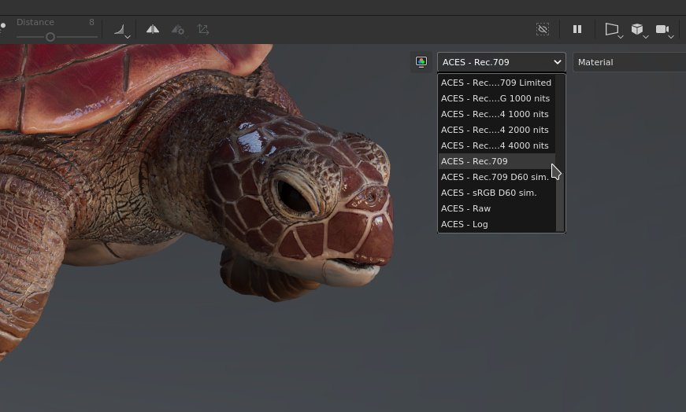
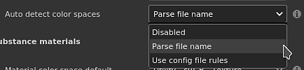

# 버전 7.4

**Substance 3D Painter 7.4**&#x200B;는 새로운 색상 관리 워크플로의 도입으로 OpenColorIO에 대한 지원을 추가합니다.

출시일: *24 2021년 11월*

## 주요 기능

### 새로운 색상 관리

이 버전에서는 [OpenColorIO](https://opencolorio.org/)&#x200B;(약식 OCIO) 버전 2의 지원을 통해 색상 관리를 소개합니다.

이 새로운 워크플로를 통해 가져오기에서 내보내기까지 그리고 뷰포트 내부까지 색상을 관리하고 교정할 수 있으므로 다른 응용 프로그램에서 모든 콘텐츠를 보다 쉽게 일치시킬 수 있습니다.

* **프로젝트 설정**\
  이제 새 프로젝트를 만들 때 색상 관리를 활성화할 수 있습니다. 기존 프로젝트에서도 프로젝트 설정을 통해 색상 관리를 활성화할 수 있습니다.\
  색상 관리를 사용하려면 **레거시**(기본값)에서 **OpenColorIO**(으)로 전환하고 기본 구성 중 하나 또는 사용자 지정 구성을 사용하십시오.

  {width="400px"}

* **뷰포트 표시 설정**\
  2D 및 3D 보기 위쪽에는 색상 관리를 위한 두 개의 컨트롤이 있습니다.\
  **색상 버튼**: 뷰포트의 색상 변환을 사용하거나 사용하지 않습니다.\
  **변형 드롭다운 표시**: 색상을 변환하는 데 사용할 변형 표시를 선택합니다.

  {width="500px"}

* **색상 피커 설정**\
  색상 관리를 사용하는 경우 색상 피커에서 새 컨트롤을 제공합니다. 구성에서 지정한 작업 색상 공간에서 색상이 편집됩니다.\
  HSV/RGB 슬라이더 아래에는 작업 영역에서 표시 색상 공간으로 변환된 최종 색상 값이 표시됩니다.

  

  

* **사용자 지정 색상 공간으로 비트맵 및 Substance 재질 가져오기**\
  Substance 재질 출력을 해석하는 방법을 포함하여 리소스를 처리하는 방법을 지정하는 전용 설정을 사용할 수 있습니다.\
  파일의 이름을 구문 분석하여 리소스가 사용 중인 색상 공간을 알 수도 있습니다.

  

* **내보내기 설정**\
  텍스처를 내보낼 때 색상 관리 채널은 새 키워드 **$colorSpace**&#x200B;의 도움으로 사용된 색상 공간의 이름을 파일 이름에 표시합니다.

  {width="250px"}

  

>[!NOTE]
>
> 응용 프로그램 내에서 색상 관리가 작동하는 방식에 대한 자세한 내용은 [전용 페이지](../../features/color-management/color-management.md)를 참조하세요.

### 2D 및 3D 뷰포트의 새로운 고정 해제

이제 2D 및 3D 보기를 고정 해제하여 다른 위치로 이동할 수 있습니다. 예를 들어, 3D 보기를 기본 화면에 두고 2D 보기를 다른 화면에 둡니다.

고정되지 않은 보기로 작업하면 애플리케이션의 레이아웃을 구성하는 것이 더 쉽고 페인팅 영역을 너무 많이 손실하지 않고도 항목을 주시할 수 있습니다.

* **보기 고정 해제**\
  보기를 고정 해제하려면 보기 메뉴를 열고 두 옵션 중 하나를 선택하기만 하면 됩니다. 각 옵션은 새 창을 열고 해당 보기를 내부에 포함하는 반면 다른 보기는 기본 인터페이스 내에 고정된 상태를 유지합니다.

  

* **고정되지 않은 보기와 함께 교체**\
  보기가 고정 해제된 동안 보기 메뉴의 교체 작업을 사용하여 보기를 바꿀 수 있습니다.

  {width="500px"}

* **색상 관리와 호환**\
  고정 해제된 보기에는 자체 색상 관리 표시 변환이 있으므로 모니터에 따라 관리가 쉬워집니다.

  {width="500px"}

### 3Dconnection의 SpaceMouse®에 대한 새로운 지원

**SpaceMouse®**&#x200B;은(는) 3D 뷰포트 카메라를 보다 직관적이고 친숙한 방식으로 조작할 수 있는 3D 연결 장치입니다. 이제 Painter에서 플러그 앤 플레이 방식으로 기본적으로 지원됩니다.

자세한 내용은 전용 [문서 페이지](../../features/spacemouse-by-3dconnexion.md)를 참조하세요.

>[!NOTE]
>
> * 버전 7.4.2 이상에서 사용할 수 있습니다.
> * Painter 제어 스키마의 이점을 활용하려면 최신 SpaceMouse® 드라이버를 설치하십시오.

### 새 콘텐츠

애플리케이션에서 사용할 수 있는 기본 콘텐츠에 새로운 에셋 세트가 추가되었습니다.

* 새 데칼, 도구 사전 설정 및 필터(**Käy Vriend**&#x200B;별):
  * **데칼**
    * 반흔 평평하게
    * 일반 포켓 패치
  * **사전 설정**
    * 지퍼 고급 테이프
    * 지퍼 고급 중지
    * 지퍼 고급 슬라이더
    * 조임끈끈
    * 조임 코드 아일릿
    * 반짝이 별 황금
    * 반짝이 파티
    * 반짝이 점 파스텔
  * **생성기**
    * 축소/줄 바꿈 부풀리기

* 새 그런지 비트맵(**Emiel Sleegers** 제공):
  * 그런지 석고 페인트
  * 그런지 석고 빛바랜
  * 그런지 페인트 벗김
  * 그런지 습도
  * 그런지 플러프
  * 그런지 콥웹
  * 그런지 부시
  * 그런지 우드 소프트
  * 그런지 종이 찢김
  * 그런지가 깊게 금이 갔다
  * 그런지 브러시 적용 Dust

### 향상된 자동 UV 언래핑

확장된 표면이 있는 3D 모델의 지원을 향상시키는 새로운 옵션으로 자동 UV 감싸기가 업데이트되었습니다.

이름이 **길어진 UV 섬 피하기**&#x200B;인 이 새 설정은 너무 길어질 수 있는 UV 섬을 분할하여 UV 공간을 더 잘 활용합니다.

아래는 이 설정을 사용하지 않고 사용하는 경우의 예입니다.

{width="500px"}

### 개선된 Python 스크립팅

Python API에는 Javascript API를 호출할 수 있는 새로운 메서드가 있습니다.

이 새로운 방법을 사용하면 이전 플러그인을 새 Python API로 더 쉽게 마이그레이션할 수 있습니다. 또한 Python에서 아직 노출되지 않은 **Baking** 및 **Shader** 관리와 같은 일부 기능을 잠금 해제합니다.

Python에서 Javascript 명령을 실행하려면 새 **js** 하위 모듈에서 **evaluate()** 함수를 사용합니다. 자세한 내용은 API 설명서(애플리케이션의 도움말 메뉴를 통해 제공)에서 확인할 수 있습니다.

## 릴리스 정보

### 7.4.2

*(2022년 3월 8일 릴리스)*

**추가됨:**

* [SpaceMouse]&#x200B;[Windows] 탐색을 위한 3D 뷰포트에서 3Dconnection SpaceMouse 지원
* [SpaceMouse]&#x200B;[Windows] 3D 뷰포트의 Pro 및 Enterprise SpaceMouse 모델에 대한 기본 단축키/키
* [SpaceMouse]&#x200B;[Windows] 3D 뷰포트의 전용 회전 중심 아이콘
* [색상 관리] OCIO 구성에서 역할을 사용하여 기본 설정 변경
* [색상 관리] 색상 위젯의 속성 창에 대한 색상 관리
* [색상 관리] 색상 관리 재질 미리보기의 속성 창
* [색상 관리] 색상 피커에서 색상 견본 관리
* [색상 관리] 설정을 추가하여 표준 sRGB 색상 공간 정의
* [색상 관리] 색상 피커 표시 선택기 목록의 OCIO 구성에서 표준 sRGB 색상 공간을 추가합니다
* [색상 관리] 색상 공간 재정의 메뉴에 대한 개선 사항
* [색상 관리] 디스플레이 설정에서 환경 맵 색상 공간 재정의를 허용합니다.
* [색상 관리] 현재 표시를 기반으로 색상 피커 그라디언트를 그립니다.
* [색상 관리] 색상 편집기에서 기본적으로 HDR 값 클램프
* [색상 관리] 레거시 모드에서 필터에 통과(색상 공간 없음)를 사용합니다.
* [색상 관리] [0-1] 범위와 일치하도록 색상 편집기에서 그레이디언트 표시 제한
* [색상 관리] 레거시 모드의 색상 피커에서 표시 선택기 숨기기
* [색상 관리] 색상 피커 16진수 필드를 항상 sRGB 색상 공간으로 만들기
* [색상 관리] 데이터 채널에 대한 색상 피커 표시 드롭다운 비활성화
* [최적화] 뒤틀기 격자는 가려진 UV 타일만 다시 계산합니다.
* [내보내기] Sketchfab, USD 및 glTF에 대한 UV 타일 프로젝트 내보내기 허용
* [스크립팅]&#x200B;[Python] tonemapping 함수 변경 허용

**고정:**

* [Sketchfab] 기존 모델을 업데이트하면 새 모델이 생성됩니다.
* [Sketchfab] 이전에 업데이트된 모델을 검색할 때 충돌이 발생합니다
* USD로 내보낼 때 충돌 발생
* 지오메트리 마스크에서 새 셰이더 인스턴스를 만들거나 지오메트리를 숨긴 경우 충돌 발생
* [에셋 가져오기 창] 가져온 리소스의 유형을 변경할 때 충돌이 발생합니다
* 표준 메시 맵이 레이어 스택에서 사용될 때 반전됨
* [Substance] 사용자 데이터 혼합 모드를 고려하지 않습니다.
* [색상 관리] 파일 이름에 색상 공간이 있는 비트맵을 UV 타일 시퀀스로 가져옵니다
* [색상 관리] Substance 그래프의 색상 관리 출력이 잘못된 색상 공간에 있습니다.
* [색상 관리] 다각형 채우기 도구에서 잘못된 색상이 표시됨
* [색상 관리] ACES 토네마퍼는 솔로 모드의 채널에 적용됩니다.
* [색상 관리] 도구 미리 보기 구 조명이 색상 관리되지 않음
* [색상 관리]&#x200B;[내보내기] 변환된 맵은 잘못된 변환을 적용합니다
* [스크립팅]&#x200B;[Python]&#x200B;[색상 관리] 템플릿 및 OCIO 환경 변수로 만든 프로젝트는 레거시 모드에 있습니다.
* [스크립팅]&#x200B;[Python] 시작할 때 JavaScript evaluate 함수를 사용할 수 없습니다.
* [3D Adobe 오퍼] 기본적으로 지원되지 않는 언어로 국가별 설정을 사용할 때 Painter을 실행할 수 없습니다.

**알려진 문제:**

* 3Dconnection SpaceMouse는 MacOS에서 지원되지 않습니다.
* [UI] 색상 관리가 포함된 가로 스크롤 막대가 새 프로젝트 창에 표시되는 경우가 있습니다
* [베이커] UV 타일 프로젝트에서 &quot;평균 표준&quot; 설정이 영향을 주지 않음
* [Mac M1] 스마트 재질이 올바르게 표시되지 않음
* [색상 관리] 투영 모드에 사용된 리소스는 오버레이에서 색상 관리되지 않습니다

### 7.4.1

*(2021년 12월 14일 릴리스)*

**추가됨:**

* [색상 관리] 내보낸 파일 이름에 데이터 역할 사용
* [색상 관리] 기본적으로 새 프로젝트 및 프로젝트 설정 창에서 OCIO를 선택하면 색상 관리 섹션을 확장합니다
* [색상 관리] 레거시 모드에서 ACES 토네마퍼 추가
* [색상 관리] 기본 구성 설정 조정
* [색상 관리]&#x200B;[내보내기] 데이터 채널의 파일 이름에 $colorSpace를 채웁니다.
* [내보내기] UV 타일 프로젝트를 Stager로 내보내기
* [상호 운용성] Steam 및 Substance 버전에는 사용할 수 없습니다.
* [상호 운용성] UV 타일 프로젝트를 Stager로 보내기 허용

**고정:**

* [MacOS]&#x200B;[충돌] Painter이 Catalina에서 시작되지 않음
* [색상 관리]&#x200B;[충돌] 사용자 채널에서 데이터 유형/색상 관리를 사용하여 재생할 때 임의의 충돌이 발생합니다
* [색상 관리] 마스크 표시 색상 공간 새 메뉴에서 회색 음영으로 사용되는 리소스
* [색상 관리] 레거시 모드 + 솔로 보기의 뷰포트에 사용자 채널이 더 어둡게 표시됩니다.
* [색상 관리] iRay에서 Env 맵을 사용할 때는 항상 선형입니다.
* [색상 관리] 색상 피커가 레거시 모드에서 데이터 채널에 적합한 값을 선택하지 않습니다.
* [색상 관리] 색상 피커가 레거시 모드에서 Substance 내부의 연결이 끊어짐
* [색상 관리] 드롭다운 메뉴를 사용할 때 뷰포트에서 솔로 채널 보기 간에 전환하면 적절한 색상 공간으로 표시되지 않습니다.
* [색상 관리] 내보내기가 레거시 모드의 색상 관리 사용자 채널에 잘못된 변환을 적용합니다
* 단독 보기 마스크에서 만든 획은 재질 보기로 다시 전환할 때 표시되지 않습니다
* [내보내기] 변환된 맵은 색상 관리 채널로 내보내지지 않습니다.
* [텍스처 세트] 이름이 변경된 사용자 채널에서 원래 이름의 도구 설명이 누락되었습니다.
* [Steam] Steam을 사용하여 파일 무결성을 확인할 때 파일이 누락되었습니다.

**알려진 문제:**

* [Mac M1] 스마트 재질이 올바르게 표시되지 않음

### 7.4.0

*(2021년 11월 24일 릴리스)*

**추가됨:**

* [색상 관리] 색상 관리 지원 OpenColorIO 버전 2
* [색상 관리] 색상 관리 설정을 프로젝트 설정에 추가
* [색상 관리] 프로젝트를 열 때 색상 관리 구성 변경에 대한 경고 창
* [색상 관리] 유효하지 않은 OCIO 구성 파일이 선택된 경우 오류 메시지를 표시합니다
* [색상 관리] OCIO 환경 변수로 구성 재정의 허용
* [색상 관리] 여러 OCIO 구성은 기본적으로 애플리케이션과 통합됩니다.
* [색상 관리] 가져온 비트맵 파일 이름에서 색상 공간 이름 추출
* [색상 관리] [속성] 창의 구성에서 색상 공간 하나를 사용하여 색상 공간을 재정의할 수 있습니다.
* [색상 관리] 텍스처 세트 설정에서 색상 관리 옵션 추가
* [색상 관리]&#x200B;[뷰포트] 2D 뷰와 3D 뷰를 개별적으로 색상 관리할 수 있습니다.
* [색상 관리] 환경 맵을 로드하고 작업 색상 공간으로 변환합니다
* [색상 관리] 현재 색상 공간으로 색상 피커 및 편집기 조정
* [색상 관리] 새 드롭다운 메뉴를 사용하여 뷰포트에서 디스플레이 변형 색상 공간을 선택할 수 있습니다.
* [색상 관리] Illustrator 렌더링 결과로 디스플레이 변환 적용
* [색상 관리] 서로 다른 색상 공간으로 텍스처를 내보냅니다
* [색상 관리]&#x200B;[Python] 환경 변수(OCIO)의 색상 관리 설정을 새 프로젝트에 적용합니다
* [뷰포트] 2D 또는 3D 뷰포트 잠금 해제 허용
* [자동 풀기] 길쭉한 섬을 피하는 새로운 옵션
* [Python 스크립팅] Python API에서 JavaScript 함수 호출
* [새 프로젝트 창] 가져온 맵 섹션을 축소할 수 있게 만듭니다.
* [투영]&#x200B;[뒤틀기] 뒤틀기 설정에서 일반 영역을 옵션으로 숨길 수 있습니다.
* [내용] 11개의 새로운 그런지 맵
* [콘텐츠] 8개의 새로운 도구 사전 설정(지퍼, 조임 코드, 반짝이기)
* [콘텐츠] 8가지 새로운 재질 (흉터, 주머니, ...)
* [Content] 1개의 새 생성기(부풀리기 shrinkwarp)

**알려진 문제:**

* [Mac M1] 스마트 재질이 올바르게 표시되지 않음
* [색상 관리]&#x200B;[충돌] 사용자 채널에서 데이터 유형/색상 관리를 사용하여 재생할 때 임의의 충돌이 발생합니다
* [색상 관리] 색상 피커가 레거시 모드에서 데이터 채널에 적합한 값을 선택하지 않습니다.
* [색상 관리]&#x200B;[Iray] 색상 관리가 뷰포트에서 활성화되어 있는 동안 EXR 또는 TIFF에서 렌더링을 저장하면 항상 선형 상태로 저장됩니다
* [색상 관리] 마스크에서 회색 음영으로 사용된 리소스에 잘못된 색상 공간 메뉴가 표시됩니다
* [색상 관리]&#x200B;[Iray] Env 맵은 Iray에서 사용될 때 항상 선형입니다.
* [색상 관리]&#x200B;[내보내기] 변환된 맵은 색상 관리 채널로 내보내지지 않습니다
* [색상 관리]&#x200B;[내보내기] 사용자 채널이 색상 관리 방식인지 레거시 모드인지 여부를 내보내기가 무시합니다
