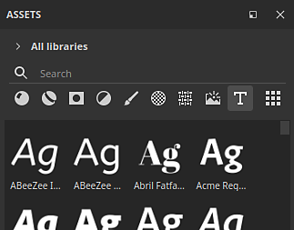
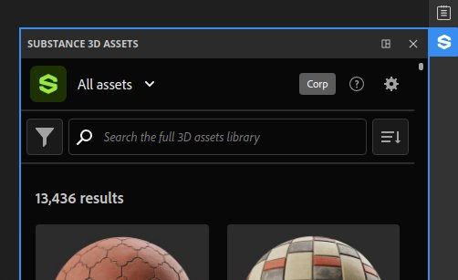
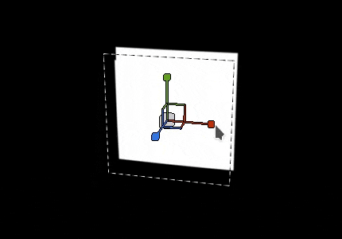

# 버전 10.0

<b>Substance 3D Painter 10.0</b>은(는) Illustrator(.ai) 파일을 지원하고, Substance 3D Assets을 통합하고, 텍스트 리소스를 통해 글꼴을 가져오고, Python API에 레이어 스택 기능을 추가하고, 여러 가지 삶의 질을 개선합니다.

출시일: *2024년 5월 16일*

## 주요 기능

### 새 텍스트 리소스

이 새 버전에서는 <b>텍스트 리소스</b>를 도입합니다. 이 리소스를 사용하면 글꼴 파일을 로드하여 다른 컨텍스트(브러시, 칠 투영, Substance 이미지 입력 등)에 텍스트를 쓸 수 있습니다. 질감을 꾸밀 수 있습니다.

* <b>에셋 창에서 글꼴 찾아보기</b>\
  글꼴이 이제 에셋 창에 자체 필터 아래에 나열됩니다. 운영 체제의 다른 위치(또는 라이브러리)에서 수집됩니다.

  
* <b>다른 리소스처럼 글꼴 끌어 놓기</b>\
  글꼴은 다른 종류의 리소스처럼 텍스트 리소스로 사용할 수 있습니다. 드래그 앤 드롭하여 자동으로 채우기 투영을 만듭니다. 또한 브러시에 사용하거나 Substance 필터에 입력으로 사용할 수도 있습니다.

  
* <b>텍스트 리소스 매개 변수</b>\
  텍스트 리소스를 만들 때 몇 가지 매개 변수를 조정하여 텍스트의 모양을 조정할 수 있습니다. 세로 및 가로 정렬, 자동 또는 수동 크기, 줄 및 문자 간격, 색상 등.

  
* <b>지원되는 다양한 문자 및 기능</b>\
  텍스트 리소스는 오른쪽에서 왼쪽 쓰기 및 [합자](https://en.wikipedia.org/wiki/Ligature_(writing))를 지원합니다. (라틴 문자가 아닌 문자를 쓰려면 호환되는 글꼴이 필요합니다.)

  
* <b>일반 리소스와 같은 사용자 지정 글꼴 가져오기</b>\
  자신의 글꼴 파일을 다른 리소스처럼 라이브러리 또는 프로젝트로 직접 가져올 수 있습니다. 일부 글꼴 유형은 지원되지 않지만 자세한 내용은 이 [문서 페이지](../technical-support/workflow-issues/shelf-issues/font-import.md)를 참조하세요.

>[!NOTE]
>
> <b>텍스트 리소스</b>에 대한 자세한 내용은 [전용 문서 페이지](../painting/text-resource.md)를 참조하세요.

### Illustrator 파일(.Ai)의 새로운 가져오기

<b>.svg</b>개 파일 지원에 따라 이 새 버전에는 Illustrator 파일 가져오기 기능(<b>.ai</b>)도 추가되었습니다.

* <b>Illustrator(.Ai) 파일 지원</b>\
  이제 이 새로운 버전에서는 Painter에서 .ai 파일을 가져와 렌더링하여 브러시, 칠 투영 또는 Substance 이미지 입력의 리소스로 사용할 수 있습니다.
* <b>.svg 및 .ai 파일은 공통 설정을 공유합니다</b>\
  SVG 및 Illustrator 문서에서는 해상도, 자르기 영역, 범위 선택 매개 변수와 같이 유사한 설정이 공유됩니다. 이는 벡터자원이 유사한 방식으로 관리될 수 있음을 의미한다.

  
* <b>대지 선택</b>\
  Illustrator 문서에서 아트보드를 지원하는 경우 .ai 파일을 사용할 때 전용 설정을 통해 사용할 수 있는 다른 아트보드 중에서 선택할 수도 있습니다.

  
* <b>향상된 범위 선택</b>\
  썸네일을 지원하여 범위 선택 창이 개선되어 특정 요소만 더 쉽게 검색하고 선택할 수 있습니다.\
  성능상의 이유로 축소판은 기본적으로 꺼져 있으며 <b>축소판 표시</b> 확인란으로 활성화할 수 있습니다.

  

>[!NOTE]
>
> Illustrator(<b>.ai</b>) 파일 가져오기는 현재 Windows 및 MacOS에서만 지원됩니다.

### 새로운 Substance 3D Assets 통합

Painter 내부에 Substance 3D Assets 웹 사이트를 직접 포함하는 새 창이 제공됩니다. 이러한 통합을 통해 라이브러리에서 직접 리소스를 쉽게 검색하고 다운로드할 수 있습니다.

* <b>새 Substance 3D Assets 창</b>\
  인터페이스에서 Substance 3D Assets을 검색할 수 있는 새 도크를 사용할 수 있습니다. 도크가 보이지 않고 닫혀 있으면 인터페이스 오른쪽에 있는 도크 도구 모음에서 다시 도크를 찾을 수 있습니다.

  
* <b>다운로드 관리자</b>\
  창의 왼쪽 하단 버튼을 사용하여 전용 관리자를 통해 현재 다운로드 중인 에셋을 볼 수 있습니다. 다운로드하지 못할 수 있는 에셋은 이 목록에서 다시 시작할 수 있습니다.

  
* <b>다운로드한 에셋을 쉽게 찾기</b>\
  창의 오른쪽 하단에 있는 버튼은 웹 사이트를 탐색하는 데 도움이 되는 몇 가지 액션이 있는 메뉴를 열지만, 에셋이 다운로드되었음을 표시합니다.

  

>[!NOTE]
>
> 에셋을 다운로드하려면 처음 실행할 때 계정에 로그인해야 합니다. 이 로그인은 나중에 사용할 수 있도록 캐시됩니다.

>[!NOTE]
>
> Steam 버전에서는 Substance 3D Assets 도크를 사용할 수 없습니다.

### Python API의 새 레이어 스택 모듈

이 릴리스에서는 Python API에 새로운 레이어 스택 모듈이 추가된 것을 확인할 수 있습니다. 이 API를 사용하면 프로젝트의 레이어 스택을 제어하여 고급 레이어 스택 플러그인 및 사용자 정의 도구 만들기의 문을 열 수 있습니다.

* <b>새 레이어 스택 API</b>\
  새로운 <b>layerstack</b> 모듈을 사용하면 다양한 방법으로 프로젝트의 레이어 스택을 제어할 수 있습니다. 다음을 수행할 수 있습니다.

  * 레이어 및 효과의 선택을 쿼리하고 설정합니다.
  * 새 레이어, 폴더 및 효과(필터, 고정점 등 포함)를 만듭니다.
  * 레이어를 인스턴스화합니다.
  * 레이어 및 효과의 매개 변수를 가져와 설정하고 리소스를 로드합니다.
  * Substance 매개 변수를 가져오고 설정합니다.
* <b>범위 수정 및 엔진 일시 중지</b>\
  레이어 스택을 조작하면 긴 계산이 필요할 수 있으므로 (UI에서처럼) API에서 엔진을 일시 중지하거나 일시 중지할 수도 있습니다. 또한 두 가지 성능 상의 이유로 수정 사항을 함께 그룹화할 수 있을 뿐만 아니라 여러 작업을 한 번만 실행 취소할 수도 있습니다.
* <b>기본 색상 관리</b>\
  레이어 스택의 표현으로 API에 색상 관리의 개념을 도입해야 했습니다. 새 <b>색상 관리</b> 모듈이 추가되어 색상을 만들고 조정하고 비트맵의 색상 공간을 선택할 수 있습니다. (API의 이 부분은 아직 완료되지 않았으며 이후 버전에서 확장될 예정입니다.)
* <b>내보내기 사전 설정 정보 쿼리</b>\
  이제 내보내기 사전 설정이 API에 노출되어 사전 설정 목록(사전 정의 및 사용자 정의)을 쿼리할 수 있습니다. 또한 기존 내보내기 텍스처 API와 유사한 형식으로 컨텐츠를 검색할 수도 있습니다.
* <b>새로운 가능성!\
  </b> API의 이 새로운 부분에서는 레이어 선택 항목을 저장하고 복원하거나 프로젝트의 모든 리소스에 대한 임의 시드를 변경하는 등 많은 새로운 작업을 수행할 수 있습니다. 예를 들면 다음과 같습니다.

  

>[!NOTE]
>
> API에 대한 자세한 내용은 <b>도움말 > 스크립팅 설명서 > Python API</b>를 통해 응용 프로그램에 포함된 설명서를 참조하십시오. 이 설명서에는 쉽게 시작할 수 있는 코드 조각이 많이 포함되어 있습니다.

>[!NOTE]
>
> 레이어 스택 플러그인의 예는 [온라인 설명서](https://adobedocs.github.io/painter-python-api/)에서도 확인할 수 있습니다.

### 개선된 표준 맵 페인팅

이 릴리스에서는 표준 맵 페인팅 워크플로우를 다시 작업했습니다. 우리는 특히 일반 브러시 스탬프를 누적하고 혼합하는 방법을 변경했습니다. 이러한 변경은 페인팅 플로우 맵과 관련된 문제를 해결하기 위해 수행되었습니다.

* <b>누적 문제 해결</b>\
  표준 채널의 영역을 계속 페인트하면 더 이상 채도가 증가하거나 클램프가 체결되어 구멍이나 가공물이 생기지 않습니다. 일반 채널을 RGB32F로 전환할 필요도 없습니다.

  
* <b>페인팅된 획 나누기 실행 취소</b> 수정\
  브러시 획을 취소해도 이미 칠해진 다른 획은 더 이상 깨지지 않습니다.

  
* <b>알파 0의 투명도</b>\
  알파 값이 0인 텍스처로 만든 브러시 스탬프가 투명으로 그려집니다. 아래 예에서는 브러시 스탬프(왼쪽)와 평면 투영(오른쪽)을 보여 줍니다.

  

>[!NOTE]
>
> 페인팅 플로우 맵에 대한 자세한 내용은 [문서 페이지](../painting/advanced-channel-painting/flow-map-painting.md)를 참조하십시오.

### 개선된 변형 조작기

변형 조작기의 사용을 개선하기 위해 몇 가지 개선이 이루어졌습니다.

* <b>정밀도 모드(CTRL 포함)</b>\
  이제 조작기를 드래그하면서 Control을 누르면 보다 세밀한 작업을 수행할 수 있는 새로운 정밀 모드로 들어갑니다. 이 변경 사항은 평행 이동, 회전 및 비율 조정 조작기에 적용됩니다.\
  다음은 드래그하는 동안 Ctrl 키를 누르기 전과 후의 예입니다.

  
* <b>새 크기 조절 동작</b>\
  이제 크기 조정 강도는 장면 크기가 아닌 현재 크기 조정 값 자체를 기반으로 합니다. 이렇게 하면 특히 작은 값에서 상대 변경을 보다 쉽게 수행할 수 있습니다. 정밀한 모드와 결합하면 비율을 훨씬 더 즐겁게 조정할 수 있습니다.\
  또 다른 변경 사항은 0이 더 이상 음수 값이 되지 않을 때까지 크기를 줄이는 것입니다. 이는 투영을 축소하고 실수로 뒤집는 문제를 피합니다.

  
* <b>향상된 표면 조작기 회전</b>\
  이제 서피스 데칼 매니퓰레이터가 서피스 주위로 드래그할 때 훨씬 안정적입니다. 앞뒤로 번역을 할 때 회전수가 증가하지 않는다.\
  다음은 <b>새</b> 동작과 비교한 <b>이전</b> 동작입니다.

  

  
* <b>드래그 앤 드롭에 대한 카메라 정렬 투영</b>\
  리소스를 뷰포트로 끌어다 놓으면 메시 표면에서 바로 뒤틀기 투영을 만들 수 있습니다. 이 투영은 이전에 잘못 회전되어 이제 카메라에 정렬됩니다.

  

그 외에도 다음과 같은 몇 가지 개선 사항이 추가되었습니다.

* <b>업데이트된 Tile Generator</b>\
  이제 <b>Tile Generator</b> 혼합 모드 매개 변수를 변경할 수 있으며 예상대로 결과를 수정합니다. 리소스가 <b>Substance 3D Designer</b>에서 사용할 수 있는 최신 버전으로도 업데이트되었습니다.
* <b>일부 필터에서 밴딩/품질 문제 해결</b>\
  여러 필터가 16비트 대신 8비트 정밀도로 고정되어 이를 사용할 때 밴딩/아티팩트가 발생합니다(막대 그래프 스캔 또는 방향 흐림 효과 등). 이 문제가 수정되었습니다.
* <b>SBSAR 출력의 색상 공간</b>\
  레거시 또는 OCIO 색상 관리 워크플로가 활성화되면 SBSAR 내보내기가 이제 해당 출력의 프로젝트에서 사용된 색상 공간 이름을 참조합니다.
* <b>더 빠른 리소스 검색</b>\
  <b>텍스트 리소스</b>의 도입으로 새 캐시를 추가하여 다음에 시작할 때 디스크의 리소스를 더 빠르게 크롤링하도록 만들었습니다. 이는 리소스가 HDD에 설치되거나 라이브러리가 GB의 리소스를 보유하고 있을 때 매우 두드러집니다. 명령줄을 사용하여 이 새 캐시를 사용하지 않도록 설정할 수 있습니다. 자세한 내용은 전용 [설명서 페이지](../pipeline-and-integration/configuration/command-lines.md)를 참조하십시오.

웹 사이트 [이(가) 아랍어입니까?](https://isthisarabic.com/) 덕분입니다. 이 버전을 개발하는 동안 큰 도움이 되었습니다.

위 미디어에 사용된 아트워크 참조:

* Lucas Gouvea의 [검은 셔츠를 입은 남자](https://unsplash.com/photos/man-wearing-black-shirt-aoEwuEH7YAs)
* Pawel Czerwinski의 [핑크와 녹색](https://unsplash.com/photos/pink-and-green-abstract-art-ruJm3dBXCqw)
* [unDraw 일러스트레이션](https://undraw.co/illustrations)
* 클로드 모네

## 튜토리얼

## 릴리스 정보

### 10.0.0

출시일: <b>2024/05/16</b>\
요약: <b>주요 릴리스, Python API를 사용한 레이어 스택 버전, 기본 Illustrator 파일 읽기, 3D 에셋 및 새 텍스트 리소스 통합</b>

<b>추가됨</b>:

* [Illustrator] Painter에서 아트 보드와 함께 Illustrator 파일 사용
* [Illustrator]&#x200B;[SVG] 범위 선택에서 미리 보기 추가
* [Substance 3D Assets] Painter에서 직접 3D 에셋을 검색하고, 선택하고, 다운로드하십시오.
* [Substance 3D Assets]&#x200B;[UI] 새 패널
* [Substance 3D Assets] 환경 맵 및 자료 지원
* [Substance 3D Assets] 새 Substance 3D Assets 패널에서 위치 폴더를 다시 로드하고 탐색하고 열 수 있습니다.
* [Substance 3D Assets] 다운로드 관리자 추가
* [텍스트 리소스] 포함 가능한 글꼴 사용 허용
* [텍스트 리소스] 메시에서 글꼴/텍스트 렌더링 허용
* [텍스트 리소스] 새 범주와 함께 에셋 패널에서 사용자 및 기타 공유 경로의 글꼴을 표시합니다
* [텍스트 리소스]&#x200B;[속성] 고급 글꼴 속성에 대한 지원 추가
* [텍스트 리소스] 미니 쉘프의 글꼴 검색/보기 허용
* [텍스트 리소스] 호환되지 않는 글꼴을 가져올 때 오류 메시지/대화 상자를 추가합니다.
* 기타
* [칠 투영] 작은 값을 사용할 때 크기 조절 조작기 동작을 개선합니다.
* [조작기] Ctrl 단축키를 누를 때 새로운 정밀 모드를 추가합니다.
* [조작기] 이동 시 표면 조작기의 안정성 향상
* [내보내기] SBSAR 출력에 색상 공간 이름 추가
* [성능] 디스크에 있는 에셋의 라이브러리 검색 시간 향상
* [Substance] Substance 엔진 버전 9.1.2로 업데이트
* [드래그 앤 드롭] 뷰포트에 놓을 때 데칼 회전을 카메라에 정렬합니다.
* [Python] 레이어 스택의 에디션
* [Python] UI에서 레이어, 효과, 마스크, 지리적 마스크 선택 허용
* [Python] 레이어 혼합 모드 가져오기/설정 허용
* [Python] 칠 레이어 투영 설정을 가져오거나 설정할 수 있습니다
* [Python] 칠 레이어에서 Substance 재질 색상을 쿼리할 수 있습니다.
* [Python] 레이어와 효과에서 균일한 색상과 리소스를 쿼리하고 설정할 수 있습니다.
* [Python] 레이어 스택에서 텍스트 리소스를 만들고 편집할 수 있습니다.
* [Python] 레이어 및 효과의 활성 채널 편집 허용
* [Python] 일괄 처리 작업을 통해 하나의 실행 취소/다시 실행을 허용합니다.
* [Python] 벡터 소스 매개 변수 로드/편집 허용
* [Python] 색상 관리를 사용하여 레이어 및 효과 색상 속성을 편집할 수 있습니다.
* [Python] 인스턴스화된 레이어를 쿼리하고 만들 수 있습니다.
* [Python] 색상 선택 효과 추가 허용
* [Python] 비트맵 이미지 색상 관리를 제어하는 것을 허용합니다.
* [Python] 엔진 일시 중지/일시 중지 취소 허용
* [Python] 동위 멤버 및 상위 노드로 이동합니다.
* [Python] 필터/생성기 효과 만들기 허용
* [Python] 레벨 효과 추가 허용
* [Python] 레이어에 스마트 마스크 추가 허용
* [Python] 고정점 만들기/편집 허용
* [Python] 레이어의 마스크 가져오기/설정 허용
* [Python] 마스크 비교 효과 만들기 허용
* [Python] Substance 리소스의 사전 설정 쿼리 및 사용 허용
* [Python] Substance 리소스에 대한 내부\_properties 함수를 통해 사전 설정 및 해당 값을 나열할 수 있습니다.
* [Python] 미리 정의된 내보내기 사전 설정을 나열할 수 있습니다.
* [Python] 라이브러리에서 사용할 수 있는 내보내기 사전 설정을 나열하도록 허용
* [Python] 내보내기 사전 설정의 콘텐츠 검색 허용

<b>고정</b>:

* [Crash] Ctrl-Z를 사용하여 &quot;셰이더 인스턴스 제거&quot; 실행 취소
* [충돌] 마지막 선택이 효과인 경우 빈 스택에 레이어를 만듭니다.
* [SVG] 사용자 정의 자른 영역 값 문제
* [자동 래핑 해제] UV 방향을 변경하지 않고 패킹만 다시 계산하면 충돌이 발생합니다
* [드래그 앤 드롭] 외부 리소스로 인한 지연이 여러 번 미리 로드됩니다.
* [UI] 리소스 축소판을 드래그하여 놓으면 레이어 스택에서 경고 메시지가 숨겨집니다.
* [성능] 마스크된 UV 타일이 여전히 계산됨
* [USD] 범위 선택에 대한 강조 표시가 잘못되었습니다.
* [리소스] 일반 채널에서 페인팅하고 프로젝트를 저장한 후 비트맵 이미지가 손상됨
* [USD] 왼손잡이 정점 메시 순서 지원
* [Substance] 각도 위젯의 경우 기본값으로 재설정하면 항상 0으로 돌아가기
* [엔진] 스텐실에서 SVG을 사용한 페인팅이 작동하지 않음
* [엔진] 실행 취소 후 표준 맵 브러시 획이 중단됨
* [콘텐츠] [그래픽-재질] 필터에 잘못된 알파 혼합 및 색상 공간이 있습니다
* [내용] Tile Generator의 혼합 모드가 작동하지 않습니다
* [콘텐츠] 막대 그래프 스캔 필터로 인해 밴딩이 발생하는 경우가 있습니다
* [내용] 스타일이 적용된 구운 조명은 페인팅된 Height을 고려하지 않습니다
* [Python] 셰이더 변경 후 인스턴스 레이어 정보를 검색하는 동안 예기치 않은 오류가 발생했습니다.

<b>알려진 문제</b>:

* [색상 관리] Linux에서 ACE를 사용한 HDR 색상 공간 변환으로 클램프된 색상 생성
* [충돌]&#x200B;[Linux]&#x200B;[AMD] Wayland OS의 레이어 스택에 있는 리소스 드래그 앤 드롭
* [회귀]&#x200B;[UI] 마우스 오른쪽 단추 클릭 메뉴가 HD 화면에서 너무 작습니다.
* [충돌]&#x200B;[Python] TextureStateEvent에 의해 USD 내보내기가 트리거되었습니다.
* [저장] &quot;다른 이름으로 저장&quot;이 실패하면 Spp 프로젝트 파일이 손실됩니다.
* [MacOS Intel] 일부 사전 설정을 가져올 때 충돌이 발생함
* [Illustrator] 서버 충돌 후 Painter을 다시 시작하지 않으면 Ai 파일을 가져올 수 없음
* [가져오기] 이름은 같지만 확장명이 다른 에셋은 무시됩니다.
