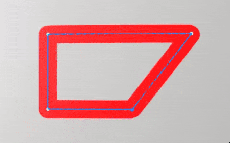

# 버전 10.1

<b>Substance 3D Painter 10.1</b>에는 새로운 강력한 필터, 향상된 USD 기능 및 업데이트된 VFX 플랫폼 및 Linux 지원이 추가되었습니다.

출시일: *2024년 9월 17일*

>[!NOTE]
>
> 이 버전의 Painter은 이제 Python 및 JavaScript 플러그인 지원에 영향을 주는 Qt 버전 6을 사용합니다. 자세한 내용은 아래를 참조하십시오.

## 주요 기능

### 새로운 기본 필터

이 릴리스에서는 텍스처링 프로세스를 크게 확장하기 위해 몇 가지 새로운 필터가 추가되었습니다.

* <b>새 자수 데칼 재질</b>\
  자산 창의 재질 섹션에서 새 자수 데칼 재질을 찾을 수 있습니다. 메시 위의 아무 곳에나 끌어다 놓고 리소스(예: 텍스처 또는 글꼴)를 연결하면 새로운 패브릭 세부 사항을 쉽게 만들 수 있습니다.

  
* <b>새 채우기 영역 색상/마스크 필터</b>\
  이 두 가지 새로운 필터를 사용하면 닫힌 패스나 윤곽선을 채울 수 있습니다. 예를 들어 3D 패스를 빠르게 채우는 데 유용합니다. 필터이기 때문에 수동 브러시 스트로크 또는 다른 상황에서도 사용할 수 있습니다.

  
* <b>새 FXAA 필터</b>\
  이 새 필터를 사용하면 특히 레벨 다음에 나타날 수 있는 선명한 가장자리 또는 [색상 선택] 효과를 사용하여 만든 마스크에서 앨리어싱을 빠르게 줄일 수 있습니다.

  
* <b>새 하이패스 필터</b>\
  이 일반 필터를 사용하면 회색 음영 텍스처를 만들어 세부 사항을 부드럽게 하거나 흐리게 하거나 선명하게 하는 등의 고급 효과에 사용할 수 있습니다.

  
* <b>새 픽셀화 필터</b>\
  픽셀화 필터는 해상도의 감소를 시뮬레이션하여 색상과 패턴을 스타일화하는 데 유용할 수 있습니다.

  
* <b>새 포스터화 필터</b>\
  이 필터는 이미지에서 색상 수를 줄이는 데 유용할 수 있습니다. 이렇게 하면 모양의 대비를 만들고 스타일화된 효과를 만드는 데 도움이 될 수 있습니다.

  
* <b>새 임계값 필터</b>\
  [한계값] 필터를 사용하면 회색 음영 입력에서 선명한 이진 흑백 마스크를 빠르게 만들 수 있습니다.

  
* <b>새 매끄러움 단계 필터</b>\
  매끄러운 단계 필터는 레벨 또는 대비를 수행하여 회색 음영 정보를 다듬는 또 다른 방법입니다. 이 필터는 결과에도 지수 곡선을 적용하여 선형 그레이디언트를 매끄러운 곡선으로 변환할 수 있습니다.

  
* <b>개선된 변환 및 미러 필터</b>\
  비 균일 크기 조절, 수직 크기 조절, 비균일 크기 조절을 지원하도록 비 균일 필터 기능이 업데이트되었습니다. 미러 필터를 보다 간단한 매개 변수로 새로 고쳤습니다.

  
* <b>개선된 아이콘</b>\
  표준 필터를 더 잘 보이게 하고 쉽게 찾을 수 있도록 해당 아이콘이 다시 만들어졌습니다. 노란색으로 색칠된 아이콘은 레이어 콘텐츠에 사용되고, 회색 음영 아이콘은 일반적이며 레이어 콘텐츠 및 마스크 모두에 사용할 수 있습니다.

  
* <b>필터에 대한 사소한 수정</b>\
  몇 가지 문제를 해결하기 위해 몇 가지 다른 필터가 조정되었습니다.

  * Height 조정 필터가 레이어의 알파에 영향을 주어 경우에 따라 사용하기 어렵습니다.
  * 흐림 효과 필터가 레거시 색상 관리 모드에서 선형 색상 공간을 사용하지 않아 해당 입력을 혼합/혼합할 때 잘못된 색상이 만들어졌습니다.

### USD 및 VFX 플랫폼 지원 업데이트

이 버전의 Painter에서는 여러 타사 구성 요소가 개선되고 업데이트되었습니다.

* <b>USD로 Adobe 표준 재질로 텍스처 내보내기\
  </b>Painter에서 USD 파일로 텍스처를 내보낼 때 Adobe Standard Material 속성을 가져옵니다. 이렇게 하면 이러한 USD 파일을 해당 속성을 지원하는 애플리케이션에서도 사용할 수 있습니다.
* <b>USD 파일에서 텍스처 가져오기</b>\
  USD 파일을 가져오면 이제 만든 프로젝트에서도 텍스처가 가져오므로 응용 프로그램 간에 주고 받는 작업이 쉬워집니다. USD 파일에서 Adobe Standard Material을 사용하는 경우 이 역시 셰이더 설정을 구성하여 뷰포트의 결과를 다른 소스 응용 프로그램과 일치시킵니다.
* <b>Gltf 변경 내용\
  </b>USD 업데이트 후 GLTF 형식의 일부 동작을 변경하여 패리티를 유지해야 했습니다. 이제 gltf 파일을 가져올 때 Painter에서는 노멀 맵이 OpenGL 형식인 것으로 가정합니다.\
  일부 gltf 파일에는 DirectX 형식이 대신 사용될 수도 있습니다. 따라서 새 프로젝트 창에 새로운 설정이 추가되어 해당 설정이 반영됩니다(표준 포맷도 레이어 스택에서 재정의할 수 있음).

  
* <b>업데이트된 종속성</b>\
  특히 VFX 플랫폼 참조와 일치하도록 Painter에서 사용하는 여러 라이브러리가 업데이트되었습니다. Painter 10.1에서 사용되는 새로운 버전은 다음과 같습니다.

  * Qt 6.5.6(및 PySide6 6.5.6)
  * SUBSTANCE 엔진 .
  * OpenEXR
  * 파이썬
  * OCIO 2.3.2
  * OpenSubdiv 3.6.0
* <b>Linux 지원 업데이트\
  </b>이 새 버전의 Painter은 이제 RHEL(Red Hat Enterprise Linux) 버전 8.6을 최소한으로 지원하지만 버전 9.x와도 호환되어야 합니다.

### 성능 향상

다음과 같은 몇 가지 응용 프로그램 영역이 일부 성능 개선을 받았습니다.

* <b>프로젝트 열기 시간 개선\
  </b>브러시 획을 많이 사용한 프로젝트가 이제 더 빠르게 Painter에서 열 수 있습니다. 이러한 프로젝트의 절약 시간 또한 약간 개선되어야 한다.\
  일부 테스트 프로젝트에서는 프로젝트를 열 때 로드 시간이 50초에서 6초로 감소하는 것을 관찰했습니다. 오래된 프로젝트를 열고 최신 버전으로 변환할 때의 메모리 소비량도 향상되었습니다.
* <b>향상된 쪽맞춤 성능\
  </b>이제 셰이더 설정에서 쪽맞춤을 사용하도록 설정한 경우 자동 최적화를 사용합니다. 화면의 픽셀보다 작은 삼각형은 더 이상 쪽맞춤을 수행하지 않아 그릴 삼각형이 줄어들고 렌더링 시간이 더 빨라집니다.\
  이 변경은 시각적 차이를 생성하지 않으며 메시 내보내기 프로세스에 영향을 주지 않습니다.
* <b>단순화된 축소판이 이제 기본값입니다.</b>\
  버전 6.2에서는 성능을 개선하기 위해 UV 타일 프로젝트에 단순화된 축소판을 도입했지만 일반 프로젝트에서는 여전히 레이어 축소판을 계산하는 이전 방법을 사용할 수 있습니다. 이 동작은 응용 프로그램 설정을 통해 제어되었습니다.\
  이제 이 설정은 기본적으로 최적화된 축소판으로 기본 설정되며 모든 프로젝트의 성능에 도움이 됩니다. 원하는 경우 기본 환경 설정에서 되돌릴 수 있습니다.

  

### Painter 10.1 마이그레이션 참고 사항

>[!NOTE]
>
> * Qt6로 업데이트한 후 Python 플러그인을 업데이트해야 할 수 있습니다. 자세한 내용은 [이 페이지](https://adobedocs.github.io/painter-python-api/guides/qt6-migration/)를 참조하세요.
> * <b>JavaScript </b>플러그인이 이제 사용자 문서 디렉터리 내의 하위 폴더로 이동되었습니다. 기존 플러그인은 해당 폴더로 수동으로 이동해야 하므로 더 이상 애플리케이션에 표시되지 않습니다.
> * Steam/Ubuntu에서 Painter이 제대로 작동하려면 시스템 라이브러리가 필요합니다. 응용 프로그램을 시작하기 전에 libxcb-cursor가 설치되어 있는지 확인하십시오.

## 릴리스 정보

### 10.1.0

출시일: <b>2024/09/17</b>

요약: <b>주요 릴리스, 새 콘텐츠: 채우기 영역 마스크/색상 필터, 자수 데칼 필터 및 6개의 일반 Substance 필터, 재질 및 셰이더 속성이 포함된 USD 가져오기, 성능 개선, VFX 플랫폼 2024 호환 및 Linux RedHat으로의 마이그레이션</b>

<b>추가됨</b>:

* [내용] 새 채우기 영역 마스크/색상 필터 추가
* [Content] 자수 데칼 필터 새로 추가
* [콘텐츠] 6개의 새로운 일반 Substance 필터(FXAA, 픽셀화, 하이패스, 포스터화, 스무딩 단계, 임계값)를 추가합니다.
* [USD] 정의된 ASM 재질이 있는 USD 레이어 내보내기
* [USD] 재료 및 셰이더 속성과 함께 USD 가져오기
* [성능] 기본적으로 최적화된 레이어 스택 축소판 사용
* [성능] 프로젝트 파일 열기 시간 및 메모리 소비량 감소(데이터 디코딩)
* VFX 플랫폼 2024 호환
* [VFX Platform 2024] Python 3.11로 업데이트
* [VFX Platform 2024] OpenEXR 3.2로 업데이트
* [VFX Platform 2024] [USD] OpenSubdiv 3.6.0 업데이트
* [VFX Platform 2024]&#x200B;[색상 관리] OCIO 2.3.2로 업데이트
* [Linux] Linux RedHat으로 마이그레이션
* [Linux] Nvidia 드라이버 최소 버전을 535.171.04로 업데이트합니다.
* [가져오기] GLTF 메시를 가져올 때 표준 맵을 뒤집는 옵션을 추가합니다
* [UI] 드래그 이벤트 감지 거리에 운영 체제 기본값 사용
* [Substance 엔진] 호출 스트립 함수를 추가하여 실행 파일에서 기호를 제거합니다.
* [Splash screen] 새 Splash Screen 형식으로 업데이트
* Substance 엔진을 버전 9.1.3으로 업데이트
* [Python] 레이어 스택 설명서 메뉴에서 예제에 대한 링크를 표시합니다
* [JavaScript] Javascript 플러그인을 javascript/plugins 하위 폴더로 이동

<b>고정</b>:

* [Illustrator] 특정 경우에 .ai 그래픽이 있는 UV 타일을 내보낼 때 충돌이 발생합니다
* [역동적인 획]&#x200B;[패스] 획당 임의 회전이 패스에서 작동하지 않습니다.
* [UI]&#x200B;[속성] 타일링이 균일하지 않을 때 잠금이 활성화됩니다
* Painter &#x200B; 프로젝트를 두 번 클릭하면 디버그 TXT 파일이 생성됨
* [USD]&#x200B;[내보내기] 일부 텍스처가 누락될 수 있습니다.
* [ASM] 색상 분산 채널은 금속색을 무시합니다.
* [콘텐츠] 흐림 효과 필터가 &quot;작업&quot; 색상 공간에서 작동하지 않음
* [내용] Height 조정 필터는 레이어의 알파도 수정합니다

<b>알려진 문제</b>:

* [색상 관리] Linux에서 ACE를 사용한 HDR 색상 공간 변환으로 클램프된 색상 생성
* [Win]&#x200B;[충돌] [ACE] 디스플레이 변환에 sRGB ICE 색상 공간을 사용하지 않음
* [회귀]&#x200B;[UI] 마우스 오른쪽 단추 클릭 메뉴가 HD 화면에서 너무 작습니다.
* [충돌]&#x200B;[Python] TextureStateEvent에 의해 USD 내보내기가 트리거되었습니다.
* [MacOS Intel] 일부 사전 설정을 가져올 때 충돌이 발생함
* [충돌] 리소스 재배치 및 프로젝트 저장
* [엔진] 일반 채널 이동 색상에서 복제 도구를 사용하여 페인팅이 잘못됨
* [Python] 아직 작동 중인 스크립트에 의해 고스트 위젯이 삭제된 것으로 나타남
* [RedHat] 색상 피커 문제
