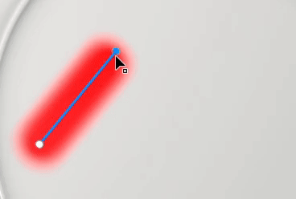
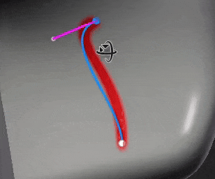
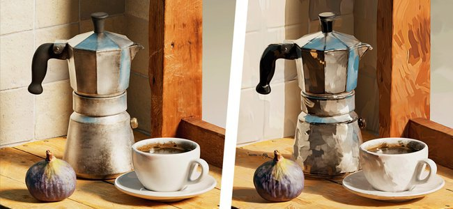
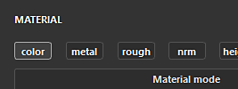

# 버전 11.0

<b>Substance 3D Painter 11.0</b>에는 새로운 자동 리소스 업데이트 작업 과정, 채워진 패스 도구 및 패스에 대한 일반적인 개선 사항, 구워내기 위한 자동 케이지 및 스타일화된 텍스처를 만들기 위한 몇 가지 새로운 필터가 추가되었습니다.

출시일: <b>2025년 3월</b>

>[!NOTE]
>
> 이 버전의 Painter에서는 Mac Intel 구성에 대한 지원이 제거되었습니다. 자세한 내용은 아래를 참조하십시오.
> 
> 또한 이 버전은 지원되는 최소 Windows 10 버전을 22H2로 높입니다.
> 
> 자세한 내용은 [시스템 요구 사항 페이지](../getting-started/system-requirements.md)를 확인하세요.

## 주요 기능

### 새로운 리소스 자동 업데이트

이제 새로운 자동 업데이트 워크플로를 통해 라이브러리 및 프로젝트를 최신 버전의 리소스로 최신 상태로 유지할 수 있습니다. 이 새로운 프로세스를 통해 Painter은 디스크의 리소스를 모니터링하여 변경 사항을 찾고 자동으로 다시 로드하고 라이브러리 및 프로젝트로 바꿀 수 있습니다.

* <b>에셋 창에서 자동 업데이트 사용</b>\
  이제 에셋 창의 오른쪽 하단에 자동 업데이트 시스템을 구성하는 버튼과 메뉴가 있습니다(작은 이중 화살표 아이콘). <b>에셋 패널</b> 옵션을 활성화하여 라이브러리를 모니터링하고 다시 로드합니다.

  
* <b>프로젝트에서 리소스 업데이트</b>\
  리소스를 다시 로드해도 레이어 스택, 표시 설정, 셰이더스 설정 등을 통해 프로젝트 내에서 사용되는 버전이 자동으로 업데이트되지 않습니다. 이렇게 하려면 <b>프로젝트에서 사용되는 리소스</b> 옵션도 활성화해야 합니다.

  
* <b>업데이트 빈도 </b>\
  Painter에서 리소스 업데이트를 찾아야 하는 빈도는 전용 설정을 통해 몇 분 안에 정의할 수 있습니다. 0분을 사용하면 응용 프로그램이 몇 초마다 새로 고쳐집니다. 그러나 이러한 낮은 값은 성능 문제를 초래할 수 있습니다. 초점을 다시 맞출 때도 애플리케이션은 자동으로 새로 고쳐집니다.
* <b>수동 리소스 업데이트</b>\
  새로 고침 및 업데이트 프로세스는 자동 업데이트 메뉴의 아래쪽에 있는 전용 버튼을 사용하여 수동으로 트리거할 수도 있습니다. 이는 자동 프로세스가 시작되기를 사용하고 기다리는 것보다 더 편리할 수 있다.

  
* <b>로그 창에서 불일치 및 오류 발생</b>\
  리소스를 업데이트하면, 특히 이전 버전과 새 버전의 차이가 중요한 경우 문제가 발생할 수 있습니다. 예를 들어, Substance 리소스에서 매개 변수가 누락되거나 변경되어 텍스처링 결과가 크게 변경되거나 중단될 수 있습니다. 매개 변수 불일치 시 <b>에셋 건너뛰기</b>가 기본적으로 사용되는 이유입니다. 문제는 로그 창에 보고됩니다.\
  강제로 업데이트하려면 이 설정을 비활성화하기만 하면 됩니다.

  

  
* <b>프로젝트 유지 관리 자동화를 위한 Python API에서 사용 가능 </b>\
  자동 업데이트 워크플로우는 Python에도 노출되었습니다. 오래된 리소스를 나열하고 바꾸는 데 도움이 되는 새 기능이 추가되었습니다.\
  자세한 내용은 응용 프로그램 도움말 메뉴를 통해 전용 설명서를 참조하십시오.

>[!NOTE]
>
> 자세한 내용은 [전용 문서 페이지](../features/auto-update.md)를 참조하세요.

### 새로운 칠 패스 도구

채우기 패스 도구는 균일한 색상으로 채워진 3D 모델의 표면에 모양을 만들 수 있는 새로운 유형의 패스 도구입니다. 그것은 복잡한 패턴의 생성을 가능하게 한다.

* <b>채우기 색상으로 패스를 만드는 새 도구</b>\
  [패스] 메뉴에서 <b>채워진 패스</b>이라는 새 도구를 사용할 수 있습니다. 이 도구는 닫힌 경우 패스의 내부 영역을 채울 수 있습니다. 채우기는 텍스처 세트의 각 채널에 대해 균일한 색상으로 수행됩니다.

  
* <b>표면에 자동으로 적용</b>\
  채워진 패스 도구는 평면 영역으로 제한되지 않고 모든 종류의 서피스에 맞춰질 수 있습니다. 이 효과는 간격과 개체 경계를 교차할 수 있습니다.

  
* <b>거울 및 방사형 대칭과 호환</b>\
  이 새로운 도구는 또한 대칭 속성을 지원하여 복잡한 모양을 만들 수 있는 가능성을 엽니다.

  
* <b>경로 도구 간 쉬운 전환</b>\
  속성 창에 다른 유형의 패스 도구 간에 전환하는 새로운 방법이 추가되었습니다. 도구를 사용해보고 패스를 복제하는 작업이 한결 쉬워집니다. 예를 들어 패스 윤곽선을 만든 다음 복제하여 채워진 패스로 변환할 수 있으므로 윤곽선이 있는 모양을 빠르게 만들 수 있습니다.

  

### 스냅, 직선 등을 사용하여 패스 도구 개선

이번 새 릴리스에서는 패스 도구를 사용하기 쉽게 하기 위해 비헤이비어와 삶의 질이 많이 개선되었습니다.

* <b>패스 미리 보기(Shift+P로 전환)</b>\
  패스를 편집할 때 새 점선이 나타나 곡선 끝에 새 점을 추가할 때 패스의 반응을 나타냅니다. 이렇게 하면 변경 내용을 보다 예측 가능하게 만들 수 있습니다. 전용 설정 메뉴를 통해 또는 <b>Shift+P</b> 키보드 단축키를 사용하여 이 미리 보기를 사용하지 않도록 설정할 수 있습니다.

  
* <b>직선 및 각도 스냅</b>\
  이제 <b>Shift </b>키보드 수정자를 사용하여 지점 사이에 직선을 자동으로 만들 수 있습니다. <b>Ctrl </b>을(를) 유지하면 각도 스냅을 적용하여 기하학적 모양을 만들 수도 있습니다.\
  컨텍스트 도구 모음의 [패스 설정] 메뉴를 통해 각도 물리기 설정을 수정할 수 있습니다.

  
* <b>메시 다각형에 패스 지점 스냅</b>\
  점을 보다 쉽게 배치할 수 있도록 새 물리기(자석 아이콘)를 활성화할 수 있습니다. 이 옵션을 사용하면 3D 모델 정점에 점을 놓고 서피스나 모서리를 따를 수 있습니다.\
  스냅은 다음 세 가지 방법으로 수행할 수 있습니다.

  * 꼭지점에 물리기
  * 가장자리에 물리기
  * 가장자리 가운데에 물리기

  이러한 모든 모드는 컨텍스트 도구 모음의 경로 설정 메뉴를 통해 사용할 수 있습니다.

  

  
* <b>마지막 정점을 클릭할 때 자동 닫기</b>\
  <b>채워진 패스 도구 </b>을(를) 더 쉽게 사용할 수 있도록 마지막 정점을 선택한 상태에서 첫 번째 정점을 클릭하면 이제 자동으로 패스가 닫힙니다. 패스를 닫는 대신 점을 선택하려면 <b>CTRL </b> 키를 사용할 수 있습니다. (이 동작은 이전 버전에서 반전되었습니다.)

  
* <b>콘텐츠에서 마스크로 패스 정점 위치 복사</b>\
  이제 재질 모드에서 패스를 <b>복사</b>한 다음 마스크의 패스에 <b>모든 정점을 붙여넣기</b>할 수 있습니다. 이렇게 하면 재질과 마스크 간에 서로 다른 경로를 동기화할 수 있습니다.

  
* <b>UI 표시 동작 표시/숨기기 개선</b>\
  이제 뷰포트 조작 도구 키보드 단축키(<b>W</b>, <b>S</b> 또는 <b>D</b>)를 누르면 바로 전환할 수 있습니다. 컨텍스트 도구 모음 전용 버튼에서 활성화/비활성화할 수도 있습니다. 이러한 변경으로 인해 경로 곡선 및 점과 같은 뷰포트의 다른 비주얼도 숨기지 않고 빠르게 표시하거나 숨길 수 있습니다.

  
* <b>이제 패스 정점에서 회전 및 크기 조절에 액세스할 수 있습니다</b>\
  이제 이 버전에서는 여러 정점을 선택한 경우 <b>회전 </b>과(와) <b>크기 조절 </b> 도구를 사용할 수 있습니다. 그러면 정점을 함께 조정하고 정렬할 수 있습니다.

  
* <b>속성 창에 경로 정보 표시</b>\
  패스 도구를 선택하면 속성 창에 새 섹션이 표시됩니다. 이 새 섹션에서는 패스 길이, 투영 깊이 및 동작과 같은 패스에 고유한 정보와 액션을 다시 그룹화하여 유형 간에 전환합니다.

  
* <b>각도에서 볼 때 향상된 접선 버전</b>\
  보기 각도에 따라 사용자 정의 접선 편집이 어려울 수 있습니다. 이제 접선이 자체 계획으로 제한되도록 변경되었습니다.

  
* <b>레이어 간에 열린 경로 목록 유지</b>\
  서로 다른 페인트 레이어와 효과 사이를 전환할 때 뷰포트의 [패스] 패널이 닫혀 있으면 다른 레이어에서도 닫혀 있는 상태로 유지됩니다. 이제 패널을 열어 두고 볼 때 더욱 편리하게 사용할 수 있습니다.

  
* <b>현재 선택한 경로 </b>에 집중\
  이제 <b>F</b> 키보드 단축키를 누르면 패스를 편집할 때 전체 3D 모델 대신 패스에 초점을 맞춥니다.
* <b>백스페이스 </b>이(가) 있는 경로 삭제\
  이제 <b>백스페이스 </b>키보드 단축키를 눌러 경로를 빠르게 삭제할 수 있습니다.

### 새로운 Substance 필터 및 텍스처 생성기

새로운 버전에서는 몇 가지 새로운 필터와 몇 가지 절차 패턴을 도입했습니다.

<b>필터:</b>

* <b>스타일화</b>\
  이 새로운 필터를 사용하면 기존 텍스처링을 보다 세련된 버전으로 변환할 수 있습니다. 3D 공간에서 브러시 획을 시뮬레이션하고 몇 가지 다른 효과를 적용하여 회화적인 분위기를 연출할 수 있습니다. 이 사전 설정에는 쉽게 사용할 수 있는 몇 가지 사전 설정이 포함되어 있습니다.

  
* <b>수량화</b>\
  정량화 필터를 사용하면 이미지의 색상 수를 줄이고 선명한 극한이 있는 플랫 영역을 만들 수 있습니다. 또한 텍스처 스타일 지정에도 사용할 수 있습니다.

  
* <b>비등방성 구와하라</b>\
  이 필터는 노이즈 감소 및 텍스처 스타일 지정에 사용할 수 있는 [Kuwahara 필터](https://en.wikipedia.org/wiki/Kuwahara_filter "https://en.wikipedia.org/wiki/Kuwahara_filter")를 적용합니다.

  
* <b>방향 거리</b>\
  이는 2D 공간에서 주어진 방향으로 픽셀을 늘이는 간단한 필터이다. 이 효과는 브러시 획을 문지르거나 쉽게 번지는 데 사용할 수 있습니다.

  
* <b>베벨 매끄럽게</b>\
  이 베벨 매끄럽게는 더 나은 결과와 컨트롤을 제공하는 새로운 버전의 경사 필터입니다. 기존 필터 외에 추가로 사용할 수 있습니다.

  
* <b>회색 음영 변환 </b>\
  이 새로운 필터를 사용하면 이미지나 채널을 회색 음영으로 편리하게 변환할 수 있으며, 필요한 경우 빨강, 녹색 및 파랑 채널을 제어할 수 있습니다.

<b>텍스처 생성기 및 노이즈</b>:

* <b>Scratches 생성기 </b>\
  다양한 컨트롤을 통해 불규칙성을 시뮬레이션하는 개선된 스크래치 생성기입니다.
* <b>Triangle Grid </b>\
  무작위 및 Smoothness 컨트롤을 사용하여 삼각형의 연결에서 만든 노이즈입니다.
* <b>타일 무작위 </b>\
  타일 패턴 빌드에 맞춘 텍스처 생성기입니다.
* <b>보로노이 및 보로노이 프랙탈 노이즈 </b>\
  이미 3D 노이즈로 사용할 수 있는 이 새로운 2D 버전은 2D 또는 UV 공간에서 작업 및 타일링에 사용할 수 있습니다.
* <b>Designer </b>에서 최신 버전으로 업데이트된 소음\
  Painter에서 사용할 수 있는 대부분의 노이즈가 Substance 3D Designer의 최신 버전으로 업데이트되었습니다. 노이즈 매개 변수는 더 빨리 편집하기 위해 그룹에 숨겨지지 않습니다.

### 베이킹용 새 자동 케이지(시험용)

하이 폴리 메쉬를 로우 폴리 메쉬에 굽는 경우 이제 케이지 모드를 지정할 때 새로운 <b>자동 </b> 옵션을 선택할 수 있습니다. 이 새로운 방법은 아티팩트를 방지하기 위해 가장 좋은 하이 폴리 메시에 맞는 자동 케이지 메시를 계산하려고 합니다.

* <b>일반 굽기 매개 변수 </b>의 새 설정\
  공통 베이킹 매개 변수 내에서 cage 매개 변수는 다음 세 옵션 중 하나로 대체되었습니다.\
  <b>거리 기반</b>: 기본 정면/후면 거리 설정입니다.\
  <b>자동(시험적)</b>: 새로운 자동 케이지.\
  <b>사용자 지정 파일</b>: 사용자 지정 메시 파일을 케이지로 로드하는 이전 방법입니다.

  

>[!NOTE]
>
> 이 기능은 실험적인 것으로 간주됩니다. 향후 버전에서 알고리즘을 개선할 계획입니다. 또한 결과의 품질과 가능한 버그에 대한 피드백을 찾고 있습니다.

### Mac OS에서 Metal으로 렌더링

이 릴리스에서는 Mac 플랫폼과 관련된 특정 변경 사항이 적용되었습니다.

* 이제 <b>Mac </b>에서 OpenGL 대신 Metal 그래픽 API가 사용되었습니다.\
  이제 이 버전부터 Painter은 Mac에서 뷰포트 렌더링 및 텍스처 계산에 <b>Metal </b>그래픽 API를 사용합니다. 이 스위치는 응용 프로그램의 성능과 안정성을 크게 향상시킵니다. 또한 OpenGL이 MacOS에서 더 이상 사용되지 않으므로 향후 새로운 기능을 더 쉽게 통합할 수 있습니다.
* <b>Mac OS </b>에서 Intel 아키텍처에 대한 지원 제거\
  이 버전에서는 MacOS의 Intel CPU와의 호환성이 제거되었습니다. ARM 아키텍처(M1, M2 등) 은(는) 이제 유일하게 지원됩니다.

### 기타

이 버전에는 다음과 같은 몇 가지 기능도 추가되었습니다.

* <b>새 칠 레이어/효과에서 기본 색상 채널만 사용</b>\
  이제 기본적으로 새 칠 레이어 또는 효과를 만들 때는 기본 색상 채널만 활성화됩니다. 이 변경 사항은 리소스 자체를 채우기 레이어/효과로 만들 리소스를 드래그하여 놓을 때는 적용되지 않습니다.\
  커뮤니티의 피드백을 기반으로 나중에 비활성화되는 채널의 계산이 트리거되지 않도록 하여 성능을 개선하기 위해 이 변경 사항을 적용했습니다. 이는 고해상도 또는 UV 타일로 작업할 때 책임감을 향상시킵니다.\
  <b>ALT </b>키보드 단축키를 유지하면서 기본 색상 단추를 클릭하여 모든 채널을 빠르게 다시 활성화할 수 있습니다.

  
* <b>텍스처를 내보내기 위해 UV 타일 이름 바꾸기</b>\
  [텍스처 세트] 목록 창에서 UV 타일에 사용자 정의 이름을 추가할 수 없습니다. 설명과 달리, 전용 태그 <b>$uvTileName</b>을(를) 통해 내보내기 사전 설정에서 사용자 정의 이름을 검색할 수 있습니다.\
  이 새로운 기능을 사용하면 내보내는 동안 UDIM 번호를 특정 이름으로 바꿀 수 있습니다.

  
* <b>Dock 도구 모음에서 사용 가능한 새 내보내기 단추</b>\
  다른 응용 프로그램으로 내보낼 수 있는 <b>보내기</b> 작업이 전용 창으로 이동되었습니다. 이제 응용 프로그램 오른쪽의 Dock 도구 모음에서 사용할 수 있습니다.

  
* <b>복사/붙여넣은 경로 및 레이어의 이름 지정 개선</b>\
  레이어 및 패스를 복제하거나 복사/붙여넣을 때 레이어의 이름 지정 체계를 보다 일관성 있고 예측 가능하도록 개선했습니다.

  

## 튜토리얼

## 릴리스 정보

### 11.0.0

출시일: <b>2025/03/11</b>\
요약: <b>주요 릴리스, 새로운 자동 업데이트 기능, 채워진 경로 도구 및 기타 경로 개선, 새로운 필터 및 베이킹을 위한 실험적인 자동 케이지 생성</b>

<b>추가됨</b>:

* 자동 업데이트
* [자동 업데이트] 에셋 패널에서 수정된 에셋 자동 업데이트
* [자동 업데이트] 프로젝트 전체에서 수정된 에셋 자동 업데이트
* [자동 업데이트] 기본적으로 자동 업데이트 해제
* [자동 업데이트] 리소스 매개 변수가 일치하지 않는 경우 업데이트를 선택적으로 지정하십시오(.sbsar, .glsl, .ai, .svg)
* [자동 업데이트] 환경 변수를 추가하여 자동 업데이트 기능 비활성화
* [자동 업데이트]&#x200B;[SBSAR] 리소스 매개 변수가 일치하지 않는 경우 업데이트를 선택적으로 지정합니다.
* 채워진 패스
* [패스]&#x200B;[칠] 새 도구를 추가하여 칠이 적용된 패스 만들기
* 경로 개선 사항
* [패스] 다각형에 스냅되는 패스 만들기
* [Path] 경로 유형을 전환할 수 있습니다.
* [패스] 내용과 마스크 간에 패스 정점 데이터 복사 및 붙여넣기 허용
* [패스] 새 점을 만들 때 각도를 제한할 수 있습니다
* [패스] 선에 대한 구속점 생성을 허용합니다.
* [패스] 클릭 한 번으로 모양 닫기
* [Path] 경로 정보 표시
* [패스] 패스 정점의 비율 조정 및 회전 허용
* [Path]&#x200B;[UX] 변형 기즈모의 액세스를 간편하게
* [Path] 패스 미리 보기 추가
* [패스] Shift + P를 사용하여 패스 미리 보기 비활성화
* [패스] 측면 보기에서 접선 버전 개선
* [패스] 3D 패스에 포커스 허용
* [패스] UI를 껐다가 다시 켤 때 정점이 선택 상태를 유지해야 합니다.
* [Path] 백스페이스를 사용하여 경로 삭제 허용
* [경로] 사용자가 경로를 확장한 경우 경로 목록을 열린 상태로 유지
* [Path]&#x200B;[Layer Stack] 복사/붙여넣기 시 중복 항목의 이름을 올바르게
* [패스] UI 및 도구 설명 개선
* 성능
* [성능] 높은 테셀레이션 레벨을 사용할 때 뷰포트 성능 향상
* [성능] 새 칠 레이어/효과에서 첫 번째 채널만 활성화
* [성능] 브러시 획 계산 병렬화
* 베이킹
* [베이킹] 높은 폴리 메쉬로 베이킹하기 위한 완전히 자동 케이지 생성 옵션 추가(시험적)
* 콘텐츠
* [내용] 스타일화, 정량화, 이방성 구와하라, 베벨 매끄럽게, 방향 거리, 회색 음영 변환 등 6가지 필터를 새로 추가합니다
* [내용] Designer(새로운 2D Voronoi 포함)에서 노이즈와 Grunges를 최신 버전으로 업데이트
* [콘텐츠] 새로운 텍스처 생성기 3개 추가(타일 무작위, Triangle Grid, Scratches 생성기)
* [Content] 언리얼 엔진 템플릿 이름 바꾸기 및 사전 설정 내보내기
* Python
* [Shelf]&#x200B;[Python] Python에서 스마트 재료 또는 스마트 마스크를 디스크에 저장
* [Python] Python API에 베이킹 자동 케이지 추가
* [Python] 텍스처 세트/UV 타일 이름 및 설명 편집 허용
* [Python] 벡터 및 글꼴 소스에 대한 해상도 설정 공유
* [자동 업데이트]&#x200B;[Python] Python에서 프로젝트 자동 업데이트 기능을 노출합니다.
* 기타
* [내보내기] 새 패널을 사용하여 보내기 옵션에 더 쉽게 액세스할 수 있습니다.
* [Nvidia] 최신 Nvidia 드라이버에 대한 경고 추가(572.16)
* 각도 스냅은 오브젝트/월드 공간 선택의 영향을 받아야 합니다&#x200B;.
* [텍스처 세트 목록] UV 타일에 사용자 정의 이름을 추가하고 내보낼 때 사용할 수 있도록 허용
* Mac
* [Mac] 그래픽 렌더링에 OpenGL 대신 Metal을 사용합니다.
* [Mac] Mac Intel 지원 중단

<b>고정</b>:

* [Nvidia]&#x200B;[베이킹] 앰비언트 오클루전 베이커 결과에 가공물이 있음
* [충돌] Alt 키를 누른 상태에서 텍스처 세트를 비활성화하면 충돌이 발생합니다
* [베이킹] 높은 폴리 매개 변수로 낮은 폴리를 고려합니다.
* [베이킹] ID 맵 베이커의 재질 색상이 USD 파일 포맷에서 작동하지 않음
* [성능] 메시가 있고 겹치는 오브젝트가 많은 뷰포트에서 렌더링 속도가 느림
* [Qt] 사용자 지정 기본 색상 피커에 색상 관리 설정이 없습니다
* [뷰포트] 앤티 앨리어싱이 활성화되면 3D 조작기가 깜박임
* 마스크 블록의 지우개 회색 음영 슬롯 브러시 상태
* [Log] 메시를 가져올 때 매우 긴 오류 메시지가 보고되지 않습니다.
* [내용] Topstitches 도구 사전 설정 내의 사전 설정 이름 목록에 오타 있음
* [Python] SVG/Ai 파일을 다른 파일로 바꾸면 속성이 업데이트되지 않습니다
* [Python] Python에서 쿼리했을 때 벡터 리소스 아트보드 ID가 비어 있는 경우가 있습니다.
* [Python] 로그에 인쇄할 때 가끔씩 많은 줄 반환이 발생합니다

<b>알려진 문제</b>:

* [색상 관리] Linux에서 ACE를 사용한 HDR 색상 공간 변환으로 클램프된 색상 생성
* [회귀]&#x200B;[UI] 마우스 오른쪽 단추 클릭 메뉴가 HD 화면에서 너무 작습니다.
* [충돌]&#x200B;[Python] TextureStateEvent에 의해 USD 내보내기가 트리거되었습니다.
* [엔진] 일반 채널 이동 색상에서 복제 도구를 사용하여 페인팅이 잘못됨
* [Python] 아직 작동 중인 스크립트에 의해 고스트 위젯이 삭제된 것으로 나타남
* [RedHat] 색상 피커 문제
