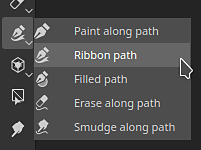
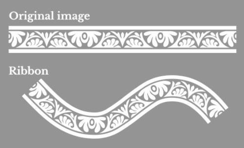
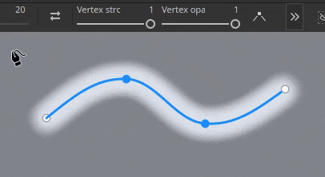
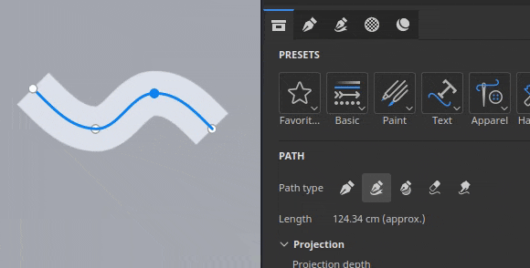
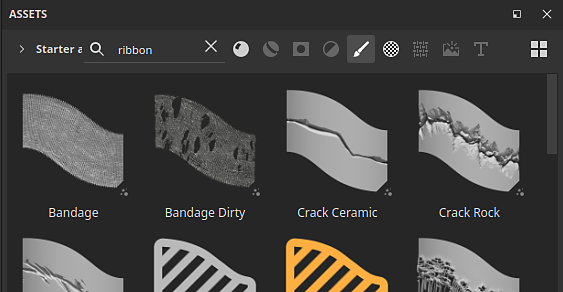
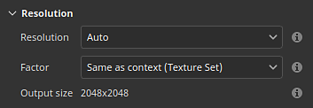

# 버전 11.1

<b>Substance 3D Painter 11.1 </b>전용 콘텐츠, 칠 레이어 및 효과의 대칭, 변위를 위한 물리적 크기 및 Vulkan 그래픽 API의 지원이 포함된 새로운 리본 경로 도구를 제공합니다.

출시일: <b>2025년 11월 18일</b>

>[!NOTE]
>
> 이 버전의 Painter은 그래픽 API를 OpenGL에서 Vulkan으로 전환합니다. 이 변경은 특히 GPU 기반 광선 추적을 사용한 제빵에 대해 응용 프로그램에서 지원하는 GPU에 영향을 줄 수 있습니다.
> 
> 자세한 내용은 [시스템 요구 사항 페이지](../getting-started/system-requirements.md)를 확인하세요.

## 주요 기능

### 새 리본 도구

<b>리본 경로</b>은(는) 패스 도구 모음에 새로 추가된 도구입니다. 리본은 날카로운 모퉁이를 위한 옵션뿐만 아니라 시작 및 끝에 대한 추가 컨트롤과 함께 잘라내기 없이 패스를 따라 텍스처를 변형하고 반복합니다.

이 새로운 도구를 사용하면 패스를 따라 텍스트를 배치하고, 패스를 따라 완벽한 그레이디언트를 배치하며, 메쉬를 감싸는 고급 트림을 쉽게 만들 수 있는 등의 새로운 비헤이비어에 대한 문을 열 수 있습니다.\
즉, 리본은 패스를 사용하여 보다 정확하게 드로잉할 수 있는 클리너 도구입니다.

* <b>다른 패스 유사 도구 옆에 사용할 수 있는 새 리본 도구</b>\
  인터페이스의 도구와 같이 다른 패스 옆에 새로운 리본 도구를 사용할 수 있습니다. 이 옵션은 도구 모음 또는 패스 문자 단축키에서 선택할 수 있습니다.

  

  
* <b>리본은 모든 종류의 표면에 걸쳐 작동하는 연속 경로입니다.</b>\
  리본은 패스를 따라 텍스처를 반복하거나 늘릴 수 있는 도구입니다. 메쉬 부품이 연결되지 않은 경우에도 모든 종류의 서피스와 형상에 걸쳐 작동합니다.

  
* <b>반복 패턴 및 그레이디언트 만들기</b>\
  이 새로운 도구는 이음새나 자르기 없이 다양한 방법으로 이미지를 반복할 수 있으며, 이는 그레이디언트와 깨끗한 패턴에 적합합니다.

  
* <b>사용자 지정 시작 및 끝으로 이미지 늘이기</b>\
  <b>오프셋 간 늘이기</b> 설정을 사용하면 이미지의 일부를 격리하여 패스의 시작 및 끝 섹션으로 사용하고 중간 섹션은 나머지 패스를 따라 늘릴 수 있습니다. 이렇게 하면 간단한 비트맵을 빠르게 사용하고 화살표와 같은 왜곡이 없는 패스를 따라 배치하는 데 편리합니다.

  
* <b>다른 모퉁이 유형을 사용할 수 있음</b>\
  접선을 끊어 모퉁이를 만들 때 필요에 따라 클래식 브레이크부터 매끄러운 선반가공에 이르기까지 여러 모양을 사용할 수 있습니다.

  
* <b>스트레치 및 타일링 컨트롤</b>\
  이미지는 자동 또는 수동으로 리본 경로를 따라 쉽게 반복되거나 늘어날 수 있습니다.

  
* <b>패스를 따라 텍스트</b>\
  리본 경로 리소스는 글꼴에서 직접 사용할 수 있습니다. 텍스트는 자동으로 패스에 맞게 조정되어 곡선을 따라 변형됩니다. 정렬 설정을 사용하여 모든 상황에 맞게 텍스트를 더 잘 조정할 수 있습니다.

  
* <b>종횡비 및 정사각형이 아닌 리소스</b>\
  사각형이 아닌 리소스는 리본 경로 길이에 맞게 자동으로 조정되므로 반복되는 장식과 트림 등 길쭉한 패턴에 적합합니다.

  
* <b>Substance 역동적인 획 워크플로와 호환</b>\
  리본 경로는 Substance 기반 동적 획 시스템과도 호환되므로 복잡한 결과를 만들 수 있습니다. 한 가지 주목할 만한 예는 사용자 정의 시작/끝 및 왼쪽/오른쪽 모퉁이를 가질 수 있는 기능입니다.\
  <b>사용자 정의 리본 회색 음영</b> 및 <b>사용자 정의 리본 재질</b>이라는 두 개의 새 도구 사전 설정도 제공되어 이 기능에 쉽게 액세스할 수 있습니다.

  
* <b>대칭 호환</b>\
  다른 타입의 툴들과 마찬가지로, 리본 경로는 또한 대칭 특징과 호환된다.

  
* <b>자체 겹칠 때 혼합 모드</b>\
  리본 경로가 스스로 넘어가면 예상치 못한 결과로 이어질 수 있다. Alpha, 표준 및 Height 채널에 대한 전용 혼합 모드를 사용하면 더 나은 결과를 얻을 수 있습니다.

  

모든 패스 도구에 걸쳐 다음과 같은 추가적인 개선 사항이 적용되었습니다.

* <b>패스의 정점당 크기와 불투명도를 분리합니다</b>\
  이제 패스의 정점당 크기와 불투명도를 조정할 수 있으며 더 이상 압력 매개 변수에 연결할 필요가 없습니다. 이제 이 두 속성은 인터페이스에서 전용 슬라이더로 별도로 처리됩니다.

  
* <b>속성 창 </b>에서 매개 변수 그룹화\
  이제 Painter의 대부분의 도구에는 매개 변수에 대해 축소 가능한 그룹이 있습니다. 이러한 변경으로 즉석에서 매개변수를 숨기고 창의 길이를 줄이는 것이 더 쉬워집니다.

  

>[!NOTE]
>
> <b>리본 도구</b>에 대한 자세한 내용은 [전용 문서 페이지](../painting/tool-list/ribbon-tool.md)를 참조하세요.
> 
> <b>역동적인 획</b>에 대한 자세한 내용은 [전용 문서 페이지](../painting/dynamic-strokes/dynamic-strokes.md)를 참조하세요.

### 리본 도구의 새 내용 및 범주

이 릴리스에는 새로운 리본 기능을 활용하는 75개의 새로운 도구 사전 설정이 포함되어 있습니다. 사전 설정을 쉽게 검색할 수 있도록 <b>속성</b> 창에 새 사전 설정 범주가 추가되었습니다.

* <b>속성 창의 새 사전 설정 범주 바로 가기</b>\
  패스 도구를 사용할 때 일련의 새 단추가 이제 <b>속성</b> 창의 맨 위에 있습니다. 각 버튼은 도구 사전 설정에 액세스할 수 있도록 해 주며, 범주별로 정렬되어 있습니다. 즐겨찾기 범주는 선택한 사전 설정을 다시 그룹화합니다.

  

  버튼 중 하나를 클릭하면 미리 선택된 일부 사전 설정에 빠르게 액세스할 수 있습니다. <b>에셋에 더 보기</b>를 클릭하면 <b>에셋</b> 창에 더 많은 경로 도구 사전 설정이 표시됩니다.

  
* <b>사전 설정 간 빠른 전환</b>\
  사전 설정 간 전환을 쉽게 하려면 사전 설정을 클릭해도 현재 편집된 패스가 더 이상 선택 해제되지 않습니다.

  
* <b>새 콘텐츠</b>\
  이 버전에서는 기본 콘텐츠의 일부로 리본 도구 전용 75개의 새로운 도구 사전 설정이 추가되었습니다. 이러한 사전 설정은 브러시 섹션 아래의 <b>에셋</b> 창에서 직접 사용할 수도 있고 <b>속성</b> 창의 새 범주 바로 가기를 통해 사용할 수도 있습니다.\
  이러한 사전 설정은 다음과 같습니다.

  * <b>의류</b>: 심 퍼커링 및 토스티치 사전 설정과 지퍼 및 패브릭 파열을 개선했습니다.
  * <b>기본</b>: 선, 대시 등의 단순한 선뿐만 아니라 <b>동적 선</b> 시스템을 기반으로 하는 그라디언트 및 <b>사용자 지정 리본</b> 사전 설정입니다.
  * <b>그런지</b>: 다양한 종류의 표면에서 손상을 시뮬레이션하는 3가지 유형의 균열.
  * <b>단단한 표면</b>: 사용 또는 기계적 개체를 위한 세부 정보, 테이프 및 용접의 그립 패턴, 패널 및 셧라인
  * <b>유기농</b>: 피부와 다른 표면을 감싸기 위해 깨끗하고 더러운 붕대를 모두 감습니다.
  * <b>페인트</b>: 브러시 기반의 그레이디언트 및 가우시안 사전 설정입니다.
  * <b>텍스트</b>: 다른 정렬 모드 및 스트레치를 사용하여 리본으로 패스를 따라 텍스트를 설정하는 빠른 사전 설정입니다.
* <b>자산 창에서 검색하기 위한 새 도구 키워드</b>\
  이제 <b>에셋</b> 창에서 &quot;리본&quot;, &quot;페인트&quot;, &quot;패스&quot; 또는 &quot;손가락&quot;을 입력할 수 있으며 해당 도구와 일치하는 사전 설정을 찾는 데 도움이 될 수 있습니다.

  

### 칠 레이어 및 효과에 대한 새로운 대칭

칠 레이어 및 효과는 이제 3D 투영 모드를 통해 대칭을 지원합니다. 이 기능은 컨텍스트 도구 모음의 대칭 메뉴 또는 <b>속성</b> 창에서 새로 추가된 대칭 섹션을 통해 활성화할 수 있습니다.

* <b>칠 레이어의 대칭 </b>\
  채우기 효과 및 레이어에서 3D 기반 투영 모드를 사용할 때 이제 대칭을 활성화할 수 있습니다. 거울 및 방사형 대칭을 모두 사용할 수 있습니다.

  
* <b>상황에 맞는 도구 모음 또는 속성 창을 통해 대칭 사용</b>\
  대칭은 페인트 도구와 유사한 <b>상황별 도구 모음</b> 메뉴를 통해 또는 새로운 전용 섹션이 있는 <b>속성</b> 창을 통해 활성화할 수 있습니다.

  

  
* <b>텍스트 및 로고에 대한 입력 리소스 뒤집기</b>\
  칠 레이어 및 효과 대칭성은 입력 이미지 또는 X/Y 축을 뒤집을 수 있는 새로운 옵션의 장점이기도 합니다. 이를 통해 예를 들어 텍스트를 미러링할 수 있지만 여전히 양쪽에서 읽을 수 있게 합니다.

  
* <b>개선된 대칭 설정 인터페이스</b>\
  대칭 설정의 인터페이스는 더 쉽게 읽을 수 있고 더 빠르게 사용할 수 있도록 재작업되었습니다. 축 슬라이더에는 각각 고유한 선이 있으므로 보다 정확하게 할 수 있습니다. 방사형 디스플레이는 또한 더 적은 공간을 차지하도록 소형화되었다.

  

<b>대칭</b>에 대한 자세한 내용은 [전용 문서 페이지](../painting/symmetry/symmetry.md)를 참조하세요.

### 변위 물리적 크기

이제 변위를 특정 단위로 정의할 수 있습니다. 이렇게 변경하면 다른 애플리케이션에서 변위된 형상을 보다 쉽게 정렬하고 일치시킬 수 있습니다.

* <b>변위 설정의 새 단위 크기 조절 옵션</b>\
  <b>셰이더 설정</b> 창에서 변위 강도를 조정할 때 새 단위 비율 설정을 사용할 수 있습니다. 이 설정은 다음과 같은 옵션을 제공합니다.

  * <b>정규화</b>: 기본값이며 Painter의 이전 동작과 일치합니다. 이 크기는 현재 프로젝트 내의 메시 경계 상자를 기반으로 합니다.
  * <b>장면</b>: 메시 파일 내부에 저장된 단위를 참조점으로 사용합니다.
  * <b>물리적 크기(cm)</b>: <b>프로젝트 구성</b> 창에 정의된 프로젝트 단위를 사용합니다.

  

### Windows 및 Linux용 새로운 Vulkan 그래픽 백엔드

Mac OS에서 OpenGL에서 Metal으로 전환했던 이전 버전에서 시작된 작업을 계속 진행하면서 이제 이 새 버전은 Windows 및 Linux 플랫폼에서 <b>Vulkan</b>을(를) 사용합니다.

* <b>Windows 및 Linux에서 OpenGL 대신 Vulkan 그래픽 API가 사용되었습니다</b>\
  Painter은 이제 뷰포트에서 렌더링하고 텍스처를 계산하기 위해 Vulkan 그래픽 API를 사용합니다. 이 스위치는 응용 프로그램의 일반적인 성능을 개선해야 합니다. 또한 향후 새로운 기능을 보다 쉽게 통합할 수 있습니다.
* <b>Vulkan을 통해 굽기 위한 GPU 광선 추적</b>\
  DirectX 광선 추적(DRX) 및 Optix는 당사의 베이커에서 Vulkan 그래픽 API를 통한 광선 추적을 선호하여 교체되었습니다. 이 변경은 이제 GPU 기반 광선 추적을 Linux 운영 체제뿐만 아니라 AMD GPU에서도 사용할 수 있음을 의미합니다.\
  Vulkan으로 전환하면 특히 고해상도에서 베이킹 렌더링 시간도 향상됩니다.

### 기타

이 버전에 추가 기능 및 개선 사항이 추가되었습니다.

* <b>Substance 확인 재정의</b>\
  도구 및 칠 레이어/효과에서 Substance 리소스를 사용할 때 새 <b>해상도</b> 매개 변수 그룹을 사용할 수 있습니다. 이러한 설정을 사용하여 응용 프로그램에서 선택한 기본 해상도를 변경할 수 있습니다.\
  이는 품질 또는 성능 상의 이유로 Substance 생성 해상도를 높이거나 낮추는 데 유용할 수 있습니다.

  사용 가능한 설정은 다음과 같습니다.

  * <b>해상도</b>: 해상도를 계산하는 데 사용되는 모드와 컨텍스트를 정의합니다. 기본값은 Auto이지만 <b>텍스처 집합</b> 또는 <b>사용자 지정</b>으로 설정할 수 있습니다.
  * <b>요소</b>: 상대적 차이를 만들기 위해 해상도를 추가로 제어합니다. 예: 지정된 컨텍스트의 절반 해상도 사용
  * <b>출력 크기</b>: 이전 설정을 기반으로 계산된 최종 해상도입니다.

  
* <b>단일 큰 삼각형의 성능 개선</b>\
  지금까지 Painter은 매우 큰 삼각형 및/또는 긴 삼각형을 가진 매우 낮은 폴리 메쉬 또는 메쉬에서 고군분투할 수 있었습니다. 더 이상 그렇지 않습니다. 단일 쿼드 메시를 사용한 작업, 예를 들어 타일링 텍스처를 만드는 작업은 더 이상 문제가 되지 않아야 합니다.
* <b>기본 브러시 모양 개선</b>\
  기본 브러시 모양이 경도 비헤이비어를 고려하여 크기와 원형율을 제어하는 새 설정으로 업데이트되었습니다.

  

## 튜토리얼

다음은 새로운 기능을 다루는 최신 튜토리얼입니다.

## 릴리스 정보

### 11.1.0

출시일: <b>2025/11/18</b>\
요약: <b>이 업데이트는 주요 릴리스이며 전용 새 콘텐츠, 채우기 레이어에 대한 대칭 지원, 변위에 대한 물리적 크기 매개 변수, 업데이트된 베이커를 통한 성능 개선, Windows 및 Linux에 대한 전체 Vulkan 지원 및 기타 개선 사항이 포함된 새 리본 도구를 포함합니다.</b>

<b>추가됨</b>:

* 새 리본 도구
* [도구] 새 리본 도구를 추가하여 매끄러운 패스를 만듭니다
* [리본] [속성] 창에서 리본 사전 설정 단축키 추가
* [리본] 패스에 있는 정점별로 리본의 불투명도를 변경할 수 있습니다.
* [리본] 패스의 정점당 리본 크기를 변경할 수 있습니다.
* [리본] 패스가 닫혀 있을 때 Substance에 정의된 시작/끝을 제거합니다.
* [리본] 페인트/지우개/손가락 패스 도구의 속성 창에서 패스/재질 미리보기 제거
* [리본] 알파 및 일부 채널이 자체 겹칠 때 혼합 모드를 추가합니다
* 대칭 채우기
* [칠] 칠 레이어 및 효과에서 대칭에 대한 지원 추가
* [칠]&#x200B;[UI] 칠 레이어 및 효과에 대한 속성 창에서 대칭 설정 노출
* [Fill] 뷰 포트 메뉴 및 속성 창에서 대칭 설정 UI 다시 작업
* [칠] 뒤틀기 모드에서 투영할 때 표준 텍스처의 방향을 적절하게 변경합니다
* 물리적 크기 변위
* [변위] 물리적 크기를 변위 단위로 사용
* 성능 향상
* [성능] 큰 삼각형에서 작은 브러시 획의 렌더링 향상
* [Performance] 셰이더 컴파일 시간 개선
* [성능] Windows 및 Linux에 대한 전체 Vulkan 지원
* [성능] 더 빠른 GPU 렌더링 및 AMD 광선 추적 지원으로 베이커가 업데이트됨
* [UI] 도구 속성을 그룹으로 다시 구성하고 기본적으로 일부 축소
* [엔진] Substance 엔진을 버전 9.2.5로 업데이트
* [Substance] 도구 및 채우기의 Substance 리소스에 대한 해상도 재정의를 표시합니다.
* [내보내기] 메시 맵 내보내기 사전 설정을 업데이트하여 회색 음영 텍스처를 내보냅니다
* Python
* [베이킹]&#x200B;[Python] 베이커 업데이트 후 변경 로그 나누기 변경을 나타냅니다.
* [Python] Python에서 채우기 대칭 설정 노출
* 콘텐츠 및 새 콘텐츠
* [내용] 리본 도구에 대해 75개의 새로운 도구 사전 설정을 추가합니다
* [Content] 리본과 호환되도록 Gradient Builder 리소스 업데이트

<b>고정</b>:

* [충돌] 경로 스냅이 활성화된 상태에서 다른 프로젝트를 로드하면 충돌이 발생할 수 있습니다
* [충돌] 클립보드에 있는 다른 세션의 정보를 사용하여 [경로] 패널을 마우스 오른쪽 버튼으로 클릭하면 충돌이 발생할 수 있습니다.
* [UI] 패스를 만들 때 도구 속성에서 인터페이스가 위로 스크롤됨
* [UI] 경로 뷰포트 시각화가 숨겨진 경우 마우스 커서가 사라짐
* [패스] [패스] 패널에서 다른 [도구] 속성을 복사/붙여넣기하면 속성이 불안정해집니다
* [도구] 지우개 및 손가락 도구 사전 설정이 항상 채널 선택을 업데이트하는 것은 아닙니다
* [도구] 페인팅된 값은 회색이지만 마스크에 색상이 적용된 도구 사전 설정을 로드하면 UI가 흰색으로 표시됩니다.
* [도구] 마스크에서 만든 사전 설정은 다른 사전 설정에서 로드한 채널 값을 유지합니다
* [Substance] 그래프에 정의된 표준 색상 공간 재정의가 고려되지 않음
* [Content] 기본 브러시 모양 리소스가 오래된 Substance을 사용합니다.

<b>알려진 문제</b>:

* 셰이더 인스턴스 기록이 제대로 추적되지 않았습니다.
* [리본] UV 타일의 성능 문제
* [리본] 경우에 따라 모퉁이 다음에 예기치 않게 패스가 겹칠 수 있습니다
* [리본] 점이 패스 끝에 가깝게 이동하면 접선이 원치 않는 루프를 만듭니다
* [충돌]&#x200B;[리본] 리본에 매우 긴 텍스트를 만들면 충돌이 발생할 수 있습니다
* [도구] 마스크에서 투영을 사용할 때 재질 미리보기가 작동하지 않습니다
* [베이킹] 여러 텍스처 세트에서 AO 설정 &quot;자체 오클루전&quot;이 무시되고 &quot;이름별 일치&quot;가 활성화됨
* [베이킹] 패딩이 누락되어 정상인 AO의 가장자리에 아티팩트가 있음
* [색상 관리] Linux에서 ACE를 사용한 HDR 색상 공간 변환으로 클램프된 색상 생성
* [회귀]&#x200B;[UI] 마우스 오른쪽 단추 클릭 메뉴가 HD 화면에서 너무 작습니다.
* [충돌]&#x200B;[Python] TextureStateEvent에 의해 USD 내보내기가 트리거되었습니다.
* [엔진] 일반 채널 이동 색상에서 복제 도구를 사용하여 페인팅이 잘못됨
* [Python] 아직 작동 중인 스크립트에 의해 고스트 위젯이 삭제된 것으로 나타남
