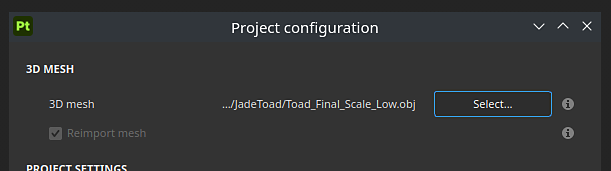

# 버전 12.0

<b>Substance 3D Painter 12.0</b>은(는) 레이어 스택에서 직접 텍스처 병합, 뒤틀기 투영을 위한 새로운 자동 모드, 개선된 후처리 효과 세트, 향상된 프로젝트 생성 및 설정 워크플로우를 제공합니다.

출시일: <b>2026년 3월</b>

>[!NOTE]
>
> 이 버전에서는 <b>통합/공유 메모리</b>를 사용하는 <b>통합 GPU</b>에 대한 지원이 향상되었습니다. 더 나은 성능과 더 적은 그래픽 문제로 이어질 비디오 메모리의 더 나은 감지를 기대할 수 있습니다.

## 주요 기능

### 새 레이어 병합

이제 레이어 스택의 마우스 오른쪽 단추 클릭 상황에 맞는 메뉴에서 새로운 <b>병합</b> 작업을 사용할 수 있습니다. 여러 레이어를 그룹화하고(<b>Ctrl/Cmd + G</b>) 병합된 복사본을 만들어(<b>Ctrl/Cmd + M</b>) 빠르게 병합할 수 있습니다. 원본 그룹은 자동으로 비활성화되며, 삭제하거나 나중에 편집할 수 있도록 <b>스마트 재질</b>로 저장할 수 있는 옵션을 유지합니다.

레이어 스택의 병합된 요소를 다른 애플리케이션에서 신속하게 반복할 수 있도록 디스크로 직접 내보낼 수도 있습니다. 그룹, 레이어 또는 마스크는 레이어 스택의 마우스 오른쪽 버튼 클릭 메뉴를 통해 개별적으로 또는 일괄적으로 내보낼 수 있습니다.

* <b>레이어 스택에서 바로 텍스처 병합</b>\
  모든 그룹은 <b>Ctrl/Cmd + M</b>을 누르거나 마우스 오른쪽 단추를 클릭하면 표시되는 컨텍스트 메뉴에서 <b>그룹 병합</b> 항목을 선택하여 병합할 수 있습니다. 이렇게 하면 선택한 내용의 병합된 사본이 생성되고 소스 그룹은 자동으로 비활성화되며 원본 레이어는 선택한 내용의 제거 또는 복원을 결정할 때까지 그대로 유지됩니다.

  
* <b>텍스처를 병합하고 디스크로 내보내기</b>\
  마우스 오른쪽 버튼 클릭 메뉴의 전용 내보내기 동작을 사용하면 레이어, 마스크 또는 그룹의 병합된 결과를 가져와 디스크에 직접 저장할 수 있습니다. 이 기능은 전체 텍스처 내보내기 파이프라인을 거치지 않고 구운 콘텐츠를 다른 애플리케이션으로 전송할 때 유용합니다.
* <b>일괄 처리 작업</b>\
  여러 레이어, 그룹 또는 마스크를 한 번에 선택하고 한 번의 작업으로 개별적으로 병합하거나 내보낼 수 있으므로 레이어 스택의 많은 부분을 한 번에 처리하는 것이 효율적입니다.

  

>[!NOTE]
>
> 레이어 병합에 대한 자세한 내용은 [전용 문서 페이지](../interface/layer-stack/flatten-layers.md)에서 확인할 수 있습니다.

### 투영에 대한 새로운 모양 비틀기 모드

이제 데칼이 복잡한 표면에 자동으로 적응하므로 수동으로 조정할 필요가 없습니다. 뒤틀기 투영이 활성화되어 있는 동안 컨텍스트 도구 모음에서 <b>형상으로 뒤틀기</b> 토글을 사용할 수 있습니다.

* <b>컨텍스트 도구 모음의 새 매개 변수</b>\
  뒤틀기 투영 모드가 활성화되어 있을 때마다 컨텍스트 도구 모음에서 새로운 <b>형상으로 뒤틀기</b> 토글을 사용할 수 있습니다. 현재 투영 설정을 재설정하지 않고도 언제든지 해제할 수 있습니다.

  
* <b>메시 표면으로 자동 래핑</b>\
  이 옵션을 활성화하면 뒤틀기 투영이 기본 메쉬의 곡률과 토폴로지를 자동으로 따릅니다. 투영을 서피스를 가로질러 드래그하면 형상을 매끄럽게 따르므로 복잡한 모양이나 곡선 모양에 데칼을 배치할 때 수동으로 미세 조정해야 하는 양을 크게 줄일 수 있습니다.

  
* <b>로컬 변형 보존</b>\
  뒤틀기 투영 격자 교점을 편집할 때, 형상에 대한 뒤틀기 모드는 항상 같은 모양이 투영되도록 미리 정의된 변형을 유지하려고 시도합니다.

  

>[!NOTE]
>
> 뒤틀기 투영에 대한 자세한 내용은 [전용 문서 페이지](../painting/fill-projections/warp-projection.md)를 참조하세요.

### 새로운 포스트 효과

이제 <b>디스플레이 설정</b> 창에서 사용할 수 있는 새로운 후처리 효과 집합을 사용하여 Painter 내의 렌더링을 개선할 수 있습니다. 이제 <b>렌즈 플레어</b> 및 <b>필름 그레인</b>과 같은 새로운 추가 기능을 사용할 수 있으며, 많은 다른 효과 중에서도 개선된 <b>필드 깊이</b> 및 <b>눈부심</b> 효과도 사용할 수 있습니다.

다음은 새 효과를 사용하여 수행할 수 있는 작업의 예입니다.

* <b>새로운 후처리 효과</b>\
  모든 후처리 효과는 <b>디스플레이 설정</b> 창에서 개별적으로 활성화하고 구성할 수 있습니다. 효과는 스택 순서대로 적용되며 각 효과를 개별적으로 켜거나 끌 수 있어 여러 효과를 쉽게 결합하고 실험할 수 있습니다.

  
* <b>새 효과 목록:</b>

  * <b>필드 깊이</b>: 초점 범위 밖의 개체를 흐리게 하여 카메라 렌즈 초점을 시뮬레이션합니다.
  * <b>흐림</b>: 이미지의 밝은 영역에서 나오는 부드러운 광선을 추가합니다.
  * <b>눈부심</b>: 광원 주위에 줄무늬를 만듭니다.
  * <b>렌즈 플레어</b>: 카메라에 밝은 빛이 비출 때 렌즈의 광학 반사를 시뮬레이션합니다.
  * <b>측면 수차</b>: 렌즈 불완전성으로 인해 발생하는 이미지 가장자리의 색록을 시뮬레이션합니다.
  * <b>비네팅</b>: 프레임의 모서리와 가장자리를 어둡게 하여 가운데로 초점을 맞춥니다.
  * <b>선명</b>: 가장자리 대비를 높여 렌더링된 이미지를 더 선명하게 보이게 합니다.
  * <b>필름 그레인</b>: 미세한 노이즈를 오버레이하여 아날로그 필름의 텍스처를 복제합니다.
  * <b>톤 매핑</b>: HDR 광도 값을 표시 가능한 범위로 다시 매핑하여 영화처럼 보이게 합니다.
  * <b>색상 교정</b>: 대비, 채도, 밝기 및 온도를 조정하여 전체 색상 균형을 미세 조정합니다.

>[!NOTE]
>
> 새 효과에 대한 자세한 내용은 [전용 설명서](../features/post-processing/post-processing.md)를 참조하세요.

### 새 프로젝트 및 설정 창 개선

새 프로젝트 창과 프로젝트 설정 대화 상자가 쉽게 탐색할 수 있도록 다시 디자인되었습니다. 가독성을 높이기 위해 매개 변수가 재정렬되고 그룹화되었으며, 프로젝트에서 반복할 때 반복하는 단계를 줄일 수 있도록 메시 재가져오기 작업 과정이 개선되었습니다.

* <b>새 프로젝트 창 개선</b>\
  가장 일반적으로 사용되는 설정을 보다 눈에 띄게 배치할 수 있도록 새 프로젝트 창의 매개 변수가 재구성되어 재정렬되었습니다. 이제 전체 레이아웃을 스캔하기가 쉬워져 새 프로젝트를 구성하는 데 필요한 시간이 줄어듭니다.
* <b>프로젝트 설정에서 메시를 다시 가져오기 위한 새 워크플로</b>\
  프로젝트 설정의 새 확인란 <b>메시 다시 가져오기</b>를 사용하면 이전에 로드한 파일의 파일 경로가 이제 저장되고 자동으로 미리 채워져서 프로젝트 메시를 더 쉽게 다시 가져올 수 있습니다.

  

## 릴리스 정보

## 버전 12

### 12.0.0

출시일: <b>2026/03/09</b>\
요약: <b>주요 릴리스입니다. 이 릴리스에는 레이어 병합, 형상 뒤틀기, 새로운 게시물 효과, 새 프로젝트 창 개선 및 기타 개선 사항이 포함되어 있습니다.</b>

<b>추가됨</b>:

* [레이어 병합] 레이어 스택 내부에서 레이어 병합
* [레이어 병합] 병합된 레이어를 디스크로 내보내기
* [형상으로 뒤틀기] 뒤틀기 투영에 새로운 자동 뒤틀기 기능 추가
* [Post-effects] Post 효과를 새 효과 추가로 바꿉니다
* [Post-effects] 톤 매퍼 업데이트
* [Post-effects] Post-effects 에셋에 대한 새로운 사용 방법 추가
* [Content][Post-effects] 라이브러리에 기본 Post-effects 에셋을 통합합니다
* [새 프로젝트] 프로젝트 생성을 위한 UI 개선
* [새 프로젝트] 메쉬 기능을 다시 가져오도록 변경
* [새 프로젝트] \*.geo.usd 파일을 열 수 있습니다.
* [프로젝트 구성] 프로젝트 구성을 위한 UI 개선
* USD 라이브러리를 버전 25.05로 업데이트
* Substance 엔진을 버전 9.3.4로 업데이트
* AMD GPU의 경우 최소 드라이버를 25.3.1/25.Q2으로 올립니다.
* Qt를 6.8.6으로 업데이트
* [스크립팅] JavaScript API를 버전 1.1.20으로 업데이트
* Python을 3.13으로 업데이트

<b>고정:</b>

* [충돌] 마스크에서 재질 채널 출력을 변경하면 충돌이 발생할 수 있습니다
* [가져오기] USD 파일을 가져올 때 EXR 텍스처가 선형 대신 sRGB로 강제 적용됩니다.
* [UV 타일] 단일 이미지가 있는 이미지 시퀀스는 다른 UV 타일도 채웁니다
* [베이킹] CPU 베이킹과 GPU 베이킹 간 AO가 다름
* [색상 관리][MacOS] 뷰포트 BaseColor가 colorpicker와 일치하지 않습니다.
* [USD] 경우에 따라 균일 값을 가져오지 않습니다.
