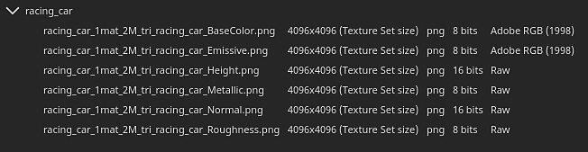
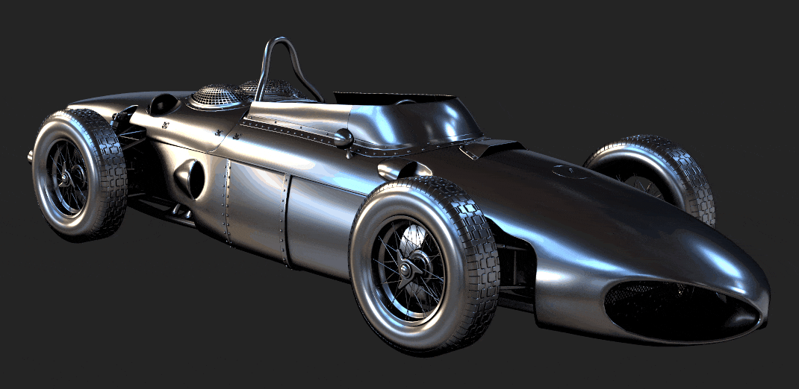

# 버전 8.1

**Substance 3D Painter 8.1**&#x200B;에서는 ACE(Adobe Color Engine)와 ICC 프로필, 새로운 베이커, 새로운 3D 노이즈, 20개의 그런지 맵 및 개선된 스포이드에 대한 지원을 통합합니다.

출시일: *2022년 6월 7일*

## 주요 기능

### Adobe Color Engine(ICC 지원)을 통한 새로운 색상 관리

이 새로운 버전에서는 ICC 프로필의 사용을 잠금 해제하는 Adobe Color Engine(ACE)의 지원으로 색상 관리 시스템이 확장되었습니다. 이 새로운 시스템을 통해 Photoshop을 포함한 다양한 응용 프로그램에서 색상을 일치시킬 수 있습니다.

* **새 프로젝트 설정**\
  새 프로젝트를 만들 때 이제 새로 추가된 **Adobe Color Engine**(ACE)으로 색상 관리 엔진을 지정할 수 있습니다.

  {width="400px"}

  ACE는 다음과 같은 작업 색상 공간과 함께 제공됩니다.

  * **선형 sRGB**
  * **ACEScg**
  * **선형 Adobe RGB**
* **ICC 프로필 지원 모니터링**\
  ICC 프로필을 사용하여 뷰포트를 조정하고 색상을 모니터와 일치시킬 수 있습니다.

  {width="400px"}

* **ICC 프로필이 포함된 이미지 가져오기 및 내보내기**\
  비트맵을 가져올 때 ICC 프로필이 자동으로 추출될 수 있습니다. 레이어 속성에서 해당 프로필을 재정의할 수도 있습니다.\
  내보낼 때 텍스처 파일에 포함될 원하는 ICC 프로필을 지정할 수 있습니다.

  {width="400px"}

* **새 json 템플릿 설정** 프로젝트에서 설정을 공유하고 다시 사용하기 위해 사전 설정 파일을 지정할 수 있습니다. 사전 설정 사양에 대한 자세한 내용은 [전용 설명서](../features/color-management/color-management-with-adobe-ace-icc.md)를 참조하십시오.

>[!NOTE]
>
> 자세한 내용은 [색상 관리](../features/color-management/color-management.md) 설명서를 참조하세요.

### Substance 자료에 대한 새로운 물리적 크기 지원

이제 Substance 재질 내부의 크기를 사용하여 채우기 레이어 투영 내부의 비율 및 타일링을 제어할 수 있습니다. 이것은 추측할 필요 없이 실제 크기에 따라 표면의 재료를 적절하게 일치시킬 수 있는 유용한 도구이다.

* **새 칠 레이어 매개 변수**\
  채우기 레이어 또는 효과에는 정의된 물리적 크기가 있는 경우 재질의 타일링/반복을 제어하는 새 매개 변수가 있습니다. 이러한 새 매개 변수는 3D 투영에서만 사용할 수 있습니다.

  {width="400px"}

* **새 뷰포트 격자**\
  물리적 크기를 더 쉽게 이해하고 시각화할 수 있도록 이제 [디스플레이 설정](../interface/display-settings/display-settings.md) 창을 통해 3D 뷰포트에서 그리드를 활성화할 수 있습니다.\
  활성화되면 격자가 확대/축소 수준에 따라 자동으로 대체됩니다. 격자 단위는 뷰포트의 왼쪽 하단에 표시됩니다.

  {width="400px"}

  {width="400px"}

>[!NOTE]
>
> 자세한 내용은 [전용 설명서](../features/physical-size.md)를 참조하십시오.

### 신입 제빵사

이 세 가지 새로운 추가 기능은 Designer과 Painter 간의 간격을 좁혀 텍스처링 및 렌더링 가능성을 확장합니다.

이 베이커 목록에 추가되었지만 기본적으로 비활성화되어 있습니다.

새로운 제빵사는 다음과 같습니다.

* **굽은 수직 베이커**&#x200B;굽은 수직 베이커는 오클루전 방향을 구울 수 있습니다(벡터로, 표준 지도와 유사). 이 텍스처는 [셰이더 설정](../interface/shader-settings/shader-settings.md) 창에서 **구부러진 표준** 설정을 활성화하여 뷰포트의 음영을 개선하는 데 사용할 수 있습니다. Bent Normals를 사용하면 실시간 뷰포트 음영의 정확도가 크게 향상됩니다.\
  **확산 음영**&#x200B;의 경우, 보다 정확한 오클루전을 제공하고 대략적인 전체 조명(아래 첫 번째 예)처럼 보일 수도 있습니다.\
  **Specular 반사**&#x200B;의 경우, 자체 그림자를 시뮬레이션하고 새는 빛의 양을 줄일 수 있으므로 개체가 특히 금속 표면에 더 많은 접지된 것처럼 느껴집니다(아래 두 번째 예).

  {width="350px"}

  {width="400px"}

* **Height 베이커**\
  Height 베이커는 낮은 폴리 메쉬와 높은 폴리 메쉬 사이의 차이를 회색 음영 텍스처로 베이킹할 수 있으며, 이는 테셀화된 메쉬 상에 변위를 생산하는 데 사용될 수 있습니다. 예를 들어, 평면에 대해 스캔 정보를 분리할 때 사용합니다.

  {width="400px"}

* **불투명도 베이커**\
  [불투명도] 제빵사는 하이 폴리 메쉬의 구멍을 보여 주는 흑백 맵을 만듭니다. 예를 들어, 그것은 팬스나 심지어 직물 표면 내부의 구멍을 베이킹하는 데 사용할 수 있습니다.

### 새 콘텐츠

이번 릴리스에는 다음을 비롯한 다양한 새로운 콘텐츠가 추가되었습니다.

* **100개 이상의 사전 설정이 포함된 새롭고 개선된 3D 노이즈**\
  기존 3D 노이즈는 재작업하고 3개가 새로 추가되었습니다. 각 사전 설정에 사전 정의된 설정이 포함되면서 7개 노이즈에 걸쳐 총 105개의 사전 설정이 제공됩니다. 이러한 사전 설정은 시작 지점으로 사용하여 매개 변수를 조정하고 특정 모양을 얻을 수 있습니다. 3D 노이즈가 항상 그렇듯이 노이즈는 매끄럽고 눈에 띄는 패턴 없이 매우 쉽게 반복할 수 있습니다.

  3D 노이즈를 찾으려면 에셋 패널의 절차 섹션으로 이동하십시오.

  {width="400px"}

  이러한 노이즈는 매우 다양한 가능성을 제공합니다. 예를 들어 **3D Voronoi Fractal**&#x200B;에서 사용할 수 있는 사전 설정은 다음과 같습니다.

  {width="300px"}

* **20개의 새 그런지 비트맵과 2개의 천 패턴**\
  새로운 그런지 세트가 기본 콘텐츠와 함께 추가되어 기존 패턴 범위가 확장되었습니다. 이러한 비트맵은 **프로시저 > 그런지 비트맵**&#x200B;에서 찾을 수 있습니다.\
  **절차 > 직물**&#x200B;에서도 두 가지 직물 패턴을 사용할 수 있습니다.

  {width="400px"}

>[!NOTE]
>
> 일부 3D 노이즈는 처음 사용하는 동안 계산하는 데 몇 초가 걸릴 수 있습니다.

### 향상된 스포이드 및 재질 피커

색상 추출 및 관리가 쉽도록 스포이드에 여러 개선 사항이 적용되었습니다.

* **새 선택 모드**\
  색상을 선택할 때 마우스를 이동하는 동안 더 이상 마우스 클릭을 누르고 유지할 필요가 없습니다. 이제 스포이드를 한 번 클릭하고 원하는 위치로 마우스를 이동한 다음 다시 클릭하여 색상을 캡처할 수 있습니다.

* **새 스포이드 단추**\
  색상 버튼 옆에는 색상 피커를 먼저 열지 않고도 색상을 캡처하는 데 사용할 수 있는 새 스포이드 아이콘이 있습니다.

  {width="400px"}

* **새 스포이드 키보드 단축키**\
  색상 피커 창이 열리면 전용 아이콘을 클릭할 필요 없이 **I**&#x200B;을 눌러 스포이드 모드로 들어갈 수도 있으므로 피킹과 페인팅을 빠르게 반복할 수 있습니다.

* **스포이드 중 새 미리 보기**\
  스포이드를 사용하여 색상을 선택할 때 마우스 옆에 새 미리보기가 표시되지 않습니다. 이 미리 보기도 색상 관리됩니다.

  

* **채널로 직접 새로운 선택**\
  새로운 스포이드 비헤이비어로 이제 메시의 채널을 직접 선택할 수 있습니다. 이렇게 하려면 SHIFT 키를 누른 상태에서 채널을 통해 직접 색상을 선택합니다. 채널은 스포이드가 시작된 위치를 기준으로 결정됩니다. 이 방법은 정확한 색상을 검색하기 위해 색상 관리에 중요한 색상 변환을 무시합니다. 색상이 캡처된 채널을 나타내는 도구 설명이 나타납니다.

  

* **색상을 캡처할 때 새 색상 공간 설정**\
  색상 관리를 사용하는 경우 색상 피커에서 새 설정을 사용하여 색상을 캡처할 때 사용되는 색상 공간을 지정할 수 있습니다. 이 설정은 Painter 세션에 대해 전역 설정이며, 속성 창의 색상 버튼 옆에 있는 스포이드 버튼에도 적용됩니다.

  

* **개선된 재질 피커 동작**\
  이제 도구 도구 모음(키보드 단축키 P)의 재질 선택기는 속성 창 내의 채널 선택을 따릅니다. 채널 자체에서 더 이상 활성화되지 않습니다.

  {width="400px"}

### 향상된 자동 언래핑

이제 자동 UV 언래핑 프로세스가 더 자연스러운 세그먼트를 제공합니다.

이제 망을 별도의 UV 섬으로 자르는 방법은 손으로 할 수 있는 것, 특히 유기 망에 더 가까이 다가갑니다.

## 릴리스 정보

### 8.1.0

*(2022년 6월 7일 릴리스)*

**추가됨:**

* [색상 관리] Adobe Color Engine(ACE)를 사용하여 ICC 프로필에 대한 지원 추가
* [색상 관리] ICC의 작업 색상 공간으로 &#39;Adobe 98 RGB&#39;에 대한 지원 추가
* [색상 관리] 구성 파일을 통해 ACE/ICC 설정 구성 허용
* [색상 관리] [레거시] 모드를 사용하여 [색상 피커]에서 선형 색상 값을 입력할 수 있습니다.
* [색상 관리] UI 외부에서 색상을 선택하는 데 사용되는 색상 프로필을 지정할 수 있습니다.
* [색상 관리] 뷰포트에서 마지막으로 선택한 디스플레이 값 기억
* [색상 관리][Substance] 색상 관리를 사용하여 생성기/필터가 제대로 작동하도록 만들기
* [색상 관리][Substance] 새 색상 공간 재정의 키워드 추가 $working 및 $standardsrgb
* [물리적 크기][엔진] 메시에서 물리적 크기 정보 추출
* [물리적 크기][엔진] 물리적 크기 계산
* [물리적 크기] UI에서 물리적 크기를 사용하는 옵션을 표시합니다.
* [물리적 크기] 뷰포트에 시각적 도우미 추가
* [베이킹] Height 베이커 추가
* [베이킹] 구부러진 수직 베이커 추가
* [베이킹] 불투명도 베이커 추가
* [스포이드] 새로운 색상 피커 미리 보기
* [스포이드] [색상 피커] 패널을 다시 열 때 마지막 위치에 다시 나타납니다
* [스포이드] [재질 피커]에 대한 새 아이콘
* [스포이드] 색상 피커의 채널 미리 보기 관리
* [스포이드] 스포이드에 클릭 선택 가능 기능을 추가합니다
* [스포이드] 재질 피커가 더 이상 비활성 채널을 활성화하지 않음
* [스포이드] 단축키와 함께 스포이드 사용 허용
* [스포이드] 스포이드가 해당되는 경우 관련 채널을 선택합니다
* [스포이드] 색상 피커 모드로 전환하면 모든 단축키가 비활성화됩니다
* [스포이드] 16진수 필드의 자동 선택 항목 제거
* [스포이드] 재질 피커를 사용할 때 패널을 닫지 않습니다.
* [스포이드] 채널을 선택할 수 없을 때 새 비활성화 상태
* [내보내기] glTF 내보내기에 접선 특성을 추가합니다.
* Substance 엔진을 v8.4로 업데이트
* 0.9.0으로 자동 줄 바꿈 해제 업데이트
* Qt 5.15.8로 업데이트
* Python 3.9로 업데이트
* [Shader] Bent Normals 음영 지원 추가
* [MacOS] 3DConnection SpaceMouse 지원
* [Python] API에 사용되는 Python 버전을 문서화합니다
* [내용] 105개의 사전 설정으로 6개의 새로운 3D 노이즈 추가
* [내용] 20개의 새로운 그런지 맵과 2개의 천 주름 패턴
* [콘텐츠] 새 베이커를 사용하도록 &#39;메시 맵&#39; 내보내기 사전 설정을 업데이트합니다
* [내용] 흐림 효과 경사 및 뒤틀기 필터는 텍스처 집합 해상도에 따라 다릅니다.
* [Content] 샘플 프로젝트를 업데이트하여 세 가지 새로운 베이커를 사용하십시오.

**고정:**

* [glTF] 특수 문자가 있는 glTF를 열 수 없습니다.
* [엔진] 비등방성 및 SVT가 비활성화된 객체
* [MacOS][M1] 스마트 재질이 올바르게 표시되지 않음
* [메시 처리] 모델러에서 메시를 가져올 수 없습니다.
* [UI] 색상 관리가 활성화된 새 프로젝트 창의 가로 스크롤 막대
* [색상 관리] 일부 OCIO 구성이 있는 색상 피커에서 작업 영역 값이 누락되었습니다.
* [색상 관리] 뷰포트의 브러시 미리 보기가 색상 관리가 되지 않음
* [SpaceMouse] 포커스가 변경되어도 피벗이 즉시 업데이트되지 않으며, 경우에 따라 모델이 업데이트되지 않습니다.
* [내보내기][USD] 내보낸 USD 파일의 구조가 잘못되었습니다.
* [USD] 내보낼 때 주변 오클루전 문제
* [콘텐츠] 미리 보기 구 샘플 프로젝트와 일치하도록 축소판의 망을 업데이트합니다

**알려진 문제:**

* 확산 패딩을 사용하여 텍스처 내보내기
* 일반/주변 오클루전 믹싱이 중단됨
* [MacOS] 드문 경우지만 Iray를 실행할 때 충돌이 발생합니다
* [미리 보기 축소판] 단순화된 축소판은 앵커를 사용할 때 업데이트되지 않습니다.
* [색상 관리] Linux에서 ACE를 사용한 HDR 색상 공간 변환으로 클램프된 색상 생성
