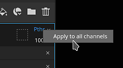
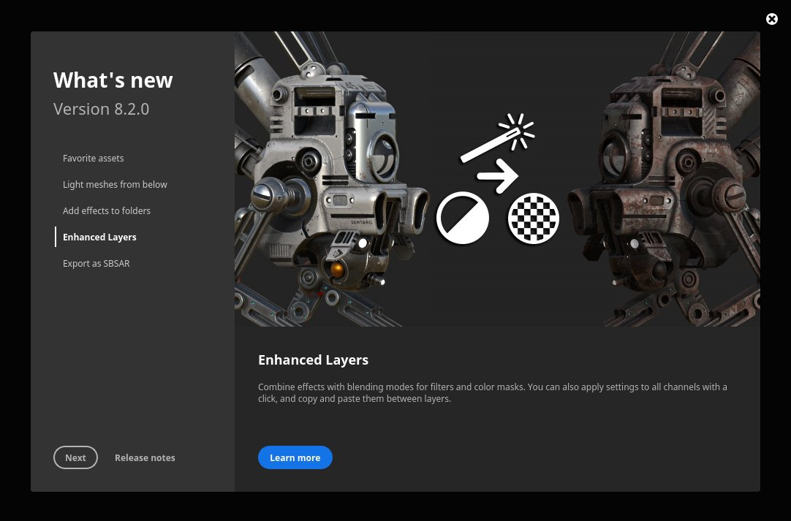
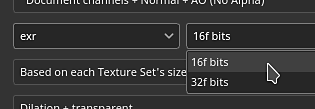
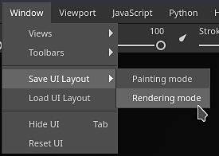

# 버전 8.2

**Substance 3D Painter 8.2**&#x200B;은 응용 프로그램의 여러 영역에서 전용 기능을 통해 삶의 질을 개선하는 데 중점을 둡니다.

출시일: *6 2022년 10월*

## 주요 기능

### 혼합 모드 및 불투명도를 적용하는 새로운 옵션

레이어 스택의 여러 채널에 혼합 모드와 불투명도를 빠르고 쉽게 복사하고 적용할 수 있도록 몇 가지 단축키와 동작이 추가되었습니다.

* **혼합 모드 또는 불투명도 컨트롤을 마우스 오른쪽 단추로 클릭**\
  혼합 모드 또는 불투명도를 마우스 오른쪽 단추로 클릭하면 **모든 채널에 적용** 작업을 선택하여 레이어의 다른 모든 채널에서 이 혼합 모드를 사용합니다. 이 작업은 혼합 모드 및 불투명도 컨트롤이 있는 효과에서도 수행할 수 있습니다.

  

* **레이어를 마우스 오른쪽 단추로 클릭하고 혼합 옵션을 선택합니다**\
  레이어(또는 효과)를 마우스 오른쪽 버튼으로 클릭하고 다음 작업 중 하나를 선택할 수도 있습니다.

  * **모든 채널에 혼합 적용**: 현재 레이어/효과의 다른 모든 채널에 현재 채널 혼합 모드를 적용합니다.
  * **모든 채널에 불투명도 적용**: 현재 레이어/효과의 다른 모든 채널에 현재 채널 불투명도를 적용합니다.
  * **모든 채널에 모두 적용**: 현재 레이어/효과의 다른 모든 채널에 현재 채널 혼합 모드와 불투명도를 적용합니다.
  * **채널 혼합 설정 복사**: 현재 레이어/효과의 모든 혼합 모드 및 불투명도 값을 클립보드에 복사합니다.
  * **채널 혼합 설정 붙여넣기**: 현재 클립보드에 있는 혼합 모드와 불투명도 값을 대상 레이어/효과에 적용합니다.

  

### 필터 및 색상 선택 효과의 새로운 혼합 모드 및 불투명도

이제 필터 및 색상 선택 효과를 통해 혼합 모드와 불투명도 컨트롤을 사용할 수 있습니다.

* **필터의 혼합 모드 및 불투명도**\
  이제 필터에서 혼합 모드와 불투명도 값을 사용할 수 있습니다. 이 매개 변수는 기본적으로 **바꾸기**&#x200B;로 설정되어 이전과 동일한 동작을 유지하고 알파 구성 요소 정보를 두 배로 늘리지 않습니다. 필터의 혼합 모드를 사용하면 효과를 계산하고 결과를 레이어에 직접 결합할 수 있으므로 같은 결과를 얻기 위해 고정점과 칠 효과를 사용할 필요가 없습니다. 이것은 또한 필터 자체 내에 혼합 모드들을 수동으로 구현할 필요성을 회피한다.

  

* **색상 선택 시 혼합 모드 및 불투명도**\
  혼합 모드와 불투명도 컨트롤을 지원하도록 색상 선택 효과가 수정되었습니다. 이전에는 이 효과가 알파 결과를 출력하던 중에 혼합 모드가 예상대로 작동하도록 하려면 출력 중인 배경색을 지정하는 새 설정이 추가되었습니다. 투명 대신 검정으로 설정됩니다(레거시 비헤이비어).

  

  

* **간소화된 효과 스택**\
  이전에는 혼합 모드와 같이 특정 방식으로 효과를 결합해야 하는 경우 기준점과 칠 효과를 사용해야 했습니다. 이제 혼합 모드가 필터에 직접 있는 경우 효과 스택 복잡성을 크게 줄일 수 있는 것은 더 이상 필수가 아닙니다.

  {width="400px"}

### 폴더에 적용된 새 효과

이제 폴더 콘텐츠(레이어의 색상 부분)에 모든 종류의 효과를 적용할 수 있습니다. 동일한 결과를 얻기 위해 복잡한 레이어 구성(예: 통과 레이어 또는 기준점)을 만들어야 하기 전에

### 새 Substance 보관(SBSAR) 내보내기

이제 텍스처를 내보낼 때 SBSAR(Substance 보관) 파일 형식을 사용할 수 있습니다. SBSAR은 Substance 통합으로 많은 응용 프로그램에서 열 수 있는 컨테이너로, 더 빠르고 쉽게 사용자 정의 텍스처를 &#39;플러그 앤 플레이&#39;할 수 있습니다.

* **Substance 보관(SBSAR) 내보내기**\
  이제 **내보내기 텍스처** 창의 파일 형식 목록에서 SBSAR 파일 형식을 지정할 수 있습니다. 지정된 텍스처가 모두 포함된 단일 SBSAR 파일을 내보냅니다. 출력 노드와 해당 사용법의 이름은 선택한 내보내기 사전 설정과 채널 유형에서 정의됩니다.

  

* **PSD 및 SBSAR 파일 형식의 하이브리드 내보내기 사전 설정**\
  이제 내보내기 사전 설정에서 다른 모든 이미지 형식뿐만 아니라 출력 맵을 PSD 또는 SBSAR로 지정할 수 있습니다. PSD 및 SBSAR 형식은 &quot;텍스처&quot;로 간주되며 이는 여러 컨테이너를 내부에 저장할 수 있음을 의미합니다. 내보내기 사전 설정이 컨테이너 포맷과 독립형 이미지 포맷을 모두 지정하면 SBSAR 파일을 대상으로 하는 템플릿의 모든 출력이 함께 그룹화되고 다른 출력은 개별 파일로 내보내집니다.

  

### 3D 모델 아래에서 조명을 켜는 새로운 환경 옵션

[디스플레이 설정](../interface/display-settings/environment-settings.md)의 새로운 설정을 통해 환경 맵을 카메라에 정렬하여 3D 모델 아래에서 조명 각도와 조명 부분을 조정할 수 있습니다.

이 새 설정을 사용하려면 [표시 설정](../interface/display-settings/environment-settings.md)(으)로 이동하여 **환경 정렬** 설정을 변경하십시오.

* **세계**: 환경 맵이 장면에 정렬됩니다.
* **로컬**: 환경 맵이 카메라에 맞춰져 있습니다.

그림자는 이 설정의 구성에 따라 자동으로 조정됩니다.

### 에셋 창에서 새 즐겨찾기 및 삭제/다시 로드

리소스를 보다 편리하게 관리할 수 있도록 [에셋](../interface/assets/assets.md) 창에 새로운 작업이 추가되었습니다.

* **리소스를 즐겨찾기에 추가하여 빠르게 찾기**\
  에셋 창에서 리소스를 마우스 오른쪽 버튼으로 클릭하여 즐겨찾기에 추가하거나 해제합니다. 자주 사용하는 리소스는 항상 검색 쿼리에서 맨 앞에 표시되며 모서리에 작은 별 태그가 있어 가장 눈에 띄고 액세스할 수 있습니다. 전용 검색 쿼리가 추가되어 즐겨 찾는 모든 리소스를 쉽게 볼 수 있습니다.

  {width="350px"}

* **디스크에서 리소스 삭제 및 다시 로드**\
  이제 사용자 라이브러리에 있는 리소스를 삭제하거나 다시 로드하거나 이름을 변경할 수 있습니다(Substance 그래프 또는 ABR 브러시와 같은 패키지의 일부 리소스 제외).

### 기타 기능 및 개선 사항

이 새 버전에는 몇 가지 개선 사항과 기능이 추가되었습니다.

* **새 시작 및 새로운 기능 창**\
  응용 프로그램에 추가된 새로운 기능에 대한 최신 정보를 얻기 위해 이제 응용 프로그램을 실행할 때 새로운 시작 및 새로운 기능 창을 소개합니다. 이 창은 쉽게 닫힐 수 있으며 다음 실행 시 다시 나타나지 않습니다. 언제든지 **도움말** 메뉴를 통해 다시 열 수 있습니다.

  {width="400px"}

  {width="400px"}

* **3D 모델을 빠르게 다시 가져오기 위한 새로운 작업**\
  새 키보드 단축키(**CTRL+SHIFT+R** 기본적으로 )가 추가되어 현재 프로젝트의 3D 모델을 빠르게 다시 가져올 수 있습니다. 이를 통해 에셋에서의 반복이 보다 쉽고 빨라집니다. 소스 파일을 찾을 수 없는 경우 로그에 오류 메시지가 표시됩니다. **편집** 메뉴에도 작업이 추가되었습니다.

  

* **HDPI 지원 개선**\
  HDPI 스크린 및 시스템 배율 조정과 관련하여 몇 가지 수정이 이루어졌습니다. 이제 중간 크기 조절 값을 지원합니다(예: 125%)는 특정 화면에서 인터페이스가 너무 크거나 작지 않도록 해야 합니다. 배율 값이 다른 HDPI 스크린 간 창 이동도 올바르게 작동합니다.

* **Substance 그래프 매개 변수를 기본값으로 다시 설정**\
  Substance 그래프가 사용되는 모든 위치(알파, 재질, 필터 등) 이제 매개 변수를 기본값으로 다시 설정할 수 있습니다.

  * **모든 매개 변수 다시 설정**: 매개 변수 목록 아래의 기본값 복원 단추를 사용하여 전체 Substance 리소스를 다시 설정합니다.
  * **마우스 오른쪽 단추 클릭**: 특정 매개 변수를 마우스 오른쪽 단추로 클릭하여 이 매개 변수와 관련된 재설정 동작을 사용하여 메뉴를 엽니다.

   

* **뷰포트에서 개별 RGBA 구성 요소 보기**\
  뷰포트의 채널을 볼 때 RGBA 구성 요소를 개별적으로 볼 수 있는 **표시 설정 > 채널 표시** 아래에 **색상 채널**&#x200B;이라는 새 설정이 있습니다. 이 기능은 텍스처를 분석하거나 사용자 채널 내의 특정 구성 요소를 분리하는 데 유용할 수 있습니다.

  

  {width="450px"}

* **128을 초과하여 칠 레이어 및 효과 타일링**\
  칠 레이어 및 효과의 타일링 매개 변수가 부드러운 범위를 갖도록 수정되었습니다. 이렇게 하면 이제 원하는 타일링 값을 입력할 수 있습니다. 슬라이더의 기본 범위도 [-128,128]에서 [-32,32]로 축소되어 더 쉽게 드래그할 수 있습니다.

  

* **새로운 16f 및 32f EXR 텍스처 내보내기 설정**\
  이전에는 인터페이스에서 EXR 텍스처 내보내기가 32f 비트로 제한되었지만 실제 파일 내에서는 16f 비트 데이터(반부동)가 생성됩니다. 그것은 이제 수정되었으며, 16f와 32f 비트 중에서 선택할 수 있는 명시적 가능성이 있다. EXR을 파일 형식으로 사용하는 이전 프로젝트 및 내보내기 사전 설정은 기본적으로 16f 비트로 설정되어 이전 비헤이비어를 유지합니다. 대부분 이전보다 더 큰 파일을 만들지 않도록 합니다.

  

* **UI 레이아웃 내보내기 및 다시 로드**\
  UI 레이아웃을 저장하고 다시 로드하는 새 작업은 **Windows** 메뉴 내에서 찾을 수 있습니다. 이렇게 하면 다른 레이아웃 간에 전환하거나 컴퓨터 간에 UI를 저장하고 다시 사용하는 것이 편리합니다. 두 가지 현재 Painter 모드(렌더링 및 페인팅)에는 자체 레이아웃이 있습니다. UI 레이아웃을 저장하고 다시 가져올 수 있도록 Python에서는 몇 가지 기능도 사용할 수 있습니다(아래 참조).

  

* **다시 구성된 파일 메뉴**\
  다양한 고급 저장 기능을 그룹화하여 파일 메뉴를 깔끔하게 정리했습니다. 이러한 행동 중 일부는 행동을 명확히 하기 위해 이름이 변경되었습니다.

  

* **너무 최근의 프로젝트를 열 때 표시되는 오류 메시지를 개선했습니다.**\
  이제 애플리케이션의 최신 버전으로 제작된 프로젝트를 열 때 더 유용한 메시지가 표시됩니다. 이제 메시지에는 필요한 버전에 대한 정보를 더 잘 알 수 있도록 하는 프로젝트 및 애플리케이션 버전이 모두 포함됩니다.

  {width="400px"}

### 개선된 Python 스크립팅

Python API에는 몇 가지 새로운 기능이 추가되었습니다. 자세한 내용은 응용 프로그램의 도움말 메뉴에 있는 설명서를 참조하십시오.

* **substance\_painter.resource**\
  **substance\_painter.resource.Type**&#x200B;을(를) 사용하면 특히 Substance 및 Photoshop 브러시 패키지와 같은 더 많은 종류의 리소스를 식별할 수 있습니다.\
  이제 리소스 객체가 상위 및 하위 항목을 나열하여 Substance 패키지와 Substance 그래프 간을 탐색할 수 있습니다. 예를 들면 다음과 같습니다.

* **substance\_painter.textureset**\
  텍스처 집합 설정에서 메시 맵을 가져오고 설정하기 위해 두 개의 새로운 함수(및 열거형)가 추가되었습니다. **get\_mesh\_map\_resource()** 및 **set\_mesh\_map\_resource()**.

* **substance\_painter.ui**\
  UI 레이아웃을 저장하고 다시 로드하기 위해 몇 가지 기능이 추가되었습니다. 레이아웃은 현재 애플리케이션 모드(페인팅 또는 렌더링)에도 따라 다릅니다.

* **substance\_painter.event**\
  새 **TextureStateEvent**&#x200B;이(가) 추가되어 텍스처 집합의 레이어 스택에서 수정 사항과 기타 매개 변수 변경 사항을 추적할 수 있습니다. 이 이벤트는 페인트 선 또는 채널의 추가/제거에 대해 트리거됩니다.

## 릴리스 정보

### 8.2.0

*(릴리스: 2022년 10월 6일)*\
요약: **새로운 온보딩 패널이 포함된 주요 릴리스(새로운 시작 패널 및 새로운 기능 패널), SBSAR로 내보내기, 폴더에 대한 효과, 삶의 질을 위한 몇 가지 개선 사항 및 버그 수정.**

**추가됨:**

* [온보딩] 온보딩 패널에서 새 사용자를 시작합니다.

  새 CC 사용자가 Painter을 처음 열 때 새 시작 화면이 추가되었습니다.
* [온보딩] 새로운 기능을 개선하는 새로운 기능 패널

  새로운 기능 화면이 추가되어 새로운 주요 기능이 표시됩니다. 주요 업데이트 후 Painter이 처음 열릴 때 자동으로 표시되며, [도움말] > [새로운 기능]을 통해 다시 액세스할 수 있습니다.
* [Onboarding] 이전 시작 파일의 이름을 &quot;홈 화면&quot;으로 바꾸기

  새 시작 화면과의 혼동을 방지하기 위해 이전 시작 화면이 홈 화면으로 이름이 변경되었습니다.
* [UI] 높은 DPI 화면에 대한 크기 조정 문제 해결

  사용자 정의 디스플레이 비율을 사용하여 HD 화면에서의 Painter UI 적용 성능을 개선했습니다.
* [UI] UI에서 영구적인 오류 메시지를 표시하지 않습니다.

  이제 이전 프로젝트의 오류 메시지가 아래쪽 상태 표시줄에서 제거됩니다.
* [UI] 저장 메뉴 다시 작업

  이제 추가 저장 옵션이 하위 메뉴에 그룹화되고 일부 옵션은 일관성을 위해 이름이 바뀝니다.
* [UI] UI 레이아웃 저장 및 내보내기/공유

  [창] 메뉴에는 UI 레이아웃을 파일에 저장하고 다시 로드하는 새로운 작업이 있습니다. 페인팅 및 렌더링 레이아웃은 별도로 저장됩니다.\
  UI 레이아웃을 저장, 재설정 및 로드하는 다양한 기능이 &quot;substance\_painter.ui&quot;에 추가되었습니다.
* 레이어의 혼합 모드/불투명도에 대한 복사/붙여넣기 작업 추가

  레이어의 오른쪽 클릭 메뉴에 새로운 항목인 &#39;혼합 옵션&#39;이 추가되었습니다. 이 기능을 사용하면 한 레이어에서 다른 레이어로 모든 채널의 혼합 모드와 불투명도를 복사하여 붙여넣을 수 있습니다.
* 레이어의 모든 채널에 혼합 모드/불투명도 적용

  레이어의 혼합 모드와 불투명도에 마우스 오른쪽 버튼 클릭 기능을 추가하여 현재 클릭한 설정을 모든 채널에 적용할 수 있습니다.
* 키보드 단축키로 메시 다시 로드(CTRL+SHIFT+R)

  마지막으로 사용 가능한 설정으로 메시 파일을 다시 로드하는 편집 가능한 단축키가 추가되었습니다. 편집 > 메시 다시 가져오기 를 통해 액세스할 수도 있습니다.
* Substance 매개 변수를 기본값으로 재설정

  리소스가 기본값으로 재설정될 수 있도록 .sbsar 리소스 아래쪽의 속성에 새 단추를 추가했습니다.
* 페인트 브러시를 기본값으로 재설정

  속성의 브러시 섹션에 기본 기본 브러시로 재설정할 수 있는 새 메뉴가 추가되었습니다.
* 마우스 오른쪽 버튼을 클릭하여 개별 Substance 매개 변수를 기본값으로 재설정

  마우스 오른쪽 버튼을 클릭하여 .sbsar 리소스 내의 개별 매개 변수를 재설정할 수 있는 가능성을 추가했습니다.
* [에셋 패널] 즐겨 찾는 에셋이 에셋 패널 상단에 표시되도록 &quot;고정&quot;

  패널 상단에 즐겨찾기로 고정할 수 있는 라이브러리 에셋에 대한 새로운 마우스 오른쪽 클릭 옵션을 추가했습니다. 저장된 검색을 통해 즐겨 찾는 모든 에셋을 조회할 수도 있습니다.
* [에셋 패널] 에셋 삭제, 다시 로드 및 이름 바꾸기

  사용자 라이브러리의 에셋을 삭제하고, 다시 로드하고, 이름을 바꿀 수 있는 마우스 오른쪽 버튼 클릭 메뉴 옵션이 추가되었습니다. 디스크의 라이브러리 위치에서 직접 삭제되고 원래 위치에서 다시 로드됩니다. .abr 또는 .sbsar와 같은 패키지의 일부인 에셋은 개별적으로 편집할 수 없습니다.
* [색상 선택] 색상 선택 효과에 혼합 모드 추가
* [레이어 스택] 혼합 모드 및 필터 불투명도 추가
* [레이어 스택] 칠 레이어/효과에 128보다 큰 타일링 값 허용
* [레이어 스택] 칠 레이어/효과의 원통형 투영에 대한 원통형 대문자

  이제 채우기 레이어 속성의 원통형 투영에 원통형 대문자 제거 옵션이 제공됩니다.
* [로그] UV 타일 프로젝트를 만들 때 메시 부분이 네거티브 스페이스에 있는 경우 오류 메시지를 표시합니다

  UV 부분이 네거티브 스페이스에서 발견되므로 UV 타일 프로젝트를 만들지 못할 때 더 명확한 오류 메시지가 추가되었습니다.
* [Project] 프로젝트를 열 때 &quot;데이터가 너무 최근&quot;이라는 오류 메시지에 버전을 표시합니다.

  응용 프로그램에 비해 너무 최근의 프로젝트를 열면 오류 메시지에 프로젝트의 버전이 표시되어 올바른 응용 프로그램 버전을 쉽게 식별할 수 있습니다.
* [뷰포트] 아래에서 메쉬를 비출 수 있습니다.

  &quot;로컬&quot;로 설정된 경우 환경 맵 조명을 카메라에 정렬하기 위해 [디스플레이 설정] > [카메라] > [환경 설정]에 새로운 환경 정렬 매개 변수를 추가했습니다.
* [Viewport] 뷰 R, G, B 및 뷰포트 (단독 Alpha 모드)

  디스플레이 설정 > 뷰포트 설정 > 채널 디스플레이에는 단일 디스플레이 모드에서 채널의 R, G, B 또는 Alpha 구성 요소만 표시할 수 있는 새로운 색상 채널 설정이 있습니다.
* [셰이더] 재질 레이어링 셰이더에서 사용자 채널을 RGBA로 설정할 수 있습니다.

  재질 레이어를 위해 셰이더 내에서 텍스처 세트 채널 구성을 설정할 때 이제 기본값을 벗어날 채널의 형식을 지정할 수 있습니다. 이를 통해 특히 회색 음영만 요청하지 않고 색상 사용자 채널을 요청할 수 있습니다.
* [내보내기] 텍스처를 SBSAR로 내보낼 수 있습니다

  파일 > 텍스처 내보내기 창을 통해 텍스처를 내보낼 때 SBSAR(Substance 아카이브) 파일 형식을 선택하여 그룹화할 수 있습니다. SBSAR의 콘텐츠는 사용된 출력 템플릿에 의해 구동됩니다.\
  내보내기 사전 설정에서도 SBSAR 파일 형식을 설정할 수 있습니다. 하이브리드 구성(SBSAR + 기타 형식) 텍스처를 사용하는 경우 SBSAR을 대상으로 하는 그룹이 함께 그룹화되고 나머지는 함께 내보냅니다.
* [내보내기] EXR 파일 형식에 대한 16비트 노출 옵션

  이제 EXR 텍스처 파일을 내보낼 때 텍스처 내보내기 창(내보내기 설정 및 내보내기 사전 설정 모두)에서 16f비트(절반 부동) 또는 32f비트(부동)를 선택할 수 있습니다. 이전 프로젝트 및 이전 내보내기 사전 설정은 기본적으로 16f 비트로 설정되어 이전 비헤이비어를 반영합니다.
* [Python] 텍스처 세트가 수정되는 경우 알아야 할 이벤트를 추가합니다.

  새 &quot;substance\_painter.event.TextureStateEvent&quot;를 사용하면 페인트 획으로 인해 텍스처 세트가 수정된 시기, 새 채널이 추가되었거나 채널이 제거된 시기를 알 수 있습니다.
* [Python] 텍스처 세트 설정에서 메시 맵 리소스를 가져오고 설정할 수 있습니다.

  메시 맵 리소스를 가져오고 설정하는 새 기능이 &quot;substance\_painter.project&quot; 모듈에 추가되었습니다. 이러한 기능을 사용하여 텍스처 세트 설정에서 참조하는 메시 맵을 업데이트할 수 있습니다.
* [플러그인] 다른 JS 플러그인을 가져오는 옵션 제거

  Javascript 플러그인은 가격이 떨어진 공유 웹 사이트에서 호스팅되므로 이를 가져오는 옵션이 제거되었습니다.
* [콘텐츠] 새 Roblox 템플릿 추가 및 사전 설정 내보내기

  PBR 텍스처를 Roblox로 더 쉽게 내보낼 수 있도록 새로운 Roblox &quot;재질 변형&quot; 및 &quot;표면 모양&quot; 프로젝트 템플릿과 내보내기 사전 설정이 추가되었습니다. 템플릿은 파일 > 새 프로젝트 창에서 액세스할 수 있습니다.
* Substance 엔진을 마지막 버전(8.6.3)으로 업데이트
* [Steam] Apple Silicon 칩셋(Apple M1/M2)에 최적화된 빌드

**고정:**

* 16k exr을 사용할 때 충돌
* [충돌] 셰이더 인스턴스를 삭제한 후 Ctrl Z
* [Iray] 일부 음영에 대해 IoR이 1로 차단됨
* [Win][베이킹] 일부 높은 폴리를 로드하지 못함
* [색상 관리] 필터가 있는 UI에서 색상 공간 이름이 잘못되었습니다.
* [Python] 가져오기 함수에 의해 반환된 리소스 개체의 형식이 없습니다.

  Python에서 Substance 패키지를 가져올 때 함수가 해당 그래프 대신 패키지를 반환했습니다. 이제 리소스 모듈은 Substance 패키지의 그래프를 검색하는 함수 및 매개 변수를 제공합니다.

**알려진 문제:**

* [색상 관리] Linux에서 ACE를 사용한 HDR 색상 공간 변환으로 클램프된 색상 생성
* [레이어 스택] 입력 소스가 레이어별로 저장되지 않음
* [페인팅] 시간 앤티 앨리어스를 사용하여 페인트할 때 아티팩트가 발생하는 경우가 있습니다
* [내보내기] 2DView는 임의 균일 맵을 내보냅니다
