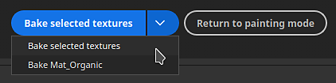
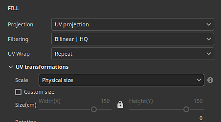

# 버전 8.3

**Substance 3D Painter 8.3**&#x200B;은(는) 새로운 베이킹 모드, USD 파일 가져오기 및 UV 투영 모드의 물리적 크기 지원을 도입합니다.

출시일: *2023년 1월 10일*

## 주요 기능

### 새로운 베이킹 모드

기존 베이킹 윈도우는 케이지의 표시 및 일치 오류와 같은 뷰포트 시각화 등 몇 가지 새로운 기능을 갖춘 전용 모드로 대체되었습니다.

* **모드 액세스 및 모드 간 전환**\
  [베이킹]은 이제 기존의 응용 프로그램 페인팅 및 렌더링 모드에 더해 새롭고 별도의 모드입니다. 베이킹 모드로 전환하려면 컨텍스트 도구 모음에서 작은 크루아상 아이콘을 사용하면 됩니다. 모드 간 전환은 모드 메뉴 또는 키보드 단축키를 사용하여 수행할 수도 있습니다. 다른 모드로 돌아가려면 모드의 전용 아이콘을 사용하면 됩니다(또한 [텍스처 설정](../interface/texture-set/texture-set-settings.md) 내의 **메시 맵 굽기** 버튼을 사용하여 새 모드로 전환할 수 있음).

  

  

* **새 모드 인터페이스**\
  전통적인 베이킹 창에는 전용 도크가 있는 모드로 변환이 있습니다.

  * **텍스처 집합 목록**&#x200B;을 사용하여 프로젝트의 굽힐 부분을 정의할 수 있습니다.
  * **메시 맵 베이커**&#x200B;를 사용하면 일반 베이킹 설정과 베이커 설정 중에서 선택할 수 있습니다. 어떤 베이커 과정이 개시될지 지정할 수 있는 곳이기도 하다.
  * **메시 맵 설정**&#x200B;은 모든 베이커 및 공통 설정이 있는 곳이며 이전 두 창에서 선택한 내용에 따라 수정할 수 있습니다.
  * **굽기 로그**&#x200B;는 굽기 프로세스에 대한 다른 정보, 특히 오류 메시지를 다시 그룹화합니다.
  * **굽기 시각화**: 이 패널은 뷰포트에 표시되며 낮음 및 높음 폴리 메시 표시와 관련된 몇 가지 옵션을 제어합니다.

  {width="500px"}

* **뷰포트에서 바로 베이킹 프로세스 시작 및 취소**\
  이제 제빵 프로세스를 시작하거나 취소하는 버튼이 뷰포트 하단에 있습니다. 또한 작은 화살표를 사용하여 베이킹 모드를 지정할 수 있습니다. 이 모드는 [텍스처 세트] 목록 선택을 기준으로 하거나 현재 활성화된 [텍스처 세트]를 사용하여 지정할 수 있습니다.

  

  

* **뷰포트에 높은 폴리 메시 표시**\
  베이킹 설정에서 높은 폴리 메시를 지정하면 이제 전용 시각화 설정이 비활성화되지 않은 경우 이 메시가 뷰포트에도 로드됩니다. 이를 통해 낮은 폴리 메쉬 기하학과 높은 폴리 메쉬 기하학이 잘 일치하는지 확인할 수 있다.

  {width="400px"}

* **누락된 영역이 있는 뷰포트에 케이지 메시를 표시하는 오류**\
  케이지 메시는 뷰포트에 표시될 수도 있습니다. 전용 메시 파일을 사용하지 않는 경우 암시적 케이지가 대신 표시되며 [최대 정면 거리] 매개 변수에 반응합니다. 케이지 크기를 조정하면 케이지 밖에 있는 높은 폴리 메쉬의 일부가 기본적으로 빨간색으로 표시되어 베이킹 과정에서 놓치는 메쉬의 일부를 쉽게 찾을 수 있습니다.

  

* **로드 및 굽는 동안 메시 둘러보기**\
  메시 로드와 베이킹이 더 이상 응용 프로그램을 정지하지 않으므로 이러한 작업 중에 뷰포트와 상호 작용할 수 있습니다. 이는 진행 중인 베이크를 조사하고, 문제를 조기에 식별하고, 베이크를 취소하는 데 유용할 수 있으며, 이는 결국 시간을 절약하는 데 도움이 됩니다. 마찬가지로 이제 뷰포트에서 가장 잘 보이는 텍스처 세트를 먼저 구울 수 있습니다. 이를 통해 특정 영역에서 결과를 미리 확인할 수 있습니다.

  

* **중간 재질 및 뷰포트 설정**\
  베이킹 결과에 초점을 맞추고 문제가 발생하는 경우 이를 찾기 위해 [베이킹] 모드에서는 중간 재질을 사용하는 대신 페인팅된 텍스처가 표시되지 않습니다. 이 중립 재질의 설정은 뷰포트 내부의 Baking Visualization 패널에서 조정할 수 있습니다.

  

* **UV 솔기가 없는 하드 가장자리 표시**\
  구울 때 아티팩트의 한 가지 소스는 UV 솔기가 없는 하드 에지의 존재입니다. 이로 인해 선이 표시되고 음영 Smoothness이 끊어질 수 있습니다. 이를 위해 시각화 설정이 추가되어 3D와 2D 보기 모두에서 누락된 부분이 많으므로 강조할 수 있습니다.

  {width="450px"}

  {width="300px"}

* **매개 변수 동기화 및 동기화 해제**\
  새 동기화 작업을 통해 텍스처 세트 간에 동기화되는 베이킹 설정 부분을 지정할 수 있습니다. 그렇지 않으면 동일한 방식으로 설정을 여러 번 구성하는 것이 번거로울 수 있습니다. 경우에 따라 텍스처 세트를 전용 설정으로 설정하고 동기화되지 않게 유지하는 것이 좋습니다. 예를 들어 이제 [일반] 설정을 구분하여 유지하면 [최대 정면 거리], [해상도] 및/또는 [텍스처 세트]마다 다른 높은 폴리 메시 목록을 사용할 수 있습니다.

  {width="400px"}

  {width="400px"}

* **이름 확인자별 일치**\
  **굽기 로그**&#x200B;의 **이름별 일치** 탭을 사용하면 굽기 전에 일치 프로세스에서 오류를 찾을 수 있으므로 일치하지 않는 메시를 더 쉽게 확인할 수 있습니다. 일치하는 메시가 그룹화되는 동안 다른 메시는 격리되어 빨간색으로 표시됩니다.

  {width="450px"}

>[!NOTE]
>
> 이 새 모드에는 더 많은 새 설정이 있습니다. 자세한 내용은 [전용 문서 페이지](../baking/baking.md)를 참조하세요.

### USD 파일의 새로운 가져오기 및 내보내기

이 새 버전에서는 [Universal Scene Description(USD)](https://graphics.pixar.com/usd/release/intro.html) 파일 형식을 지원합니다. 이제 USD 형식을 사용하여 메시 및 텍스처를 내보내는 Painter 프로젝트를 시작할 수 있으므로 응용 프로그램 간에 워크플로우가 더 일관되게 유지됩니다.

* **변형, 스킨 및 특정 프레임에서 USD 파일 가져오기**\
  USD 파일 형식은 프로젝트를 만들거나 프로젝트 내의 메시를 다시 가져올 때 사용할 수 있습니다. USD 파일은 복잡한 장면이 될 수도 있으므로 범위 및 변형 선택기를 사용하여 파일의 하위 집합만 가져올 수도 있습니다.

  {width="400px"}

  {width="400px"}

* **USD을 새 파일로 내보내거나 프로젝트에 사용된 원본 USD에 연결하세요.**\
  텍스처가 준비되면 **파일 > 텍스처 내보내기** 창을 사용하여 USD 파일을 텍스처 파일과 함께 내보낼 수 있습니다. **USD 에셋 내보내기** 설정을 활성화하기만 하면 됩니다. 이렇게 하면 나중에 파이프라인에 쉽게 통합할 수 있는 여러 USD 파일이 생성됩니다. UV를 사용하지 않고 USD 파일이 아니거나 USD 파일을 사용한 경우 텍스처 맵 및 USD 재질 파일 외에 새 USD 형상 파일도 내보내집니다.\
  또한 **파일 > 메시 내보내기**&#x200B;를 사용하여 프로젝트 형상을 USD 파일로 내보낼 수도 있습니다.

  

  {width="400px"}

### UV 모드에서 물리적 크기 지원 개선

임베디드 물리적 크기가 있는 Substance 재료의 지원은 UV 기반 프로젝션까지 확장되었다.

* **UV 모드의 물리적 크기**\
  이제 UV 투영 모드를 사용하여 채우기 레이어 및 채우기 효과의 타일링 대신 비율 조정 모드를 물리적 크기로 설정할 수 있습니다. UV 크기는 UV 풀기에서 삼각형의 평균 크기에 따라 자동으로 계산됩니다.

  {width="400px"}

* **물리적 크기로 자동 전환**&#x200B;재질을 만들 때(예: 자산 창의 리소스를 끌어서 놓을 때) 자동으로 크기 조절 설정을 물리적 크기로 설정하는 새 프로젝트 설정이 추가되었습니다. 이렇게 하면 새 칠 레이어가 만들어질 때마다 설정을 수동으로 전환할 필요 없이 프로젝트 전체에서 일관된 크기 조정을 사용할 수 있습니다. 기존 프로젝트에서 활성화하려면 **편집 > 프로젝트 구성**&#x200B;으로 이동하여 **재료를 할당할 때 채우기 레이어 비율을 물리적 크기로 전환**&#x200B;을 활성화하십시오. 이 설정은 새 프로젝트를 만들 때도 활성화할 수 있습니다.

  

## 플랫폼 지원 정보

이 릴리스에서는 Steam에서 지원되는 최소 Painter 버전을 Ubuntu 20.04로 올렸습니다.

## 튜토리얼

새로운 베이킹 모드를 발견하고 이에 대해 알아보려면 최신 튜토리얼을 확인하십시오.

## 릴리스 정보

*(릴리스: 2023년 1월 10일)*\
요약: **새로운 베이킹 모드, USD 파일의 새로운 가져오기 및 내보내기, UV 투영에 대한 물리적 크기 지원이 포함된 주요 릴리스**

**추가됨:**

* [베이킹 모드] 베이킹 프로세스 전용의 새로운 베이킹 모드
* [베이킹 모드] [단축키]를 베이킹 모드로 전환하여 F8로 설정
* [베이킹 모드] 뷰포트에 베이킹 시작 및 취소 버튼을 추가합니다.
* [베이킹 모드] 텍스처 세트 목록에 베이킹 선택 항목 추가
* [베이킹 모드] 새 메시 맵 베이커 창을 추가하여 베이커 선택
* [베이킹 모드] 새 메시 맵 설정 창을 추가하여 베이킹 설정 편집
* [베이킹 모드] 베이킹 프로세스를 따르려면 새 베이킹 로그 창을 추가합니다
* [베이킹 모드] 작업 내역 창에 베이킹 매개 변수 추가 및 실행 취소 작업
* [베이킹 모드] 메시 맵 설정에 탐색 경로 추가
* [베이킹 모드] 메시 맵 베이커 창에 메시 맵 축소판을 추가합니다
* [베이킹 모드] 3D 뷰포트에서 시각화 설정 축소 가능 메뉴 추가
* [베이킹 모드] 시각화 설정을 추가하여 하이 폴리 메쉬를 표시하거나 숨깁니다.
* [베이킹 모드] 케이지 메시 및 와이어프레임을 표시하거나 숨기도록 시각화 설정을 추가합니다.
* [베이킹 모드] 시각화 설정을 추가하여 낮은 폴리 메시를 표시하거나 숨깁니다.
* [베이킹 모드] 시각화 설정을 추가하여 UV 솔기가 없는 선명한 가장자리를 오류로 표시합니다.
* [베이킹 모드] 뷰포트에 베이킹 로그가 표시되지 않는 경우 메시 및 베이킹 오류에 대해 알립니다.
* [베이킹 모드] 모든 텍스처 세트에서 베이커 설정을 동기화하는 작업을 추가합니다.

  메시 맵 베이커 창에서 각 베이커 및 공통 설정은 해당 이름 옆에 있는 링크 아이콘을 클릭하여 텍스처 세트 간에 동기화할 수 있습니다. 이 작업을 수행하면 동일한 매개변수를 공유할 텍스처 세트를 선택할 수 있는 창이 열립니다.
* [베이킹 모드] 동작을 추가하여 베이커 설정을 복사하고 붙여넣습니다.

  메시 맵 베이커 창에서 창 상단의 전용 메뉴 또는 마우스 오른쪽 버튼으로 클릭하면 열리는 컨텍스트 메뉴를 통해 각 베이커 설정을 복사하여 텍스처 세트 간에 이동할 수 있는 작업을 사용할 수 있습니다.
* [베이킹 모드] 베이킹 로그의 버튼을 추가하여 오류에서 오른쪽 설정으로 이동합니다.

  베이커가 실패하거나 메시가 제대로 로드되지 않으면 [베이킹 로그]에 오류 메시지가 나타납니다. 메시지 옆에 있는 버튼을 사용하여 메시 맵 베이커 및 메시 맵 설정 창을 변경하여 관련 설정을 표시할 수 있습니다. 이렇게 하면 문제의 원인을 보다 쉽게 격리하여 해결할 수 있습니다.
* [베이킹 모드] 텍스처 세트 및 베이커 선택 항목을 관리하는 메뉴를 추가합니다

  &quot;텍스처 세트 목록&quot;과 &quot;메시 맵 베이커&quot; 창 모두에 선택 항목을 복사하고 반전할 수 있는 작은 작업 메뉴가 추가되었습니다.
* [베이킹 모드] 텍스처 세트별로 베이커 선택 목록 분할
* [베이킹 모드] 텍스처 세트별로 일반 설정 분할
* [베이킹 모드] 인터페이스를 고정하지 않고 하이 폴리 및 케이지 메쉬를 로드합니다.
* [베이킹 모드] 뷰 포트 진행률 표시줄을 사용하여 메시 로딩을 표시합니다
* [베이킹 모드] 베이킹 로그에 메쉬 로딩 상태 추가
* [베이킹 모드] 베이킹 중 뷰포트에서 메시 돌리기 허용
* [베이킹 모드] 현재 메쉬 뷰 포트 가시성을 기반으로 베이킹 순서 설정
* [베이킹 모드] 뷰포트에 암시적 베이킹 케이지 표시

  사용자 정의 케이지 메시 파일을 사용하지 않는 경우 자동 케이지 메시가 생성되어 뷰포트에 표시됩니다. 이 크기는 일반 베이킹 설정에서 최대 정면 거리 매개 변수를 기반으로 합니다. 케이지 메쉬는 낮은 폴리와 높은 폴리 사이의 매칭이 얼마나 멀리 갈 것인지를 나타내기 위해 사용됩니다.
* [굽기 모드] 굽기 로그에 [이름별 일치]에 대해 일치하는 메시 이름 목록을 표시합니다
* [베이킹 모드] 중간 재질을 사용하여 3D 모델을 뷰포트에 표시
* [베이킹 모드] 베이킹 모드에서 엔진 계산을 비활성화합니다.
* [베이킹 모드] 베이킹이 진행 중인 동안 앱을 종료할 때 경고를 표시합니다
* [베이커] 앤티앨리어싱 설정 레이블 업데이트

  앤티 앨리어싱 설정 값의 이름이 &quot;수퍼샘플링&quot;로 바뀌고 해당 동작을 명확히 하기 위해 명시적 승수 번호를 사용하여 바뀌었습니다.
* [베이커] 베이커를 버전 2.5.7로 업데이트합니다.
* [USD] Universal Scene Description 파일(USD) 가져오기 및 내보내기
* [USD] USD 파일을 선택할 때 새 프로젝트 창에 USD 옵션을 추가합니다.
* [USD] 새 범위 및 변형 추가 선택 창

  USD 파일을 가져올 때 새 프로젝트 또는 프로젝트 구성 창에서 변경 버튼을 클릭하면 가져올 USD 파일의 부품 및 변형을 선택할 수 있습니다.
* [USD] 서브디비전 수준 추가 옵션

  세분류를 포함하는 USD 메시 파일로 새 프로젝트를 만들 때 슬라이더를 사용하여 세분 레벨을 선택할 수 있습니다. 세분화된 메쉬로 프로젝트가 생성됩니다. 레벨은 프로젝트 구성을 통해 수정자가 될 수 있습니다.
* [USD] 특정 프레임에서 USD 스킨 메시를 가져옵니다

  애니메이션이 포함된 USD 메시 파일로 새 프로젝트를 만들 때 포함된 타임라인 시퀀스를 반영하는 슬라이더를 사용하여 프레임을 선택할 수 있습니다. 프로젝트 구성을 통해 프레임을 수정할 수 있습니다.
* [USD]&#x200B;[내보내기] USD 파일을 내보내는 옵션을 추가합니다

  텍스처 내보내기 창에 새 USD 내보내기 확인란이 추가되었습니다. 이 확인란을 선택하면 모든 템플릿을 사용하여 텍스처 맵뿐만 아니라 USD 파일을 내보낼 수 있습니다.
* [USD]&#x200B;[내보내기] 메시 내보내기에 USD 파일 형식을 추가합니다.
* [USD] 기존 &quot;USD PBR 금속 거칠음&quot; 내보내기 사전 설정의 이름을 더 명확하게 바꿉니다

  이전에 &#39;USD PBR Metal Roughness&#39;로 알려진 USD 내보내기 템플릿은 내보내기 텍스처 > 출력 템플릿 > USDz(Apple AR)를 통해 계속 액세스할 수 있습니다.
* [자동 줄 바꿈 해제] 패킹에 잠금 방향 추가

  패킹 기능을 사용할 때 기존 UV 섬의 방향을 유지할 수 있는 자동 줄 바꿈 설정 의 새로운 옵션입니다. 새 프로젝트 > 자동 흐름 해제 옵션 > UV 섬 방향을 통해 액세스할 수 있습니다.
* [물리적 크기] 채우기 효과/레이어에서 물리적 크기를 자동으로 사용하도록 설정을 추가합니다.

  물리적 크기가 포함된 재질을 사용할 때 물리적 크기 배율로 자동 전환하는 새로운 옵션이 추가되었습니다. 새 프로젝트 를 통해 또는 재질을 할당할 때 편집 > 프로젝트 구성 > 물리적 크기 > 칠 레이어 비율을 물리적 크기로 전환 을 통해 프로젝트별로 활성화할 수 있습니다.
* [물리적 크기] UV 투영 물리적 크기 노출

  이제 UV 투영에 물리적 크기 크기 조정을 사용할 수 있습니다. 이를 통해 메시 물리적 크기를 기반으로 재질의 자동 크기 조정이 활성화됩니다. 칠 레이어 또는 효과 속성 창에서 비율 > 물리적 크기를 통해 선택할 수 있습니다.
* [스크립팅]&#x200B;[Python] 응용 프로그램 버전 쿼리 허용
* [스크립팅]&#x200B;[JavaScript] 새 베이킹 매개 변수와 일치하도록 API를 업데이트합니다.
* [스크립팅]&#x200B;[Python] 베이킹 모듈: 베이킹 매개 변수 편집
* [스크립팅]&#x200B;[Python] 베이킹 모듈: 베이킹 실행/취소
* [스크립팅]&#x200B;[Python] 베이킹 모듈: 곡률 방법 선택
* [스크립팅]&#x200B;[Python] 베이킹 모듈: 베이커/uv 타일 선택
* [스크립팅]&#x200B;[Python] 베이킹 모듈: 모든 텍스처 집합에서 베이커 설정을 동기화합니다
* [SVT] AMD GPU에서 스파스 하드웨어 지원 활성화

  이제 AMD GPU를 사용하여 스파스 가상 텍스처 시스템의 하드웨어 가속을 활성화할 수 있습니다. 이 설정은 일반 환경 설정에서 자동으로 활성화됩니다.
* [투영] 원통형 투영 매개변수 이름 바꾸기

  &quot;실린더 캡 컬링&quot; 매개변수는 동작을 더 잘 나타내기 위해 &quot;백페이스 컬링&quot;으로 이름이 변경되었습니다. 연결된 툴팁이 적절하게 조정되었습니다.
* [Project] 프로젝트에 응용 프로그램 버전을 저장하고 스크립팅을 통해 검색합니다.

  버전 8.2 이후 저장 시 응용 프로그램 버전이 spp 파일 내에 저장됩니다.\
  이 버전 번호는 Python API의 프로젝트 모듈에서 last\_saved\_substance\_painter\_version() 함수로 검색할 수 있습니다.\
  8.2 이전에 만든 프로젝트의 경우 반환된 값은 null입니다.
* [가져오기] 3D 모델의 일반적인 가져오기 시간 개선

  메쉬의 일반적인 가져오기 시간을 개선했습니다. 예를 들어, 베이킹을 위해 높은 폴리 메시를 로드할 때 대기 시간을 줄일 수 있습니다. 이러한 최적화는 특히 OBJ 파일 로딩에 적용됩니다.

**고정:**

* [충돌] 특정 스택으로 필터의 채널 변경
* [Mac]&#x200B;[M1] 칠 레이어를 만들고 레이어 스택을 벗어날 때 충돌이 발생합니다

  이 문제는 Mac OS 13(Ventura)으로 업데이트하여 해결할 수 있습니다.
* [스크립팅]&#x200B;[Python] 잘못된 유형으로 ui.add\_dock\_widget()을 사용할 때 충돌이 발생합니다.
* [굽기] 굽기가 실패할 때 로그에 불완전한 오류 메시지가 표시됩니다.
* [굽기] 굽기가 완료되면 메모리가 해제되지 않습니다.
* [엔진] 효과 가시성을 변경할 때 텍스처 캐시가 업데이트되지 않음
* [내보내기] 2DView는 임의 균일 맵을 내보냅니다
* [Project] 큰 메쉬로 프로젝트를 저장할 때 메모리 할당 오류 발생
* [뷰포트] TAA는 경우에 따라 페인팅 시 아티팩트를 발생시킵니다.

**알려진 문제:**

* [색상 관리] Linux에서 ACE를 사용한 HDR 색상 공간 변환으로 클램프된 색상 생성
* [레이어 스택] 입력 소스가 레이어별로 저장되지 않음
* [내보내기] 2D 뷰는 임의 균일 맵을 내보냅니다
