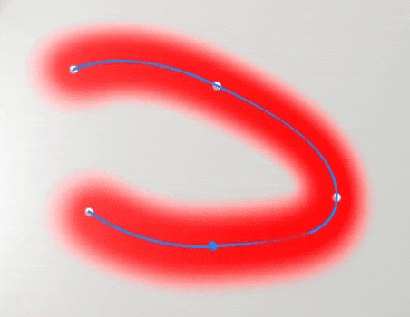
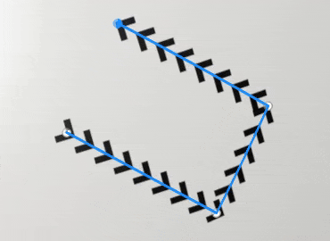
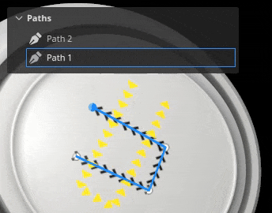
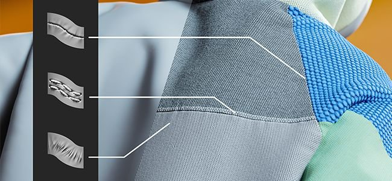
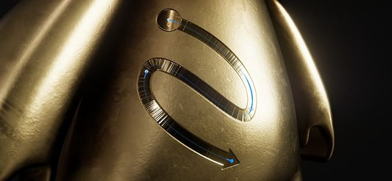

# 버전 9.0

<b>Substance 3D Painter 9.0</b>에서는 새로 고침된 기본 콘텐츠뿐만 아니라 3D 뷰포트에서 다시 편집할 수 있는 경로로 획을 페인트 하는 새로운 방법을 소개합니다.

출시일: *20 June 2023*

## 주요 기능

### 3D 뷰포트에서 패스를 따라 새 페인트 만들기

<b>패스를 따라 페인트</b> 도구는 3D 뷰포트에서 획을 페인트 하는 새로운 방법입니다. 다른 애플리케이션과 마찬가지로 3D 오브젝트 표면의 점으로 제어되는 베지어 기반 곡선을 만들어 패턴을 그릴 수 있습니다. Substance 재질과 함께 이 새로운 도구는 많은 새로운 가능성을 열 수 있습니다.

* <b>점이 있는 패스로 제어되는 페인트 획을 만드는 새로운 도구</b>\
  이 도구의 도구 모음 안에는 [패스] 도구 전용의 새 아이콘이 있습니다. 이 새로운 도구를 사용하면 3D 모델 표면에 곡선을 그려 페인트 선을 만들 수 있습니다. 이러한 획은 언제든지 다시 편집할 수 있습니다. 도구가 활성 상태이면 메시 서피스를 클릭하여 점을 추가합니다. 기존 점을 클릭하고 Delete 키를 눌러 제거합니다.

  세 가지 유형의 패스 도구를 보여 주는 도구 모음 인터페이스의 

  
* <b>메시 표면의 점 드래그 및 이동</b>\
  패스 모양을 편집하려면 점을 클릭하고 드래그하기만 하면 3D 모델 표면을 따라 이동할 수 있습니다.

  
* <b>패스를 닫아 매끄러운 패턴을 만듭니다</b>\
  또한 패스를 닫아 루프를 만들 수도 있으므로 특정 영역 주위에 반복 패턴을 만드는 데 모두 유용할 수 있습니다.

  

  
* <b>패스 패널을 사용하여 패스(및 해당 속성) 다시 편집</b>\
  [패스] 도구를 선택하면 현재 페인트 레이어 내에서 만들어진 패스가 3D 뷰포트 위쪽의 전용 [패스] 패널에 나열됩니다. 이 패널을 사용하여 경로를 선택하거나 삭제하거나 이름을 변경할 수 있습니다.

  

  
* <b>대칭, 모양 마스크, 역동적인 획 등과 같은 다른 페인트 기능과 호환</b>\
  일반 페인트 선의 많은 설정을 패스 도구와 함께 사용할 수 있습니다.

  * 대칭을 활성화하면 한 패스만 관리하면서 여러 번 패스를 그릴 수 있습니다.
  * 지오메트리 마스크가 활성화된 레이어에 있는 패스는 숨겨진 지오메트리 아래에 페인트 할 수 있습니다

  
* <b>지우개 또는 스머지 같은 다른 도구로 페인팅</b>\
  [패스] 도구는 [지우개] 및 [손가락] 도구와도 호환되므로 더욱 정교하게 페인트할 수 있는 방법과 획을 쉽게 다시 편집할 수 있는 방법으로 결합할 수 있습니다.

  

* <b>사전 설정으로 경로 속성 저장 및 다시 사용</b>\
  [패스] 도구를 사용하는 경우 브러시 속성을 사전 설정으로 저장할 수도 있습니다. 이렇게 하면 도구 사전 설정을 저장할 수 있으며, 저장 시 에셋 창에서 선택하면 패스 도구로 자동 전환됩니다.

>[!NOTE]
>
> 자세한 내용은 [전용 설명서](../painting/tool-list/path.md)를 참조하십시오.

### 패스를 따라 페인트 기능에 사용할 새로운 콘텐츠

패스에 따라 새 페인트 기능을 활용하기 위해 이 버전에 몇 가지 새로운 도구 사전 설정이 포함되었습니다.

* 파이프 랙 SF
* 퍼커링
* 솔기
* 토스티칭
* 용접용 금속
* 지퍼 테이프

### 패스를 따라 페인트 기능을 위한 개선된 역동적인 획

새로운 [패스] 도구를 사용하여 동적 선 시스템에 새로운 속성을 추가했습니다. 이러한 새로운 속성은 다른 시작 및 종료 시각적 기능을 제공하는 위 이미지의 화살표와 같이 이전에는 불가능했던 새로운 종류의 획을 잠금 해제합니다.

* <b>새 시작/중간/끝 속성</b>\
  새 속성을 정의하여 획 내의 스탬프가 첫 번째 스탬프, 마지막 스탬프 또는 중간에 스탬프가 될 경우 Substance 그래프에 지정할 수 있습니다. 이를 통해 시작점 및 끝점을 만들 수 있으며, 지퍼를 만드는 데 매우 유용하게 사용할 수 있습니다. (<b>참고</b>: 끝 상태는 패스 도구에서만 사용할 수 있습니다.)
* <b>새 크기 및 간격 속성</b>\
  [크기 및 간격] 속성을 사용하면 현재 스탬프 상태를 기준으로 Substance 그래프의 출력을 조정할 수 있습니다.
* <b>새 획 길이 속성</b>\
  패스를 따른 거리와 패스의 최대 거리를 지정하면 정규화된 값을 직접 제공할 필요 없이 일부 효과가 반복될 때 보다 효율적으로 제어할 수 있습니다.\
  이는 예를 들어 성장하는 획과 그려진 거리(그려진 총 스탬프 수가 아님)를 기반으로 반복 패턴이 있는 획을 모두 만들 수 있게 합니다.

>[!NOTE]
>
> 자세한 내용은 [전용 설명서](../painting/dynamic-strokes/creating-custom-dynamic-strokes.md)를 참조하십시오.

### 새로 고친 기본 재질

이 릴리스에서는 라이브러리를 조금 정리하기로 결정했고, 따라서 모든 사용자에게 더 유용하게 사용하도록 기본 기본 재질을 변경했습니다. 이러한 재질은 [Substance 3D Assets](https://substance3d.adobe.com/assets)에서 콘텐츠를 제공하는 동일한 팀에서 제작했습니다.

>[!NOTE]
>
> 제거된 콘텐츠는 [Substance 3D 커뮤니티 에셋](https://substance3d.adobe.com/community-assets?q=painter23update&u=painter23update)에서 사용할 수 있습니다.

## 튜토리얼

새 패스 도구를 찾고 이에 대해 알아보려면 최신 튜토리얼을 확인하십시오.

## 릴리스 정보

### 9.0.0

출시일: <b>2023/06/20</b>\
요약: <b>3D 곡선, 새로운 기본 재질 및 레거시 재질 클리닝과 3D 곡선에 대한 새로운 사전 설정을 허용하는 페인트가 있는 주요 릴리스</b>

<b>추가됨:</b>

* [패스] 패스를 따라 새 페인트 추가 도구
* [패스] 패스 도구에 빈 단축키 추가
* [패스] 기존 패스에 새 점을 추가할 수 있습니다.
* [Path] 현재 단축키 생성을 종료하려면 경로를 추가하십시오.
* [패스] 패스의 브러시 속성을 편집할 수 있습니다.
* [패스] 점을 배치할 때 접선을 자동으로 조정합니다
* [패스] 점이 이동하면 접선을 다시 계산합니다.
* [패스] 새로 생성된 점을 메시 표면에 스냅합니다
* [패스] 정점당 압력 편집 허용
* [패스] 인접한 점에서 새로 만든 점의 압력을 조정합니다
* [패스] 점을 부드러운/모퉁이(접선 나누기)로 변환할 수 있습니다.
* [패스] 새로 추가된 점을 즉시 이동할 수 있습니다
* [패스] 기존 패스에서 점 제거 허용
* [패스] 패스 방향을 반전할 수 있습니다.
* [패스] 뷰포트에서 패스 선택 허용
* [패스] 선택 윤곽 선택으로 패스 점 선택 허용
* [패스] Ctrl-A 단축키를 사용하여 패스의 모든 점을 선택합니다.
* [패스] 패스 닫기 허용
* [패스] 속성에서 패스 위 축을 지정할 수 있습니다.
* [패스] 컨텍스트 도구 모음에 정점 컨트롤 메뉴를 추가합니다
* [패스] 패스 도구에 페인트/지우기/손가락 모드 도입
* [Path] 뷰포트에 있는 패스에 대해 시각적 피드백 만들기
* [패스] 패스 방향에 대한 시각적 표시기 추가
* [패스] 패스 표시 설정에 선 Thickness 추가
* [패스] 패스 숨기기 허용 UI
* [패스] 현재 선택한 레이어의 패스를 나열하는 [패스] 패널을 추가합니다.
* [패스] 패스 패널에서 패스 위로 마우스를 가져가면 시각적 피드백을 추가할 수 있습니다.
* [패스] 패스 도구를 선택할 때마다 패스 패널을 표시합니다.
* [패스] 패스 패널에서 패스 이름 바꾸기, 삭제, 복사, 잘라내기, 복제 허용
* [Path] [패스] 도구를 사용하여 2D 뷰포트에서 상호 작용하려고 할 때 메시지를 표시합니다.
* [라이브러리] 새 콘텐츠(경로 도구 및 기본 재질) 통합
* [역동적인 획] 역동적인 획에 대한 distance 속성 추가
* [역동적인 획] 역동적인 획에 크기 및 간격 속성 추가
* [역동적인 획] 역동적인 획의 시작/중간/끝 속성을 추가합니다.
* [Python]&#x200B;[USD] USD 형식에 대한 프로젝트 구성 매개 변수를 표시합니다.
* [Python]&#x200B;[USD] USD 형식에 대한 프로젝트 생성 매개 변수를 표시합니다.
* [내보내기]&#x200B;[USD] 내보낸 USD 파일 내에 프로젝트 경로 정보 추가
* [GLTF] GLTF 파일을 다시 로드할 때 라이브러리의 텍스처 업데이트
* [Shader] 방향이 다른 UV 섬에 대한 심 아티팩트를 줄입니다.
* [엔진] Substance 엔진 버전 9.0으로 업데이트

<b>고정:</b>

* [가져오기] 텍스처가 있는 일부 GLB가 Painter에서 텍스처를 가져오지 못합니다
* [AMD] 모든 3D 투영 채우기의 테두리에 아티팩트
* [엔진] 레이어 가시성을 전환할 때 텍스처 끊김
* [엔진] 혼합 모드를 변경하면 일부 위치에서 텍스처가 비어 있습니다
* [엔진] 경우에 따라 텍스처/투영은 빈 뒤틀기 모드입니다
* [Iray] 렌더링을 저장할 때 반복이 0으로 재설정됨
* [Log] [파일] > [새로 만들기]를 수행할 때 USD 오류 메시지 표시

<b>알려진 문제:</b>

* [색상 관리] Linux에서 ACE를 사용한 HDR 색상 공간 변환으로 클램프된 색상 생성
* [레이어 스택] 입력 소스가 레이어별로 저장되지 않음
