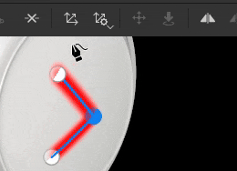
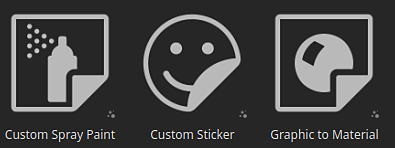
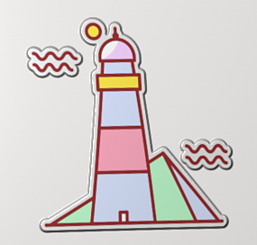
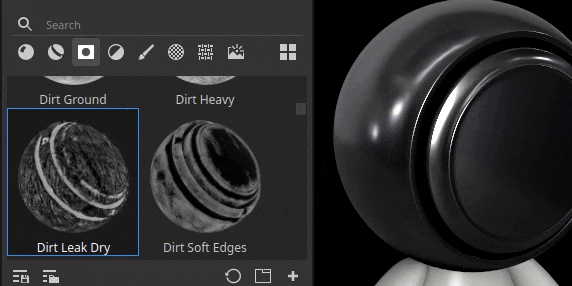
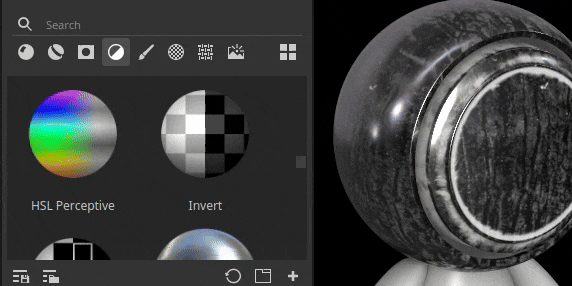

# 버전 9.1

<b>Substance 3D Painter 9.1</b>에는 [패스] 도구에 대한 접선 컨트롤, SVG 파일 형식 지원, 드래그 앤 드롭으로 리소스를 가져오고 적용하는 기능, 뷰포트의 반투명도 지원이 추가되었습니다.

출시일: *2023년 11월 7일*

## 주요 기능

### 패스 도구의 새로운 접선 컨트롤 및 개선 사항

이 새로운 버전에서는 커뮤니티에서 요청한 누락된 비트 및 기능을 추가하기 위해 [패스] 도구(버전 9.0에 도입됨)의 개발을 계속합니다.

* <b>수동으로 패스 지점 접선 제어</b>

  이제 패스 상의 특정 점에 대한 접선을 수동으로 설정할 수 있습니다. 이렇게 하면 자동 동작을 재정의하여 새 모양을 만들 수 있습니다.

  
* <b>조작기를 통해 패스 지점 편집</b>

  개체 표면의 스니딩점만으로는 충분하지 않은 경우도 있습니다. 이 조작기를 사용하면 점을 서피스 밖으로 이동할 수 있습니다. 메쉬를 다시 가져온 후 서피스에서 너무 멀리 떨어져 있는 경우처럼 여러 포인트를 한 번에 이동하는 것이 매우 도움이 될 수 있습니다.

  
* <b>개별적으로 패스 표시 켜기/끄기</b>

  이제 전용 뷰포트 패널을 통해 패스별로 패스 가시성을 변경할 수 있습니다. 경로를 비활성화하면 해당 패스를 삭제할 필요 없이 최종 텍스처에서 기여가 제거됩니다.

  
* <b>경로 위치 및 속성 복사 및 붙여넣기</b>

  패스 복사 및 붙여넣기가 확장되어 패스 지점 위치 또는 해당 속성만 복사할 수 있습니다. 이제 다양한 방법으로 경로를 동기화할 수 있으므로 위치를 통해 복잡한 효과를 만들거나 속성을 통해 다른 위치에서 특정 모양을 공유하기가 더 쉬워집니다.

  

  

>[!NOTE]
>
> 패스 도구에 대한 자세한 내용은 [전용 설명서를 참조하십시오](../painting/tool-list/path.md).

### 뷰포트에서 반투명도, 투명도 및 흡수에 대한 새로운 지원

새 프로젝트를 만들 때 기본값인 <b>Adobe ASM(Standard Material)</b> 셰이더가 <b>투명도</b>, <b>투명도</b> 및 <b>흡수</b> 속성을 지원하도록 업데이트되었습니다. 따라서 이제 이러한 렌더링 비헤이비어의 결과를 실시간 뷰포트 및 Iray 렌더러 내에서 확인할 수 있습니다.

따라서 이제 얇은 조명 흡수로 <b>유리</b>, <b>나뭇잎</b> 또는 <b>플라스틱</b>과 같은 제작 재질을 뷰포트에서 바로 볼 수 있습니다. 다른 Substance 3D 애플리케이션으로 내보내면 ASM 정의 덕분에 모양이 일치합니다.

* <b>새 ASM 셰이더 설정</b>

  ASM 셰이더가 [셰이더 설정](../interface/shader-settings/shader-settings.md) 창을 통해 수정할 수 있는 새로운 기능을 지원하도록 업데이트되었습니다.

  * <b>투명도</b>(불투명도): 나뭇잎과 같은 투명한 표면을 얻기 위해 더 이상 다른 셰이더로 전환할 필요가 없습니까. 대신 <b>모양 > 불투명도</b> 그룹에서 <b>알파 테스트</b> 또는 <b>알파 혼합</b> 매개 변수를 활성화합니다. 디더링과 같은 일반적인 설정도 사용할 수 있습니다.
  * <b>반투명도</b>: 이 새로운 속성을 사용하면 유리 같은 표면을 만들 수 있어 Specular 반사를 유지하면서 모양을 투명하게 만들 수 있습니다. 이를 사용하려면 프로젝트에 반투명도 채널을 추가하고 <b>내부</b> 그룹에서 <b>반투명도</b> 매개 변수를 사용하도록 설정하십시오.
  * <b>흡수</b>: 이 새로운 속성을 사용하면 개체를 통과하여 손실되는 빛을 시뮬레이션할 수 있으며, 이는 하위 표면 산란을 사용하는 것보다 더 나은 방식으로 플라스틱이나 액체를 시뮬레이션하는 데 유용할 수 있습니다. 사용하려면 <b>내부</b> 그룹에서 <b>흡수</b> 설정을 사용하도록 설정하십시오.
* <b>개선된 셰이더 설정 UI 및 도구 설명</b>

  셰이더의 재작업을 통해 매개 변수의 UI를 개선하고 매개 변수를 활성화하는 방법을 더 쉽게 알아볼 수 있도록 많은 새로운 도구 설명을 추가할 기회를 얻었습니다.

  매개 변수의 순서는 다른 Substance 3D 소프트웨어와 더 잘 일치해야 하므로 설정을 시도할 때 앞뒤로 하기가 더 쉽습니다.

  
* <b>Adobe Standard Material 데모용 새 샘플 프로젝트</b>

  새 ASM 속성을 조작하는 것은 처음에는 어려울 수 있으므로 셰이더의 여러 기능을 보여 주는 새 샘플 프로젝트가 추가되어 보다 쉽게 배울 수 있습니다.

  이 프로젝트를 <b>프랑스 식당 테이블</b>이라고 하며 <b>파일 > 샘플 열기</b> 메뉴를 통해 찾을 수 있습니다. 또한 작은 트릭을 많이 사용하므로 새로운 텍스처링 방법을 발견하는 데 좋은 학습 리소스가 될 수 있습니다.

  
* <b>이제 반투명도 채널은 기본적으로 검정색으로 설정됩니다</b>

  새 셰이더 속성을 보다 쉽게 사용하고 뷰포트에서 예기치 않은 결과가 나타나지 않도록 하기 위해 채널 반투명도의 기본 색상이 흰색 대신 검정색으로 변경되었습니다.

  프로젝트에서 이 레이어 스택을 이미 사용 중이었던 경우에는 채널 하단에 채우기 레이어를 추가하고 채널 값을 흰색으로 설정하기만 하면 이전 비헤이비어를 얻을 수 있습니다. 셰이더 매개 변수에서 <b>반투명도를 분산 마스크로 사용</b> 설정을 활성화하여 하위 표면 분산 결과에 대한 채널 기여도를 다시 적용할 수 있습니다.

### 벡터 그래픽 파일(SVG)에 대한 새로운 지원

이 릴리스에서는 SVG 파일의 지원을 레이어, 페인트 도구 등에 사용할 수 있는 리소스로 추가합니다.

SVG 파일은 가벼우면서도 로고 또는 모양을 정확하게 나타내는 데 매우 편리합니다. Painter에서는 원하는 해상도로 렌더링하고 쉽게 업데이트할 수 있으므로 비파괴 워크플로에 적합합니다.

* <b>SVG 파일 가져오기</b>\
  SVG 파일은 다른 리소스, 프로젝트, 라이브러리 등과 같이 가져올 수 있습니다. SVG <b>최대 버전 1.1</b>을(를) 가져올 수 있습니다. 최신 버전의 기능은 지원되지 않습니다.

  이 버전에서도(아래 참조) 가져오기가 쉬워져 SVG 파일 사용을 위해 Painter 외부의 리소스를 직접 메시 또는 레이어 스택으로 드래그하여 놓을 수 있습니다.
* <b>전용 SVG 설정</b>\
  SVG 리소스를 사용할 때 몇 가지 설정을 사용하여 리소스 모양을 제어할 수 있습니다.

  * <b>해상도</b>: 자동 값, 파일 내에 정의된 값 또는 사용자 지정 값을 사용합니다.
  * <b>자르기 영역</b>: 사용할 SVG 캔버스의 특정 영역을 정의합니다.
  * <b>범위</b>: SVG의 전체 콘텐츠를 선택하거나 일부 요소만 선택합니다.

  
* <b>새 SVG 맞춤 재질</b>

  텍스처링 시 SVG 파일을 사용하는 데 도움이 되는 3개의 새로운 리소스가 추가되었습니다.

  * <b>사용자 지정 스프레이 페인트</b>: 하나의 입력 이미지에서 벽에 칠한 데칼을 시뮬레이션할 수 있습니다.
  * <b>사용자 지정 스티커</b>: 표면에 플라스틱 스티커를 만듭니다. 여러 설정을 사용하여 손상과 접기를 시뮬레이션할 수 있습니다.
  * <b>그래픽에서 재질로</b>: 단일 이미지 입력에서 여러 재질 속성을 만들 수 있습니다. 이 리소스는 SVG 파일을 뷰포트로 끌어다 놓을 때 자동으로 삽입됩니다. 이 리소스는 여러 채널에 걸쳐 입력의 투명도를 공유하는 쉬운 방법을 제공하여 간단한 데칼에 적합합니다.

  

  

>[!NOTE]
>
> SVG 형식 및 설정에 대한 자세한 내용은 [전용 설명서를 참조하십시오](../painting/vector-graphic-svg.md).

### 드래그 앤 드롭을 통한 새로운 리소스 가져오기

이 릴리스에서는 외부 파일을 애플리케이션의 다른 컨텍스트로 끌어다 놓아 리소스를 자동으로 가져오고 사용할 수 있습니다. 이 새로운 프로세스를 통해 파일 가져오기와 관련된 지루한 단계를 건너뛸 수 있습니다.

* <b>뷰포트에 끌어다 놓기를 통해 가져오기</b>

  외부 파일을 메시에 직접 배치할 수 있도록 뷰포트로 드래그합니다. 이렇게 하면 자동으로 새 레이어가 만들어집니다. 리소스의 특성(이미지, Substance 자료, Substance 필터 등)에 따라 다릅니다. 결과는 그에 따라 달라집니다.
* <b>레이어 스택으로 끌어서 놓기를 통해 가져오기</b>\
  외부 리소스 파일을 뷰포트에 드롭하는 것과 동일한 방식으로, 파일을 레이어 스택에 드롭하면 리소스가 포함된 레이어 또는 효과를 직접 만들 수 있습니다.
* <b>리소스 슬롯으로 끌어서 놓기를 통해 가져오기</b>

  레이어 또는 도구로 리소스를 직접 가져올 수도 있습니다. 올바른 설정을 사용하여 칠 레이어나 효과가 이미 있는 경우 속성 창의 채널 슬롯 중 하나에 외부 파일을 끌어다 놓으면 해당 파일을 가져와 적용할 수 있습니다.

>[!NOTE]
>
> 리소스 가져오기에 대한 자세한 내용은 [전용 설명서를 참조하십시오](../content/importing-assets/import-drag-and-drop.md).

### 새로운 리소스 끌어서 놓기 동작

드래그 앤 드롭 개선 사항은 리소스 가져오기에만 국한되지 않습니다. 이제 에셋 창에서 리소스를 드래그하여 놓아 새 레이어, 효과 및 마스크까지 바로 만들 수 있습니다.

* <b>다양한 유형의 리소스 끌어다 놓기</b>

  이제 리소스 유형을 뷰포트 또는 레이어 스택으로 직접 끌어다 놓을 수 있습니다. 이제 다음 유형의 리소스를 거의 모든 위치에서 드래그 앤 드롭할 수 있습니다.

  * 알파
  * 텍스처
  * 절차
  * 재질
  * 스마트 재질
  * 스마트 마스크
  * Generators
  * 필터
  * 환경 맵
* <b>새 레이어 또는 효과로 리소스 삭제</b>

  Painter에서 리소스를 삭제할 위치를 선택하면 자동으로 새 레이어 또는 새 효과가 생성됩니다.

  
* <b>드래그하는 동안 콘텐츠 또는 마스크 효과 스택 중 선택\
  </b>

  썸네일 위로 리소스를 드래그하면 Painter이 연결된 효과 스택으로 자동 전환됩니다. 그런 다음 리소스를 스택 내부의 정확한 위치에 놓기만 하면 됩니다. 이렇게 하면 사전에 오른쪽 스택으로 전환할 필요가 없습니다.

  
* <b>즉시 새 검정 마스크 만들기</b>

  리소스를 드래그하는 동안 마스크 없이 모든 레이어에 새 아이콘이 나타납니다. 이 고스트 마스크에서 리소스를 삭제하면 자동으로 새 마스크를 만들고 새 리소스를 추가합니다. 새로운 마스크를 빠르게 설정하고 드래그하여 놓기를 취소하지 않도록 하여 수동으로 추가할 수 있는 방법입니다.

  
* <b>뷰포트에 드롭하여 새 레이어 만들기</b>

  리소스를 드래그 앤 드롭하여 뷰포트에 새 레이어를 만들 수도 있습니다. 리소스 종류에 따라 결과가 달라질 수 있습니다. 필터는 패스스루 모드에서 레이어 페인팅을 만들고, 스마트 마스크는 새 마스크가 있는 칠 레이어를 만듭니다.

  

  
* <b>고급 동작에 키보드 보조키 사용</b>

  리소스를 삭제할 때 키보드 수정자 CTRL 또는 ALT를 사용하면 추가 동작을 활성화할 수 있습니다.

  * <b>레이어 스택</b>에 드롭하는 동안 <b>CTRL</b>: 검정 마스크에 있는 리소스로 새 레이어를 만듭니다. 예를 들어, 재질을 강제로 마스크에 삽입하는 데 유용할 수 있습니다. 알파가 있는 드롭다운 메뉴를 건너뜁니다.
  * <b>레이어 스택</b>에 드롭하는 동안 <b>ALT</b>: 레이어 축소판 위로 드롭하는 경우에만 적용됩니다. ALT 키를 누르면 이전의 모든 효과가 제거됩니다. 이렇게 하면 다른 리소스, 특히 스마트 마스크를 수동으로 먼저 제거할 필요 없이 빠르게 리소스를 사용할 수 있습니다.
  * <b>뷰포트</b>에 드롭하는 동안 <b>CTRL</b>: 검은색 마스크에 있는 리소스로 새 레이어를 만듭니다. 리소스는 뷰포트에서 수행한 선택을 기반으로 설정되는 <b>Color ID 선택</b> 효과 아래에 배치됩니다.
  * <b>뷰포트</b>에 드롭하는 동안 <b>ALT</b>: 이전과 동일하게 리소스를 데칼 투영 모드로 강제 적용합니다.

### 기타 개선 사항

이 릴리스에는 몇 가지 부수적인 기능과 개선 사항도 추가되었습니다.

* <b>16비트 이미지의 손실 없는 압축</b>

  이제부터는 비트 심도가 16인 프로젝트에 포함된 모든 이미지가 손실 없는 알고리즘으로 압축되므로 품질 손실 없이 크기를 줄일 수 있습니다. 또한 프로젝트 파일에서 자체 데이터를 이미 압축하고 있습니다.

  이 변경은 주로 <b>베이크 텍스처</b>을 대상으로 하며, 이는 일반적으로 프로젝트 파일이 디스크에 매우 많을 수 있는 이유입니다. 평균적으로 프로젝트가 <b>디스크에서 크기가 30%에서 50%로 감소</b>되는 것을 보았습니다.

  이 압축은 아직 압축되지 않은 리소스에 프로젝트(이전 또는 새 프로젝트)를 저장할 때 자동으로 적용됩니다. 오래된 프로젝트의 경우 이 새 버전에서 처음으로 저장하는 데 평소보다 시간이 조금 더 소요될 수 있다는 의미입니다. 이 작업이 완료되면 시간을 절약하는 것이 정상으로 돌아옵니다.
* <b>UV 세트 채우기 투영 모드로 새 UV 설정</b>

  칠 레이어/효과에 대한 새 투영 모드가 <b>UV 세트를 UV 세트 투영</b>으로 추가되었습니다. 프로젝트 내부의 메쉬에서 사용할 수 있는 다양한 UV를 기반으로 텍스처를 투영하는 데 사용할 수 있습니다. 외부 도구에 의존할 필요 없이 보다 고급화된 텍스처 전송을 수행하는 데 사용할 수 있다.

  <b>UV 세트 0</b>은(는) Painter에서 페인팅하는 데 사용되는 기본 UV입니다. 추가 UV 세트를 사용할 수 있는 경우 <b>소스</b> 설정의 드롭다운 내에서 사용할 수 있습니다.

  
* <b>임시 안티앨리어싱은 기본적으로 모든 새 프로젝트에서 사용할 수 있습니다.</b>

  새 프로젝트를 만들 때 이제 뷰포트의 렌더링 품질을 개선하기 위해 [디스플레이 설정] 창에서 사용할 수 있는 <b>임시 안티앨리어싱</b> 설정이 기본적으로 활성화됩니다.
* <b>새로운 Python API 개선 사항</b>

  Python API는 이번 릴리스에서 몇 가지 추가 기능을 받았습니다.

  * Painter은 새로운 <b>substance\_painter.application.close() </b>함수를 사용하여 Python을 통해 종료/닫을 수 있습니다.
  * 이제 API를 통해 기본 뷰포트 카메라를 수정할 수 있습니다. 여기에는 위치, 회전 뿐만 아니라 시야, 조리개 등의 기타 속성이 포함됩니다. 이제 API가 메시와 관련하여 카메라를 보다 쉽게 배치하기 위해 장면 경계 상자도 표시합니다.
  * 이제 내보내기 모듈을 통해 프로젝트 메시를 삼각측량 여부에 관계없이 변위 여부에 관계없이 내보낼 수 있습니다.
  * 이제 API에서 프로젝트 내보내기 텍스처 경로도 검색할 수 있습니다.
* <b>After Effects(베타)로 새 보내기</b>

  메시와 해당 텍스처를 After Effects으로 내보내는 새로운 보내기 작업을 사용할 수 있으므로 시각적 효과를 반복할 때 편리합니다. 이 기능을 사용하려면 After Effects 버전 24.1 Beta 이상에 대한 액세스 권한이 필요합니다.

## 튜토리얼

## 릴리스 정보

### 9.1.0

(릴리스: 2023년 11월 7일)\
요약: <b>SVG 및 투명도 지원과 드래그 앤 드롭 및 패스 도구 개선 사항이 포함된 주요 릴리스</b>

<b>추가됨:</b>

* [SVG] 벡터 파일(SVG) 가져오기 허용
* [SVG][UI] SVG 관련 속성에 대한 지원 추가
* [SVG] 원본 이미지 비율을 쉽게 유지하는 옵션을 추가합니다
* [SVG] SVG 알파를 투명도와 함께 자동으로 사용할 수 있습니다.
* [Interop] 질감이 있는 메시를 After Effects(Ae 24.1 beta)로 보낼 수 있도록 허용
* [Interop] After Effects으로 보내기 설정 추가
* [QoL][에셋][UI] UI 슬롯으로 드래그하여 놓을 때 에셋 자동 가져오기
* [QoL] 외부 에셋을 레이어 스택에 끌어다 놓을 수 있습니다.
* [QoL][레이어 스택] 에셋 패널에서 레이어 스택으로 텍스처 드래그 앤 드롭
* [QoL][뷰포트] 메시의 필터인 생성기를 드래그하여 놓을 수 있습니다.
* [QoL][뷰포트] 외부 에셋을 메쉬에 놓을 수 있습니다.
* [QoL][투영] UV 세트 투영 모드에 새 UV 세트 추가
* [QoL] 뷰포트 및 레이어 스택에서 스마트 마스크를 새 레이어로 드래그 앤 드롭
* [QoL] 마스크에서 사용할 때 여러 출력이 있는 생성기용 선택기 추가
* [QoL] 칠 효과 위에 단일 채널 이미지를 드래그하여 놓을 수 있습니다.
* [QoL][레이어 스택] 드래그 앤 드롭과 함께 CTRL/ALT 수정자를 사용하여 효과/레이어를 만들 위치/방법을 지정합니다
* [패스] 패스 패널에서 패스 가시성을 개별적으로 전환
* [패스] 패스 지점에 변형 조작기 사용 허용
* [패스] 정점당 접선을 수동으로 제어할 수 있습니다.
* [패스] 패스 속성 복사/붙여넣기
* [패스] 탄젠트 분리 버튼에 빈 단축키를 추가합니다.
* [Shader] ASM 셰이더의 불투명도 및 반투명도 지원 추가
* [Shader] ASM 셰이더를 사용하여 흡수 색상 채널에 대한 추가 지원
* [Shader] ASM 셰이더 매개변수 향상 도구 설명
* [Shader] 반투명도 채널 기본 색상을 검정으로 변경합니다
* [디스플레이 설정] 기본적으로 임시 안티앨리어싱 활성화
* [디스플레이 설정] 기본적으로 서브서피스 분산 설정 활성화
* [Substance] 그래프 입력/출력에서 ColorSpace 속성 지원 추가
* [Substance] Substance 엔진을 버전 9.0.3으로 업데이트합니다.
* [UI] 앱 창이 작더라도 상황별 도구 모음 버튼에 액세스할 수 있도록 설정
* [자동 풀기] 텍셀 밀도로 컨트롤 UV 타일 번호
* [베이킹] 기본적으로 AMD GPU에서 GPU 광선 추적 비활성화
* [성능] 16비트 이미지에 손실 없는 압축을 적용하여 프로젝트 풋프린트 감소
* [Python] 3D 보기에서 기본 카메라 조작 허용
* [Python] 스크립팅을 통해 메시 내보내기 기능 노출
* [Content][Samples] 새 샘플 프로젝트 &quot;French Restaurant Table&quot; 추가
* [Content] Substance 로고 알파를 새 버전으로 업데이트
* [콘텐츠] SVG에 중점을 둔 세 가지 재질 필터(사용자 정의 스티커, 재질에 사용자 정의 스프레이 및 그래픽) 추가

<b>고정:</b>

* [충돌] 대칭 도구를 사용하지 않을 때 조작기 크기 변경
* [충돌] [레이어 스택] 아무 것도 선택하지 않은 상태에서 레이어를 만듭니다.
* [Project] 사용하지 않는 리소스를 제거한 후 메시 맵이 손상될 수 있습니다.
* [Project] 이미지를 다시 가져오거나 다시 굽은 후 리소스가 손상됨
* [Assets] 에셋을 다시 로드하면 즐겨찾기에서 제거됩니다
* [가져오기] 에셋 패널에 &quot;검색 결과 없음&quot;이 표시되면 리소스를 가져올 수 없습니다.
* [UI] 상황별 도구 모음 화살표가 나타나지 않는 경우가 있습니다
* [Substance] 부울 값에 대한 [나란히] 버튼이 지원되지 않습니다.
* [레벨] 마스크에 사용할 때 잘못된 채널 레이블
* [내보내기][glTF] Painter에서 내보낸 glTF/GLB 파일에는 물리적 크기 단위가 없습니다
* [내용] 흐림 효과 필터 강도가 16으로 고정됨
* [Content] 색상 일치 필터 &quot;대상 색상&quot; 이미지 입력이 표시되지 않음

<b>알려진 문제:</b>

* [색상 관리] Linux에서 ACE를 사용한 HDR 색상 공간 변환으로 클램프된 색상 생성
* [충돌][Linux] 레이어 스택에서 리소스를 드래그하여 놓을 때 AMD에서 Linux Wayland 사용
* [충돌][Mac] Monterey OS에서 이방성 필터링 값 변경
* [충돌] Exr이 이미지 입력으로 사용됨
* [충돌] 16K 환경 맵 사용
* [자동 풀기] 텍셀 밀도 컨트롤 관련 UI 문제
* [회귀][UI] 마우스 오른쪽 단추 클릭 메뉴가 hd 화면에서 너무 작습니다.
* [Python] TextureStateEvent에서 트리거된 USD 내보내기 충돌
* [QoL] 데칼 모드에서 Alpha 리소스를 드래그하여 놓으면 마스크에 UV 투영이 생성됩니다.
