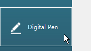
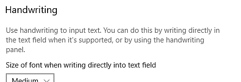
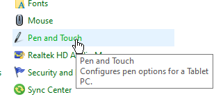

# 펜 및 태블릿 구성

이 페이지에서는 응용 프로그램과의 호환성을 개선하기 위해 Windows에서 그래픽 태블릿 펜을 구성하는 데 필요한 여러 가지 권장 사항을 나열합니다.

## Windows Ink란 무엇입니까?

Windows Ink 는 그래픽 태블릿의 스타일러스 또는 펜과 같은 펜을 처리하는 소프트웨어/서비스입니다. 컴퓨터에서 펜과 상호 작용할 수 있는 스티커 노트, 스케치패드 등 다양한 애플리케이션을 제공합니다.

버전 2019.3 이후 애플리케이션은 그래픽 태블릿을 처리하는 데 사용되었습니다. 이 버전 이전에는 Wintab을 대신 사용했습니다(일부 그래픽 태블릿 모델에서 지원하지 않는 이전 서비스).

## 태블릿 드라이버 설정에서 Windows Ink 활성화

펜 압력이 제대로 인식되는지 확인하려면 그래픽 태블릿의 드라이버 설정에서 Windows Ink를 활성화해야 합니다.

>[!NOTE]
>
> Windows Ink는 가상 컴퓨터에서 지원되지 않으므로 그래픽 태블릿 이벤트가 응용 프로그램으로 전달되지 않습니다. 따라서 펜 압력은 이 구성에서 지원되지 않습니다.

### Wacom 태블릿용 Windows Ink 활성화

1. **시작** 메뉴를 엽니다.
1. **Wacom 태블릿 속성**&#x200B;을 입력하고 첫 번째 검색 결과를 클릭합니다.
1. **Wacom 태블릿 속성** 창의 도구 목록에서 **펜**&#x200B;을 클릭합니다.\
   
1. 더하기 **&quot;+&quot;** 단추를 클릭하여 응용 프로그램 프로필을 추가합니다.\
   
1. 새 창에서 **찾아보기** 단추를 클릭하여 Substance 3D Painter 실행 파일을 찾습니다.\
   
1. **확인**&#x200B;을 클릭하여 프로필을 확인하고 만듭니다.\
   
1. **매핑** 탭을 클릭합니다.\
   
1. 창의 왼쪽 아래에서 **Windows Ink 사용**&#x200B;이 활성화되어 있는지 확인합니다.\
   

>[!NOTE]
>
> Windows Ink를 활성화한 후 애플리케이션을 다시 시작하여 변경 사항이 제대로 반영되었는지 확인합니다.

### Huion 태블릿용 Windows Ink 활성화

1. **시작** 메뉴를 엽니다.
1. **Huion Tablet**&#x200B;을 입력하고 첫 번째 검색 결과를 클릭합니다.
1. **Huion 태블릿** 창에서 **디지털 펜** 을 클릭합니다.\
   
1. 창의 왼쪽 아래에서 **Windows Ink 사용**&#x200B;이 활성화되어 있는지 확인합니다.\
   

## Windows Ink 설정에 액세스하는 방법

Windows Ink 설정은 일반 Windows 설정에서 액세스할 수 있습니다.

1. **시작** 메뉴를 엽니다.
1. **설정** 아이콘을 클릭합니다.\
   
1. 설정 창에서 **장치** 를 클릭합니다.\
   
1. **장치** 창에서 **펜 및 Windows 잉크**&#x200B;를 클릭합니다(그래픽 태블릿이 연결된 경우에만 사용 가능).\
   

## 권장 Windows Ink 설정

다음은 Windows Ink 설정과 각 설정에 권장되는 구성입니다.

>[!NOTE]
>
> 이 가이드를 따라도 Windows Ink와 관련된 일부 시각적 개체가 계속 표시됩니다. 안타깝게도 Microsoft은 Windows에서 이러한 설정을 비활성화하는 설정을 제공하지 않습니다.
> 
> 나머지 시각적 요소는 다음과 같습니다.
> 
> * 마우스 오른쪽 단추를 클릭할 때 **원**.
> * 키 수정자(Ctrl, Alt 또는 Shift)를 누를 때 마우스 아래의 **도구 설명**.

### 펜 설정

| ***설정*** | ***설명*** |
| --- | --- |
| **쓸 손 선택** | 권장: **오른손** 이 설정은 펜 방향을 인식하는 방법을 제어합니다. 이 설정을 [왼쪽]으로 설정하면 매개 변수를 조정할 때 일부 UI가 작동을 멈출 수 있습니다. |
| **시각 효과 표시** | 권장: **사용 안 함** 이 설정은 다양한 펜 상호 작용 중에 표시되는 시각적 효과를 제어합니다. 이 기능을 비활성화하면 다음을 클릭할 때 잔물결 원 효과를 숨길 수 있습니다. 

 |
| **커서 표시** | 권장: **사용 안 함** |
| **일부 데스크탑 앱에서 내 펜을 마우스로 사용할 수 있도록 허용** | 권장: **사용** 이 설정을 사용하면 그래픽 태블릿 펜에서 일반 마우스 입력을 보낼 수 있습니다. 이 설정을 사용하지 않으면 UI 매개 변수에서 일부 상호 작용 문제가 발생할 수 있습니다. |

### 필기 설정

| ***설정*** | ***설명*** |
| --- | --- |
| **텍스트 필드에 직접 쓸 때 글꼴 크기** | 권장: **보통(기본값)** |
| **필기를 사용할 때 글꼴** | 권장: **맑은 고딕(기본값)** |
| **펜으로 텍스트 필드를 누르면 손글씨를 사용하여 텍스트를 입력합니다** | 권장: **태블릿 모드에서만** 이 설정은 필기 텍스트 입력 창이 표시되는 방법과 시기를 제어합니다. &quot;태블릿 모드에서만&quot;으로 설정되지 않은 경우, UI에서 텍스트 필드를 선택할 때마다 창이 표시됩니다. 슬라이더에 특정 값을 입력하는 경우를 예로 들 수 있습니다. |
| **일부 데스크탑 앱에서 내 펜을 마우스로 사용할 수 있도록 허용** | 권장: **사용** 이 설정을 사용하면 그래픽 태블릿 펜에서 일반 마우스 입력을 보낼 수 있습니다. 이 설정을 사용하지 않으면 UI 매개 변수에서 일부 상호 작용 문제가 발생할 수 있습니다. |
| **손끝으로 필기 패널에 쓰기** | 권장: **사용 안 함** |

### 펜 단축키 설정

| ***설정*** | ***설명*** |
| --- | --- |
| **한 번 클릭** | 권장: **없음** |
| **두 번 클릭** | 권장: **없음** |
| **길게 누르기(일부 펜에서만 지원됨)** | 권장: **없음** |
| **앱이 바로 가기 단추 동작을 재정의하도록 허용** | 권장: **사용** |
| **사용 가능한 경우 저장소에서 펜을 제거한 후 잉크 작업 영역 표시** | 권장: **사용 안 함** |

## 펜 및 터치 설정에 액세스하는 방법

펜 및 터치 설정은 제어판에서 액세스할 수 있습니다.

1. **시작** 메뉴를 엽니다.
1. **제어판**&#x200B;을 입력하고 첫 번째 검색 결과를 클릭합니다.
1. 제어판 **표시 모드**&#x200B;를 **작은 아이콘**(으)로 전환합니다.\
   
1. **펜 및 터치** 설정을 클릭합니다.\
   

## 권장 펜 및 터치 설정

페인팅 동작과 카메라 조작을 개선하려면 다음 설정을 사용하는 것이 좋습니다.

설정에 액세스하려면 창에서 **펜 동작** 중 하나를 클릭한 다음 **설정** 단추를 클릭하십시오.

| ***설정*** | ***설명*** |
| --- | --- |
| **한 번 누르기** | 매개 변수가 없습니다. |
| **두 번 누르기** | 권장: **기본값** |
| **길게 누르기** | 권장: **마우스 오른쪽 단추를 누르기 위해 길게 누르기 사용 설정을 사용하지 않도록 설정** 이 설정을 사용하지 않도록 설정하면 Windows 드래그 원을 활성화하지 않고 요소를 정상적으로 드래그할 수 있습니다. 

 |
| **마우스 오른쪽 단추로 클릭 단추 사용** | 권장: **사용** |
| **펜의 상단을 사용하여 잉크를 지웁니다(사용 가능한 경우)** | 권장: **사용** |
