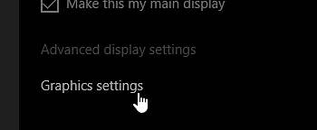
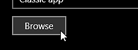

# Painter이 올바른 GPU에서 시작되지 않음

Windows에서 응용 프로그램이 시작할 때 올바른 GPU를 사용하지 않아 성능 및 안정성 문제가 발생할 수 있습니다. 다음은 소프트웨어가 올바른 GPU와 작동하는지 확인하기 위한 일반적인 문제 및 해결 방법 목록입니다.

사용하는 GPU를 확인하려면 [로그 파일](../../exporting-the-log-file.md)을(를) 확인하십시오.

## Windows

### 모니터 케이블 구성

Windows에서 애플리케이션에 할당된 GPU는 애플리케이션이 실행 중인 모니터에 따라 달라집니다. 모니터 케이블이 GPU 자체의 출력에 직접 연결되기 때문입니다. 따라서 애플리케이션이 시작되는 모니터가 그래픽 카드 자체의 그래픽 출력이 아닌 마더보드의 그래픽 출력에 연결되어 있는 경우 잘못된 GPU에서 시작할 수 있습니다. 이 경우 Windows는 전용 GPU보다는 통합 GPU를 사용할 가능성이 높습니다.

<b>이 문제를 해결하려면</b> : 마더보드에 연결된 모니터의 플러그인을 제거한 다음 GPU 출력에 연결하여 케이블 구성을 수정하기만 하면 됩니다.

### 잘못된 GPU 드라이버 설치

GPU 드라이버가 올바르게 설치되지 않으면 응용 프로그램이 전용 GPU에 연결할 수 없고 대신 통합 GPU에서 대체해야 합니다.

<b>이 문제를 해결하려면</b> : 현재 GPU 드라이버를 제거하고 컴퓨터를 다시 부팅한 후 GPU 드라이버를 다시 설치하십시오.

### Nvidia GPU 드라이버 프로필 설정

랩톱과 같은 일부 컴퓨터에서는 기본적으로 전용 Nvidia GPU 대신 통합 GPU에서 애플리케이션을 실행할 수 있습니다. NVIDIA GPU를 사용하는 경우 오른쪽 GPU로의 전환은 응용 프로그램 프로필에 따라 달라집니다. 애플리케이션에 이러한 프로필이 없는 경우 수동으로 할당할 수 있습니다.

<b>이 문제를 해결하려면</b> :

1. 바탕 화면을 마우스 오른쪽 단추로 클릭하고 NVIDIA 제어판을 선택합니다. <b>또는</b> 제어판으로 이동하여 NVIDIA 제어판을 검색합니다.
1. <b>3D 설정</b>에서 <b>3D 설정 관리</b>(으)로 이동
1. <b>프로그램 설정</b> 탭에서 <b>Substance 3D Painter</b>에 대한 새 프로필을 추가합니다.
1. 기본 설정 그래픽 프로세서 설정을 고성능 NVIDIA 프로세서 로 변경합니다.

### Windows 성능 설정

기본 성능 및 전력 소비량 설정으로 인해 Windows에서 응용 프로그램에 대해 잘못된 GPU 설정을 지정했을 수 있습니다.

<b>이 문제를 해결하려면 : </b>기본 GPU 구성을 재정의하려면 아래 단계를 따르십시오.

1. 바탕 화면을 마우스 오른쪽 단추로 클릭하여 디스플레이 설정을 엽니다 .

   
1. 홈에서 창의 하단으로 이동하여 &quot;그래픽 설정&quot;을 클릭합니다 .

   
1. &quot;찾아보기&quot; 단추를 클릭하고 Substance 3D Painter 실행 파일 을 찾습니다.

   
1. 애플리케이션이 추가되었으면 &#39;옵션&#39; 버튼을 클릭합니다.

   
1. &quot;고성능&quot; 설정을 선택하고 &quot;저장&quot; 버튼을 클릭합니다.

   

## 리눅스

### &quot;기본 GPU가 아닌 항목 우선&quot; 사용 안 함

데스크탑 바로 가기에서 Painter을 실행하거나 Steam을 통해 실행할 때는 <b>\*.desktop</b> 파일 내의 <b>PreferencesNonDefaultGPU</b> 설정이 <b>false</b>로 설정되어 있는지 확인하십시오.

이 설정은 오해의 소지가 있으며 더 섬세하고 강력한 통합 GPU 대신 통합 GPU가 사용/강제될 수 있습니다. 자세한 내용은 [이 토론을 참조하십시오](https://github.com/ValveSoftware/steam-for-linux/issues/9940).

### DRI\_PRIME 환경 변수를 사용하여 특정 GPU 강제 실행

기본적으로 Painter은 Vulkan 그래픽 API에서 나열된 첫 번째 GPU를 사용하지만 이 GPU가 잘못된 GPU일 수 있습니다(먼저 나열된 통합 GPU일 수 있음). 이로 인해 성능이 저하될 수 있습니다. DRI\_PRIME 환경 변수를 사용하여 선택한 GPU를 강제 실행할 수 있습니다. 자세한 내용은 [Arch Wiki의 설명서를 참조하십시오](https://wiki.archlinux.org/title/PRIME#For_open_source_drivers%E2%80%94PRIME). [Mesa 설명서](https://docs.mesa3d.org/envvars.html#envvar-DRI_PRIME)를 참조할 수도 있습니다.
