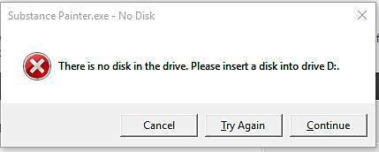

# 오류: 드라이브에 디스크가 없습니다.

Windows에서 다음과 같은 오류가 발생할 수 있습니다.

&quot;드라이브에 디스크가 없습니다. X 드라이브에 디스크를 넣으십시오.&quot;

이 오류를 제거하기 위해 확인할 몇 가지 사항이 있습니다.

* 드라이브 문자 설정이 올바른지 확인합니다(<https://support.microsoft.com/en-us/kb/330137> 참조)
* Substance 3D Painter에 사용된 이전 위치가 유효한지 확인(&quot;최근 파일&quot; 목록 등)
