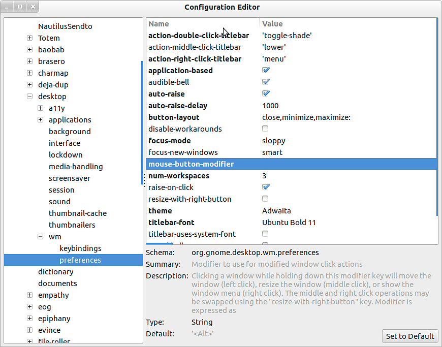

# Linux에서 ALT 키보드 단축키 사용 불가

**Gnome**&#x200B;을(를) 사용자 인터페이스로 사용하는 Linux 배포(**Ubuntu** 또는 **CentOS**)를 실행하는 경우, **ALT** 키의 기본 동작을 비활성화하여 뷰포트를 탐색할 수 있습니다.

## 센트OS

1 - **시스템 > Windows**(으)로 이동

{width="250px"}

2 - &quot;이동 키&quot; 설정을 &quot; **Alt**&quot; 이외의 설정으로 변경합니다. 예를 들어 키보드의 &quot;Windows&quot; 키를 선택하려면 &quot; **Super**&quot;을(를) 사용합니다.

{width="350px"}

## 우분투

1 - 터미널을 열고 다음 명령을 실행합니다.

```
sudo apt-get install dconf-tools
```


이렇게 하면 고급 구성 도구가 설치됩니다. 이 도구를 실행하려면 추가 종속성을 설치해야 할 수 있습니다.

2 - 시작 메뉴를 열고 &quot; **Dconf-tools** &quot;을(를) 찾습니다. 실행.

3 - 다음 경로로 이동하여 왼쪽에 있는 트리 메뉴를 확장합니다. **조직 > 그놈 > 데스크탑 > wm > 환경 설정**

4 - &quot;마우스-버튼-수정자&quot;를 편집하고 값을 변경합니다. 또는 대신 설정하지만 *비워 두지 마세요* . Super는 &quot;Windows&quot; 키에 해당합니다.

{width="500px"}
