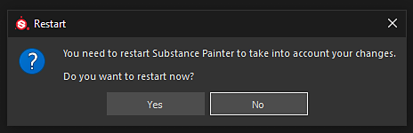

# 뷰포트의 텍스처에 뭉툭한 가공물 표시

버전 2018.3.0부터 뷰포트에 다음 유형의 아티팩트가 표시될 수 있습니다.

{width="400px"}

이러한 아티팩트는 Nvidia GPU 드라이버 문제와 관련이 있습니다.\
아티팩트를 방지하려면 스파스 가상 텍스처 하드웨어 지원을 비활성화해야 합니다.

GeForce **드라이버 440.97**&#x200B;에서 이제 **이 문제를 해결** 했습니다. 이러한 드라이버로 업데이트하고 SVT를 활성화 상태로 유지하여 성능을 향상시키는 것이 좋습니다.

새 드라이버는 Nvidia 웹 사이트 <https://www.nvidia.com/Download/index.aspx>에서 사용할 수 있습니다.

## 스파스 가상 텍스처 하드웨어 가속을 사용하지 않도록 설정

### 1 - Substance 3D Painter을 시작하고 설정 열기

[편집] > [설정]을 통해 기본 설정을 엽니다.

### 2 - &quot;Sparse Virtual Textures&quot;라는 섹션 찾기

&quot;일반&quot; 섹션 내에서 아래로 스크롤하여 &quot;스파스 가상 텍스처&quot;라는 하위 섹션을 찾습니다.

### 3 - 설정 선택 해제

선택을 취소하여 &quot;하드웨어 지원 가속&quot; 설정을 비활성화합니다.

### 4 - Substance 3D Painter 확인 및 다시 시작

&quot;확인&quot; 단추를 눌러 변경 사항을 검증합니다.

&quot;예&quot; 단추를 클릭하여 변경 사항을 적용하여 Substance 3D Painter을 다시 시작합니다.
