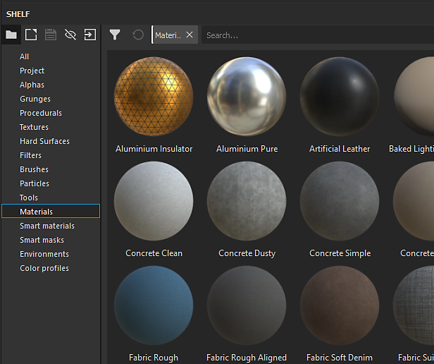

# 선반의 축소판이 잘못 표시됨

셸프의 축소판이 상습적인 것과 다른 것으로 나타나는 이유는 미리 보기를 렌더링하는 데 사용되는 셰이더 때문일 수 있습니다.

| 깨진 축소판 | 표준 축소판 |
| --- | --- |
| 

 | 

 |

## 1 - 기본 설정 창 열기

**편집**&#x200B;으로 이동하고 **설정** :

## 2 - 셸프 미리 보기 셰이더 제거

**일반** 보기에서 &quot;미리 보기 옵션&quot; 섹션이 표시될 때까지 아래로 스크롤합니다.\
&quot; **재질 미리 보기 셰이더**&quot; 앞에 있는 **십자** 단추를 클릭하여 지정한 현재 셰이더를 제거합니다.

{width="450px"}

## 3 - Substance 3D Painter 다시 시작

축소판이 올바르게 표시되도록 다시 생성하려면 Substance 3D Painter을 다시 시작해야 합니다.
